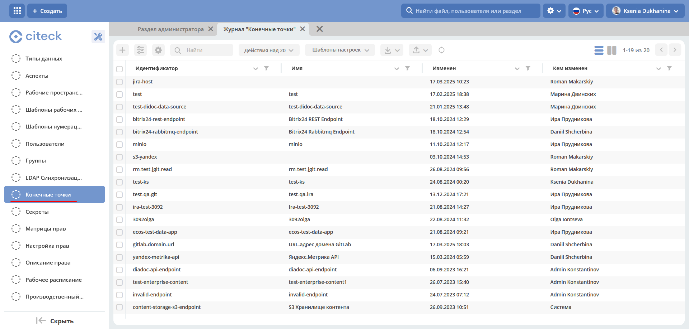
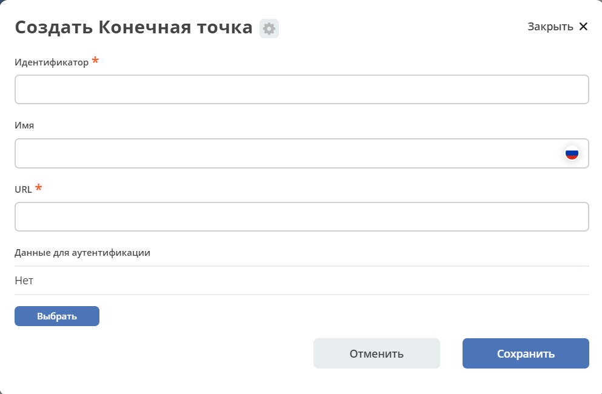

Конечные точки ECOS
====================

.. contents::
   :depth: 3

Для работы с ресурсами по сети в Citeck ECOS предусмтрен тип артефакта ECOS Endpoint.

Расположение артефактов с данным типом: **model/endpoint**

Модель конфигурации:

.. code-block::

    id: String # идентификатор конечной точки
    name: MLText # имя конечной точки
    url: String # адрес конечной точки
    credentials: EntityRef # параметры для доступа к конечной точке. Здесь указывается ссылка на сущность EcosSecret 

Пример конфигурации:

.. code-block::

    ---
    id: content-storage-s3-endpoint
    name:
    ru: S3 Хранилище контента
    en: S3 content storage

    url: http://localhost:9000
    credentials: emodel/secret@content-storage-s3-credentials

Информация о конечных точках по умолчанию хранится и загружается из БД микросервиса ecos-model, но так же есть возможнось указать настройки через переменные среды. Для этого следует взять идентификатор конечной точки и сконвертировать его по следующим правилам:

1. Разбиваем camelCase на части через символ '_'. Например: camelCase → camel_Case

2. Заменяем все символы ‘-' и '.' на '_’

3. Заменяем все символы, которые не входят в перечень ``[a-zA-Z0-9_]`` на ``_X{код_символа}_``

4. Переводим получившуюся строку в верхний регистр и добавляем префикс **“ECOS_ENDPOINT_“**

Таким образом для примера выше мы можем задать следующие переменные среды:

.. code-block::

    ECOS_ENDPOINT_CONTENT_STORAGE_S3_ENDPOINT_URL=http://localhost:9000
    ECOS_ENDPOINT_CONTENT_STORAGE_S3_ENDPOINT_CREDENTIALS=content-storage-s3-credentials

Переменные среды приоритетнее хранилища конечных точек в БД микросервиса ecos-model и они могут быть заданы как непосредственно в микросервисе который будет использовать эти конечные точки так и в ecos-model.

Использование конечных точек в коде
------------------------------------

Получение:

.. code-block::

    EcosEndpoint endpoint = EcosEndpoints.getEndpoint(endpointId);
    String url = endpoint.getUrl(); // url можно использовать для подключения к удаленному ресурсу 

    EcosSecret secret = endpoint.getCredentials(); // загружаем секрет с параметрами доступа
    BasicSecretData basicData = secret.getBasicData(); // если мы уверены, что это всегда BasicData (username и password), то можем загрузить эти данные без проверок типа секрета

    String username = basicData.getUsername();
    String password = basicData.getPassword();

Подписка на изменения:

.. code-block::

    EcosEndpoints.listenChanges((endpointId) -> {
        // здесь можем пересоздать подключения, которые зависят от endpointId
        return Unit.INSTANCE;
    });

В интерфейсе
--------------

.. _ECOS_endpoints:

Настройки доступны в журнале **«Конечные точки» (Рабочее пространство "Раздел администратора" - Модель)**:

Журнал доступен по адресу: ``v2/admin?journalId=endpoints&type=JOURNAL``

Форма создания:

В данных для идентификации необходимо выбрать созданный ранее :ref:`Секрет<ECOS_secrets>`.
