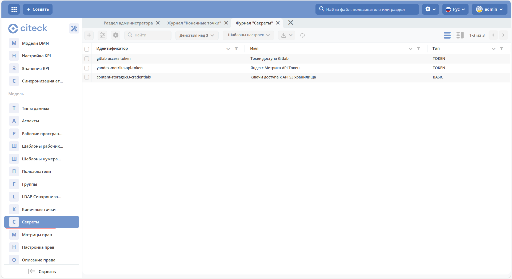

ECOS Секреты
=============

.. contents::
   :depth: 3

**ECOS Секрет** - объект, содержащий конфиденциальные данные, такие как пароль, токен или ключ.

Расположение артефактов с данным типом: **model/secret**

Модель конфигурации:

.. code-block::

    id: String # идентификатор секрета
    type: Enum {BASIC|...} # тип секрета
    data: ObjectData # данные секрета. Полностью зависят от типа

Типы секретов:

.. list-table::
      :widths: 10 10
      :header-rows: 1
      :class: tight-table 
      
      * - Тип
        - Содержимое поля data
      * - BASIC
        - 
          .. code-block::

            username: String
            password: String
      * - TOKEN
        -            
          .. code-block::

            token: String
      * - CERTIFICATE
        -            
          .. code-block::

            privateKey: String
            certificate: String

Пример конфигурации:

.. code-block::

    ---
    id: content-storage-s3-credentials
    name:
    ru: Ключи доступа к API S3 хранилища
    en: S3 storage API Keys
    type: BASIC
    data:
    username: sMJjtYPxFGjPEKeFp1lC
    password: KenKpEhD6Lag3acImDAq2ZeLtlSij1vyaYZt8lyH

Информация о секретах по умолчанию хранится и загружается из БД микросервиса ecos-model, но так же есть возможнось указать настройки через переменные среды. Для этого следует взять идентификатор секрета и сконвертировать его по следующим правилам:

1. Разбиваем camelCase на части через символ **'_'**. Например: **camelCase → camel_Case**

2. Заменяем все символы **‘-'** и **'.'** на **'_’**

3. Заменяем все символы, которые не входят в перечень ``[a-zA-Z0-9_]`` на ``_X{код_символа}_``

4. Переводим получившуюся строку в верхний регистр и добавляем префикс **“ECOS_SECRET_“**

Таким образом для примера выше мы можем задать следующие переменные среды:

.. code-block::

    ECOS_SECRET_CONTENT_STORAGE_S3_CREDENTIALS_TYPE=BASIC
    ECOS_SECRET_CONTENT_STORAGE_S3_CREDENTIALS_USERNAME=sMJjtYPxFGjPEKeFp1lC
    ECOS_SECRET_CONTENT_STORAGE_S3_CREDENTIALS_PASSWORD=KenKpEhD6Lag3acImDAq2ZeLtlSij1vyaYZt8lyH

Переменные среды приоритетнее хранилища секретов в БД микросервиса ecos-model и они могут быть заданы как непосредственно в микросервисе который будет использовать эти секреты так и в ecos-model.

Использование секретов в коде
-------------------------------

Получение:

.. code-block::

    BasicSecretData basicData = EcosSecrets.getBasicData("content-storage-s3-credentials");
    String username = basicData.getUsername();
    String password = basicData.getPassword();

Подписка на изменения:

.. code-block::

    EcosSecrets.listenChanges((secretId) -> {
        // здесь можем пересоздать подключения, которые зависят от secretId
        return Unit.INSTANCE;
    });

В интерфейсе
--------------

.. _ECOS_secrets:

Настройки доступны в разделе **«Секреты» (Рабочее пространство "Раздел администратора" - Модель)**:

Журнал доступен по адресу: ``v2/admin?journalId=ecos-secrets&type=JOURNAL``

Форма создания:

.. list-table::
      :widths: 20 20
      :align: center

      * - |

            .. image:: _static/secrets_02.png
                :width: 700
                :align: center

        - |

            .. image:: _static/secrets_03.png
                :width: 700
                :align: center

Шифрование секретов
---------------------

.. _secrets_encryption:

 1. Секреты хранятся в базе данных в зашифрованном виде.
 2. Ключ шифрования задается через переменные окружения (ENV) микросервиса ecos-model.
 3. Предусмотрена возможность интеграции с внешним хранилищем секретов (vault) в будущем.

Настройки шифрования
~~~~~~~~~~~~~~~~~~~~~

Поддержка в Helm
"""""""""""""""""""

Начиная с версии ecos-helm 1.3.57, добавлена поддержка настройки шифрования секретов в микросервисе ecos-model.

Переменные окружения
"""""""""""""""""""""

**ECOS_SECRET_ENCRYPTION_CURRENT_KEY**

 * Описание: текущий AES-ключ для шифрования данных.
 * Важно: ключ по умолчанию, заданный в микросервисе ecos-model, обязательно должен быть изменен на продакшн-серверах. Если ключ не изменен, система будет работать, но в логах появятся предупреждения.

 Пример генерации ключа:
 
 .. code-block::

    fun main() {

        val keyGen = KeyGenerator.getInstance("AES")
        keyGen.init(128) // AES key size 128
        val secretKey = keyGen.generateKey()
        val base64Key = Base64.getEncoder().encodeToString(secretKey.encoded)

        println("Base64 Key: $base64Key")

    } 

**ECOS_SECRET_ENCRYPTION_CURRENT_ALGORITHM**

 * Алгоритм шифрования.
 * Значение по умолчанию: AES/GCM/NoPadding.

**ECOS_SECRET_ENCRYPTION_CURRENT_IV_SIZE**

 * Размер вектора инициализации (IV).
 * Значение по умолчанию: 12.

**ECOS_SECRET_ENCRYPTION_CURRENT_TAG_SIZE**

 * Размер тега аутентификации (TAG).
 * Значение по умолчанию: 128.

**ECOS_SECRET_ENCRYPTION_PREVIOUS_KEY**

 * Предыдущий AES-ключ для расшифровки данных.
 * Используется в процессе ротации ключей, чтобы обеспечить доступ к ранее зашифрованным данным.

Ротация ключей шифрования
"""""""""""""""""""""""""""

Для ротации ключа шифрования выполните следующие действия:

 1. Сгенерируйте новый **AES-ключ**.
 2. Установите новый ключ в переменную окружения **ECOS_SECRET_ENCRYPTION_CURRENT_KEY**.
 3. Старый ключ укажите в переменной **ECOS_SECRET_ENCRYPTION_PREVIOUS_KEY**.

При запуске системы секреты будут расшифрованы с использованием предыдущего ключа и повторно зашифрованы новым ключом.

Инструкция для администраторов
""""""""""""""""""""""""""""""""

 1. При развертывании нового сервера необходимо каждый раз генерировать уникальный ключ шифрования.
 2. Используйте приведенный выше код для генерации AES-ключа.
 3. Убедитесь, что ключ по умолчанию заменен на новый. Если этого не сделать, система выдаст предупреждение в логах.
