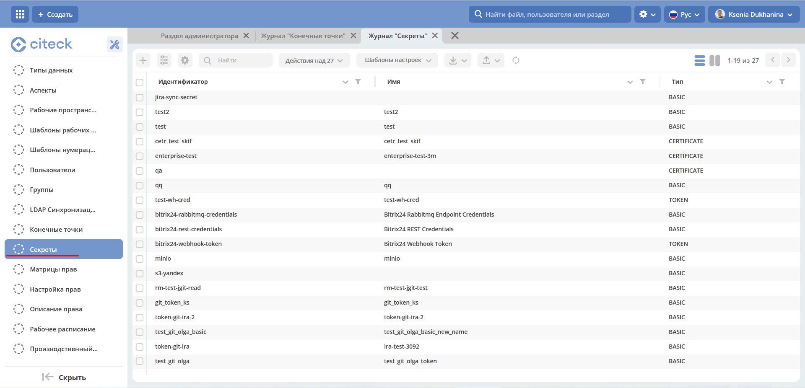

ECOS Секреты
=============

.. contents::
   :depth: 3

**ECOS Секрет** - объект, содержащий конфиденциальные данные, такие как пароль, токен или ключ.

Расположение артефактов с данным типом: **model/secret**

Модель конфигурации:

.. code-block::

    id: String # идентификатор секрета
    type: Enum {BASIC|...} # тип секрета
    data: ObjectData # данные секрета. Полностью зависят от типа

Типы секретов:

.. list-table::
      :widths: 10 10
      :header-rows: 1
      :class: tight-table 
      
      * - Тип
        - Содержимое поля data
      * - BASIC
        - 
          .. code-block::

            username: String
            password: String

Пример конфигурации:

.. code-block::

    ---
    id: content-storage-s3-credentials
    name:
    ru: Ключи доступа к API S3 хранилища
    en: S3 storage API Keys
    type: BASIC
    data:
    username: sMJjtYPxFGjPEKeFp1lC
    password: KenKpEhD6Lag3acImDAq2ZeLtlSij1vyaYZt8lyH

Информация о секретах по умолчанию хранится и загружается из БД микросервиса ecos-model, но так же есть возможнось указать настройки через переменные среды. Для этого следует взять идентификатор секрета и сконвертировать его по следующим правилам:

1. Разбиваем camelCase на части через символ '_'. Например: camelCase → camel_Case

2. Заменяем все символы ‘-' и '.' на '_’

3. Заменяем все символы, которые не входят в перечень ``[a-zA-Z0-9_]`` на ``_X{код_символа}_``

4. Переводим получившуюся строку в верхний регистр и добавляем префикс **“ECOS_SECRET_“**

Таким образом для примера выше мы можем задать следующие переменные среды:

.. code-block::

    ECOS_SECRET_CONTENT_STORAGE_S3_CREDENTIALS_TYPE=BASIC
    ECOS_SECRET_CONTENT_STORAGE_S3_CREDENTIALS_USERNAME=sMJjtYPxFGjPEKeFp1lC
    ECOS_SECRET_CONTENT_STORAGE_S3_CREDENTIALS_PASSWORD=KenKpEhD6Lag3acImDAq2ZeLtlSij1vyaYZt8lyH

Переменные среды приоритетнее хранилища секретов в БД микросервиса ecos-model и они могут быть заданы как непосредственно в микросервисе который будет использовать эти секреты так и в ecos-model.

Использование секретов в коде
-------------------------------

Получение:

.. code-block::

    BasicSecretData basicData = EcosSecrets.getBasicData("content-storage-s3-credentials");
    String username = basicData.getUsername();
    String password = basicData.getPassword();

Подписка на изменения:

.. code-block::

    EcosSecrets.listenChanges((secretId) -> {
        // здесь можем пересоздать подключения, которые зависят от secretId
        return Unit.INSTANCE;
    });

В интерфейсе
--------------

.. _ECOS_secrets:

Настройки доступны в разделе **«Модель - Секреты»**.

Журнал - https://host/v2/admin?journalId=ecos-secrets&type=JOURNAL

Форма создания:

.. list-table::
      :widths: 20 20
      :align: center

      * - |

            .. image:: _static/secrets_02.png
                :width: 700
                :align: center

        - |

            .. image:: _static/secrets_03.png
                :width: 700
                :align: center

