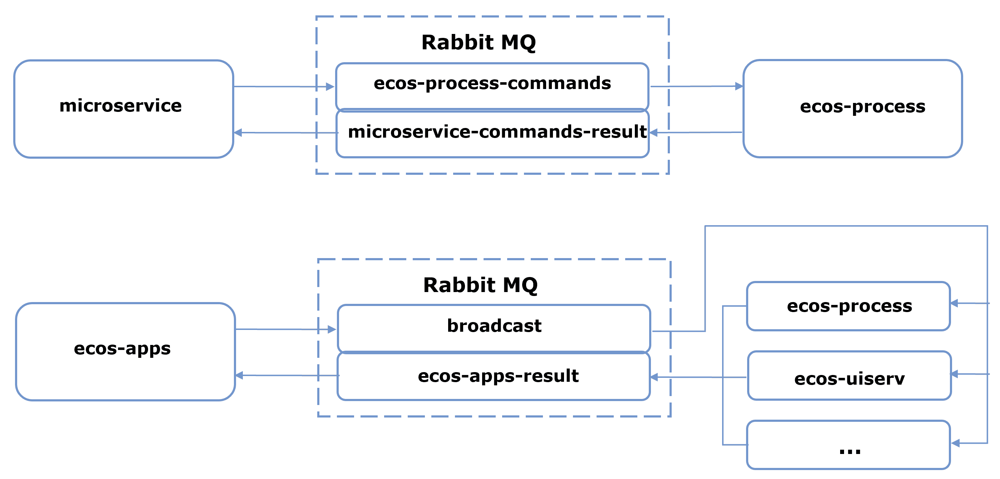

.. _ecos_commands:

Команды
=========

.. contents::
   :depth: 3

**Команда** — декларативное описание действия, которое нужно сделать на удаленном сервисе или локально.

**Команды** в Citeck в качестве транспорта используют очереди RabbitMQ. Использование команд возможно как в синхронном, так и в асинхронном режиме.

Целью команд могут быть:

1. Тип сервиса (ecos-process, ecos-uiserv, alfresco и др.). Команду исполняет один из инстансов данного сервиса.

2. Инстанс сервиса (у каждого типа сервиса может быть много инстансов).

3. Все типы сервисов (широковещательные команды). Сервис-источник команды отправляет широковещательную команду в RabbitMQ. Её обрабатывают все сервисы, которые в данный момент активны.

Выполнение команды осуществляется с помощью сервиса ``CommandService``, в частности его методами ``execute`` и ``executeSync``.

Команды могут быть как локальными (т.е. исполняются в рамках одного сервиса), так и удаленными (команда отправляется в другой микросервис, в этом случае необходимо указать **id микросервиса**, куда отправится команда).

Реализация удалённой команды
------------------------------

1. DTO запроса
~~~~~~~~~~~~~~~

Создать DTO в сервисе, *из* которого будет отправлена команда, и там, где она будет исполняться. Например, если необходимо отправить команду из alfresco в микросервис интеграций, то нужно создать 2 идентичных класса — один в alfresco, а второй в микросервисе интеграций:

.. code-block:: java

    @Data
    @CommandType("execute-spark-method")
    public class SparkServiceMethodCommand {
        private String dataSourceId;
        private String methodName;
        private Map<String, String> methodAttributes;
    }

.. note::

    Обязательно указать аннотацию ``CommandType`` с уникальным именем команды (по ней определяется, какому Executor будет отдана данная команда — см. п. 3).

2. DTO ответа
~~~~~~~~~~~~~~

Также необходим DTO с ожидаемым ответом — его нужно реализовать в обоих сервисах.

DTO с данными конвертируется в JSON и отправляется в нужный микросервис. Там он конвертируется обратно в DTO, и с ним уже работает executor. После обработки executor формирует DTO с ответом, который также конвертируется в JSON и отправляется обратно в то место, откуда была вызвана команда, — там он снова преобразуется из JSON в response DTO.

Например, ответ, который ожидаем от исполнения команды из примера выше:

.. code-block:: java

    @AllArgsConstructor
    @NoArgsConstructor
    @Data
    public class SparkServiceMethodCommandResponse {
        private String status;
        private String xmlContent;
    }

3. Executor
~~~~~~~~~~~~

В сервисе, *куда* отсылается команда, необходимо реализовать ``Executor``, который будет обрабатывать DTO.

В executor нужно имплементировать интерфейс ``CommandExecutor<E>``, где ``E`` — входящий DTO (см. п. 1), и реализовать метод ``execute(E)``, в котором и происходит обработка команды: на вход принимается DTO с запросом, из него берутся данные и обрабатываются, после чего формируется DTO с ответом, который метод возвращает.

Пример:

.. code-block:: java

    public class CallSparkServiceCommandExecutor implements CommandExecutor<SparkServiceMethodCommand> {

        @Override
        public SparkServiceMethodCommandResponse execute(SparkServiceMethodCommand executeServiceMethodCommand) {
            String statusString = "Error";
            String methodName = executeServiceMethodCommand.getMethodName();
            if (methodName.equals("Complete")) {
                statusString = "Done";
            }

            SparkServiceMethodCommandResponse response = new SparkServiceMethodCommandResponse();
            response.setStatus(statusString);
            response.setXmlContent("<?xml version=\"1.0\" encoding=\"UTF-8\"?><TestTag>Test</TestTag>");
            return response;
        }

    }

Пример логики, где просто проверяется имя метода и формируется ответная DTO.

4. Отправка команды
~~~~~~~~~~~~~~~~~~~~

В сервисе, *из* которого отправляется командный запрос, используется ``CommandService``. Пример:

.. code-block:: java

    public String sendSparkRequest(String dataSourceId, String methodName, Map<String, String> attributes) {
            SparkServiceMethodCommand command = new SparkServiceMethodCommand();
            command.setDataSourceId(dataSourceId);
            command.setMethodName(methodName);
            command.setMethodAttributes(attributes);
            SparkServiceMethodCommandResponse result = commandsService.executeSync(command, "integrations")
                    .getResultAs(SparkServiceMethodCommandResponse.class);
            return result.getXmlContent();
        }

В данном примере формируется DTO (также можно использовать builder) и отправляется команда в микросервис интеграций, явно указанный вторым параметром.

В ответе ожидается ``SparkServiceMethodCommandResponse`` DTO, а метод ``.getResultAs`` используется для автоматической конвертации ответа в удобный DTO.
