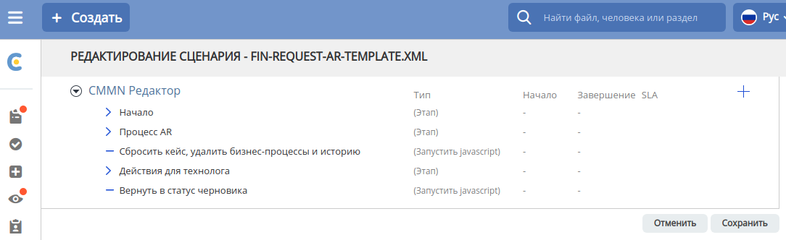

ECOS CMMN
=========

Общее описание
~~~~~~~~~~~~~~

В рамках Citeck ECOS разработан движок и редактор адаптивного кейс-менеджмента.

CMMN сценарии можно найти по следующему адресу: /v2/admin?journalId=cmmn-process-def&type=JOURNAL

Каждый сценарий может быть представлен в двух форматах: Схема и Таблица

Табличный формат CMMN
~~~~~~~~~~~~~~~~~~~~~

При редактировании табличного сценария открывается табличный редактор:

Изменения, которые делаются с в табличном редакторе экспортируются в шаблон только после нажатия кнопки "Сохранить".
