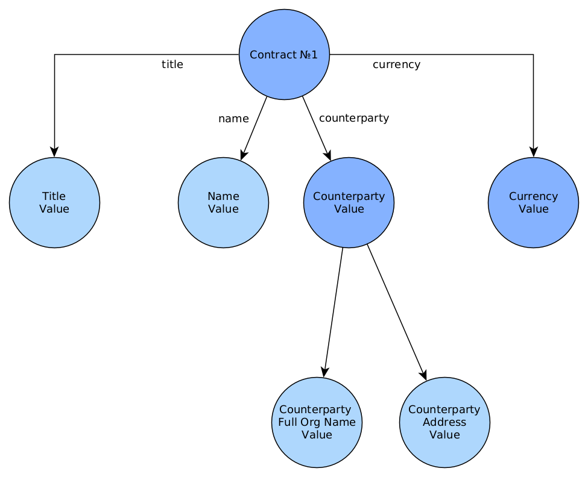
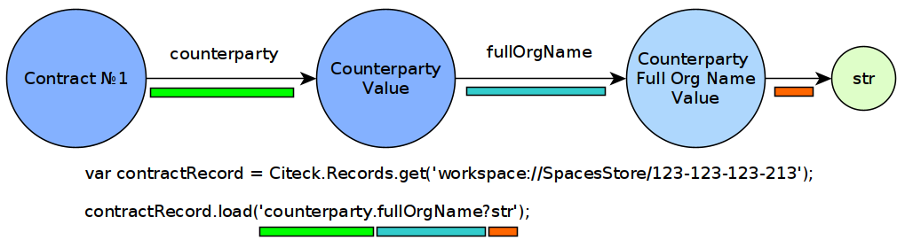

.. _Records_API:

ECOS Records API
================

.. contents::
		:depth: 5

Общее описание
---------------

API, разработанное для организации простого и легко масштабируемого общения между потребителем информации и источником.
Источниками данных могут быть БД, alfresco, REST и др.

Преимущества:

* Единый API для доступа к данным в системе для всех потребителей (Браузер, Мобильное приложение, Система построения отчетов, Индексирование данных, Различные микросервисы и т.д.);
* Поддержка загрузки данных из связанных сущностей. Например, если у нас договор ссылается на доверенность, то, имея идентификатор договора, мы можем получить любой атрибут связанной доверенности;
* Оптимальность. Загружаются и вычисляются только те атрибуты, которые нужны потребителю;
* Простота в разработке – разработчик источника данных описывает все атрибуты, которые могут запросить потребители вне зависимости от сложности их вычисления. Потребитель в запросе указывает только те атрибуты, в которых он заинтересован;
* Простота поддержки - нет версионирования API т.к. мы в любой момент можем добавлять новые атрибуты, не трогая старые;
* Тип получаемых данных полностью описывается запросом. Из источника данных мы возвращаем атрибуты с любым типом, а Records API приводит их к нужному для потребителя;
* Вычисляемые атрибуты. Возможность добавлять атрибуты, которые не хранятся в БД или любом другом хранилище, а вычисляются на основе существующих;
* Поддержка объединения атрибутов из разных источников. Например, можно написать источник данных, который часть атрибутов будет брать из alfresco, а часть из внешней БД объединяя их по идентификатору.

.. note::

  ECOS Records API - это **НЕ GraphQL**. Старые версии Records API использовали GraphQL, но начиная с версии 3.0 API полностью самостоятелен.

Термины
--------

Общие:

* **Атрибут (Attribute)** – свойство или ассоциация сущности;
* **Сущность (Entity)** – некоторый объект в системе (договор, доверенность, человек, группа, форма и др.);
* **Запись (Record)** – сущность с набором атрибутов и идентификатором записи (RecordRef);
* **Идентификатор записи (RecordRef)** – идентификатор источника данных и локальный идентификатор сущности в виде строки.
* **Источник данных (записей) (Records DAO)** – источник данных, в котором описана логика базовых CRUD операций для работы с сущностями.

Данные:

* **Граф данных (Data Graph)** – представление данных, которые может запросить клиент по схеме атрибутов;
* **Скаляр (Scalar)** – некоторое финальное значение в графе данных, у которого нельзя запросить вложенные атрибуты (строка, число и др).
* **Схема атрибутов (Attributes Schema)** – описание запроса данных для преобразования графа данных в наборы (map и list) значений скаляров;

Описание работы с данными
--------------------------

Очень часто данные не являются плоским списком, а представляют из себя граф, где сущности ссылаются друг на друга.
Ниже показан пример такого среза данных, где у нас есть договор с четыремя атрибутами:

* **Заголовок (Title)** - Строка
* **Имя (Name)** - Строка
* **Контрагент (Counterparty)** - Сложный объект
    * **Полное наименование (Full Organization Name)** - Строка
    * **Адрес контрагента (Counterparty Address)** - Строка
* **Валюта (Currency)** - Сложный объект
    * *атрибуты пропущены для простоты*

.. _scalars:

С точки зрения Records API каждый узел этого графа данных может быть получен как значение одного из скаляров:

* **disp** - Человекочитаемый вид значения. (Примеры: Для договора - "Договор №2", Для пользователя - "Иванов Иван");
* **str** - Строка;
* **num** - Число (Двойная точность. Если точности Double не хватает, то следует использовать str);
* **bool** - Булево значение;
* **json** - JSON представление значения. Допускаются массивы и объекты;
* **id** - глобальный идентификатор значения, который содержит идентификатор источника данных и локальный идентификатор. Актуален для сложных значений вроде "Договор", "Контрагент", "Валюта" и др.;
* **localId** - то же что и id, но без идентификатора источника данных;
* **assoc** - с точки зрения потребителя данных - то же что и id. Разница появляется при изменении (мутации) записи.

.. image:: _static/records/data_graph_with_scalars.png
       :width: 600
       :align: center
       :alt: Data Graph with Scalars

Для примера рассмотрим получение полного наименования организации контрагента у договора.

Здесь мы используем javascript Records API для загрузки нужного нам атрибута.

Первая строка - получение записи по её идентификатору.

.. note::
  Общий вид идентификатора **"приложение/источник_данных@локальный_id"**, но здесь присутствует только локальный_id. Для API это означает, что приложение = "alfresco", а источник_данных = "" (пустой идентификатор зарезервирован за источником с нодами Alfresco)

Вторая строка - загрузка нужного нам атрибута. Вложенные атрибуты разделены точкой **"."**, а скаляр определяется знаком вопроса **"?"**

.. note::
  Допустимая вложенность атрибутов не ограничена

Атрибуты
------------

Синтаксис атрибутов
~~~~~~~~~~~~~~~~~~~~

.. _Records API attribute:

Самый простой способ получить значение атрибута - это указать его имя::

  cm:name

.. note:: 
  Двоеточие - часть имени и не является спец символом в данном контексте.

Если мы не указываем скаляр, то он по умолчанию принимается равным **"?disp"**. То есть запись выше аналогична следующей::

  cm:name?disp

Для значений с типом **"Строка (String)"** разницы между скалярами **"?disp"** и **"?str"** нет т.к. вернется одно и то же значение.

Для обращения к вложенному атрибуту следует разделять имена точкой::

  counterparty.fullOrgName?str

Если на каком-то из уровней в атрибуте ожидается список значений, то следует использовать квадратные скобки **"[]"** после имени атрибута::

  counterparty[].fullOrgName?str
  cm:manager.cm:subordinates[].cm:userName?str
  cm:manager.cm:department.managers[].cm:subordinates[].cm:userName?str

Если мы запросили атрибут без указания квадратных скобок, а источник данных вернул список, то мы получим только первый элемент из этого списка или null, если список пустой.

Для получения сразу нескольких атрибутов у вложенного значения можно использовать фигурные скобки::

  cm:manager.cm:subordinates[]{userName:"cm:userName?str",firstName:"cm:firstName"}

В результате получим следующую структуру::

  [
    {
        "userName": "ivan.ivanov",
        "firstName": "Ivan"
    },
    {
        "userName": "petr.petrov",
        "firstName": "Petr"
    }
  ]

В атрибутах есть поддержка пост-процессоров, которые позволяют выполнять операции над результатом перед тем как вернуть его клиенту.

Пост-процессоры описываются после атрибута через символ вертикальной черты **"|"**.

**Форматирование даты**::

  cm:created|fmt("yyyy__MM__dd")

Подробнее о шаблоне для форматирования даты можно почитать здесь: https://docs.oracle.com/javase/7/docs/api/java/text/SimpleDateFormat.html

**Форматирование числа**::

  ecos:documentAmount|fmt("00000.00")

Данный формат помогает дополнить число лидирующими нулями, если его целая часть меньше 5 знаков и ограничивает числа после запятой двумя знаками

Подробнее о шаблоне для форматирования чисел можно почитать здесь: https://docs.oracle.com/javase/7/docs/api/java/text/DecimalFormat.html

**Значение по умолчанию**::

  ecos:documentAmount?num|or(0)

Если атрибут **ecos:documentAmount** вернет **null**, то вместо него мы получим число **0**.

Для процессора **"or"** есть короткая запись через **"!"** ::

  ecos:documentAmount?num!0

В процессоре **"or"** можно использовать другие атрибуты::

  cm:title?str!cm:name?str
  cm:title?str|or("a:cm:name?str")

В данном примере мы получим значение **cm:title** или значение **cm:name**, если **cm:title** равен null или пустой строке.

.. note::
  Данный атрибут приведен для примера и для получения "заголовок или имя" лучше использовать скаляр **"?disp"** т.к. у нод alfresco он по умолчанию реализован подобным образом

В полной форме нам нужно указать префикс **"a:"** чтобы обозначить, что нам нужно значение атрибута, а не константа **"cm:name?str"**
Если нам нужно строковое константное значение в короткой форме, то следует взять значение в кавычки::

  cm:title?str!"cm:name"

**Добавление префикса или суффикса**::

  cm:name|presuf("prefix-","-suffix")

Если значение **cm:name** равно **"Имя"**, то на выходе мы получим **"prefix-Имя-suffix"**
Значение суффикса можно не задавать. Если значение префикса не нужно, а значение суффикса нужно, то первым аргументом можно передать пустую строку.

**Процессоры можно объединять**::

  cm:title!cm:name!"n-a"|presuf("prefix-","-suffix")

1. Взять **заголовок**;
2. Если заголовок пустой, то взять **имя**;
3. Если имя пустое, то взять константу **"n-a"**;
4. Добавить к результату пунктов 1-3 префикс **"prefix-"**;
5. Добавить к результату пункта 4 суффикс **"-suffix"**.

.. list-table:: Список возможных пост-процессоров
    :widths: 5 50 50
    :header-rows: 1

    *   - Название
        - Аргументы
        - Описание
    *   - presuf
        - | ``prefix: String``
          | ``suffix: String``
        - Добавить константу в начало и/или в конец строки
    *   - or
        - | ``orValue0: Any``
          | ``orValue1: Any``
          | ``orValueN: Any``
        - | Вернуть значение по умолчанию если значение атрибута равно null. Если аргумент является строкой
          | и начинается на "a:", то оставшаяся часть атрибута воспринимается как другой атрибут, который
          | нужно вычислить и вернуть в результате.
          | Количество аргументов не ограничено. Аргументы перебираются по очереди
          | и если он не null (не является null и не вычислился через "a:" в null), то результат сразу возвращается.
    *   - rxg
        - | ``pattern: String``
          | ``groupIdx: Int = 1``
        - | Применить регулярное выражение к результату и вернуть указанную группу.
          | Примеры:
          | ``"some-text" | rxg("some-(.+)") -> text``
          | ``"some-text-and-more" | rgx("(some)-(text)-(and)-(more)", 2) -> text``
    *   - join
        - ``delimiter: String = ","``
        - Объединить список значений в строку используя указанный разделитель
    *   - hex (3.26.0+)
        - | ``delimiter: String = ""``
        - | Представить base64 строку как HEX строку (список шестнадцатеричных чисел,
          | где каждый байт представлен двумя символами)
    *   - fmt
        - | ``format: String``
          | ``locale: String = "en"``
          | ``timezone: String = "UTC"``
        - Отформатировать число или дату по указанному формату
    *   - cast
        - | ``type: { "str", "num", "bool" }``
        - Преобразует значение в указанный формат.
    *   - yaml 
        - 
        - Любую структуру приводит к YAML строке.
          | Пример:

            .. code-block:: js

                await Citeck.Records.get('uiserv/form@ECOS_FORM').load('?json|yaml()')

Работа с MLText полями (3.26.0+)
~~~~~~~~~~~~~~~~~~~~~~~~~~~~~~~~~~~~

Если известно. что в каком-то атрибуте лежит строка или MLText структура (объект, где в качестве ключей локаль,
а в значении соответствующая строка), то можно применить преобразование **"mltext"**.

Пример::

    some.att._as.mltext // получение актуального значения по локали пользователя
    some.att._as.mltext.ru // получение значения для конкретной локали
    some.att._as.mltext.closest.ru // получение значения для конкретной локали с попыткой вычислить ближайшее не пустое значение
    some.att._as.mltext?json // получение значения для всех локалей (если some.att является строкой, то она будет соответствовать локали "en")

Преобразование работает для **String, DataValue, MLText, ObjectData, JsonNode (jackson)**

Использование динамических атрибутов в предикатах (3.26.0+)
~~~~~~~~~~~~~~~~~~~~~~~~~~~~~~~~~~~~~~~~~~~~~~~~~~~~~~~~~~~~

При использовании поиска на основе языка предикатов для всех источников записей есть возможность
указывать вместо значений динамически вычисляемые атрибуты.

Пример запроса с текущим пользователем::

    {
        "t": "eq",
        "att": "actor",
        "val": "${$user.userName}"
    }

Если ``${}`` один и занимает всю строку, то ``"${...}"`` меняется полностью на вычисленное значение. Таким образом результат вычисления шаблона может быть любым JSON типом включая null.
Динамические вставки можно использовать на любом уровне вложенности для любых значений в объектах (можно задавать t, att, val).

Список доступных атрибутов можно посмотреть в разделе **"Контекстные атрибуты"**.

Контекстные атрибуты
~~~~~~~~~~~~~~~~~~~~~~~

Часто возникают ситуации, когда нужно загрузить атрибуты, которые не относятся напрямую к сущности, а являются контекстными.

Пример таких атрибутов:

* **Текущий пользователь**
* **Текущая дата**

Для доступа к таким атрибутам при запросе данных к имени атрибута в начале добавляется знак **"$"**.

Т.о. если нам нужно получить имя текущего пользователя, мы можем загрузить следующий атрибут::

  $user.cm:userName

Если нам нужно получить текущую дату и отформатировать её::

  $now|fmt("yyyy")

Список контекстных атрибутов, которые доступны во всех источниках:

* **user** - Текущий пользователь
* **now** - Текущая дата
* **auth** - Аутентификация текущего пользователя. С помощью этого атрибута можно проверить является ли пользователь частью группы или глобальной роли::

  $auth._has.GROUP_ECOS_ADMINISTRATORS?bool
  $auth._has.ROLE_ADMIN?bool

* **str** - Атрибут для указания константного строкового значения
* **ref** - Атрибут для указания ссылки на другую сущность
* **appName** - Имя текущего приложения
* **appInstanceId** - Идентификатор инстанса текущего приложения   

Если в серверном коде нужно расширить доступный список контекстных атрибутов, то работу с RecordsService нужно выполнять следующим образом::

  val contextAtts = mutableMapOf<String, Object>()
  contextAtts["customVariable"] = RecordRef.valueOf("people@admin")

  String result = RequestContext.doWithAtts(contextAtts) {
    recordsService.getAtt("any-record", "$customVariable?disp").asText()
  }

В качестве значений для контекстных атрибутов могут быть RecordRef'ы (для доступа к другим сущностям) или значения любых других типов.

Скаляры ?raw и ?bin (3.45.0)
~~~~~~~~~~~~~~~~~~~~~~~~~~~~~~

В [3.45.0] Появилось два новых скаляра - **?raw** и **?bin**

**?raw** возвращет данные без преобразования, как есть.

**?bin** возвращает бинарные данные. При использовании json-формата равнозначен использованию **?str** (данные передаются в виде base64 строки), но с использованием форматов, которые поддерживают передачу массивов байт без необходимости трансформации в base64 дает преимущество по размеру передаваемых данных (base64 дает оверхед 33%). 

RecordsService (Java)
---------------------

**RecordsService** - сервис для работы с абстрактными записями, источником которых может быть любой DAO.

Существует четыре операции, которые можно проделывать над записями:

а) Поиск записей
~~~~~~~~~~~~~~~~~

Методы: **query, queryOne**

Для поиска записей всегда передается **RecordsQuery**, который содержит параметры поиска. Помимо самого простого метода для поиска с одним параметром **RecordsQuery** так же есть варианты с объединенным поиском и запросом атрибутов.

.. code-block:: java

  recordsService.queryOne(
    RecordsQuery.create()
          .withLanguage(PredicateService.LANGUAGE_PREDICATE)
          .withQuery(Predicates.and(
                  Predicates.eq(ValuePredicateToFtsAlfrescoConstants.TYPE, "cm:person"),
                  Predicates.eq("ssgedic:personalNumber", personalNumber)))
          .withConsistency(Consistency.EVENTUAL)
          .addSort(new SortBy("cm:created", true))
          .build());

.. code-block:: java

  recordsService.query(RecordsQuery.create()
          .withLanguage(PredicateService.LANGUAGE_PREDICATE)
          .withQuery(Predicates.and(
                  Predicates.eq("_type", "emodel/type@ssgediip-inboundPackage"),
                  Predicates.eq("ssgediip:isNeedSendToVim", true),
                  Predicates.not(
                          Predicates.eq("ssgediip:isAlreadySentToVim", true)
                  )
          ))
          .withConsistency(Consistency.EVENTUAL)
          .build());

* **.withLanguage** – указываем язык запроса;

* **.withQuery** – сам запрос;

* **.withConsistency** – Consistency (Согласованность). Возможные варианты: EVENTUAL, TRANSACTIONAL, DEFAULT, TRANSACTIONAL_IF_POSSIBLE

* **.addSort** – указываем по какому полю нужна сортировка

* **.build()** – сборка запроса

На выходе:

* при **query** получаем **RecsQueryRes<RecordRef>**
* при **queryOne** получаем **RecordRef**

б) Получение атрибутов записи
~~~~~~~~~~~~~~~~~~~~~~~~~~~~~~~~

Методы: **getAtt**, **getAtts**

.. code-block:: java

  recordsService.getAtt(documentRef, "eint:ediProviderType?str").asText();

* **documentRef** – record, к которому обращаемся

* **"eint:ediProviderType?str"** – параметр, который хотим получить

.. code-block:: java

 List<ObjPropertyClass> list = recordsService.getAtt(documentRef, "objProperty[]?json").asList(ObjPropertyClass.class);

.. code-block:: java

  RecordAtts recordAtts = recordsService.getAtts(RecordRef.valueOf(nodeRef.toString()),
        Collections.singletonMap("assocId", name + "[]?id"));

Существует два уровня абстрации для получения атрибутов:

**DTO Class > Attributes**

* **DTO Class** - класс, который используется для генерации списка аттрибутов для формирования схемы и запроса атрибутов из DAO.

После получения всех данных из DAO идет создание инстансов переданного DTO класса и наполнение его данными с помощью библиотеки jackson;
Список аттрибутов формируется либо из названий полей, либо можно добавить аннотацию AttName для указания атрибута вручную.

* **Attributes** - аттрибуты записи в чистом виде. Есть варианты с одним атрибутом, списком атрибутов или набором ключ->значение (Map)

в) Мутация (изменение или создание) записи
~~~~~~~~~~~~~~~~~~~~~~~~~~~~~~~~~~~~~~~~~~~~~~

Каждый DAO решает сам создавать или редактировать полученную запись.
Если в DAO приходит запись с пустым идентификатором, то это команда к созданию новой записи.

Изменение записи

.. code-block:: java

  RecordAtts recordAtts = new RecordAtts();
  recordAtts.setId(recordRef);
  recordAtts.setAtt("ssgedidl:isOutboundPackageSyncNeeded", false);
  recordsService.mutate(recordAtts);

Для обновления записи необходимо указывать **.setId()** записи которой необходимо изменить

Создание записи

.. code-block:: java

  RecordAtts recordAtts = new RecordAtts();
  recordAtts.setAtt(AlfNodeRecord.ATTR_TYPE, "ssgedidl:routeTemplate");
  recordAtts.setAtt(RecordConstants.ATT_TYPE, "emodel/type@ssgedidl-routeTemplateItem");
  recordAtts.setAtt("etype:type","ssgedidl-routeTemplateItem");
  recordAtts.setAtt(RecordConstants.ATT_PARENT,
          "/app:company_home/st:sites/cm:ssg-edi/cm:dataLists/cm:ssgedidl-routeTemplate");
  recordAtts.setAtt(RecordConstants.ATT_PARENT_ATT, "cm:contains");
  recordsService.mutate(recordAtts);

При создании новой записи параметр **setId()** не указывается. 

г) Удаление записи
~~~~~~~~~~~~~~~~~~~~~~~

.. code-block:: java

  recordsService.delete(routeTemplate);

* **RecordRef routeTemplate** – record который необходимо удалить

RecordRef
----------

**RecordRef** - это идентификатор записи, который состоит из трех частей:

#. **appName** - идентификатор приложения, к которому относится запись;
#. **sourceId** - идентификатор локального (для приложения) источника данных, к которому относится запись;
#. **id** - локальный идентификатор, который должен быть уникален в пределах источника.

Общий вид: ``appname/sourceId@id`` 

  где **/** и **@** - особые разделители.

* Если в **RecordRef** не задан **sourceId**, то источником по умолчанию считается - "" (пустая строка).

**RecordRef является реализацией интерфейса EntityRef**

В Alfresco с таким идентификатором зарегистрирован AlfNodesRecordsDAO - источник данных, у которого запись === нода Alfresco.
Из этого следует, что NodeRef.toString() === RecordRef.toString() для нод Alfresco;

Уровни детализации от меньшего к большему:

* /@localId == @localId == localId
* /sourceId@localId == sourceId@localId
* appName/sourceId@localId

.. code-block:: java

  RecordRef.create("emodel", "type", "ssgedidl-counterpartyToAuthority");

* **“emodel”** – appName
* **“type”** – sourceId

.. image:: _static/records/records_1.png
       :width: 600
       :align: center

Использование в браузере
-------------------------

Для работы с Records API разработан компонент **Citeck.Records**, который доступен в глобальном контексте на любой странице системы. Доступные операции:

* **get(recordRef)** - Получить запись по её идентификатору. Ниже представлен список операций с записью;
* **query(query, attributes)** - Поиск записей. Первый аргумент - запрос для поиска, а второй - какие атрибуты нам нужны у найденых записей;
* **remove(records)** - Удаление записей.

Операции с записью, которая получена через метод "Citeck.Records.get":

* **load(attributes, forceLoad)** - Загрузить атрибут или несколько атрибутов. Первым аргументом мы указываем что нужно загрузить, а вторым следует использовать кэш или нет. Второй аргумент опционален и по умолчанию равен false (т.е. кэш активен);
* **att(attributeName, value)** - Проставить значение атрибута для записи. Используется перед сохранением записи;
* **save(attsToLoad)** - Сохранить изменения в записи, которые были сделаны методом att из предыдущего пункта и загрузить атрибуты, которые передали в attsToLoad (опционально);

Метод save с версии UI 2.8.1 может принимать атрибуты для загрузки. В этом случае на сервер вместе с атрибутами для изменения так же отправляются атрибуты для загрузки в поле attributes тела запроса.
Если при вызове save указаны атрибуты для загрузки, то в результате будет тот же формат, что и при вызове метода load.

Структура query::

  {
    "sourceId": String // идентификатор источника данных в формате "приложение/id_локального_источника_данных"
    "query": Any // любой формат, который поддерживается источником данных
    "language": String // язык для определения содержимого query. Источник данных может поддерживать несколько языков
    "sortBy": [
        {
            "attribute": String // атрибут для сортировки
            "ascending": Boolean // сортировка должна быть по возрастанию true или по убыванию false
        }
    ],
    "groupBy": [String] // список атрибутов для группировки
    "page": {
        maxItems: Number // максимальное кол-во элементов
        skipCount: Number // количество элементов, которое нужно пропустить при поиске
    }
    "consistency": EVENTUAL | TRANSACTIONAL | DEFAULT | TRANSACTIONAL_IF_POSSIBLE // ожидаемая консистенция данных. EVENTUAL позволяет использовать индексы для поиска элементов
  }

Примеры использования::

  Запрос ноды:

  await Citeck.Records.get("workspace://SpacesStore/16d8668d-7325-49ef-80d3-f2bfdb4c6d00").load({
    'status': 'icase:caseStatusAssoc.cm:title?str',
    'display': '.disp'
  });

  ---
  Запрос конфига:

  await Citeck.Records.get('ecos-config@ecos-forms-enable').load('.str');

  ---

  await Citeck.Records.query({
    sourceId: 'alfresco/',
    query: 'TYPE:"cm:content"',
    language: 'fts-alfresco',
    page: {	maxItems: 10 }
  }, ['cm:title', 'cm:name']);

  ---
  Запрос ФИО пользователя:

  var user = Citeck.Records.get('alfresco/people@admin');
  await user.load({
    userName: 'cm:userName',
    firstName: 'cm:firstName',
    lastName: 'cm:lastName'
  })

  ---
  Запрос ФИО пользователя:

  var user = Citeck.Records.get('alfresco/people@admin');
  await user.load(['cm:userName', 'cm:firstName', 'cm:lastName'])

  ---
  Запрос имени пользователя:
  
  var user = Citeck.Records.get('alfresco/people@admin');
  await user.load('cm:firstName')

  ---

  Пример скрипта для смены статуса:

  var doc = Citeck.Records.get('someDocumentRef');
  doc.att('_status', 'some_status_id');
  doc.save();

  ---
  
  Проверка enterprise лицензии:

  await Citeck.Records.get('emodel/meta@').load('$license.enterprise?bool', true)

CRUD операции
~~~~~~~~~~~~~~~

Общение с сервером происходит через ``POST`` запросы. 

.. list-table:: 
      :widths: 10 40 40
      :header-rows: 1

      * - Запрос
        - Описание
        - В коде ecos-ui используется
      * - ``READ_ONLY POST``

          .. code-block:: text
                      
            /gateway/api/records/query 

        - Поиск записей и/или получение атрибутов
        - 

            .. code-block:: js

              Records.query и Records.get("id_сущности").load(атрибуты_для_загрузки)

      * - ``READ_WRITE POST``

          .. code-block:: text

            /gateway/api/records/delete 

        - Удаление сущностей 
        - 

            .. code-block:: js

              Records.remove

      * - ``READ_WRITE POST``

          .. code-block:: text

            /gateway/api/records/mutate 

        - Создание или изменение сущностей
        - 

            .. code-block:: js

              var rec = Records.get("id_сущности"); rec.att("атрибут", "значение"); rec.save() 

Возвращаемые в ответе типы 
~~~~~~~~~~~~~~~~~~~~~~~~~~~

В ответе может быть возвращен только тип json. 

Коды HTTP ответов
~~~~~~~~~~~~~~~~~~

Возможные коды ответов:

*	200 **OK**
*	401 **Unauthorized**
*	500 **Internal Server Error**

Описание ошибок и их уровни
~~~~~~~~~~~~~~~~~~~~~~~~~~~~~

Ошибки отражены в теле ответа по ключу **messages** и с полем **level** равным **"ERROR"**. 

Пример:

.. code-block:: json

  {
    "messages": [
      {
        "level": "ERROR",
        "time": 1653990549261,
        "type": "text",
        "msg": "Some error",
        "requestId": "7848a70e-a449-4b24-abb9-a2a7fbb8ebfa",
        "requestTrace": [
          "gateway:06d039e1766550be603cf98379bbdb22",
          "alfresco:019ca5db-160f-45df-84a6-02750a4f13b7"
        ]
      }
    ],
    "txnActions": [],
    "records": [],
    "hasMore": false,
    "totalCount": 0,
    "version": 1
  }

Доступный **level** только **"ERROR"**.

Kotlin/Java Backend
-------------------

Для работы с RecordsAPI на kotlin/java бэкенде предусмотрена библиотека ecos-records - https://github.com/Citeck/ecos-records

Подключив библиотеку можно создать ``RecordsServiceFactory`` и получить оттуда все сервисы для работы с RecordsAPI.
Инициализация сервисов инкапсулирована в ``RecordsServiceFactory`` и не требует обязательного наличия DI механизмов.

Основной сервис для работы с RecordsAPI - это ``ru.citeck.ecos.records3.RecordsService``. Пример использования:

Kotlin:

.. code-block:: kotlin

    val serviceFactory = RecordsServiceFactory()
    val recordsService = serviceFactory.recordsServiceV1
  
    val value = HashMap<String, String>()
    value["someKey"] = "someValue"
  
    val attributeValue = recordsService.getAtt(value, "someKey").asText()
    println(attributeValue) // someValue
    
Java:

.. code-block:: java
  
    RecordsServiceFactory serviceFactory = new RecordsServiceFactory();
    RecordsService recordsService = serviceFactory.getRecordsServiceV1();
    
    Map<String, String> value = new HashMap<>();
    value.put("someKey", "someValue");
  
    String attributeValue = recordsService.getAtt(value, "someKey").asText();
    System.out.println(attributeValue); // someValue

Здесь мы создаем новую мапу с одним значением и получаем из неё атрибут с именем someKey через ``RecordsService``.

Есть два основных сценария использования ``RecordsService``:

* Работа с уже готовыми данными как в примере выше. Нам не нужно никуда отправлять запросы и получение атрибутов проходит в пределах сервиса. В этом режиме доступно только получение атрибутов и Records DAO никак не задействуются.
   
* Работа с ссылками (``EntityRef``). В этом режиме сервис взаимодействует с источниками данных, функционал которых реализован через следующие интерфейсы:

  + ``RecordsDao`` базовый интерфейс для всех остальных ниже по списку. Содержит только один метод - ``String getId()``, который используется при регистрации ``RecordsDao`` в ``RecordsService``;

  + ``RecordsQueryDao`` для поиска записей;
  
  + ``RecordsAttsDao`` (``RecordAttsDao``) для получения атрибутов по заранее известным идентификаторам записей;
  
  + ``RecordMutateDao`` для создания или редактирования записей;
  
  + ``RecordsDeleteDao`` (``RecordDeleteDao``) для удаления записей;

*прим. - В скобках указаны варианты интерфейсов, где в метод приходит только один идентификатор записи. 
По своей сути эти интерфейсы отличаются от множественного варианта только отсутствием необходимости писать перебор идентификаторов вручную. Но
если есть какие-либо оптимизации, которые можно реализовать при пакетной обработке записей, то следует реализовывать интерфейсы, которые принимают коллекции записей*

*прим. - Records DAO - это реализация абстрактного понятия "Источник данных". Один Records DAO может представлять разные источники данных.*

При работе с Records DAO в зависимости от типа действия происходит следующее:

  + Query. Мы передаем в ``RecordsQueryDao`` поисковый запрос и ждем на выходе следующие типы значений (поддерживаются как коллекции этих значений так и значения в одном экземпляре):

    - ``EntityRef`` - ссылки на сущности. Если мы получаем ссылки, то сервис обращается к соответствующему ``RecordsAttsDao`` для получения атрибутов;

    - ``String`` - текстовый результат означает что мы вернули идентификаторы записей, по которым нам нужно получить атрибуты через RecordsAttsDao. Если в строке не указан другой Records DAO, то используется тот же, у которого мы вызывали query;
    
    - ``RecsQueryRes`` - список записей вместе с данными об их общем количестве;

    - ``Any`` - любое другое значение, которое обрабатывается с использованием реализаций интерфейса ``AttValueFactory``;

  + Get attributes. Получение атрибутов по идентификаторам записей. Этот метод используется либо с результатом Query из предыдущего пункта либо посредством прямого вызова ``recordsService.getAtts(...)``
    Метод возвращает любое значение, которое обрабатывается с использованием реализаций интерфейса ``AttValueFactory``;
    
  + Mutate. Изменение или создание записей через ``RecordMutateDao``
  
  + Delete. Удаление записей через ``RecordsDeleteDao``

**AttValue** - это интерфейс, который представляет собой значение, с которым умеет работать ``RecordsService`` при получении атрибутов. Методы интерфейса:

.. code-block:: java

    Promise<?> init() // инициализация значения перед тем как начать вычисление атрибутов
    Object getId() // идентификатор значения. Может быть как строкой, так и EntityRef  
    Object getDisplayName() // значение для скаляра "?disp"
    String asText() // значение для скаляра "?str"
    Object getAs(String type) // значение для спец. атрибута "_as"
    Double asDouble() // значение для скаляра "?num"
    Boolean asBoolean() // значение для скаляра "?bool"
    Object asJson() // значение для скаляра "?json"
    Object asRaw() // значение для скаляра "?raw"
    Object asBin() // значение для скаляра "?bin"
    has(String name) // значение для спец. атрибута "_has"
    Object getAtt(String name) // получить значение атрибута по его имени
    AttEdge getEdge(String name) // получить мета-информацию об атрибуте по его имени
    Object getType() // получить ECOS тип значения

**AttValueFactory** - это интерфейс для преобразования произвольных типов данных в имплементацию AttValue

.. code-block:: java
  
  // Проинициализировать фабрику. В основном используется для получения конвертеров для других типов. 
  // Например: attValuesConverter.getFactory(DataValueAttFactory.class)
  void init(attValuesConverter: AttValuesConverter)
  
  // Получить реализацию AttValue для значения
  AttValue getValue(T value)
  
  // Получить список доступных типов значений, которые может обрабатывать данная фабрика
  List<Class<*>> getValueTypes()
  
  // Получить приоритет фабрики. Чем выше приоритет, тем важнее фабрика в случае если для одного и того же типа нашлось две фабрики.
  int getPriority()

Для регистрации произвольных AttValueFactory нужно в библиотеке или микросервисе создать следующий файл::
  
  resources/META-INF/services/ru.citeck.ecos.records3.record.atts.value.factory.AttValueFactory

Внутри этого файла должно быть полное имя класса (вместе с пакетом) с вашей реализацией интерфейса AttValueFactory

Пример: https://github.com/Citeck/ecos-records/blob/master/ecos-records/src/test/resources/META-INF/services/ru.citeck.ecos.records3.record.atts.value.factory.AttValueFactory

Если для значения не нашлось подходящего ``AttValueFactory``, то используется стандартная фабрика ``BeanValueFactory``.
Эта фабрика работает со значением как с бином, у которого ищутся геттеры для атрибутов.

Например, если у нас есть следующий бин:

.. code-block:: java
   
    static class TestDto {
      private String field;    
      void setField(String value) {
        this.field = value;
      }
      String getField() {
        return field;
      }
    } 

То с точки зрения ``BeanValueFactory`` у этого бина есть значение с одним атрибутом "field". Пример работы:

.. code-block:: java

    RecordsServiceFactory serviceFactory = new RecordsServiceFactory();
    RecordsService recordsService = serviceFactory.getRecordsServiceV1();
    
    TestDto value = new TestDto();
    value.setField("field-value");
  
    String attributeValue = recordsService.getAtt(value, "someKey").asText();
    System.out.println(attributeValue); // field-value

Если же мы хотим изменить имя атрибута не меняя названия методов, то можно воспользоваться аннотацией ``AttName``:

.. code-block:: java

    static class TestDto {
      private String field;    
      void setField(String value) {
        this.field = value;
      }
      @AttName("otherName")
      String getField() {
        return field;
      }
    }
    ...
    TestDto value = new TestDto();
    value.setField("field-value-2");
  
    String attributeValue = recordsService.getAtt(value, "otherName").asText();
    System.out.println(attributeValue); // field-value-2

Аннотация ``@AttName`` помогает задать произвольное имя атрибута. Её можно использовать:

* На геттере, чтобы дать произвольное название атрибуту;
* На сеттере для конвертации DTO -> Схема атрибутов для запроса; (см. методы ``recordsService.getAtts(Any record, Class<?> atts)``)
* Аннотация на поле работает как для сеттера так и для геттера если они есть;

Аннотация ``@AttName`` может в качестве аргумента принимать значение ``"..."``. 
Такая запись означает, что все атрибуты из поля с этой аннотацией будут доступны так же и в нашем значении. Пример:

.. code-block:: java

   static class ParentDto {
     @AttName("...")
     private ChildDto child = new ChildDto(); // опустим сеттер, чтобы не усложнять пример
     public ChildDto getChild() {
       return child;
     }
   }
   static class ChildDto {
      public String getValue(): String {
        return "abc"; // геттер не обязательно должен отдавать значение поля. Его поведение может быть произвольным
      }
   }
   ...
   ParentDto value = new ParentDto();
   
   // Если бы аннотация AttName отсутствовала, то до значения 'abc' мы бы могли добраться так:
   // recordsService.getAtt(value, "child.value").asText();
   // Но с аннотацией @AttValue("...") можно обращаться к вложенному атрибуту так:
   
   String attributeValue = recordsService.getAtt(value, "value").asText();
   System.out.println(attributeValue); // abc

Так же особое значение имеют аннотации ``AttName`` где в качестве аргумента указан один из скаляров с вопросительным знаком. 
Например: ``@AttName("?str")``. Такие геттеры вызываются при загрузке скаляров.

``BeanValueFactory`` так же ищет в бине ряд специальных методов по их имени и аргументам (тип возвращаемого значения не важен):

.. code-block:: java
  
  Object getId() // значение для скаляра ?id
  Object getAsStr() // значение для скаляра "?str"
  Object getAsNum() // значение для скаляра "?num"
  Object getAsBool() // значение для скаляра "?bool"
  Object getAsJson() // значение для скаляра "?json"
  Object getAsRaw() // значение для скаляра "?raw"
  Object getAsBin() // значение для скаляра "?bin"
  Object getEcosType() // значение для атрибута "_type"
  Object getAs(String name) // значение для спец. атрибута "_as"
  Object has(String name) // значение для спец. атрибута "_has"
  Object getEdge(String name) // значение для спец. атрибута "_edge"
  Object getAtt(String name) // Значение атрибута по имени если не получилось найти геттер для него

Для отображаемого имени нашего бина ``BeanValueFactory`` ищет следующие методы в порядке убывания приоритета (используется первый найденный):

.. code-block:: java
  
  Object getDisplayName()
  Object getLabel()
  Object getTitle()
  Object getName()

Формальное описание синтаксиса атрибута ECOS Records
-------------------------------------------------------

Терминология
~~~~~~~~~~~~

* **Контекст** - область, которая выделена с помощью скобок или кавычек ``{}``, ``[]``, ``()``, ``""``, ``''`` или не выделена ничем (корневая область или корневой контекст);
* **Алиас** - псевдоним для атрибута. Пример: в конструкции ``someAlias:name`` someAlias является алиасом и возможный результат вычисления - ``someAlias:"Договор №2"``;
* **Экранирование символа** - добавление перед символом знака ``\``. Необходимо в тех случаях, когда спец-символ должен быть обработан как обычный символ;
* **Спец-символ** - символ, который в определенном контексте имеет специальное значение.
* **Скаляр** - конечный атрибут, который не может содержать вложенных атрибутов. Может быть одним из ``?id``, ``?str``, ``?disp``, ``?num``, ``?assoc``, ``?localId``, ``?bool``, ``?json``.

.. note::
  1. Экранирование спец-символов необходимо только в текущем контексте и не требуется во вложенных контекстах.

Описание
~~~~~~~~~

Общий вид атрибута::

    path0[].path1{INNER}|proc0(arg0,arg1)|proc1(arg0,arg1) (1)

``path0[].path1`` - это путь из атрибутов. Элементы пути объединяются через точку. Если точка является частью имени атрибута, то её следует экранировать.

Все атрибуты в пути кроме последнего имеют ровно один внутренний атрибут без пост-процессоров и алиаса. Последний атрибут в пути может иметь любое количество вложенных атрибутов, но не имеет алиаса.
Все атрибуты в пути кроме первого не имеют пост-процессоров. Первый атрибут в пути может иметь любое количество пост-процессоров, которые указываются в конце после ``{INNER}``.
Любой элемент пути из атрибутов может иметь окончание ``[]``, которое при наличии означает, что атрибут множественный.

``{INNER}`` содержит вложенные атрибуты с алиасами, которые разделены через запятую. Алиас не обязателен. Если он отсутствует, то для результата используется первое имя в пути атрибутов.

Пример значения ``{INNER}``::

    {alias0:attribute0,alias1:attribute1,attribute2}

В **aliasN** спец-символами являются ``,`` и ``:``. Вместо **attributeN** допускается синтаксис (1), но c экранированием запятых ``,`` и если отсутствует алиас, то следует экранировать ``:`` (см. Примечание 1). Если алиас равен первому элементу в пути атрибутов, то это равнозначно отсутствию алиаса.

Вместо ``{INNER}`` при наличии только одного вложенного атрибута без алиаса и процессоров допускается запись без фигурных скобок. В таком случае если вложенный атрибут не является скаляром, то перед ним добавляется точка. Перед скаляром ничего не добавляется т.к. он уже содержит разделительный символ ``?``. 

Примеры::

    name?str == name{?str}
    name.title?str == name{title{?str}}

Если атрибут заканчивается на скаляр ``?disp`` (``att0?disp`` или ``att0{?disp}``), то допускается опустить окончание ``?disp`` в атрибуте т.к. это скаляр по-умолчанию. 

Пример::

    name?disp == name

При описании атрибута допускается использование пост-процессоров, которые вызываются с результатом вычисления атрибута::

    proc0(arg0,arg1)

* **procN** - имя пост-процессора;
* **argN** - аргументы, которые отделяются друг от друга запятыми. Допускаются значения аналогичные формату json - https://www.json.org/json-en.html , но с возможностью использовать для строк одинарные кавычки вместо двойных;

Пост-процессоры объединяются через символ ``|`` и выполняются слева направо аналогично unix pipeline. Пост-процессоры могут быть частью любого атрибута на любом уровне вложенности.

Для пост-процессора с типом "or" доступен дополнительный синтаксис с использованием ``!``. Возможные варианты значения после ``!``:

1. Значение в двойных или одинарных кавычках означает константную строку; (``some!'constant' == some|or('constant')``)
2. При отсутствии значения парсер подбирает нужный аргумент в зависимости от скаляра перед знаком ``!``:
   
  * ?bool! -> ``false``
  * ?json! -> ``{}``;
  * ?num! -> ``0``;
  * иначе -> ``""``.
  
3. null означает пустое значение; (``some!null == some|or(null)``)
4. true или false - булево значение; (``some!true == some|or(true)``)
5. Если первый символ число - числовое значение; (``some!123 == some|or(123)``)
6. Если ни один из вышестоящих вариантов не подошел, то считается, что указано имя атрибута, который нужно вернуть в случае если результат вычисления атрибута до ``!`` оказался null; (``some!other == some|or('a:other')``)

Между частями атрибута (алиас, путь, вложенные атрибуты, пост-процессоры, аргументы) допускается использование любого количества пробельных символов (``\n``, ``\t``, ``\r``, :literal:`\ `).

Модель атрибута::

    SchemaAtt {
        alias: String,
        name: String,
        multiple: Boolean,
        inner: List<SchemaAtt>,
        processors: List<AttProcDef>
    }

Модель пост-процессора::

    AttProcDef {
        type: String,
        arguments: List<DataValue>
    }

* **DataValue** - любой json тип - https://www.json.org/json-en.html
