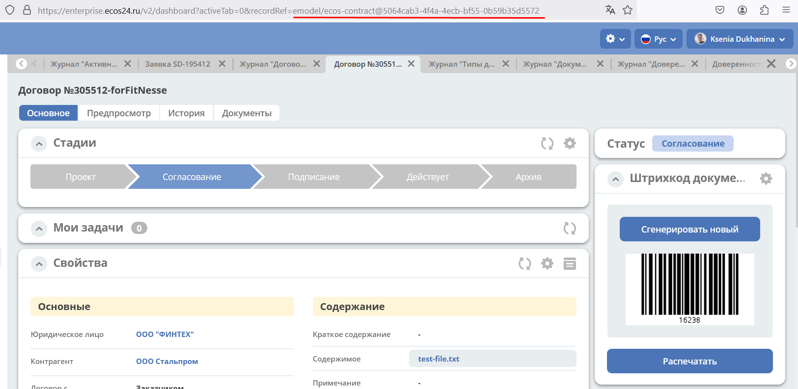

RecordRef
==========

.. _RecordRef:

**RecordRef** - идентификатор записи, вида ``appName/sourceId@id``, где **/** и **@** - особые разделители.
  
Состоящий из трех частей:

 * **appName** - идентификатор приложения, к которому относится запись, например системные микросервисы (например,emodel, eproc) и разработанные микросервисы;
 * **sourceId** - идентификатор локального (для приложения) источника данных, к которому относится запись;
 * **id** - локальный идентификатор, который должен быть уникален в пределах источника.

**RecordRef**, например, указывается в строке браузера при обращении к сущности:

Если в **RecordRef** не задан **sourceId**, то источником по умолчанию считается - "" (пустая строка).

RecordRef является реализацией интерфейса EntityRef.

Уровни детализации от меньшего к большему:

 * /@localId == @localId == localId
 * /sourceId@localId == sourceId@localId
 * appName/sourceId@localId

.. code-block:: java

  RecordRef.create("emodel", "type", "testdl-counterpartyToAuthority");

* **emodel** – appName
* **type** – sourceId
* **testdl-counterpartyToAuthority** - id