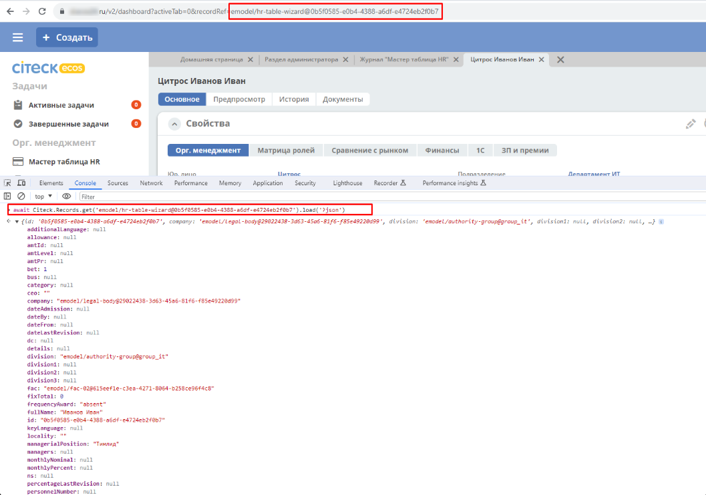
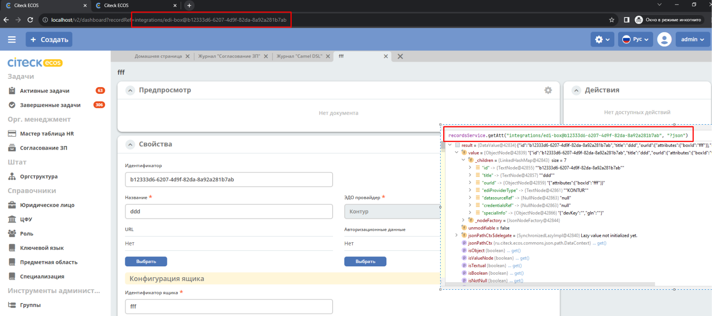

Атрибуты
===========

.. contents::
   :depth: 3

Синтаксис атрибутов
--------------------

.. _Records API attribute:

Самый простой способ получить значение атрибута - это указать его имя::

  cm:name

.. note:: 
  Двоеточие - часть имени и не является спец символом в данном контексте.

Если мы не указываем скаляр, то он по умолчанию принимается равным **"?disp"**. То есть запись выше аналогична следующей::

  cm:name?disp

Для значений с типом **"Строка (String)"** разницы между скалярами **"?disp"** и **"?str"** нет т.к. вернется одно и то же значение.

Для обращения к вложенному атрибуту следует разделять имена точкой::

  counterparty.fullOrgName?str

Если на каком-то из уровней в атрибуте ожидается список значений, то следует использовать квадратные скобки **"[]"** после имени атрибута::

  counterparty[].fullOrgName?str
  cm:manager.cm:subordinates[].cm:userName?str
  cm:manager.cm:department.managers[].cm:subordinates[].cm:userName?str

Если мы запросили атрибут без указания квадратных скобок, а источник данных вернул список, то мы получим только первый элемент из этого списка или null, если список пустой.

Для получения сразу нескольких атрибутов у вложенного значения можно использовать фигурные скобки::

  cm:manager.cm:subordinates[]{userName:"cm:userName?str",firstName:"cm:firstName"}

В результате получим следующую структуру::

  [
    {
        "userName": "ivan.ivanov",
        "firstName": "Ivan"
    },
    {
        "userName": "petr.petrov",
        "firstName": "Petr"
    }
  ]

В атрибутах есть поддержка пост-процессоров, которые позволяют выполнять операции над результатом перед тем как вернуть его клиенту.

Пост-процессоры описываются после атрибута через символ вертикальной черты **"|"**.

**Форматирование даты**::

  cm:created|fmt("yyyy__MM__dd")

Подробнее о шаблоне для форматирования даты можно почитать здесь: https://docs.oracle.com/javase/7/docs/api/java/text/SimpleDateFormat.html

**Форматирование числа**::

  ecos:documentAmount|fmt("00000.00")

Данный формат помогает дополнить число лидирующими нулями, если его целая часть меньше 5 знаков и ограничивает числа после запятой двумя знаками

Подробнее о шаблоне для форматирования чисел можно почитать здесь: https://docs.oracle.com/javase/7/docs/api/java/text/DecimalFormat.html

**Значение по умолчанию**::

  ecos:documentAmount?num|or(0)

Если атрибут **ecos:documentAmount** вернет **null**, то вместо него мы получим число **0**.

Для процессора **"or"** есть короткая запись через **"!"** ::

  ecos:documentAmount?num!0

В процессоре **"or"** можно использовать другие атрибуты::

  cm:title?str!cm:name?str
  cm:title?str|or("a:cm:name?str")

В данном примере мы получим значение **cm:title** или значение **cm:name**, если **cm:title** равен null или пустой строке.

.. note::
  Данный атрибут приведен для примера и для получения "заголовок или имя" лучше использовать скаляр **"?disp"** т.к. у нод alfresco он по умолчанию реализован подобным образом

В полной форме нам нужно указать префикс **"a:"** чтобы обозначить, что нам нужно значение атрибута, а не константа **"cm:name?str"**
Если нам нужно строковое константное значение в короткой форме, то следует взять значение в кавычки::

  cm:title?str!"cm:name"

**Добавление префикса или суффикса**::

  cm:name|presuf("prefix-","-suffix")

Если значение **cm:name** равно **"Имя"**, то на выходе мы получим **"prefix-Имя-suffix"**
Значение суффикса можно не задавать. Если значение префикса не нужно, а значение суффикса нужно, то первым аргументом можно передать пустую строку.

**Процессоры можно объединять**::

  cm:title!cm:name!"n-a"|presuf("prefix-","-suffix")

1. Взять **заголовок**;
2. Если заголовок пустой, то взять **имя**;
3. Если имя пустое, то взять константу **"n-a"**;
4. Добавить к результату пунктов 1-3 префикс **"prefix-"**;
5. Добавить к результату пункта 4 суффикс **"-suffix"**.

.. list-table:: Список возможных пост-процессоров
    :widths: 5 50 50
    :header-rows: 1

    *   - Название
        - Аргументы
        - Описание
    *   - presuf
        - | ``prefix: String``
          | ``suffix: String``
        - Добавить константу в начало и/или в конец строки
    *   - or
        - | ``orValue0: Any``
          | ``orValue1: Any``
          | ``orValueN: Any``
        - | Вернуть значение по умолчанию если значение атрибута равно null. Если аргумент является строкой
          | и начинается на "a:", то оставшаяся часть атрибута воспринимается как другой атрибут, который
          | нужно вычислить и вернуть в результате.
          | Количество аргументов не ограничено. Аргументы перебираются по очереди
          | и если он не null (не является null и не вычислился через "a:" в null), то результат сразу возвращается.
    *   - rxg
        - | ``pattern: String``
          | ``groupIdx: Int = 1``
        - | Применить регулярное выражение к результату и вернуть указанную группу.
          | Примеры:
          | ``"some-text" | rxg("some-(.+)") -> text``
          | ``"some-text-and-more" | rgx("(some)-(text)-(and)-(more)", 2) -> text``
    *   - join
        - ``delimiter: String = ","``
        - Объединить список значений в строку используя указанный разделитель
    *   - hex (3.26.0+)
        - | ``delimiter: String = ""``
        - | Представить base64 строку как HEX строку (список шестнадцатеричных чисел,
          | где каждый байт представлен двумя символами)
    *   - fmt
        - | ``format: String``
          | ``locale: String = "en"``
          | ``timezone: String = "UTC"``
        - Отформатировать число или дату по указанному формату
    *   - cast
        - | ``type: { "str", "num", "bool" }``
        - Преобразует значение в указанный формат.
    *   - yaml 
        - 
        - Любую структуру приводит к YAML строке.
          | Пример:

            .. code-block:: js

                await Citeck.Records.get('uiserv/form@ECOS_FORM').load('?json|yaml()')

Поисковые запросы
------------------

**Группировка**

В query можно задать атрибуты для группировки через параметр groupBy.
Если Records DAO поддерживает группировку (реализует интерфейс RecsGroupQueryDao), то RecordsService ничего не делает
с запросом и передает его как есть в DAO. Если же Records DAO не поддерживает группировку, то RecordsService пробует 
выполнить группировку самостоятельно используя дополнительные запросы. Этот механизм называется "автогруппировка". 
Так как автогруппировка может быть нежелательна в ряде случаев, то в системе предусмотрен флаг для её отключения::
  
  ecos.webapp.records.queryAutoGroupingEnabled

Если этот флаг выставлен в false и целевой Records DAO не поддерживает группировку, то все запросы с непустым groupBy 
будут возвращать пустой список.

Работа с MLText полями (3.26.0+)
--------------------------------------

Если известно. что в каком-то атрибуте лежит строка или MLText структура (объект, где в качестве ключей локаль,
а в значении соответствующая строка), то можно применить преобразование **"mltext"**.

Пример::

    some.att._as.mltext // получение актуального значения по локали пользователя
    some.att._as.mltext.ru // получение значения для конкретной локали
    some.att._as.mltext.closest.ru // получение значения для конкретной локали с попыткой вычислить ближайшее не пустое значение
    some.att._as.mltext?json // получение значения для всех локалей (если some.att является строкой, то она будет соответствовать локали "en")

Преобразование работает для **String, DataValue, MLText, ObjectData, JsonNode (jackson)**

Использование динамических атрибутов в предикатах (3.26.0+)
------------------------------------------------------------

При использовании поиска на основе языка предикатов для всех источников записей есть возможность
указывать вместо значений динамически вычисляемые атрибуты.

Пример запроса с текущим пользователем::

    {
        "t": "eq",
        "att": "actor",
        "val": "${$user.userName}"
    }

Если ``${}`` один и занимает всю строку, то ``"${...}"`` меняется полностью на вычисленное значение. Таким образом результат вычисления шаблона может быть любым JSON типом включая null.
Динамические вставки можно использовать на любом уровне вложенности для любых значений в объектах (можно задавать t, att, val).

Список доступных атрибутов можно посмотреть в разделе **"Контекстные атрибуты"**.

Контекстные атрибуты
-----------------------

.. _context_attributes:

Часто возникают ситуации, когда нужно загрузить атрибуты, которые не относятся напрямую к сущности, а являются контекстными.

Пример таких атрибутов:

* **Текущий пользователь**
* **Текущая дата**

Для доступа к таким атрибутам при запросе данных к имени атрибута в начале добавляется знак **"$"**.

Т.о. если нам нужно получить имя текущего пользователя, мы можем загрузить следующий атрибут::

  $user.cm:userName

Если нам нужно получить текущую дату и отформатировать её::

  $now|fmt("yyyy")

Список контекстных атрибутов, которые доступны во всех источниках:

* **user** - Текущий пользователь
* **now** - Текущая дата
* **auth** - Аутентификация текущего пользователя. С помощью этого атрибута можно проверить является ли пользователь частью группы или глобальной роли::

  $auth._has.GROUP_ECOS_ADMINISTRATORS?bool
  $auth._has.ROLE_ADMIN?bool

* **str** - Атрибут для указания константного строкового значения
* **ref** - Атрибут для указания ссылки на другую сущность
* **appName** - Имя текущего приложения
* **appInstanceId** - Идентификатор инстанса текущего приложения   

Если в серверном коде нужно расширить доступный список контекстных атрибутов, то работу с RecordsService нужно выполнять следующим образом::

  val contextAtts = mutableMapOf<String, Object>()
  contextAtts["customVariable"] = RecordRef.valueOf("emodel/person@admin")

  String result = RequestContext.doWithAtts(contextAtts) {
    recordsService.getAtt("any-record", "$customVariable?disp").asText()
  }

В качестве значений для контекстных атрибутов могут быть EntityRef'ы (для доступа к другим сущностям) или значения любых других типов.

Скаляры
----------

?raw и ?bin
~~~~~~~~~~~~~~

В [3.45.0] Появилось два новых скаляра - **?raw** и **?bin**

**?raw** возвращет данные без преобразования, как есть.

**?bin** возвращает бинарные данные. При использовании json-формата равнозначен использованию **?str** (данные передаются в виде base64 строки), но с использованием форматов, которые поддерживают передачу массивов байт без необходимости трансформации в base64 дает преимущество по размеру передаваемых данных (base64 дает оверхед 33%). 

?json 
~~~~~~~

Скаляр **?json** удобен для получения всего набора атрибутов из записи. 

Синтаксис для js: 

Синтаксис для java:

Например - чтобы одним запросом вытянуть все значения для всех локализаций у MLText поля, необходимо использовать при загрузке значения атрибута скаляр **"?json"**.

.. code-block::

  Records.get("emodel/test-type@ed955b2d-44c2-4617-b48d-0a6b2e0d5a53").load("name?json")
  -> 

  {"ru":"Договор №17362","en":"Contract №17362"}