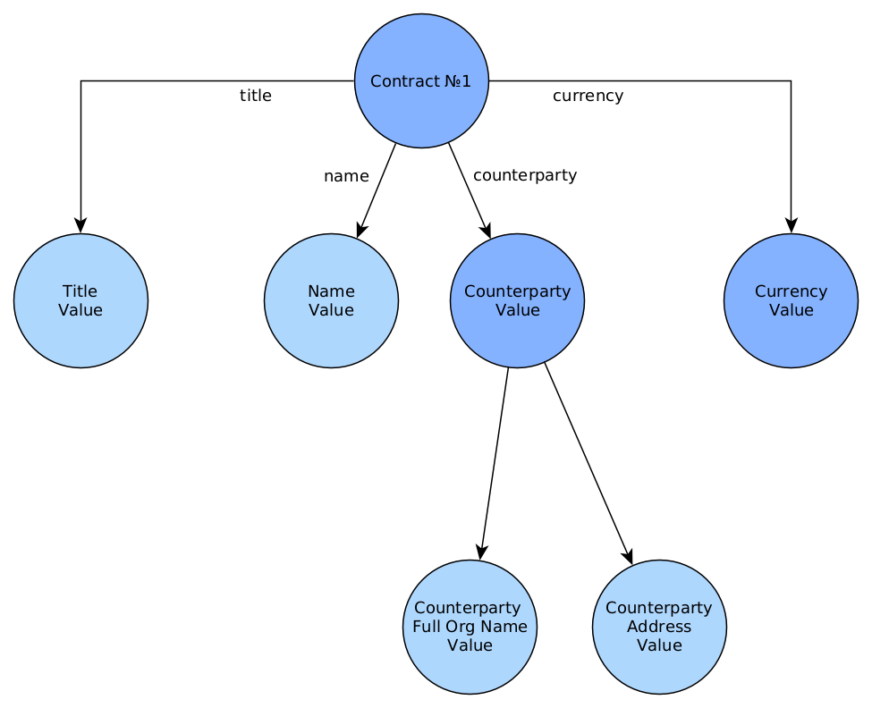
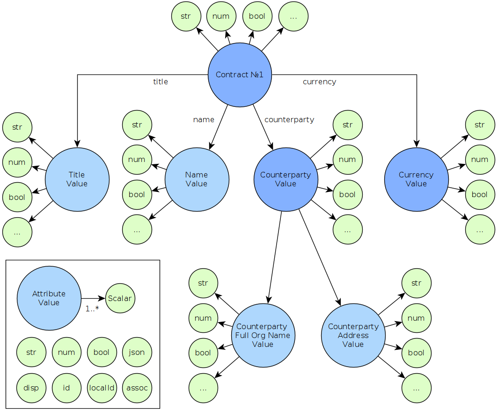
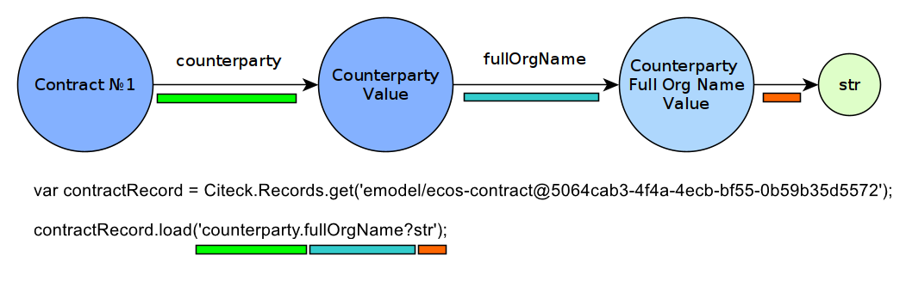

Термины и описание работы
===========================

Термины
---------

Общие:

 * **Атрибут (Attribute)** – свойство или ассоциация сущности;
 * **Сущность (Entity)** – некоторый объект в системе (договор, доверенность, человек, группа, форма и др.);
 * **Запись (Record)** – сущность с набором атрибутов и идентификатором записи (:ref:`RecordRef<RecordRef>`);
 * **Идентификатор записи (RecordRef)** – идентификатор источника данных и локальный идентификатор сущности в виде строки.
 * **Источник данных (записей) (Records DAO)** – источник данных, в котором описана логика базовых CRUD операций для работы с сущностями.

Данные:

 * **Граф данных (Data Graph)** – представление данных, которые может запросить клиент по схеме атрибутов;
 * **Скаляр (Scalar)** – некоторое финальное значение в графе данных, у которого нельзя запросить вложенные атрибуты (строка, число и др).
 * **Схема атрибутов (Attributes Schema)** – описание запроса данных для преобразования графа данных в наборы (map и list) значений скаляров;

Описание работы с данными
----------------------------

.. _Records_API_scalar:

Очень часто данные не являются плоским списком, а представляют из себя граф, где сущности ссылаются друг на друга.
Ниже показан пример такого среза данных, где у нас есть договор с четыремя атрибутами:

 * **Заголовок (Title)** - Строка
 * **Имя (Name)** - Строка
 * **Контрагент (Counterparty)** - Сложный объект
     * **Полное наименование (Full Organization Name)** - Строка
     * **Адрес контрагента (Counterparty Address)** - Строка
 * **Валюта (Currency)** - Сложный объект
    * *атрибуты пропущены для простоты*

.. _scalars:

С точки зрения Records API каждый узел этого графа данных может быть получен как значение одного из скаляров:

Примитивные скаляры:

 * **disp** - Человекочитаемый вид значения. (Примеры: Для договора - "Договор №2", Для пользователя - "Иванов Иван");
 * **str** - Строка;
 * **num** - Число (Двойная точность. Если точности Double не хватает, то следует использовать str);
 * **bool** - Булево значение;
 * **json** - JSON представление значения. Допускаются массивы и объекты. см. ниже;
 * **id** - глобальный идентификатор значения, который содержит идентификатор источника данных и локальный идентификатор. Актуален для сложных значений вроде "Договор", "Контрагент", "Валюта" и др.;
 * **localId** - то же что и id, но без идентификатора источника данных;

Непримитивные скаляры:

 * **?raw** возвращет сырые данные в исходном виде, как есть.Это единственный скаляр, при загрузке которого не происходит конвертации исходных данных.
 * **?bin** возвращает бинарные данные. При использовании json-формата равнозначен использованию **?str** (данные передаются в виде base64 строки), но с использованием форматов, которые поддерживают передачу массивов байт без необходимости трансформации в base64 дает преимущество по размеру передаваемых данных (base64 дает оверхед 33%). 
 * **?json** удобен для получения всего набора атрибутов из записи. 

       Синтаксис для js:

       .. code-block::

        await Citeck.Records.get ('hr-table-wizard@0b5f0585-e0b4-4388-a6df-e4724eb2f0b7').load('?json')

       .. image:: _static/json_1.png
              :width: 600
              :align: center

       Синтаксис для java:

       .. code-block::

        recordsService.getAtt("integrations/edi-box@b12333d6-6207-4d9f-82da-8a92a281b7ab", "?json")       

       .. image:: _static/json_2.png
              :width: 600
              :align: center

       Например - чтобы одним запросом вытянуть все значения для всех локализаций у MLText поля, необходимо использовать при загрузке значения атрибута скаляр **"?json"**.

       .. code-block::

        Records.get("emodel/test-type@ed955b2d-44c2-4617-b48d-0a6b2e0d5a53").load("name?json")
       
        -> 

        {"ru":"Договор №17362","en":"Contract №17362"}

Для примера рассмотрим получение полного наименования организации контрагента у договора.

Здесь мы используем javascript Records API для загрузки нужного нам атрибута. 

**Первая строка** - получение записи по её идентификатору RecordRef. :ref:`см. подробно<RecordRef>`

.. note::

  Общий вид идентификатора **"приложение/источник_данных@локальный_id"**, но здесь присутствует только локальный_id.

**Вторая строка** - загрузка нужного нам атрибута. Вложенные атрибуты разделены точкой **"."**, а скаляр определяется знаком вопроса **"?"**

.. note::

  Допустимая вложенность атрибутов не ограничена

