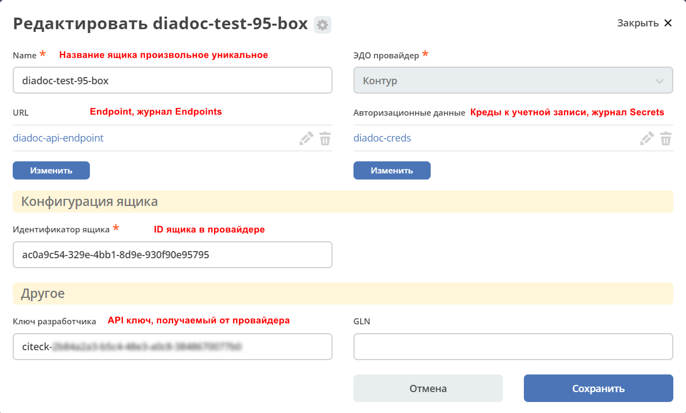
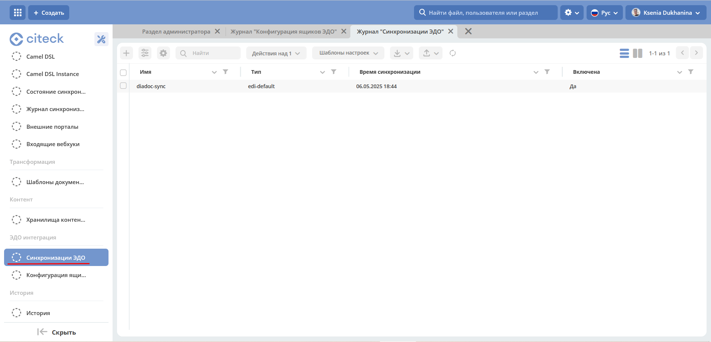
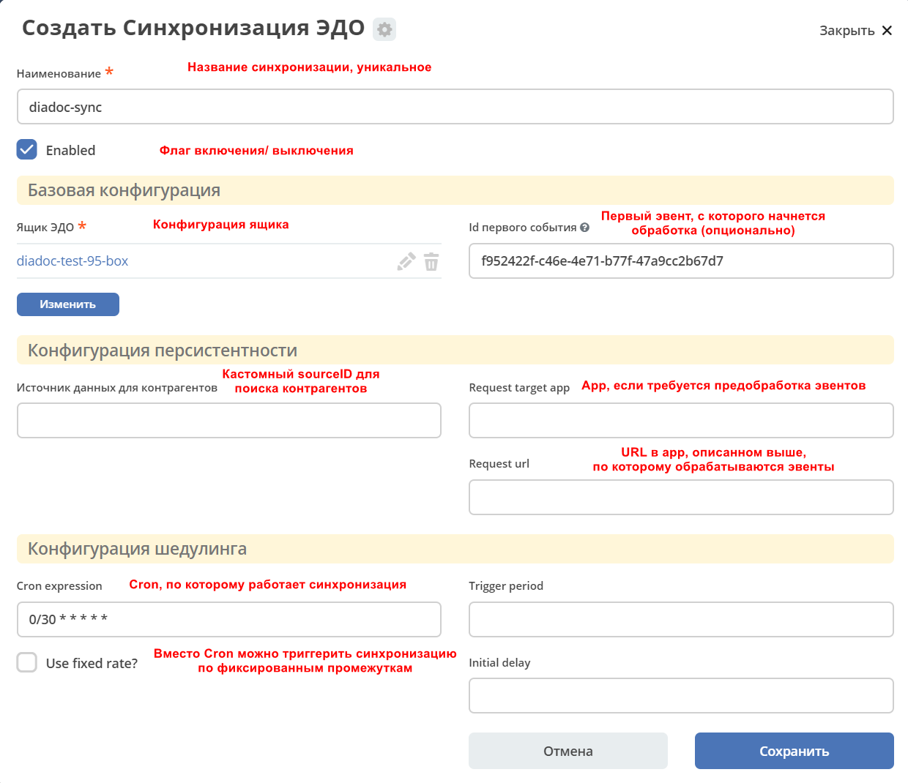
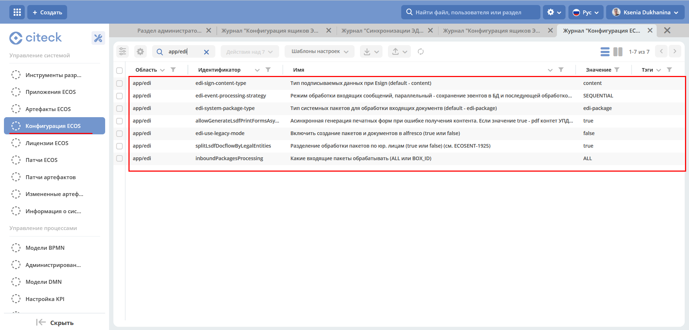

Настройка синхронизации и конфигурация
========================================

.. note::

  На текущий момент логика синхронизации с провайдером для **targetApp = integrations** работает **ТОЛЬКО** для версий с alfresco.

  Если **targetApp = edi**, то обе версии (с alfresco и без).

В микросервис ecos-edi вынесен функционал по EDI синхронизации с провайдерами **diadoc** и **sbis**:

Принцип действия и настройки ящиков и синхронизаций edi практически идентичны настройкам на integrations.

Перед созданием ящиком необходимо создать записи в журналах **Секреты** и **Конечные точки**.

Для того чтобы добавить новую синхронизацию с каким-либо ящиком диадок или СБИС необходимо:

1. Cоздать ящик в журнале **Конфигурация ящиков ЭДО**:

.. note:: 

 Журнал располагается в разделе **(Рабочее пространство "Раздел администратора" - ЭДО интеграция)**, не путать с журналом, который располагается в разделе **Интеграция**

2. Настройка ящика такая же как и в integrations:

- **Name** - название ящика, произвольное, уникальное.
- **URL** -  endpoint. Указывается в журнале :ref:`Конечные точки<ECOS_endpoints>`.
- **Авторизационные данные** - креды у учетной записи. Указывается в журнале :ref:`Секреты<ECOS_secrets>`.
- **Идентификатор ящика** - ID ящика в провайдере.
- **Ключ разработчика** - API ключ, получаемый от провайдера.

3. Создание новой синхронизации также идентично тому что в integrations на данный момент.

|

- **Наименование** - название синхронизации, уникальное.
- **Включена** - флаг включения/выключения.
- **Ящик ЭДО** - конфигурация ящика.
- **Id первого события** - первое событие, с которого начнется обработка (опционально).
- **Источник данных для контрагентов** - кастомный sourceID для поиска контрагентов. 
- **Стратегия обработки эвентов** - режим обработки входящих сообщений:
    - **PARALLEL** - параллельный, сохранение событий в БД и последующей обработкой,
    - **SEQUENTIAL** - стандартный последовательный, обработка событий "на лету" при получении.
- **Приложение внешний обработки событий** - App, если требуется предобработка событий.
- **Url адрес для внешней обработки** - URL в app, описанном выше, по которому обрабатываются события.
- **Крон выражение** - Cron, по которому работает синхронизация.
- **Фиксированный запуск** - вместо Cron можно триггерить синхронизацию по фиксированным промежуткам.

.. note::

    Если необходимо включить синхронизацию по ящику в edi микросервисе (**ЭДО интеграция - Синхронизации ЭДО**), то эту же синхронизацию необходимо отключить в integrations микросервисе (**Интеграция - Синхронизации**), иначе возможны ошибки и конкурентные потоки записывающие различные данные в одни и те же документы.

.. note::

    Также, если мы хотим переключить синхронизацию с edi на integrations и наоборот, надо помнить что в другом микросервисе она уже продвинулась и поэтому перед включением обязательно выставлять поле **First event id**, соответствующее последнему обработанному событию, иначе события будут обрабатываться заново уже в другом микросервисе, что займет время и ресурсы.

4. Переключение логики по исходящим пакетам, а также любым действиям с нашей стороны.

Для того чтобы переключить логику выполнения запросов к провайдеру между edi и integrations микросервисами существует настройка **TargetEdiApp** (значения edi или integrations). Актуально только для систем с alfresco, для чистых ecos системы вся логика общения с провайдерами идет через edi.

См. ниже по остальным настройкам (для работы микросервиса edi необходимо выставить этой настройке параметр - edi).

Настройки и конфигурация
----------------------------

Основные настройки, на которые следует обратить внимание:

**TargetEdiApp** - настройка alfresco, служит для того чтобы определять в какой именно микросервис будут отправлены команды завязанные на edi логику с нашей стороны (подписание и отправка титулов, отказ, аннулирование и т.д.). Принимает 2 значения:

    - **integrations** - команды отсылаются в микросервис ecos-integrations (старая логика)
    - **edi** - команды отсылаются в новый микросервис ecos-edi

Если данное поле пустое, то команды отсылаются в микросервис integrations по умолчанию.

.. image:: _static/edi_5.png
       :width: 600
       :align: center

1. Конфигурация из ecos конфига **(Рабочее пространство "Раздел администратора" - Управление системой - Конфигурация ECOS)**:

- **edi-event-processing-strategy** - стратегия обработки входящих эвентов (SEQUENTIAL или PARALLEL). 

   - **SEQUENTIAL** - стандартная обработка эвентов по мере их получения, друг за другом. 
   - **PARALLEL** - сохранение получемых эвентов в БД и последующая их параллельная обработка разбитая по пакетам. (В разных потоках одновременно обрабатываются эвенты по пакетам, в рамках пакета эвенты обрабатываются последовательно)

- **edi-system-package-type** - тип системного пакета (используется в новой логике, в гибридном варианте с alfresco пока не используется, возможно позже, когда будет миграция данные).
- **allowGenerateLsdfPrintFormsAsyncOnFail** - настройка перенесенная из ecos-integrations, позволяет асинхронную генерацию печатных форм (оставить в true).
- **edi-use-legacy-mode** - как именно обрабатываются пакеты, по старой логике или по новой (true, так как используем пока вместе с alfresco и логика обработки и системные пакеты должны сохраняться в БД alfresco).
- **splitLsdfDocflowByLegalEntities** - разделение системных пакетов по юр. лицам (настройка перенесенная из ecos-integrations, возможно переименуем или переделаем данный функционал в зависимости от потребностей, по умолчанию - true).
- **inboundPackagesProcessing** - настройка перенесенная из ecos-integrations, какой тип эвентов обрабатывать все (ALL - по умолчанию) или по BOX_ID.
    

