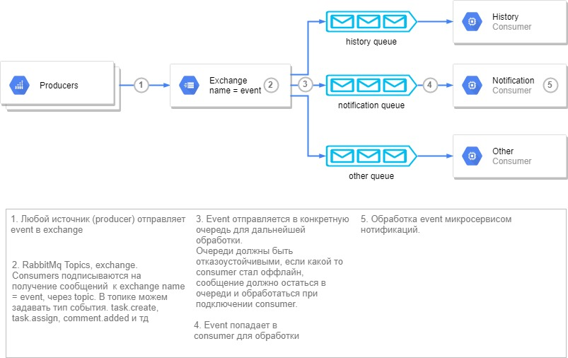

Events
=======

.. _events_1-0_label:

Events 1.0
----------

Архитектура
~~~~~~~~~~~

Описание
~~~~~~~~
Получение / отправка events из alfresco
"""""""""""""""""""""""""""""""""""""""
Отправка сообщений (events) и получение строится на основе rabbitmq и моделей events в библиотеке - `ecos-events <https://gitlab.citeck.ru/ecos-community/ecos-events>`_. на стороне producer и consumer строится подключение к rabbitmq.

На стороне alfresco, свойства, отвечающие за подключение::

 event.server.connection.enabled=false
 event.server.host=localhost
 event.server.port=0
 event.server.username=
 event.server.password=

Очередь durable, сообщения требуют обязательного подтверждения обработки. Если при обработки сообщения произошло исключения, то сообщения попадает в dead-letter-queue с определенном ttl, после истечения ttl сообщения поступает обратно в "рабочую" очередь для повторной обработки. Пока есть пару проблем с повторной обработкой, см. блок TODO \ Проблемы. 

На данный момент из alfresco отправляются events по задачам - task.create, task.assign, task.compete, task.delete. По умолчанию выключена, свойства отвечающие за отправку в alfresco::

 event.task.create.emit.enabled=false
 event.task.assign.emit.enabled=false
 event.task.complete.emit.enabled=false
 event.task.delete.emit.enabled=false

Имеется поддержка нескольких инстансов alfresco, на основе tenant id. В alfresco добавлено свойство ecos.server.tenant.id, на основе  которого реализовано разделение.

.. attention::
    TODO / Проблемы:
    
    Необходимо проверить запуск несколько инстансов микросевиса, проверить как правильно ли будут забираться сообщения из очереди и обрабатываться.
    
    Довести до ума dead-letter-queue. Сейчас при возникновении исключения, сообщение отправляется в dead-letter-queue с определенным ttl, после истечения ttl сообщения возвращается в рабочую очередь
        
        * Но при этом рабочая очередь почему то не пытается обработать сообщение, пришедшее из dead-letter-queue. 
        * Нужно сделать повторную обработку сообщений, какое-то определенное кол-во раз.

Events 2.0
-----------

Отправка уведомлений как реакция на событие - сменился кейс статус, изменился атрибут, назначилась задача и т.д.

Архитектура
~~~~~~~~~~~

.. image:: _static/events/notification_through_events_2.0.png
       :align: center
