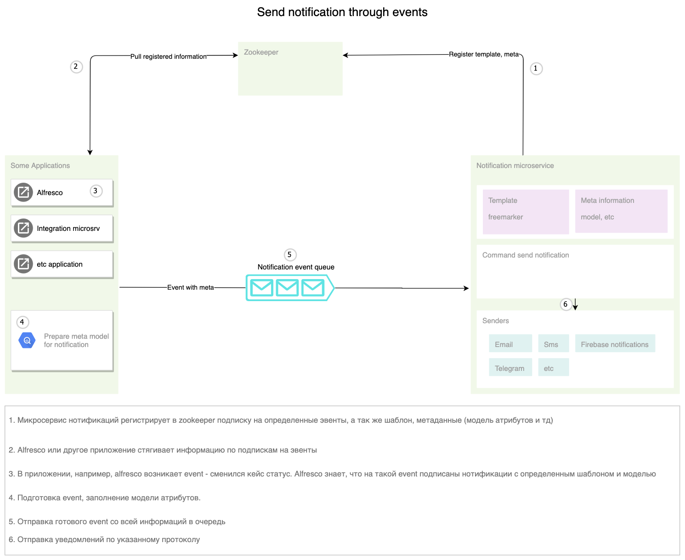
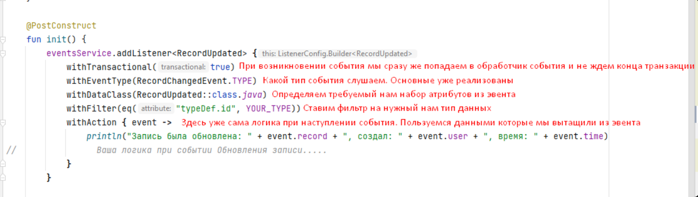

Работа с событиями (events) 
===========================================

Events 2.0
-----------

Реакция на события (events) строится на основе rabbitmq и моделей events в библиотеке - `ecos-events <https://github.com/Citeck/ecos-events>`_. На стороне producer и consumer строится подключение к rabbitmq. Пример: отправка уведомлений как реакция на событие - сменился статус, изменился атрибут, назначилась задача и т.д.

Архитектура
~~~~~~~~~~~

Описание работы
---------------

События в ECOS позволяют менять атрибутивный состав, который нужен подписчику на событие, без модификации источника событий.
При старте системы все подписчики регистрируют в Zookeeper список необходимых им событий по типам и атрибуты события, в которых они заинтересованы.

Приложение, которое может отправлять события подобного типа, видит, что в системе есть подписчики на эти события, и,
при их возникновении, подготовив необходимый список атрибутов, отправляет их в Rabbit MQ (нетранзакционные слушатели) или
напрямую слушателю (транзакционные слушатели) через синхронный запрос.

Атрибуты описываются в формате Records API и могут пользоваться всеми преимуществами данного API.

Транзакционные слушатели
------------------------

Транзакционные слушатели позволяют реагировать на события "здесь и сейчас", не дожидаясь пока транзакция завершится.
Подобные слушатели могут быть использованы, чтобы добавить валидацию состояния системы с возможностью прервать транзакцию или для любых других действий,
которые должны выполниться в рамках транзакции.

Важная особенность - добавляя транзакционных слушателей вы автоматически добавляете жесткую зависимость генерирующих события микросервисов
от микросервиса со слушателем. Т.е. если микросервис со слушателем недоступен, то микросервис, генерирующий события не сможет функционировать в полной мере.

Примеры
-------

Подписка на событие с произвольными атрибутами (Kotlin)
~~~~~~~~~~~~~~~~~~~~~~~~~~~~~~~~~~~~~~~~~~~~~~~~~~~~~~~~~

.. code-block:: kotlin

  eventsService.addListener<DataValue> {
      withTransactional(true)
      withEventType(RecordCreatedEvent.TYPE)
      withAction {
          println("Event for record with type: ${it["type"].asText()} Display name: ${it["disp"].asText()}")
      }
      withDataClass(DataValue::class.java)
      withAttributes(mapOf("type" to "rec._type?id", "disp" to "rec?disp"))
  }

Подписка на событие с произвольными атрибутами (Java):
~~~~~~~~~~~~~~~~~~~~~~~~~~~~~~~~~~~~~~~~~~~~~~~~~~~~~~~~~

.. code-block:: java

  Map<String, String> attributes = new HashMap<>();
  attributes.put("type", "rec._type?id");
  attributes.put("disp", "rec?disp");

  eventsService.<DataValue>addListener(b -> {
      b.withTransactional(true);
      b.withEventType(RecordCreatedEvent.TYPE);
      b.withActionJ((event) -> {
          System.out.printf(
              "Event for record with type: %s Display name: %s%n",
              event.get("type").asText(),
              event.get("disp").asText()
          );
      });
      b.withDataClass(DataValue.class);
      b.withAttributes(attributes);
      return Unit.INSTANCE;
  });

Пример listener-а событий для определенного типа данных
~~~~~~~~~~~~~~~~~~~~~~~~~~~~~~~~~~~~~~~~~~~~~~~~~~~~~~~~~

.. code-block::

    import org.springframework.stereotype.Component
    import ru.citeck.ecos.events2.EventsService
    import ru.citeck.ecos.events2.type.RecordChangedEvent
    import ru.citeck.ecos.events2.type.RecordCreatedEvent
    import ru.citeck.ecos.events2.type.RecordDeletedEvent
    import ru.citeck.ecos.records2.RecordRef
    import ru.citeck.ecos.records2.predicate.model.Predicates.eq
    import ru.citeck.ecos.records3.record.atts.schema.annotation.AttName
    import java.time.Instant
    import javax.annotation.PostConstruct

    @Component
    class SomeTypeEventsListener(
        private val eventsService: EventsService,
    ) {

        companion object {
            private const val YOUR_TYPE = "ID вашего типа данных"
        }

        @PostConstruct
        fun init() {
            eventsService.addListener<RecordUpdated> {
                withTransactional(true)
                withEventType(RecordChangedEvent.TYPE)
                withDataClass(RecordUpdated::class.java)
                withFilter(eq("typeDef.id", YOUR_TYPE))
                withAction { event ->
                    println("Запись была обновлена: " + event.record + ", создал: " + event.user + ", время: " + event.time)
    //                Ваша логика при событии Обновления записи.....
                }
            }

            eventsService.addListener<RecordCreated> {
                withTransactional(true)
                withEventType(RecordCreatedEvent.TYPE)
                withDataClass(RecordCreated::class.java)
                withFilter(eq("typeDef.id", YOUR_TYPE))
                withAction { event ->
                    println("Создана новая запись: " + event.record + ", создал: " + event.user + ", время: " + event.time)
    //                Ваша логика при событии Создания записи.....
                }
            }

            eventsService.addListener<RecordDeleted> {
                withTransactional(true)
                withEventType(RecordDeletedEvent.TYPE)
                withDataClass(RecordDeleted::class.java)
                withFilter(eq("typeDef.id", YOUR_TYPE))
                withAction { event ->
                    println("Запись была удалена: " + event.record + ", удалил: " + event.user + ", время: " + event.time)
    //                Ваша логика при событии Удаления записи.....
                }
            }

    //        И еще много других Listener-ов для уже реализованных эвентов или ваших собственных
    //        Например для RecordStatusChangedEvent, RecordDraftStatusChangedEvent, RecordContentChangedEvent и тд.
        }

    //    В data классах определяем набор необходимых нам данных, которые хотим достать из Event-а.
    //    Можно ознакомиться с классом RecordEventTypes.kt из библиотеки ecos-events2 для более подробного понимания какие данные можно получить

        data class RecordUpdated(
            @AttName("record?id")
            val record: RecordRef,
            @AttName("\$event.time")
            val time: Instant,
            @AttName("\$event.user")
            val user: String,
        )

        data class RecordCreated(
            @AttName("record?id")
            val record: RecordRef,
            @AttName("\$event.time")
            val time: Instant,
            @AttName("\$event.user")
            val user: String,
        )

        data class RecordDeleted(
            @AttName("record?id")
            val record: RecordRef,
            @AttName("\$event.time")
            val time: Instant,
            @AttName("\$event.user")
            val user: String
        )

    }

Пояснения:

