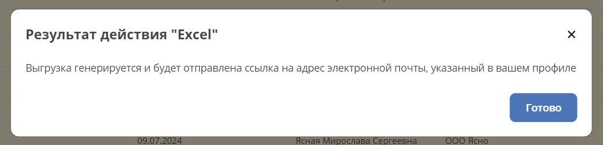

Групповые действия
======================

.. _group_actions:

.. note::

    Доступно только в Enterprise версии.

.. contents::
   :depth: 3
   
Групповые действия позволяют обработать большое количество элементов на сервере.

Примеры групповых действий:

    1. Выгрузка в Excel
    2. Скачивание Zip архива со всеми выбранными элементами

Лицензия
---------

Функционал групповых действий доступен если в разделе **features** содержимого лицензии есть запись **group-actions**:

.. code-block::

    features:
    group-actions: {}

Описание новых групповых действий в микросервисе
-------------------------------------------------

Для добавления возможности описывать групповые действия в микросервисе нужно добавить в **pom.xml** зависимость:

.. code-block::

    <!-- Подходящая версия подтянется из родительского pom файла -->
    <dependency>
        <groupId>ru.citeck.ecos.ent.groupactions</groupId>
        <artifactId>ecos-group-actions</artifactId>
    </dependency>

После этого можно описывать свою реализацию следующего интерфейса как spring-компонент (он зарегистрируется автоматически): 

.. code-block::

    interface GroupActionExecutionFactory<in T : Any, in C : Any> {
    
        fun createExecution(config: C): GroupActionExecution<T>
    
        fun getType(): String
    }

Метод **getType** должен вернуть тип, по которому можно будет вызвать реализуемое действие.

Метод **createExecution** вызывается каждый раз когда запускается новое действие.

Интерфейс **GroupActionExecution** выглядит следующим образом:

.. code-block::

    interface GroupActionExecution<in T : Any> {
    
        fun getRequiredAttributes(): Map<String, *> {
            return emptyMap<String, String>()
        }
    
        @Throws(Exception::class)
        fun execute(context: GroupActionContext<T>): ActionResult
    
        @Throws(Exception::class)
        fun dispose()
    }

Метод **getRequiredAttributes** возвращает мапу с атрибутами, которые нужны для выполнения действия. Атрибуты можно запрашивать и в ходе выполнения действия, но эффективнее вернуть их список заранее, чтобы не делать лишних запросов.

Метод **dispose** вызывается когда действие завершилось с любым результатом. Т.е. в случае ошибки метод **dispose** будет так же вызван.

Метод **execute** вызывается в момент запуска действия. Все основные манипуляции с данными выполняется именно в этом методе.

В метод **execute** передается контекст действия с методами **getValues(): Iterable<T>** и **getBatchedValues(batchSize: Int): Iterable<List<T>>**. Можно вызвать любой из этих методов и перебрать все значения через цикл или вручную.

Если предполагается, что при возникновении ошибки обработку не нужно прерывать, то исполнитель действия должен сам это учитывать. В случае выбрасывания исключения из метода **execute** выполнение действия сразу завершается.

Варианты результата групповой операции:

.. list-table::
      :widths: 5 5 10 20
      :header-rows: 1
      :align: center
      :class: tight-table 

      * - Класс
        - ID
        - Данные
        - Описание
      * - **ActionResultLink**
        - LINK
        - url: String
        - | Вернуть ссылку на что-то для скачивания. 
          | Ссылка должна быть относительной (без протокола, хоста, порта). 
          | Например:

            .. code-block::

                /gateway/emodel/api/ecos/webapp/content?ref=temp-file@1c1bf32d-07ad-422c-85e4-4789058e0fb1

          | Для получения ссылки на скачивание контента записи можно пользоваться методом **getDownloadUrl** в сервисе **EcosContentApi**. 
          | Там же есть API для создания временного файла.
      * - **ActionResultMessage**
        - MESSAGE
        - message: String
        - Вернуть сообщение
      * - **ActionResultOk**
        - OK
        - 
        - Вернуть простой результат о том что действие успешно выполнено
      * - **ActionResultResults**
        - RESULTS
        - 

            .. code-block::

                results: List<Result>

                Типы: 

                Result:
                message: String,
                status: ResultStatus,
                recordRef: EntityRef

                enum ResultStatus {
                OK,
                ERROR,
                PERMISSION_DENIED,
                SKIPPED
                }

        - Вернуть список результатов по каждой обрабатываемой записи       

Потоки исполнения
------------------

Все групповые действия выполняются в рамках преднастроенного тред пула.

Настройка количества потоков исполнения через spring свойства:

.. code-block::

    ecos:
    webapp:
        task:
        executors:
            group-actions:
            corePoolSize: 5 # по умолчанию действия выполнают пять потоков

Выполнение действия происходит в контексте пользователя, который его инициировал (права доступа, часовой пояс, локаль и т.д.) 

Запуск группового действия
----------------------------

Для запуска группового действия необходимо подготовить следующие параметры:

.. code-block::

    GroupActionParams(
        values: GroupActionValuesParams, # параметры формирования списка значений для обработки
        execution: GroupActionExecutionParams # параметры обработки
    )
    
    GroupActionValuesParams(
        type: String, # тип источника значений для обработки
        config: ObjectData, # конфигурация для формирования списка значений для обработки
        limit: Long = -1 # ограничение на количество элементов в списке значений. -1 - без ограничений
    )
    
    GroupActionExecutionParams(
        type: String, # тип действия
        config: ObjectData = ObjectData.create(), # конфигурация действия
        timeout: Duration = Duration.ofHours(5) # ограничение на время выполнения
    )

Источники значений:

.. list-table::
      :widths: 10 10 20
      :header-rows: 1
      :align: center
      :class: tight-table 

      * - Тип
        - Конфигурация
        - Описание
      * - records-list
        - 
          .. code-block::

             records: List<EntityRef>

        - Список конкретных сущностей
      * - records-query
        - 

          .. code-block::

            query: RecordsQuery
            pageSize: Int

        - Список конкретных сущностей

Архитектура решения
--------------------

Общий принцип работы групповых действий следующий:

При добавлении зависимости **ecos-group-actions** Spring Boot автоконфигурация регистрирует:

    1. Сервис групповых действий
    2. Регистратор групповых действий
    3. RecordsDAO для групповых действий с ID "group-action"

Для запуска группового действия выполняется мутация записи:

.. code-block::

    {appName_микросервиса}/group-action@

В атрибутах заполняются поля для **GroupActionParams** (т.е. values и execution)

RecordsDao через сервис запускает групповую операцию и сразу же (не дожидаясь её завершения) возвращает ссылку на созданное действие в следующем виде:

.. code-block::

    {appName_микросервиса}:{appInstance_микросервиса}/group-action@{actionId}

Например:

.. code-block::

    transformations:nrfdsvbocapo/group-action@7c269f9c-262b-4426-8865-7309dec07f2c

Далее инициатор действия может загрузить по вернувшемуся рефу атрибуты для получения информации о состоянии действия:

.. code-block::

    status: GroupActionStatus
    initiator: EntityRef
    processedCount: Long
    totalCount: Long
    result: GroupActionResult? # результат выполнения. В статусах WAITING и RUNNING всегда возвращает null. В остальных случаях всегда возвращается не-null значение.
    
    Типы:
    
    enum GroupActionStatus = {
        WAITING, // действие ожидает пока освободится поток для его выполнения
        RUNNING, // действие выполняется
        COMPLETED, // действие завершено успешно
        ERROR // ошибка при выполнении действия
    }
    
    GroupActionResult(
        type: String, # Тип результата. Может быть одним из штатных типов результата (LINK, OK, и т.д.) или ошибочным - "ERROR"
        data: ObjectData # Данные по результату. Например, для LINK здесь будет ссылка, для OK пустой объект.
    )

Инициатор действия периодически может проверять состояние действия через загрузку нужных атрибутов и может выполнить какие-либо действия как только получит статус отличный от WAITING/RUNNING или ненулевой результат. 

UI действие
-------------

.. _ui_group_actions:

Тип действия - **server-group-action-v2**

Конфиг действия:

.. code-block:: yaml

  targetApp: String # целевое приложение где описана реализация групповой операции
  valuesParams:
    limit: Number # Лимит обрабатываемых элементов
  executionParams:
    type: String # Тип действия
    timeout: Duration # Максимальное время, которое действие может выполняться
    config: Map<String, *> # Конфигурация действия. Содержимое зависит от типа действия
  outputParams:
    type: String # Тип способа возвращения результата действия
    config: Map<String, *> # Конфигурация, описывающая дополнительные свойства для возвращения результата действия

**outputParams** не является обязательным параметром и прописывается в том случае, если необходимо исправить дефолтный способ ответа действия.

Пример конфигурации:

.. code-block:: yaml

  id: group-action-export-csv
  type: server-group-action-v2
  name:
    ru: Скачать CSV-файл
    en: Download Excel-file
  
  config:
    targetApp: transformations
    valuesParams:
      limit: 1000000
    executionParams:
      type: export-xlsx
      timeout: T1H
      config:
        fileName: "report"
        columns: [{name: Column, attribute: "?disp"}]

  features:
    execForRecords: true
    execForQuery: true
    execForRecord: false

При выполнении групповой операции отображается окно с прогрессом (% выполнения):

Пример конфигурации с outputParams:

.. code-block:: yaml

  id: group-action-export-xlsx
  type: server-group-action-v2
  name:
    ru: Скачать Excel-файл
    en: Download Excel-file

  config:
    targetApp: transformations
    valuesParams:
      limit: 1000000
    executionParams:
      type: export-xlsx
      timeout: T1H
      config:
        fileName: "${$context.journalName}_${$now|fmt('yyyy-MM-dd_HH-mm-ss')}"
        columns: "${$context.reportColumns[]?json}"
    outputParams:
      type: EMAIL
      config:
        notificationRef: notifications/template@default-link-for-export-file-notification

  features:
    execForQuery: true
    execForRecord: false
    execForRecords: true

