Плагин для IntelliJ IDEA для работы с платформой Citeck
========================================================

.. _IntelliJ_IDEA_plugin:

.. contents::
   :depth: 2

Разработан плагин для IntelliJ IDEA, ускоряющий работу с проектами и артефактами ECOS. Плагин доступен для `Community и Ultimate версий IntelliJ IDEA <https://www.jetbrains.com/idea/download>`_ 

Исходный код плагина доступен по ссылке: `ecos-idea-plugin <https://github.com/Citeck/ecos-idea-plugin>`_

.. note::

 Минимально необходимые версии:
    
  * IntelliJ IDEA - 2022.2.5.
  * Citeck - 4.2

Установка плагина
------------------

Скачайте дистрибути плагина из `release page <https://github.com/Citeck/ecos-idea-plugin/releases>`_ или соберите из исходников самостоятельно.

Далее установите плагин в IDEA: **Settings -> Plugins -> Install Plugin from disk**

Обновление плагина
-------------------

Для обновления скачайте последнюю версию дистрибутива плагина из `release page <https://github.com/Citeck/ecos-idea-plugin/releases>`_

Удалите старую версию из **Settings -> Plugins** и установите последнюю версию плагина **Settings -> Plugins -> Install Plugin from disk**

Функционал плагина
------------------

1. Создание **новых проектов ECOS** (приложение, микросервис).

**File -> New project**

Доступен пункт **ECOS** и варианты создания :ref:`приложения<applications>`/ :ref:`микросервиса<mcs_setup>`:

.. list-table::
      :widths: 20 20
      :align: center

      * - |

            .. image:: _static/idea_plugin/01.png
                  :width: 500
                  :align: center

        - |

            .. image:: _static/idea_plugin/02.png
                  :width: 500
                  :align: center

Создается проект со соответствующей структурой:

.. list-table::
      :widths: 20 20
      :align: center

      * - | **Приложение**

        - | **Микросервис**

      * - |

            .. image:: _static/idea_plugin/03.png
                  :width: 400
                  :align: center

        - |

            .. image:: _static/idea_plugin/04.png
                  :width: 400
                  :align: center

2. Создание **артефактов** по шаблону.

    По правой кнопке в контекстном меню доступен пункт **ECOS Artifact**:

    .. image:: _static/idea_plugin/05.png
        :width: 700
        :align: center

    Вводим название, выбираем тип данных:

    .. image:: _static/idea_plugin/06.png
        :width: 300
        :align: center

    артефакт генерируется в соответствии с шаблоном:

    .. image:: _static/idea_plugin/07.png
        :width: 700
        :align: center

3. **Загрузка/выгрузка артефактов** на/с локального сервера (формы ECOS, журналы, дашборды, процессы).

    Для артефакта доступны следующие действия:

    .. image:: _static/idea_plugin/08.png
        :width: 600
        :align: center

    * **Deploy File** - выгрузка артефакта на сервер. 

    * **Fetch File** - загрузка артефакта с сервера

    * **Open In Browser**- просмотр артефакта в браузере

    * **Open Documentation** - переход на страницу с документацией по артефакту

    Выгрузите артефакт по кнопке **Deploy File** на стенд или локально:

    .. list-table::
      :widths: 20 20
      :align: center

      * - |

            .. image:: _static/idea_plugin/deploy_a.png
                  :width: 300
                  :align: center

        - |

            .. image:: _static/idea_plugin/select_server.png
                  :width: 200
                  :align: center 

       
    Откройте артефакт (например, форму) по кнопке **Open In Browser** в no-code редакторе на стенде или локально, отредактируйте:

    .. list-table::
      :widths: 20 20
      :align: center

      * - |

            .. image:: _static/idea_plugin/form_1.png
                  :width: 500
                  :align: center

        - |

            .. image:: _static/idea_plugin/form_2.png
                  :width: 500
                  :align: center 
    
    Загрузите измененный артефакт обратно по кнопке **Fetch File**:

    .. image:: _static/idea_plugin/08_1.png
        :width: 600
        :align: center

4. **Поиск артефактов** по их идентификаторам (расширение для search everywhere):
   
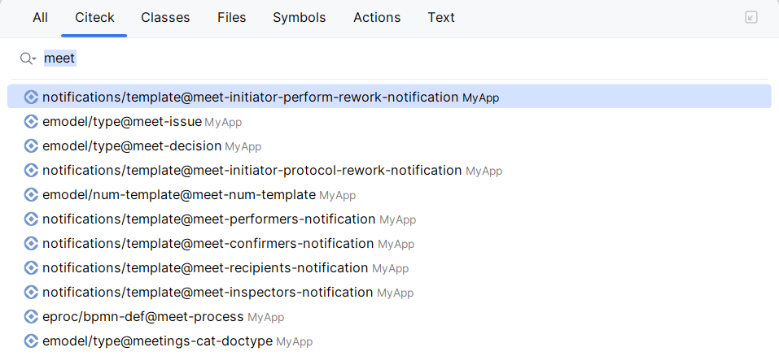

5. **Навигация в коде** по артефактам ECOS через гиперссылки:

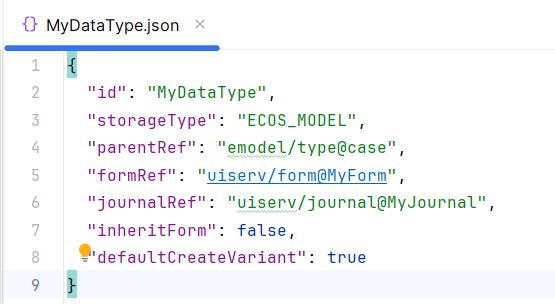

6. **Автодополнение кода JavaScript** (IDEA Ultimate):
   
    1. Формы ECOS:
   
        - Автодополнение объекта **data** списком компонент формы.

.. list-table::
      :widths: 20 20
      :align: center

      * - |

            .. image:: _static/idea_plugin/11.png
                  :width: 500
                  :align: center

        - |

            .. image:: _static/idea_plugin/12.png
                  :width: 500
                  :align: center

7. **Навигация в файлах**:
   
    - Формы (быстрый переход к компонентам по их имени);
    - Журналы (навигация по колонкам);
    - Типы данных (быстрый переход к атрибутам, ролям, статусам и т.д.)

Пока доступно только для формата json.

.. list-table::
      :widths: 20 20
      :align: center

      * - |

            .. image:: _static/idea_plugin/13.png
                  :width: 500
                  :align: center

        - |

            .. image:: _static/idea_plugin/13_1.png
                  :width: 500
                  :align: center

8. **Инспекции кода**:
    
    - Формы - проверка уникальности ключей компонентов форм с учетом областей (container, datagrid).

Пока доступно только для формата json.

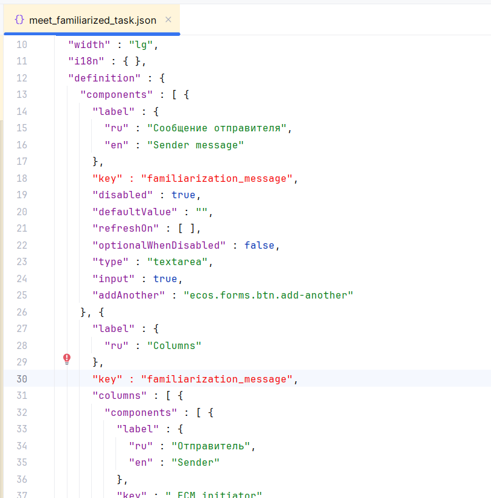

9. Генерация компонентов формы:
    
Если в форме задан **typeRef**

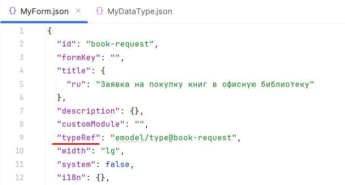

то доступна генерация компонентов по атрибутам указанного в typeRef типа данных.

.. list-table::
      :widths: 20 20 20
      :align: center

      * - |

            .. image:: _static/idea_plugin/comp_gen_02.png
                  :width: 500
                  :align: center

        - |

            .. image:: _static/idea_plugin/comp_gen_03.png
                  :width: 500
                  :align: center

        - |

            .. image:: _static/idea_plugin/comp_gen_04.png
                  :width: 500
                  :align: center

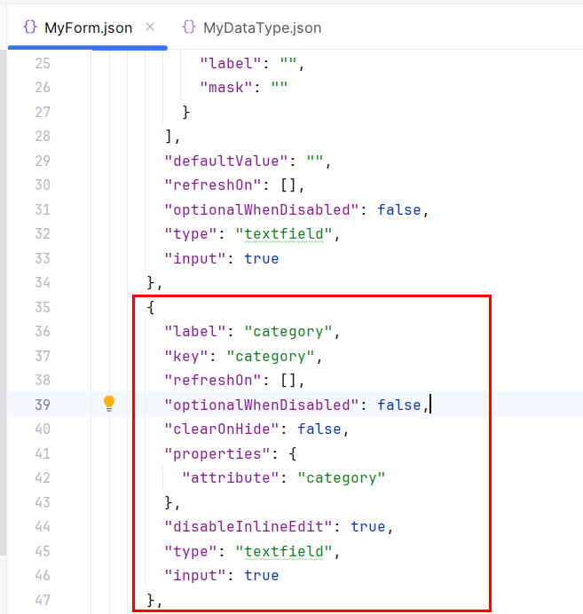

10. Расширения областей поиска **файлами, содержащими артефакты ECOS**:

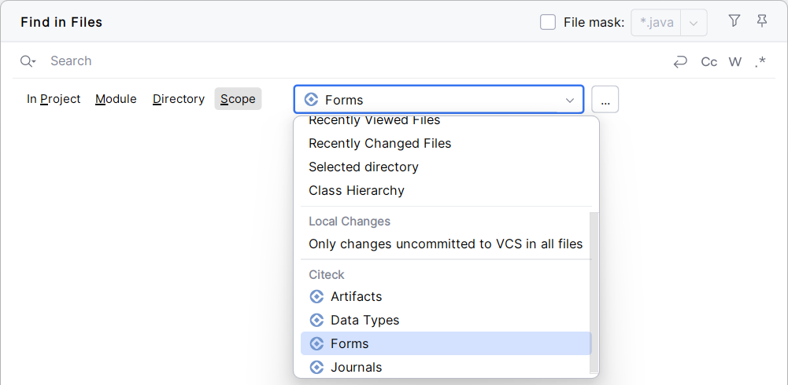

11. **Language Injection (JavaScript)** в формах ECOS:

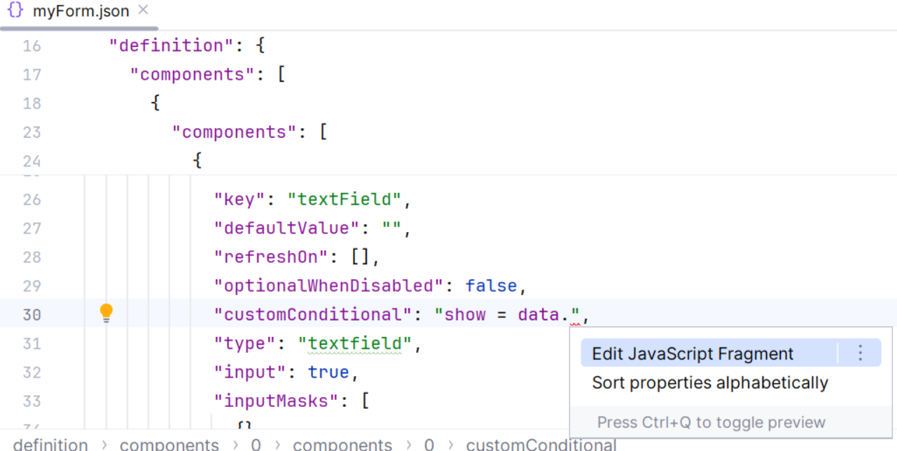

12. **Деплой проекта ECOS**

Деплой проекта возможен из **meta.yml** по нажатию на **Deploy File**:

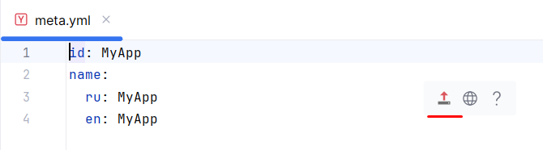

Далее можно нажать **Open In Browser**, чтобы посмотреть и отредактировать приложение в ECOS:

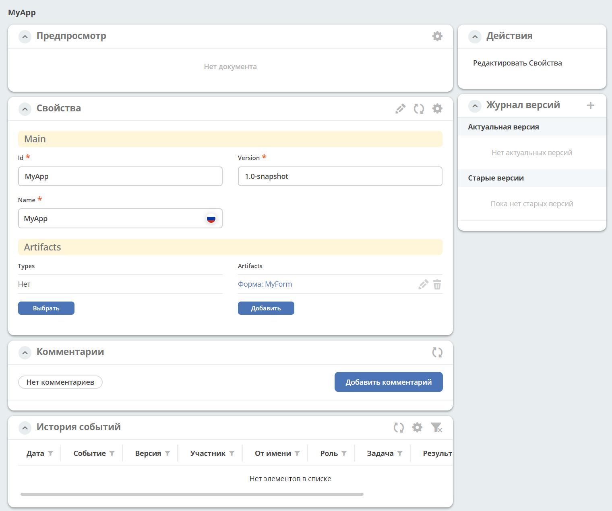

Так же деплоить можно из контекстного меню, выбрав **ECOS-Deploy Application**:

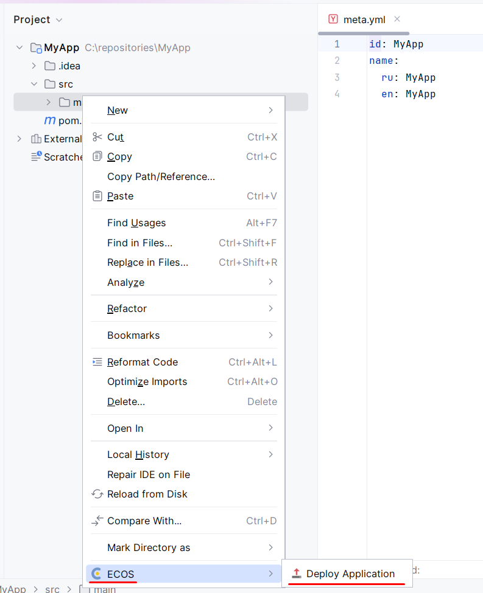

Конфигурация серверов
----------------------

Настройка серверов ECOS: **Settings -> ECOS Settings -> Servers**

Примеры настройки:

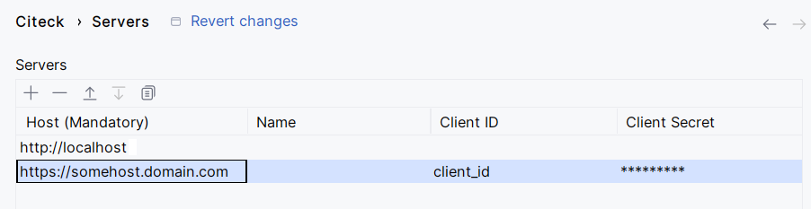

Для локального стенда используется метод **basic**.

Для метода **OAuth2**:

    - **Grant Type** - client_credentials
    - **Client ID** и **Client Secret** можно получить в соответствии с :ref:`инструкцией<keycloak_postman>`

Сборка дистрибутива плагина
-----------------------------

1. Для корректной сборки дистрибутива плагина необходимо убедиться, что используемая версия **Gradle JVM не ниже 17**.
   
   Настроить используемую JVM для Gradle в IDEA можно по следующему пути: **Settings -> Build, Execution, Deployment -> Build Tools -> Gradle -> Gradle JVM**

2. Сборка осуществляется **Gradle** задачей **buildPlugin**.

3. Собранный дистрибутив будет расположен по следующему пути: **build/distributions/**

Разработка
-----------

Для разработки плагина можно использовать Gradle задачу **runIde**.

При выполнении задачи будет запущен новый экземпляр IDEA с пересобранным плагином.