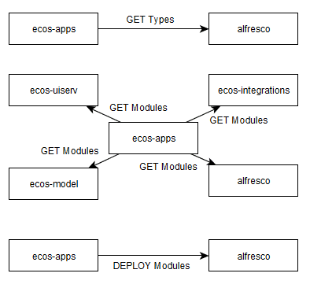
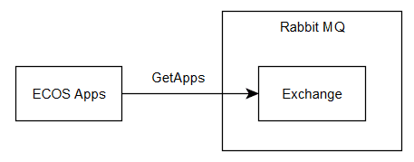
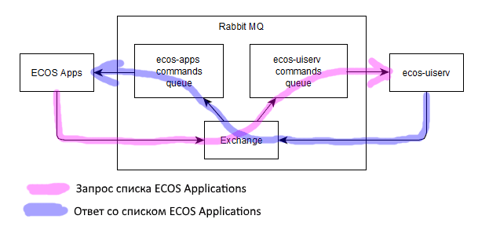
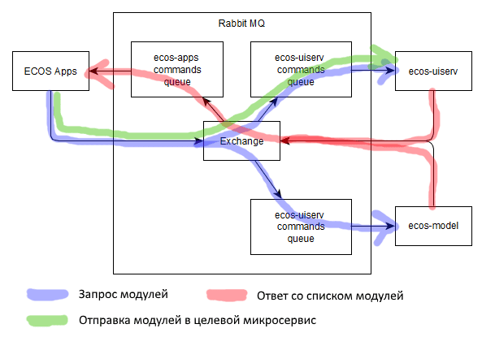

.. _apps_service:

Микросервис приложений Citeck
===============================

.. contents::
   :depth: 2

Платформа Citeck строится на базе артефактов, позволяя расширять функционал написанием новых артефактов, не затрагивая уже существующий функционал.

Артефакт означает единицу конфигурации системы Citeck. Примером артефактов являются: форма, журнал, тип, раздел, матрица прав, действие и др.

Микросервис, который управляет деплоем приложений и артефактов называется ECOS Applications или сокращенно ecos-apps.

Цели микросервиса:

1. Версионирование артефактов. Все меняющиеся артефакты сохраняются как отдельные ревизии без возможности изменения.

2. Доставка артефактов от всех микросервисов к целевому (например, доставка форм из ecos-integrations, ecos-model, alfresco в ecos-uiserv).

3. Отслеживание зависимостей. Если артефакт зависит от другого артефакта, то микросервис соблюдает порядок деплоя.

4. Управление патчами для артефактов.

Процесс деплоя артефактов выглядит примерно следующим образом:

Простое описание
------------------

После появления в сети нового приложения (на схеме это alfresco) происходит 3 этапа:

1. Запрос типов.

2. Получение артефактов.

3. Деплой артефактов.

Подробное описание
--------------------

Микросервис периодически опрашивает всех кто подключен к Rabbit MQ

1. Пока к Rabbit'у никто не подключился ничего не происходит.

2. Когда появляется первый микросервис он возвращает ответ в ECOS Apps о своем присутствии.

3. После этого ECOS Apps отправляет запрос на типы, в которых заинтересован микросервис.

Получив список типов ECOS Apps отправляет всем зарегистрировавшимся микросервисам запрос на получение артефактов.

4. Получив необходимые артефакты ECOS Apps проверяет поменялись ли они с прошлой загрузки и если нет, то ничего не делает.

Если выясняется, что артефакты поменялись, то они отправляются в целевой микросервис на деплой.

Все взаимодействие происходит посредством Rabbit MQ и библиотеки ecos-commands.

Лог ECOS Apps при обнаружении трех микросервисов (включая себя):

.. code-block:: text

    Detected new application 'eapps' with EcosApps: [EcosAppInfo(id=eapps, lastChanged=1584425736433)]
    // Обнаружено новое приложение (микросервис). eapps не содержит типов артефактов. Поэтому грузить нечего
    Detected new application 'uiserv' with EcosApps: [EcosAppInfo(id=uiserv, lastChanged=1584425751061)]
    // В uiserv уже есть 4 типа (форма, дашборд, действие и меню). Мы должны пройтись по всем зарегистрированным микросервисам и опросить есть ли у них модули с такими типами:
    Loaded 1 modules from 'eapps' EcosApp: 'eapps' type: 'ui/form'
    // нашли одну форму в eapps
    Loaded 1 modules from 'eapps' EcosApp: 'eapps' type: 'ui/action'
    // нашли одно действие в eapps
    Loaded 0 modules from 'eapps' EcosApp: 'eapps' type: 'ui/menu'
    Loaded 0 modules from 'eapps' EcosApp: 'eapps' type: 'ui/dashboard'
    Loaded 3 modules from 'uiserv' EcosApp: 'uiserv' type: 'ui/form'
    // нашли 3 формы в uiserv (локальные артефакты тоже деплоятся через ECOS Apps)
    Loaded 7 modules from 'uiserv' EcosApp: 'uiserv' type: 'ui/action'
    Loaded 0 modules from 'uiserv' EcosApp: 'uiserv' type: 'ui/menu'
    Loaded 4 modules from 'uiserv' EcosApp: 'uiserv' type: 'ui/dashboard'
    Modules count was changed by target app. Before: 4 After: 1
    // мы отправили в uiserv изменившиеся артефакты, но он отказался принимать 3 из них (защита от перезатирания конфигурации, которую настроили на стенде)
    Detected new application 'emodel' with EcosApps: [EcosAppInfo(id=emodel, lastChanged=1584425829184)]
    Loaded 0 modules from 'eapps' EcosApp: 'eapps' type: 'model/section'
    Loaded 0 modules from 'eapps' EcosApp: 'eapps' type: 'model/type'
    Loaded 0 modules from 'uiserv' EcosApp: 'uiserv' type: 'model/section'
    Loaded 1 modules from 'uiserv' EcosApp: 'uiserv' type: 'model/type'
    Loaded 0 modules from 'emodel' EcosApp: 'emodel' type: 'model/section'
    Loaded 3 modules from 'emodel' EcosApp: 'emodel' type: 'model/type'
    Loaded 3 modules from 'emodel' EcosApp: 'emodel' type: 'ui/form'
    Loaded 0 modules from 'emodel' EcosApp: 'emodel' type: 'ui/action'
    Loaded 0 modules from 'emodel' EcosApp: 'emodel' type: 'ui/menu'
    Loaded 0 modules from 'emodel' EcosApp: 'emodel' type: 'ui/dashboard'

Полезные скрипты (EApps)
------------------------

.. dropdown:: Получение и удаление артефактов по типу
   :color: secondary

   Для получения всех артефактов по типу можно выполнить следующий скрипт:

   .. code-block:: javascript

         Records.query({
         sourceId: 'eapps/module',
               query: {
                     type: 'form'
               },
               page: {maxItems: 100}
         }).then(console.log);

   В результате выполнения в консоль выведется список id артефактов.

   Имея id артефакта, его можно удалить следующим скриптом:

   .. code-block:: javascript

         Records.remove(["eapps/module@form$3784f71c-5557-4123-b751-84e38c6157a1"]);

Получение содержимого модулей из базы eapps
--------------------------------------------

.. dropdown:: Извлечение файла модуля напрямую из БД
   :color: secondary

   Получаем список ревизий по ext_id и типу артефакта:

   .. code-block:: sql

         select module.ext_id,rev.created_date,rev.created_by,rev.content_id
         from ecos_module module
         join ecos_module_rev rev on module.id=rev.module_id
         where module.ext_id='ECOS_FORM' and module.type='ui/form';

   Смотрим на поле **content_id** нужных модулей и делаем следующий запрос:

   .. code-block:: sql

         select id,encode(data, 'base64') from ecos_content where id=14809;

   Получаем результат в виде постранично разбитой base64-строки (фрагмент):

   .. code-block:: text

          id   |                                    encode
         -------+------------------------------------------------------------------------------
         11448 | UEsDBBQACAgIAAAAIQAAAAAAAAAAAAAAAAAOABEARUNPU19GT1JNLmpzb25VVA0ABwAAAAAAAAAA+
               | AAAAAO1aWXMbNxL+K8y8xKnSYUdOLDHZrXIoKVFiLl2Wy3nYcrnAGZADCgNQAIYUxeJ/324cc1AU+
               | HR1UxM3oRRygB+jz625g5hFLonZ00umdfzntfehGO9FAquwPOoPRTCY5p19wAMYNM5xG7XlEBcyd+
               | ...
               | AABRQgAADgAJAAAAAAAAAAAAAAAAAAAARUNPU19GT1JNLmpzb25VVAUABwAAAABQSwUGAAAAAAEA+
               | AQBFAAAAmQgAAAAA

   Убираем шапку, отступы ``|``, переносы строк и знаки ``+`` в конце строк — получаем одну сплошную base64-строку:

   .. code-block:: text

         UEsDBBQACAgIAAAAIQAAAAAAAAAAAAAAAAAOABEARUNPU19GT1JNLmpzb25VVA0ABwAAAAAAAAAAAAAAAO1aWXMbNxL...RUNPU19GT1JNLmpzb25VVAUABwAAAABQSwUGAAAAAAEAAQBFAAAAmQgAAAAA

   Загружаем полученную строку в любой сервис по декодированию base64 в файл. Например:

   `https://base64.guru/converter/decode/file <https://base64.guru/converter/decode/file>`_

   Скачиваем итоговый файл:

   .. image:: _static/apps_mks/app_download.png
      :width: 700
      :align: center

   В результате получаем архив с нашим модулем.

Полезные скрипты в базе ECOS Apps
----------------------------------

.. dropdown:: Получение ревизий модуля
   :color: secondary

   .. code-block:: sql

         select module.ext_id,rev.created_date,rev.created_by,rev.is_user_rev,rev.content_id
         from ecos_module module
         join ecos_module_rev rev on module.id=rev.module_id
         where module.ext_id='ECOS_FORM' order by rev.created_date desc;

   **is_user_rev** флаг определяет, что модуль менялся пользователем.
