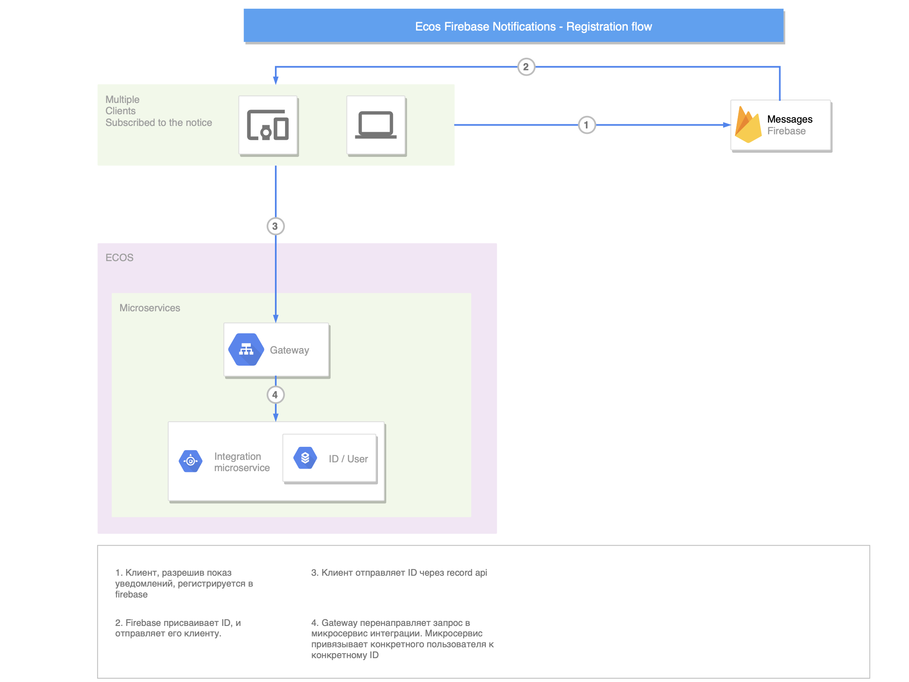
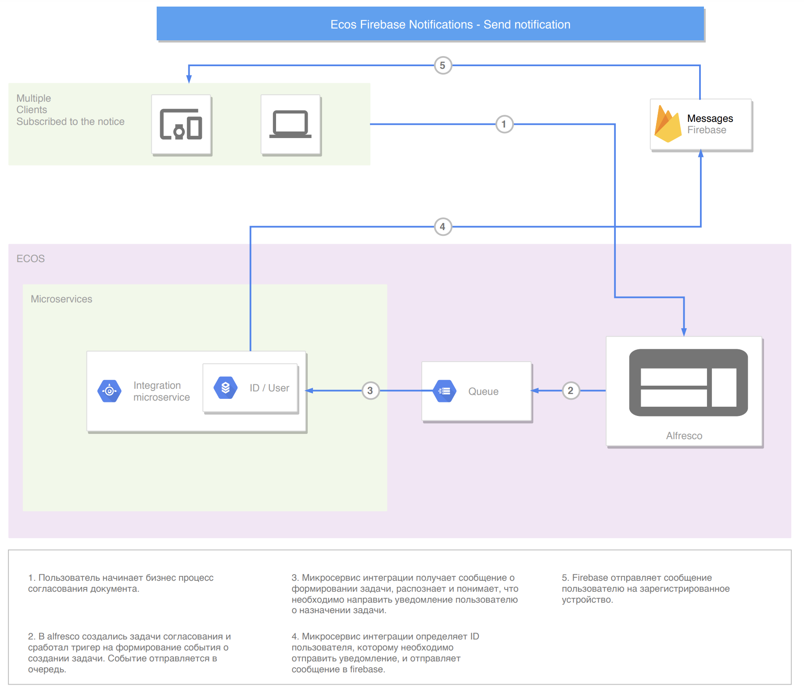

================================
Уведомления (переходная версия)
================================
Firebase уведомления
--------------------------

Firebase уведомления отправляются как реакция на события с использованием библиотеки :ref:`Ecos Events 1.0  <events_1-0_label>`

Пуш уведомления на мобильное устройство о задачах
~~~~~~~~~~~~~~~~~~~~~~~~~~~~~~~~~~~~~~~~~~~~~~~~~
Для подключения пуш уведомлений необходимо предпринять ряд действия, описанных ниже.

1. Подключение отправки эвентов из alfresco
"""""""""""""""""""""""""""""""""""""""""""
В alfresco необходимо включить отправки эвентов по задачам - см. :ref:`Ecos Events 1.0  <events_1-0_label>`

2. Подключение firebase на мобильном устройстве
"""""""""""""""""""""""""""""""""""""""""""""""
В мобильном приложении должен быть подключен firebase sdk с настройками конкретного проекта,
см. `документацию firebase <https://firebase.google.com/>`_ под нужную платформу приложения клиента.

3. Настройка микросервисе нотификаций
""""""""""""""""""""""""""""""""""""""""""""""""""
В микросервисе нотификаций должно быть заданы firebase credential-class-path и data-base-url. Для каждого проекта / клиента необходимо использовать свои credentials.
На данный момент на стенды доставляется в комплекте поставки микросервиса. Для локальной разработки нужно указать путь для тестовых crdentials.

4. Реализация подписки / отписки на пуш уведомления на мобильном устройстве пользователя
""""""""""""""""""""""""""""""""""""""""""""""""""""""""""""""""""""""""""""""""""""""""

.. note::
       Если основной функционал подписки / отписки в мобильном клиенте уже реализован, а нужно только изменить настройки подиски, то см. :ref:`пункт 3, Настройка подписки  <notification_subscrive_config_label>` 

1. 
Получение tenant id.

Сначала необходимо получить tenantId сервера, для этого выполняем запрос::

       GET /share/proxy/alfresco/citeck/global-properties?name=ecos.server.tenant.id HTTP/1.1
       Host: some-ecos-server.citeck.ru

В ответе получим tenant id сервера и запоминаем::

  {
    "data": {
      "ecos.server.tenant.id": "some-tenant-id"
      }
  }

2. 
Регистрация в firebase

Мобильный клиент регистрируется в firebase через sdk.

.. attention::
       На схеме микросервис интеграции заменить на нотификаций

.. _notification_subscrive_config_label:

3. 
Настройка подписки

После того, как пользователь подтвердил подписку на уведомления и был получен registrationToken от firebase, его необходимо передать в ecos с настройками подписки. Формируем запрос::

  POST /share/api/records/mutate HTTP/1.1
  Host: some-ecos-server.citeck.ru

  {
    "records": [
      {
        "id": "notifications/subscription-action@",
        "attributes": {
          "subscriberId": "some-tenant-id|mmtr_user",
          "eventType": "task.assign",
          "action": {
            "type": "FIREBASE_NOTIFICATION",
            "config": {
              "fireBaseClientRegToken": "ctBwBNEJ0Uk:APA91bG0KNkEey7sOOegkf7QVbf8nlb-h_McCcTVQ9BEcCPdE9ndsLJX_N5vW5rotia0yKvAfj0nsRqEFwEVc6ZR5QLzZA2tRo1wMZVOdKmuBdhEddt8PA0iA4PiSgKcB2SQ1cRocvda",
              "deviceType": "android",
              "templateId": "supervisor-firebase-template"
            },
            "condition": "customData.req.type.asText() == 'uterm:travelExpensesRequest' && (event.taskType == '{http://www.citeck.ru/model/blabla/te/workflow/1.0}approvalTask' || event.taskType == '{http://www.citeck.ru/model/blabla/te/workflow/1.0}approvalPRTask')",
            "customData": [
              {
                "variable": "req",
                "record": "${event.docId}",
                "attributes": { 
                  "number": "uterm:terRegNumber",
                  "package": ".atts(n:\"uterm:packageContent\"){id}",
                  "employee": "uterm:reportablePerson",
                  "type": "_type"
                }
              }
            ]
          }
        }
      }
    ]
  }
  
*id* - указывается records api id для подписок в микросервисе нотификаций.

*subscriberId* - здесь нужно сформировать id, по шаблону tenantId|username, то есть, в tenanId подставляем id, полученный из пункта №1, в username подставляем username текущего пользователя.

*type* - для отправки пуш уведомлений через firebase указывается "FIREBASE_NOTIFICATION". На данный момент это единственное реализованное действие.

*fireBaseClientRegToken* - подставляем токен, полученный от firebase.

*deviceType* - подставляем, в зависимости от мобильного клиента - android или ios.

*templateId* - id шаблона написанного на freemarker для отправки уведомения. Шаблон включчает в себя title и body уведомления.

.. warning::
       На данный момент шаблоны в firebase просто заглушка с одним зашитым шаблоном (ru/citeck/ecos/notifications/service/TemplateService.java). Необходимо реализовать привязку к реальным шаблонам уведомлений в микросервисе нотификаций.

*condition* - условие отправки уведомления на groovy.

.. note::
       Если необходимо получать пуши по всем задачам назначенным на пользователя, то условие просто должно вернуть true

.. hint::
       Моделью данных для вычисления условия и шаблона является сам event + дополнительная информация, которую можно запросить по records api в блоке "customData". Сейчас можно запросить данные из alfresco (реализовано через basic auth, выделяется отдельный пользователь).
       
       При построении запроса в records api, так же можно использовать шаблонизатор freemarker для доступа к модели events.
   
*customData* - дополнительная модель данных, которую можно использовать в шаблоне и условии.

В ответе приходит id созданного объекта подписки, его нужно сохранить для следующего использования::

  {
      "records": [
          {
              "id": "notifications/subscription-action@5",
              "attributes": {}
          }
      ],
      "errors": []
  }

На данном этапе пользователь зарегистрировался как подписчик и будет получать уведомления

4. 
Отписка от пуш уведомления

Если пользователь отказывается от подписки, то необходимо отправить соответствующий запрос серверу, с id, сохраненным на шаге №3::
  
  POST /share/api/records/delete HTTP/1.1
  Host: some-ecos-server.citeck.ru
  
  
  {
    "records": [
    			"notifications/subscription-action@5"
    	]
  }

Ответ сервера:

* Если в ответе приходит 200й код, значит сервер был доступен и обработал запрос. Если другой код, то подписка не была удалена (возможно стоит вывести пользователю сообщение, что сервер не доступен, повторите операцию позднее)
* Если в ответе пришел 200й код, но при этом в объекте error вернулся тип ошибки EmptyResultDataAccessException, то следует считать что данной подписки на сервере не существует, соответственно и на клиенте нужно актуализировать состояние. Пример ответа с данной ошибкой::
  
   {
    "records": [],
    "errors": [
      {
        "type": "EmptyResultDataAccessException",
        "msg": "No class ru.citeck.ecos.notifications.domain.subscribe.Action entity with id 222 exists!",
        "stackTrace": [
          "org.springframework.data.jpa.repository.support.SimpleJpaRepository.lambda$deleteById$0(SimpleJpaRepository.java:151)",
          "java.util.Optional.orElseThrow(Optional.java:290)",
          "org.springframework.data.jpa.repository.support.SimpleJpaRepository.deleteById(SimpleJpaRepository.java:150)"
        ]
      }
    ]
   }

5. 
Обновление fireBaseClientRegToken.

Токен, выданный firebase не бесконечный, в sdk для этого предусмотрено его автоматическое обновление. На клиенте, при срабатывания onRefreshToken, необходимо обновить токен в экосе. Для этого выполнить запрос::

  POST /share/api/records/mutate HTTP/1.1
  Host: some-ecos-server.citeck.ru
  
  {
    "records": [
      {
        "id": "notifications/subscription-action@1331",
        "attributes": {
        	"updateActionConfig": {
        		"fireBaseClientRegToken": "some-new-token",
              "deviceType": "android",
              "templateId": "supervisor-firebase-template"
        	}
        }
      }
    ]
  }

В атрибуте *updateActionConfig* необходимо передать новый config, где *fireBaseClientRegToken* - новый токен, *deviceType* и *templateId* - Оставляем как в шаге №2. В id передаем id объекта action, который необходимо изменить (полученный в ответе на шаге №2).

6. 
Процесс отправки и получения пуш уведомления

.. attention::
       На схеме микросервис интеграции заменить на нотификаций

.. note::
       У одного пользователя может быт несколько мобильных устройств для получения пуш уведомлений

.. attention::
       TODO / Проблемы
       
       Реализовать реальные шаблоны уведомлений. Сейчас есть сервис с заглушкой (ru/citeck/ecos/notifications/service/TemplateService.java), в котором есть захардкоженный дефолтный шаблон для задач и конкретная реализация для заказчика.
