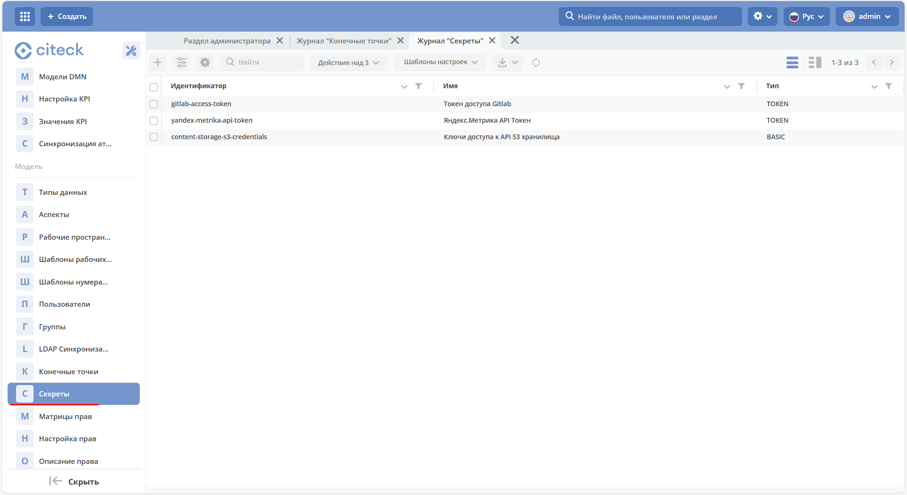

.. _ecos_secret:

Секреты
=========

.. contents::
   :depth: 3

**ECOS Секрет** — объект, содержащий конфиденциальные данные, такие как пароль, токен или ключ.

Расположение артефактов с данным типом: **model/secret**

Модель конфигурации:

.. code-block:: yaml

    id: String # идентификатор секрета
    type: Enum {BASIC|...} # тип секрета
    data: ObjectData # данные секрета. Полностью зависят от типа

Типы секретов:

.. list-table::
   :widths: 10 10
   :header-rows: 1
   :class: tight-table

   * - Тип
     - Содержимое поля data
   * - BASIC
     -
       .. code-block:: yaml

         username: String
         password: String
   * - TOKEN
     -
       .. code-block:: yaml

         token: String
   * - CERTIFICATE
     -
       .. code-block:: yaml

         privateKey: String
         certificate: String

Пример конфигурации:

.. code-block:: yaml

    ---
    id: content-storage-s3-credentials
    name:
      ru: Ключи доступа к API S3 хранилища
      en: S3 storage API Keys
    type: BASIC
    data:
      username: sMJjtYPxFGjPEKeFp1lC
      password: KenKpEhD6Lag3acImDAq2ZeLtlSij1vyaYZt8lyH

Информация о секретах по умолчанию хранится и загружается из БД микросервиса ecos-model, но также есть возможность указать настройки через переменные среды. Для этого следует взять идентификатор секрета и сконвертировать его по следующим правилам:

.. dropdown:: Правила преобразования идентификатора в имя переменной окружения
   :color: secondary

   1. Разбиваем camelCase на части через символ **'_'**. Например: **camelCase → camel_Case**

   2. Заменяем все символы **'-'** и **'.'** на **'_'**

   3. Заменяем все символы, которые не входят в перечень ``[a-zA-Z0-9_]`` на ``_X{код_символа}_``

   4. Переводим получившуюся строку в верхний регистр и добавляем префикс **"ECOS_SECRET_"**

Таким образом для примера выше мы можем задать следующие переменные среды:

.. code-block:: text

    ECOS_SECRET_CONTENT_STORAGE_S3_CREDENTIALS_TYPE=BASIC
    ECOS_SECRET_CONTENT_STORAGE_S3_CREDENTIALS_USERNAME=sMJjtYPxFGjPEKeFp1lC
    ECOS_SECRET_CONTENT_STORAGE_S3_CREDENTIALS_PASSWORD=KenKpEhD6Lag3acImDAq2ZeLtlSij1vyaYZt8lyH

Переменные среды приоритетнее хранилища секретов в БД микросервиса ecos-model и они могут быть заданы как непосредственно в микросервисе, который будет использовать эти секреты, так и в ecos-model.

Использование секретов в коде
-------------------------------

Получение:

.. code-block:: java

    BasicSecretData basicData = EcosSecrets.getBasicData("content-storage-s3-credentials");
    String username = basicData.getUsername();
    String password = basicData.getPassword();

Подписка на изменения:

.. code-block:: kotlin

    EcosSecrets.listenChanges((secretId) -> {
        // здесь можем пересоздать подключения, которые зависят от secretId
        return Unit.INSTANCE;
    });

.. _ECOS_secrets:

В интерфейсе
--------------

Настройки доступны в разделе **«Секреты» (Рабочее пространство "Раздел администратора" - Модель)**:

Журнал доступен по адресу: ``v2/journals?journalId=ecos-secrets&viewMode=table&ws=admin$workspace``

Форма создания:

.. grid:: 2
   :gutter: 2

   .. grid-item::

      .. image:: _static/secrets_02.png
         :width: 500
         :align: left

   .. grid-item::

      .. image:: _static/secrets_03.png
         :width: 500
         :align: left

.. _secrets_encryption:

Шифрование секретов
---------------------

1. Секреты хранятся в базе данных в зашифрованном виде.
2. Ключ шифрования задается через переменные окружения (ENV) микросервиса ecos-model.
3. Предусмотрена возможность интеграции с внешним хранилищем секретов (vault) в будущем.

Настройки шифрования
~~~~~~~~~~~~~~~~~~~~~

Поддержка в Helm
"""""""""""""""""""

Начиная с версии ecos-helm 1.3.57, добавлена поддержка настройки шифрования секретов в микросервисе ecos-model.

Переменные окружения
"""""""""""""""""""""

.. list-table::
   :widths: 10 15 5
   :header-rows: 1
   :class: tight-table

   * - Переменная
     - Описание
     - По умолчанию
   * - **ECOS_SECRET_ENCRYPTION_CURRENT_KEY**
     - Текущий AES-ключ для шифрования данных. Ключ по умолчанию, заданный в микросервисе ecos-model, обязательно должен быть изменён на продакшн-серверах — если этого не сделать, система будет работать, но в логах появятся предупреждения.
     - —
   * - **ECOS_SECRET_ENCRYPTION_CURRENT_ALGORITHM**
     - Алгоритм шифрования.
     - AES/GCM/NoPadding
   * - **ECOS_SECRET_ENCRYPTION_CURRENT_IV_SIZE**
     - Размер вектора инициализации (IV).
     - 12
   * - **ECOS_SECRET_ENCRYPTION_CURRENT_TAG_SIZE**
     - Размер тега аутентификации (TAG).
     - 128
   * - **ECOS_SECRET_ENCRYPTION_PREVIOUS_KEY**
     - Предыдущий AES-ключ для расшифровки данных. Используется в процессе ротации ключей, чтобы обеспечить доступ к ранее зашифрованным данным.
     - —

Пример генерации ключа для **ECOS_SECRET_ENCRYPTION_CURRENT_KEY**:

.. code-block:: kotlin

   fun main() {

       val keyGen = KeyGenerator.getInstance("AES")
       keyGen.init(128) // AES key size 128
       val secretKey = keyGen.generateKey()
       val base64Key = Base64.getEncoder().encodeToString(secretKey.encoded)

       println("Base64 Key: $base64Key")

   }

Ротация ключей шифрования
~~~~~~~~~~~~~~~~~~~~~~~~~~~~

.. dropdown:: Как ротировать ключ шифрования
   :color: secondary

   1. Сгенерируйте новый **AES-ключ**.
   2. Установите новый ключ в переменную окружения **ECOS_SECRET_ENCRYPTION_CURRENT_KEY**.
   3. Старый ключ укажите в переменной **ECOS_SECRET_ENCRYPTION_PREVIOUS_KEY**.

   При запуске системы секреты будут расшифрованы с использованием предыдущего ключа и повторно зашифрованы новым ключом.

Инструкция для администраторов
~~~~~~~~~~~~~~~~~~~~~~~~~~~~~~~~

.. dropdown:: Чек-лист при развёртывании нового сервера
   :color: secondary

   1. При развертывании нового сервера необходимо каждый раз генерировать уникальный ключ шифрования.
   2. Используйте приведённый выше код для генерации AES-ключа.
   3. Убедитесь, что ключ по умолчанию заменён на новый. Если этого не сделать, система выдаст предупреждение в логах.
