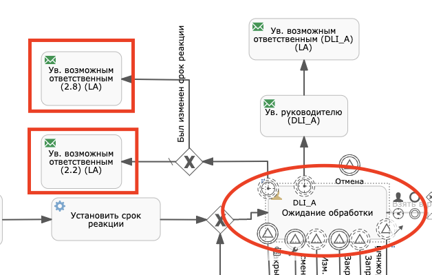

ECOS BPMN (Flowable)
====================

.. contents:: 
   :depth: 5

Запуск ecos + flowable webapps
-------------------------------

При запуске **ecos-community** через **ecos:run**, веб приложения flowable автоматически деплоятся в tomcat через **profile flowable**. Данный **profile** включен по умолчанию, для отключения можно воспользоваться ключами ``-P !flowable`` или ``-DoffFlowable``

По умолчанию flowable webapps используют внутренние конфигурационные файлы. По умолчанию, все приложения используют в качестве базы данных H2. Для того, чтобы переопределить параметры внутренних конфигурационных, необходимо в конфигурационных дескрипторах указать новые значения (конфигурационные дескрипторы находятся в ``<ecos-project>/src/test/resources/tomcat/``). 

Для большего удобства в проектах ecos-community и ecos-enterprise-core сделан один общий конфигурационный файл для всех flowable webapps - 

``<ecos-propejct>/src/test/resources/tomcat/flowable/flowable-webapps.properties``

Инструкция по настройке общего конфигурационного файла для всех flowable webapps
~~~~~~~~~~~~~~~~~~~~~~~~~~~~~~~~~~~~~~~~~~~~~~~~~~~~~~~~~~~~~~~~~~~~~~~~~~~~~~~~~~~~~~~~~~

В главном **pom.xml** в профиле **flowable** необходимо добавить плагин **properties-maven-plugin** для считывания **properties** из внешнего файла. Значение ``inherited`` необходимо выставить ``false``, чтобы плагин отработал только для самого проекта и не затрагивал дочерние модули.

**Настройка плагина**

.. code-block::

 <plugin>
	<groupId>org.codehaus.mojo</groupId>
    <artifactId>properties-maven-plugin</artifactId>
    <version>1.0-alpha-2</version>
    <inherited>false</inherited>
    	<executions>
        	<execution>
            	<phase>validate</phase>
                	<goals>
                    	<goal>read-project-properties</goal>
                    </goals>
                    <configuration>
                    	<files>
                        	<file>${project.build.testOutputDirectory}/tomcat/flowable/flowable-webapps.properties</file>
                        </files>
                    </configuration>
            </execution>
        </executions>
 </plugin>

После в конфигурациях плагина **ecos-maven-plugin** нужно добавить **tomcatSystemProperties** и перекинуть необходимые значения из **flowable-webapps.properties**.

**Системные переменные Tomcat**

.. code-block::

 <tomcatSystemProperties>
	<flowable.webapps.db.url>${flowable.webapps.db.url}</flowable.webapps.db.url>
    <flowable.webapps.db.driver.class.name>${flowable.webapps.db.driver.class.name}</flowable.webapps.db.driver.class.name>
    <flowable.webapps.db.username>${flowable.webapps.db.username}</flowable.webapps.db.username>
    <flowable.webapps.db.password>${flowable.webapps.db.password}</flowable.webapps.db.password>

    <flowable.webapps.admin.userid>${flowable.webapps.admin.userid}</flowable.webapps.admin.userid>
    <flowable.webapps.admin.password>${flowable.webapps.admin.password}</flowable.webapps.admin.password>

    <flowable.webapps.idm.app.url>${flowable.webapps.idm.app.url}</flowable.webapps.idm.app.url>
    <flowable.webapps.deployment.api.url>${flowable.webapps.deployment.api.url}</flowable.webapps.deployment.api.url>

    <flowable.webapps.rest.create.demo.definitions>${flowable.webapps.rest.create.demo.definitions}</flowable.webapps.rest.create.demo.definitions>

    <flowable.webapps.admin.rest.app.host>${flowable.webapps.admin.rest.app.host}</flowable.webapps.admin.rest.app.host>
    <flowable.webapps.admin.rest.app.port>${flowable.webapps.admin.rest.app.port}</flowable.webapps.admin.rest.app.port>
    <flowable.webapps.admin.rest.app.user>${flowable.webapps.admin.rest.app.user}</flowable.webapps.admin.rest.app.user>
    <flowable.webapps.admin.rest.app.password>${flowable.webapps.admin.rest.app.password}</flowable.webapps.admin.rest.app.password>

    <flowable.webapps.async-executor-activate>${flowable.webapps.async-executor-activate}</flowable.webapps.async-executor-activate>
 </tomcatSystemProperties>

После переноса переменных из **flowable-webapps.properties** в **tomcatSystemProperties**, они станут доступны в xml дескрипторах.

**flowable-idm.xml**

.. code-block::

 <?xml version='1.0' encoding='utf-8'?>

 <Context antiJARLocking="true">
    <Environment name="datasource.driver" value="${flowable.webapps.db.driver.class.name}" type="java.lang.String"/>
    <Environment name="datasource.url" value="${flowable.webapps.db.url}" type="java.lang.String"/>
    <Environment name="datasource.username" value="${flowable.webapps.db.username}" type="java.lang.String"/>
    <Environment name="datasource.password" value="${flowable.webapps.db.password}" type="java.lang.String"/>

    <Environment name="admin.userid" value="${flowable.webapps.admin.userid}" type="java.lang.String"/>
    <Environment name="admin.password" value="${flowable.webapps.admin.password}" type="java.lang.String"/>

	<Environment name="flowable.async-executor-activate" value="${flowable.webapps.async-executor-activate}" type="java.lang.Boolean"/>
 </Context>

Включение функционала async executors (таймеры, асинхронные задачи и т. д.)
~~~~~~~~~~~~~~~~~~~~~~~~~~~~~~~~~~~~~~~~~~~~~~~~~~~~~~~~~~~~~~~~~~~~~~~~~~~~~~~

В версии community 3.10.0 была добавлена возможность пользоваться функционалом, который зависел от **async executors**.

Для правильной работы необходимо выключить запуск **async executors** из **flowable webbaps**, так как **aync executor** будет запускаться из внутреннего сконфигурированного движка flowable. Для этого:

1. В главном **pom.xml** в блоке ``<tomcatSystemProperties>`` необходимо добавить новое свойство ``<flowable.webapps.async-executor-activate>${flowable.webapps.async-executor-activate}</flowable.webapps.async-executor-activate>``
2. В ``flowable-webapps.properties`` выставить свойство обязательно в ``false`` - ``flowable.webapps.async-executor-activate=false``
3. В каждый файл - **flowable-admin.xml, flowable-idm.xml, flowable-modeler.xml, flowable-rest.xml, flowable-task.xml** добавить строку - ``<Environment name="flowable.async-executor-activate" value="${flowable.webapps.async-executor-activate}" type="java.lang.Boolean"/>``

PS - в докер образе данная настройка уже произведена.

Переменные в flowable
----------------------

Предопределенные переменные
~~~~~~~~~~~~~~~~~~~~~~~~~~~

1. **case_status** - cm:name кейс статуса
2. **case_status_before** - cm:name предыдущего кейс статуса
3. **document** - NodeRef документа, по которому идет процесс. 
4. **shareUrl** - share url из SysAdminParams. Например, ``http://localhost:8080/share/``. Доступно с версии 3.28.0 core
5. **webUrl** - например ``http://localhost:8080/``. Доступно с версии 3.28.0 core

**Примеры использования:**

Переменные кейс статусов можно использовать как flow condition:

.. code-block::

    ${case_status_before == "ssg-approval"}

Переменная document необходима для манипуляций с документом, будь то скрипт, или передача nodeRef в параметре сервиса.

**Задание кейс статуса в expression**

.. code-block::

    ${caseStatusService.setStatus(document, "ssg-reworking")}

Добавление дополнительных переменных
~~~~~~~~~~~~~~~~~~~~~~~~~~~~~~~~~~~~~

Если необходимо в execution процесса добавить дополнительные переменные, это можно сделать унаследовав класс ``ru.citeck.ecos.flowable.listeners.global.impl.variables.AbstractFlowableSaveToExecutionListener`` и переопределить методы **saveToExecution** и **saveIsRequired**. Переменные будут пересчитываться по ходу движения процесса.

Выполнение такого listener будет применяться ко всем процессам, по этому, если в установлении переменных есть привязка к какому-то конкретному типу документа, то это нужно учесть при реализации метода saveToExecution (например проверять в нем, что текущий тип документа - это необходимый тип).

Сервисы в flowable
-------------------

CaseCompletenessService
~~~~~~~~~~~~~~~~~~~~~~~~

JS имплементация сервиса (caseCompletenessServiceJS), доступна по ключу - **completeness**.

Пример использования - проверка выполнения чек листов в flow condition:

.. code-block::

    ${completeness.isLevelCompleted(document, "workspace://SpacesStore/cl-hr-itn") && completeness.isLevelCompleted(document, "workspace://SpacesStore/cl-hr-bank-details")}

CaseStatusService
~~~~~~~~~~~~~~~~~~~~~~~~

JS имплементация сервиса (caseStatusServiceJS), доступна по ключу - **caseStatusService**.

Пример использования - установка кейс статуса через expression:

.. code-block::

    ${caseStatusService.setStatus(document, "ssg-signed")}

FlowableRecipientsService
~~~~~~~~~~~~~~~~~~~~~~~~~~~

JS имплементация сервиса (flowableRecipientsServiceJS), доступна по ключу - **flwRecipients**.

Данный сервис позволяет получить данные по реципиентам из кейс роли.

**Методы:**

``getRoleEmails(NodeRef document, String caseRoleName)``  - получение email адресов из кейс роли. Применяется для заполнения поля **To** в **mail task**

.. code-block::

    ${flwRecipients.getRoleEmails(document, 'ssg_initiator')}

``getRoleGroups(NodeRef document, String caseRoleName)`` - получение групп из кейс роли. Применяется для заполнения **candidate groups** в **user task assigments**

.. code-block::

    ${flwRecipients.getRoleGroups(document, 'ssg_initiator')}

``getRoleUsers(NodeRef document, String caseRoleName)`` - получение пользователей из кейс роли. Применяется для заполнения **candidate users** в **user task assigments**

.. code-block::

    ${flwRecipients.getRoleUsers(document, 'ssg_initiator')}

Например, назначение задачи на роль **ssg_initiator** будет выглядеть следующим образом:

 .. image:: _static/bpmn/assintment.png
       :width: 400
       :align: center

Использование Производственного календаря во Flowable
~~~~~~~~~~~~~~~~~~~~~~~~~~~~~~~~~~~~~~~~~~~~~~~~~~~~~~~

В данный момент производственный календарь во Flowable используется для 2-х целей:

* Задание значения таймера;
* Задание Срока задачи (dueDate);

**Пример задания значения таймера в процессе Flowable:**

 .. image:: _static/bpmn/example_1.png
       :width: 600
       :align: center

В данном примере мы предварительно вычисляем дату в JS-коде, используя ``workingCalendarService``.
Вычисленную дату сохраняем в переменную ``execution ${dismissal_payoff_start_timer_date}``.

После этого используем в конструкторе БП эту переменную.

Пример задания переменной execution датой для таймера:

.. code-block::

 calculateStartDate: function () {
    var dismissalDate = document.properties["hr:dismissalDate"];
    if (dismissalDate != null) {
        var ws = services.get("workingCalendarService");
        var correctedDate = workingCalendarService.addWorkingDaysForCalendar(dismissalDate, -2, "RU");
        var beginHour = ws.getWorkingDayData("RU")["workingDayBegin"];
        if (beginHour != null) {
            correctedDate.setHours(parseInt(beginHour,10));
        }
        execution.setVariable("dismissal_payoff_start_timer_date", correctedDate);
    }
 }

**Пример задания Срока задачи в процессе Flowable:**

1. Непосредственно через **dueDateService**

 .. image:: _static/bpmn/example_2.png
       :width: 600
       :align: center

``${dueDateService.getDueDateForCalendar('RU', 1)}`` С текущей даты прибавляется 1 рабочий день по Производственному календарю 'RU'

2. Также существует возможность задания сроков задач через **FlowableDueDateTaskListener**.

С помощью параметров ``workingDaysToAdd``, ``workingHoursToAdd`` можно задать на сколько рабочих дней/часов должен смещаться Срок задачи относительно текущей даты и времени.

Данный способ может быть лучше тем, что он более гибко определяет откуда брать производственный календарь (у пользователя, группы в оргструктуре, в которую входит пользователь или выбирать его по локали сервера).

Listeners в flowable
---------------------

Execution listeners
~~~~~~~~~~~~~~~~~~~~~

**FlowableDocumentSetListener**

Устанавливает переменную **document** в **process execution**, представляет собой ScriptNode документа, по которому идет процесс. Можно обращаться к свойствам, ассоциациям документа в flowable expressions.

.. code-block::

    ${document.properties["idocs:registrationNumber"]}

**FlowableCheckCompletenessLevelsExecutionListener**

Проверяет, выполнены ли заданные чек-листы, если нет, то выводит сообщения об ошибке, с перечислением невыполненных чек-листов

*Параметры*

* **completenessLevels** - перечисление nodeRef чек-листов, через ";"

*Пример использования*

**Кейс** - необходимо проверить, что заполнены чек листы ``workspace://SpacesStore/cl-hr-uni-form-t-8``, ``workspace://SpacesStore/cl-hr-uni-form-t-61``, если чек листы не заполнены, то  блокировать движение по процессу и вывести сообщение с информацией о незаполненных чек-листах.

Для этого назначим ``execution listener ru.citeck.ecos.flowable.listeners.FlowableCheckCompletenessLevelsExecutionListener`` на необходимый **event**, со следующими параметрами:

* ``completenessLevels = workspace://SpacesStore/cl-hr-uni-form-t-8;workspace://SpacesStore/cl-hr-uni-form-t-61 (nodeRefs чек-листов)``

 .. image:: _static/bpmn/execution_listeners.png
       :width: 600
       :align: center

**FlowableSetAttachmentToMailExecutionListener**

Позволяет прикреплять вложения к письму для конкретной mail task из документов загруженных в карточку.

Если в карточке не будет загружен ни один из документов с заданным видом, то к письму не будет прикреплено вложений.

*Параметры*

* **mailTaskId** - id конкретной mail task
* **filesRefs** - перечисление nodeRef видов документов "tk:kind", через ","

**CreateCalendarEntryExecutionListener**

Позволяет создать событие в ecos календаре через **EcosCalendarService**.

Все параметры поддерживают expressions.

*Параметры*

* **calendarId** - id календаря. Если календарь сайта, то id сайта. В дальнейшем планируется реализация календарей для пользователей, в таком случае в качестве id календаря будет выступать username пользователя.
* **title** - заголовок события
* **description** - описание события
* **isAllDay** - весь день (продолжительность события)
* **start** - начало события. Формат - ``java.util.Date ${document.properties['term:terTravelStart']}`` или дата в формате iso8601 2019-03-10T18:00:00, 2019-03-06T14:30:42+0700
* **end** - конец события. Формат аналогичен параметру start
* **participants** - участники события. Коллекция String объектов - email или nodeRef пользователя. java.util.Collections из String, или строка с разделителем запятая ','. 

**SetCalendarEntryExecutionListener**

Позволяет создать или обновить событие в ecos календаре через **EcosCalendarService**.

При создании позволяет записать имя эвента в указанную в параметрах execution переменную.

Все параметры поддерживают expressions.

*Параметры*

* **calendarId** - id календаря. Если календарь сайта, то id сайта. В дальнейшем планируется реализация календарей для пользователей, в таком случае в качестве id календаря будет выступать username пользователя.
* **title** - заголовок события
* **description** - описание события
* **isAllDay** - весь день (продолжительность события)
* **start** - начало события. Формат - ``java.util.Date ${document.properties['term:terTravelStart']}`` или дата в формате iso8601 2019-03-10T18:00:00, 2019-03-06T14:30:42+0700
* **end** - конец события. Формат аналогичен параметру start
* **participants** - участники события. Коллекция String объектов - email или nodeRef пользователя. java.util.Collections из String, или строка с разделителем запятая ','. 
* **transparency** - будет ли созданное событие отображаться со статусом 'Busy'. Поддерживает 2 параметра: "opaque" - значение по умолчанию, проставляется если значение указано неверное или не указано ничего, соответствует статусу 'Busy'; "transparent" - соответствует статусу "Avaliable".
* **eventName** - имя события в календаре ecos. Если указан, то заданное событие обновится параметрами указанными в лисенере, если не указан или не найден по имени, то создаст новое событие.
* **eventNameVar** - имя execution переменной flowable, если указан, то имя созданного события запишется в эту переменную.

Task listeners
~~~~~~~~~~~~~~~

**FlowableCheckMandatoryVariableOnOutcomeTaskListener**

Проверяет, что определенная переменная заполнена, при определенных **task outcomes**,  если переменная не заполнена, то блокирует движение по процессу и выводит указанное сообщение.

*Параметры*

* **variableId** - проверяемая переменная
* **outcomeId** - task outcome id
* **outcomes** - task outcomes, перечисленные через ";"
* **message** - сообщение об ошибке, которое будет показано пользователю. Можно передать i18 message key.

*Пример использования*

**Кейс** - Необходимо проверить, заполнен ли комментарий, при выполнении задачи с результатами На доработку, Отменить, если комментарий не заполнен, то блокировать движение по процессу и вывести пользователю сообщение о необходимости заполнения комментария.

Для этого, на необходимую задачу назначим **listener on complete**, класса ``ru.citeck.ecos.flowable.listeners.FlowableCheckMandatoryVariableOnOutcomeTaskListener``, со следующими параметрами:

* **variableId** = ``cd_signer_sign_comment`` (id переменной комментария, которую нужно проверить на заполненность)
* **outcomeId** = ``form_cd_signer_sign_outcome`` (id переменной результата выполнения задачи)
* **outcomes** = ``На доработку;Отменить`` (результаты задачи, при которых необходимо осуществлять проверку)
* **message** = ``wfcf_confirmworkflow.message_comment_is_empty`` (message key сообщения об ошибки, в данном случае будет содержать локализованное сообщение: "Необходимо ввести комментарий")

 .. image:: _static/bpmn/task_listeners.png
       :width: 600
       :align: center

Как активировать пользователя
-----------------------------

Как активировать пользователя, созданного в БП flowable ``(PersonServiceImpl.getPerson()`` если не нашел пользователя, то по умолчанию создает его, но надо активировать):

.. code-block::

    var authService = services.get("authenticationService");

    var userName = 'LineManager'; var password = 'test';

    var passArr = Packages.java.lang.String.valueOf(password).toCharArray(); 

    authService.createAuthentication(userName, passArr);

Поля документа на форме flowable
---------------------------------

Чтобы появилась возможность просматривать и изменять поля из кейса на форме flowable необходимо в поле **field id**  задать идентификатор в формате ``_ECM_NSPREFIX_FIELD``. 

Вначале идентификатора добавляется _ECM_. Затем идет префиксная запись QName свойства или ассоциации с заменой двоеточия (:) на подчеркивание (_). 

QName чувствителен к регистру.

Пример:

 .. image:: _static/bpmn/form_document.png
       :width: 600
       :align: center

При запуске процесса с документом при открытии карточки с активной задачей мы увидим форму с заполнеными полями из документа:

 .. image:: _static/bpmn/document_tasks.png
       :width: 600
       :align: center

Обязательность документов во вкладке "Документы"
-------------------------------------------------

Если в кейсе не запущен бизнес-процесс flowable тогда во вкладке **"Документы"** все документы отмечены красным.

Если в кейсе есть активные бизнес-процес(ы) flowable, то проверяются текущие активные задачи на наличие listener'а на событии **"complete"** ``ru.citeck.ecos.flowable.listeners.CheckListsTaskListener``

Если таких listener'ов не найдено, то все незагруженные документы отображаются серым цветом. Если найдены ``CheckListsTaskListener``, то проверяется свойство "lists", в котором перечислены чек-листы. Все документы из указанных чек-листов отображаются красным цветом на вкладке **"Документы"**.

Если у Listener'а задано свойство ``outcomesToCheck`` и корректный **outcomeField** (поле с результатом выполнения задачи), то при невыполненных чек-листах задача не завершится.

Если у Listener'а свойство ``outcomesToCheck`` не задано, то чек листы проверяются при любом outcome

Если у Listener'а свойство ``checkEnabled`` (поддерживается expression) равняется **false**, то проверки чек-листов при завершении задачи не происходит, но подсветка документов красным во вкладке **"Документы"** по прежнему будет работать.

Пример конфигурации:

 .. image:: _static/bpmn/change_value.png
       :width: 600
       :align: center

Выполнение задач по email в flowable
-------------------------------------

.. note::

    Версии указаны для модуля enterprise

Способы отправки
~~~~~~~~~~~~~~~~~~

Существует несколько подходов к отправке емейл уведомления с вердиктами.

Вкратце, для того, чтобы в flowable отправить сообщение с вердиктами задачи, необходимо:

1. Создать в процессе **Mail task**, заполнить его необходимыми данными для отправки (при этом получателей рекомендуется указать тех же, что и в кандидатах задачи).

2. В html шаблоне вставить код формирования кнопок выполнения задач.

3. В задаче, для которой необходимо включить возможность выполнения через емейл, добавить **task listener** на событие create с необходимым листенером.

1. Отправка через task listener
""""""""""""""""""""""""""""""""""

Отправка осуществляется через **task listener** на create, который подготавливает данные для lazy approval и запускает выполнение **mail task**

 .. image:: _static/bpmn/email_task_1.png
       :width: 300
       :align: center

*Пример*

**Кейс**
Необходимо добавить возможность выполнения через емейл для задачи, которая назначается на роль из кейса "nmo-compliance", и имеет 3 результата: Согласовано, Отказ, Отправить на доработку инициатору.

**Решение**

1. Создаем **mail task**. 

Если версия ядра до 4.11.0, то у mail task должен быть уникальный **id**, например - compliance_email_1.

2. В получателях указываем роль nmo_comliance  - ``${flwRecipients.getRoleEmails(document, 'nmo-compliance')}``

3. В html шаблоне добавляем вердикты:

*До версии 4.11.0*

.. code-block::

    

        <fieldset>
            
Вердикты:

            

                
<a href="mailto:${taskMailData.compliance_email_1.email_to}?Subject=CA-${taskMailData.compliance_email_1.task_id}-Согласовано-${taskMailData.compliance_email_1.task_token}&body=Вердикт: Согласовано %0D%0A %0D%0A Поле комментарий обязательно для заполнения %0D%0A %0D%0A $[comment] %0D%0A %0D%0A ${taskMailData.compliance_email_1.default_task_comment} %0D%0A %0D%0A [comment]"
                    target="_top">Согласовано</a>

                
<a href="mailto:${taskMailData.compliance_email_1.email_to}?Subject=CA-${taskMailData.compliance_email_1.task_id}-Отказ-${taskMailData.compliance_email_1.task_token}&body=Вердикт: Отказ %0D%0A %0D%0A Поле комментарий обязательно для заполнения %0D%0A %0D%0A $[comment] %0D%0A %0D%0A ${taskMailData.compliance_email_1.default_task_comment} %0D%0A %0D%0A [comment]"
                    target="_top">Отказ</a>

                
<a href="mailto:${taskMailData.compliance_email_1.email_to}?Subject=CA-${taskMailData.compliance_email_1.task_id}-Отправить на доработку инициатору-${taskMailData.compliance_email_1.task_token}&body=Вердикт: Отправить на доработку инициатору %0D%0A %0D%0A Поле комментарий обязательно для заполнения %0D%0A %0D%0A $[comment] %0D%0A %0D%0A ${taskMailData.compliance_email_1.default_task_comment} %0D%0A %0D%0A [comment]"
                    target="_top">Отправить на доработку инициатору</a>

            

        </fieldset>
    

Внутри **div** необходимо сформировать ссылки, каждая ссылка соответствует одному вердикту в задаче. Ссылки формируются по правилу: 

``href="mailto:${taskMailData.ID_мейл_таска.email_to}?Subject=CA-${taskMailData.ID_мейл_таска.task_id}-ID_вердикта_по_задаче-${taskMailData.ID_мейл_таска.task_token}&body=Вердикт: имя_вердикта_по_задаче%0D%0A %0D%0A Поле комментарий обязательно для заполнения %0D%0A %0D%0A $[comment] %0D%0A %0D%0A ${taskMailData.ID_мейл_таска.default_task_comment} %0D%0A %0D%0A [comment]"``

*До версии 4.9.6 или 4.11.0+*

С этой версии завязка данных для lazy approval осуществляется на основе **task definition key (id элемента task)**.

Оставлена поддержка способа “До версии 4.11.0” для обратной совместимости .

В **model** шаблона уведомления подтягиваем данные для lazy approval конкретной задачи, в переменную ``mail_task_data``:

``mail_task_data:``

``"$process.mailTaskApprovalData.comlianceApproval?json"``, где ``comlianceApproval`` - id элемента task, по которому происходит согласование через email.

Добавляем вердикты:

.. code-block::

    

        <fieldset>
            
Вердикты:

            

                
<a href="mailto:${mail_task_data["email_to"]}?Subject=CA-${mail_task_data["task_id"]}-Согласовано-${mail_task_data["task_token"]}&body=Вердикт: Согласовано %0D%0A %0D%0A Поле комментарий обязательно для заполнения %0D%0A %0D%0A $[comment] %0D%0A %0D%0A ${mail_task_data["default_task_comment"]} %0D%0A %0D%0A [comment]"
                    target="_top">Согласовано</a>

                
<a href="mailto:${mail_task_data["email_to"]}?Subject=CA-${mail_task_data["task_id"]}-Отказ-${mail_task_data["task_token"]}&body=Вердикт: Отказ %0D%0A %0D%0A Поле комментарий обязательно для заполнения %0D%0A %0D%0A $[comment] %0D%0A %0D%0A ${mail_task_data["default_task_comment"]} %0D%0A %0D%0A [comment]"
                    target="_top">Отказ</a>

                
<a href="mailto:${mail_task_data["email_to"]}?Subject=CA-${mail_task_data["task_id"]}-Отправить на доработку инициатору-${mail_task_data["task_token"]}&body=Вердикт: Отправить на доработку инициатору %0D%0A %0D%0A Поле комментарий обязательно для заполнения %0D%0A %0D%0A $[comment] %0D%0A %0D%0A ${mail_task_data["default_task_comment"]} %0D%0A %0D%0A [comment]"
                    target="_top">Отправить на доработку инициатору</a>

            

        </fieldset>
    

Внутри **div** необходимо сформировать ссылки, каждая ссылка соответствует одному вердикту в задаче.

*Упрощенный шаблон вердиктов, 3.17.0+*

Если в процессе может быть запущена только одна задачи с lazy approval в один момент времени, то можно воспользоваться упрощенным шаблоном кнопок

.. code-block::

    

        <fieldset>
            
Вердикты:

            

                
<a href="mailto:${email_to}?Subject=CA-${task_id}-Согласовано-${task_token}&body=Вердикт: Согласовано %0D%0A %0D%0A Поле комментарий обязательно для заполнения %0D%0A %0D%0A $[comment] %0D%0A %0D%0A ${default_task_comment} %0D%0A %0D%0A [comment]"
                    target="_top">Согласовано</a>

                
<a href="mailto:${email_to}?Subject=CA-${task_id}-Отказ-${task_token}&body=Вердикт: Отказ %0D%0A %0D%0A Поле комментарий обязательно для заполнения %0D%0A %0D%0A $[comment] %0D%0A %0D%0A ${default_task_comment} %0D%0A %0D%0A [comment]"
                    target="_top">Отказ</a>

                
<a href="mailto:${email_to}?Subject=CA-${task_id}-Отправить на доработку инициатору-${task_token}&body=Вердикт: Отправить на доработку инициатору %0D%0A %0D%0A Поле комментарий обязательно для заполнения %0D%0A %0D%0A $[comment] %0D%0A %0D%0A ${default_task_comment} %0D%0A %0D%0A [comment]"
                    target="_top">Отправить на доработку инициатору</a>

            

        </fieldset>
    

Внутри **div** необходимо сформировать ссылки, каждая ссылка соответствует одному вердикту в задаче. Ссылки формируются по правилу: 

``href="mailto:${email_to}?Subject=CA-${task_id}-ID_вердикта_по_задаче-${task_token}&body=Вердикт: имя_вердикта_по_задаче%0D%0A %0D%0A Поле комментарий обязательно для заполнения %0D%0A %0D%0A $[comment] %0D%0A %0D%0A ${default_task_comment} %0D%0A %0D%0A [comment]"``

4. В задаче, добавляем **task listener** на create, с классом ``ru.citeck.ecos.taskmailapproval.flowable.listeners.ExecuteApprovalServiceMailTaskListener`` и в переменой **emailId** указываем ``compliance_email_1``.

 .. image:: _static/bpmn/email_task_2.png
       :width: 400
       :align: center

 .. image:: _static/bpmn/email_task_3.png
       :width: 400
       :align: center

2. Отправка через привычный flow процесса
""""""""""""""""""""""""""""""""""""""""""

.. note::

    добавлено в версии 4.9.3, 4.11.0+

В данном случае в **task listener** на create осуществляется только подготовка данных для lazy approval, отправка располагается в зависимости от бизнес логики.
Преимущество такого способа заключается в том, что отправка емейл сообщения не завязана жестко на создание задачи. Это позволяет использовать всю гибкость процесса - добавлять условия, запускать дополнительные действия, размещать отправку емейл сообщения в другом месте процесса и т. д.

.. important::
    
    По ходу движения процесса задача должна быть создана вместе с листенером подготовки данных для lazy approval **до** отправки емейла.

*Пример*

**Кейс**

Необходимо добавить возможность выполнения через емейл для задачи, которая назначается на роль из кейса **"possible-responsible"**, и имеет 1 результат: Взять в работу.
Отправка емейл сообщения должна осуществляться после создания задачи с определенным условием для отправки разные емейлов.

 .. image:: _static/bpmn/email_task_5.png
       :width: 400
       :align: center

**Решение**

Создаем flow от задачи, **start event** которого является таймер, например, 20 сек после создания задачи. В зависимости от определенного условия, отправляются разные емейлы.

В **model** шаблона уведомления подтягиваем данные для lazy approval конкретной задачи, в переменную ``mail_task_data``:

``mail_task_data:``

``"$process.mailTaskApprovalData.waitingForProcessing?json"``, где ``waitingForProcessing`` - id элемента task, по которому происходит согласование через email.

Добавляем вердикты:

.. code-block::

    

        <fieldset>
            
Вердикты:

            

                

                    <a href="mailto:${mail_task_data["email_to"]}?Subject=CA-${mail_task_data["task_id"]}-Take-${mail_task_data["task_token"]}&body=Вердикт: Взять в работу %0D%0A %0D%0A $[comment] %0D%0A %0D%0A ${mail_task_data["default_task_comment"]} %0D%0A %0D%0A [comment]"
                    target="_top">Взять в работу</a>

            

        </fieldset>
    

Внутри **div** необходимо сформировать ссылки, каждая ссылка соответствует одному вердикту в задаче. Ссылки формируются по правилу: 

``href="mailto:${mail_task_data["email_to"]}?Subject=CA-${mail_task_data["task_id"]}-ID_вердикта_по_задаче-${mail_task_data["task_token"]}&body=Вердикт: имя_вердикта_по_задаче%0D%0A %0D%0A Поле комментарий обязательно для заполнения %0D%0A %0D%0A $[comment] %0D%0A %0D%0A ${mail_task_data["default_task_comment"]} %0D%0A %0D%0A [comment]"``

В задаче добавляем **task listener** на create с классом ``ru.citeck.ecos.taskmailapproval.flowable.listeners.SaveTaskMailTokensTaskListener``

Поддержка multi-instance task
"""""""""""""""""""""""""""""""

С версии 3.17.0 была добавлена поддержка **multi-instance task**.

Пример
*******

В роли **nmo-compliance** содержится 2 группы - **Директор, Compliance**, которые необходимо запустить в параллельное согласование и согласовать их через email.

 .. image:: _static/bpmn/email_task_6.png
       :width: 600
       :align: center

**Настройка задачи:**

**Collection (Multi-instance)** : ``${flwRecipients.getRoleGroups(document, 'nmo-compliance')}``

**Element variable (Multi-instance)** : ``candidateGroup``

**Assignments** : в поле **"Группа кандидатов"** добавим переменную ``candidateGroup``

**Настройка email task:**

Настройка должна быть произведена согласно пункту №3, для версии 3.17.0+

В поле To будет использоваться переменная candidateGroup для получения емейлов через вызов сервиса - ``${flwRecipients.getAuthorityEmails(candidateGroup)}``

Идея в том, что при **multi-instance task** в поле To у **email task** мы должны указать одного реципиента из коллекции multi-instace, например, посредством **Element variable**, которая будет доступна в контексте email task.

Игнорирование ошибки отправки email в Flowable
~~~~~~~~~~~~~~~~~~~~~~~~~~~~~~~~~~~~~~~~~~~~~~~~~~~~~~

С версии 3.20.0 - появилась возможность игнорировать ошибку отправки email flowable и не обваливать выполнение. Ошибки будут при этом попадать в лог.

.. important:: 
    
    Игнорироваться будут абсолютно все ошибки, разделения ошибок нет.

Включить игнорирование (по умолчанию выключено) можно добавлением следующих свойств в **global-properties**:

.. code-block::

    ecos.flowable.mail.ignore-exception.default=true

Игнорирование реализовано за счет переопределение класса отправляющего уведомления в flowable в ``1st-override-repo (org.flowable.engine.impl.bpmn.behavior.MailActivityBehavior)``.

Использование flowable-modeler в docker
----------------------------------------

Версия flowable-modeler теперь доступа для докера:

* Для ECOS 4.x.x - 3.0.5.5+ 

* Для ECOS 3.x.x - 2.0.6+ 
  
`https://nexus.citeck.ru/#browse/browse:docker:v2/ecos-flowable-apps/tags <https://nexus.citeck.ru/#browse/browse:docker:v2/ecos-flowable-apps/tags>`_

Для поднятия и использования **flowable-modeler** надо:

1. Настроить **alfresco-global-properties**. Указываем логин/пароль для админа и хост/порт контейнера flowable

.. code-block::

    flowable.rest-api.username=admin
    flowable.rest-api.password=test
    flowable.host.url=http://localhost:8070
    flowable.modeler.url=http://localhost:8070/flowable-modeler
    flowable.rest-api.url=http://localhost:8070/flowable-rest

2. Добавляем контейнер в файл docker-compose проекта. Проверяем настройки для БД, чтобы микросервис соединялся с той же БД, что и альфреско (проперти в альфреско flowable.db.*)

.. code-block::

    ecos-flowable-apps-app:
        image: nexus.citeck.ru/ecos-flowable-apps:3.0.5.5-snapshot
        container_name: ecos-flowable-apps-app
        environment:
            - SERVER_PORT=8080
            - SPRING_DATASOURCE_DRIVER-CLASS-NAME=org.postgresql.Driver
            - SPRING_DATASOURCE_URL=jdbc:postgresql://host:5432/flowable // Указываем URI БД flowable
            - SPRING_DATASOURCE_USERNAME=alfresco
            - SPRING_DATASOURCE_PASSWORD=alfresco
            - FLOWABLE_COMMON_APP_IDM-REDIRECT-URL=http://localhost:8070/flowable-idm // URL Куда редиредктить пользователя
            // Создаём пользователь админа по умолчнанию.
            // При первом запуске создаётся пользователь с данным логином/паролем
            // При последующих запусках логин/пароль должны сопадать с логином паролем в БД
            - FLOWABLE_REST_APP_ADMIN_USER-ID=admin
            - FLOWABLE_REST_APP_ADMIN_PASSWORD=123123
            - FLOWABLE_IDM_APP_ADMIN_USER-ID=admin
            - FLOWABLE_IDM_APP_ADMIN_PASSWORD=123123
            - FLOWABLE_COMMON_APP_IDM-ADMIN_USER=admin
            - FLOWABLE_COMMON_APP_IDM-ADMIN_PASSWORD=123123
            // Настройки по умолчнинию
            - FLOWABLE_COMMON_APP_IDM-URL=http://localhost:8080/flowable-idm
            - FLOWABLE_ADMIN_APP_SERVER-CONFIG_PROCESS_SERVER-ADDRESS=http://localhost
            - FLOWABLE_ADMIN_APP_SERVER-CONFIG_PROCESS_PORT=8080
            - FLOWABLE_ADMIN_APP_SERVER-CONFIG_PROCESS_CONTEXT-ROOT=flowable-rest
            - FLOWABLE_ADMIN_APP_SERVER-CONFIG_PROCESS_REST-ROOT=service
            - FLOWABLE_ADMIN_APP_SERVER-CONFIG_CMMN_SERVER-ADDRESS=http://localhost
            - FLOWABLE_ADMIN_APP_SERVER-CONFIG_CMMN_PORT=8080
            - FLOWABLE_ADMIN_APP_SERVER-CONFIG_CMMN_CONTEXT-ROOT=flowable-rest
            - FLOWABLE_ADMIN_APP_SERVER-CONFIG_CMMN_REST-ROOT=cmmn-api
            - FLOWABLE_ADMIN_APP_SERVER-CONFIG_DMN_SERVER-ADDRESS=http://localhost
            - FLOWABLE_ADMIN_APP_SERVER-CONFIG_DMN_PORT=8080
            - FLOWABLE_ADMIN_APP_SERVER-CONFIG_DMN_CONTEXT-ROOT=flowable-rest
            - FLOWABLE_ADMIN_APP_SERVER-CONFIG_DMN_REST-ROOT=dmn-api
            - FLOWABLE_ADMIN_APP_SERVER-CONFIG_FORM_SERVER-ADDRESS=http://localhost
            - FLOWABLE_ADMIN_APP_SERVER-CONFIG_FORM_PORT=8080
            - FLOWABLE_ADMIN_APP_SERVER-CONFIG_FORM_CONTEXT-ROOT=flowable-rest
            - FLOWABLE_ADMIN_APP_SERVER-CONFIG_FORM_REST-ROOT=form-api
            - FLOWABLE_ADMIN_APP_SERVER-CONFIG_CONTENT_SERVER-ADDRESS=http://localhost
            - FLOWABLE_ADMIN_APP_SERVER-CONFIG_CONTENT_PORT=8080
            - FLOWABLE_ADMIN_APP_SERVER-CONFIG_CONTENT_CONTEXT-ROOT=flowable-rest
            - FLOWABLE_ADMIN_APP_SERVER-CONFIG_CONTENT_REST-ROOT=content-api
            - FLOWABLE_ADMIN_APP_SERVER-CONFIG_APP_SERVER-ADDRESS=http://localhost
            - FLOWABLE_ADMIN_APP_SERVER-CONFIG_APP_PORT=8080
            - FLOWABLE_ADMIN_APP_SERVER-CONFIG_APP_CONTEXT-ROOT=flowable-task
            - FLOWABLE_ADMIN_APP_SERVER-CONFIG_APP_REST-ROOT=app-api
        ports:
            - 8070:8080 // 8070 порт т.к. на 8080 запускается Alfresco
        // Ожидаем когда подымиться БД
        entrypoint: ["/wait-for-something.sh", "flowable-postgres", "5432", "PostgreSQL", "/opt/tomcat/bin/catalina.sh", "run"]

3. Поднимаем БД и альфреску, после поднятия альферски, поднимаем flowable-moder

4. Логинимся и меняем процессы как хотим `http://localhost:8070/flowable-modeler: <http://localhost:8070/flowable-modeler>`_

Известные проблемы с Flowable
------------------------------

Процесс с таймерами не движется дальше
~~~~~~~~~~~~~~~~~~~~~~~~~~~~~~~~~~~~~~

Таймеры в flowable по умолчанию пытаться выполниться 3 раза, затем после неудачных попыток перемещаться в таблицу DeadLetterJob

Получить список и информацию о мертвых таймерах можно через скрипт:

.. code-block::

    var flowableManagementService = services.get("flowableManagementService");
    var jobs = flowableManagementService
    .createDeadLetterJobQuery()
    //.processInstanceId('11699313') // Фильтр по "ID процесса flowable"
    .listPage(0, 10);

    for (var i = 0; i < jobs.size(); i++) {
        var job = jobs.get(i);
        print(job);
        print("id: " + job.getId());
        print("executionId: " + job.getExecutionId());
        print("createTime: " + job.getCreateTime());
        print("jobHandlerConfiguration: " + job.getJobHandlerConfiguration());
        print("processDefinitionId: " + job.getProcessDefinitionId());
        print("processInstanceId: " + job.getProcessInstanceId());
        print("exceptionMessage: " + job.getExceptionMessage());
        //print("exceptionStacktrace: " + job.getExceptionStacktrace());
        print("---");
    }

Подробнее: `DeadLetterJobQuery <https://flowable.com/open-source/docs/javadocs/org/flowable/engine/ManagementService.html>`_

ID процесса flowable можно узнать выполнив скрипт: 

.. code-block::

    var document = search.findNode("workspace://SpacesStore/fc00ec8c-d68a-4b8b-a63d-ab879fa99b70");
    var bpmPackages = document.parentAssocs['bpm:packageContains'] || [];
    for (var i in bpmPackages) {
        var bpmPackage = bpmPackages[i];
        var workflowId = bpmPackage.properties['bpm:workflowInstanceId'];
        print(workflowId);
    }

Чтобы заново запустить таймер его необходимо переместить в таблицу запущенных таймеров 

.. code-block::

    var flowableManagementService = services.get("flowableManagementService");
    var deadLetterJobId = '1100117'; // ID таймера 
    var retriesCount = 3; // Новое кол-во попыток после которых таймер попадёт в DeadLetterJob
    flowableManagementService.moveDeadLetterJobToExecutableJob(deadLetterJobId, retriesCount);

Сервис восстановления таймеров flowable
"""""""""""""""""""""""""""""""""""""""""

В Community Core 3.34.3 был добавлен сервис ``FlowableTimersRestorerService`` и джоба ``FlowableRecoveryTimersJob`` для восстановления таймеров.

Восстановление таймеров происходит по следующему алгоритму:

1. Запрашивается пачка (batchSize) джоб из таблицы **flowable DeadLetterJobs**/

2. Из этой пачки создаётся множество **processInstanceId**

3. Далее отдельно для каждого **processInstanceId** запрашивается кол-во умерших таймеров

    a. Если кол-во умерших таймеров больше заданного кол-ва ``maxCountJobForProcess``, то id данного процесса логируется с ошибкой. Таймеры для него не восстанавливаться. 

    b. Иначе происходит попытка восстановления таймеров

      * Если ошибка удовлетворяет шаблонам (перечислены в ``exceptionMsgPatterns``) представленным в конфигурации, таймер будет восстановлен. К нему будет установлена новое кол-во попыток выполнения при неудаче ``retriesCount``

      * Иначе если **id процесса flowable** и **id таймера** присутствуют в мапе ``processActivitiesToChangeStatus``, документу будет выставлено свойство ``CiteckWorkflowModel.PROP_TIMER_ERROR_STATUS(cwf:timerErrorStatus, аспект cwf:hasTimerErrorStatus)`` со значением ``ecos-flowable-timer-error``. 

Выполняется шаг 1 пока не пройдёт все джобы. Джоба ограничивается последней датой выполнения на момент старта.

Сервис и джоба использует следующий конфиг:

* ``int maxCountJobForProcess`` - Максимально кол-во таймеров которые можно восстановить для одного процесса. (Необходим для защиты от бага зацикливания таймеров flowable)

* ``int retriesCount`` - Задаёт новое кол-во попыток выполнения для таймера, перед тем как он снова попадёт в таблицу **DeadLetterJobs**

* ``int batchSize`` - Кол-во запрашиваем джоб на шаге 1.

* ``Map<String, Set<String>> processActivitiesToChangeStatus`` - Мапа, где ключ - **id процесса flowable BPMN** (например flowable-confirm), значения это множество id таймеров в процессе, если таймер не смог выполниться, то документу выставляется свойство ``cwf:timerErrorStatus``, со значением ``ecos-flowable-timer-error``.

* ``exceptionMsgPatterns`` - лист шаблонов для ошибок, которые должны быть обработаны, если не указан, шаблон по умолчанию ``“.*was updated by another transaction concurrently$"``

Необходимо для процессов, где падание таймера останавливает процесс:

Пример сконфигурированной джобы:

.. code-block::

    <bean id="flowable-recovery-timers-job" class="org.alfresco.util.CronTriggerBean">
        <property name="jobDetail">
            <bean class="org.springframework.scheduling.quartz.JobDetailBean">
                <property name="name" value="flowable-recovery-timers-job"/>
                <property name="jobClass" value="ru.citeck.ecos.flowable.jobs.FlowableRecoveryTimersJob"/>
                <property name="jobDataAsMap">
                    <map>
                        <entry key="name" value="flowable-recovery-timers-job"/>
                        <entry key="jobLockService" value-ref="jobLockService"/>
                        <entry key="flowableTimersRestorerService" value-ref="flowableTimersRestorerService"/>
                        <entry key="maxCountJobForProcess" value="100"/>
                        <entry key="retriesCount" value="3"/>
                        <entry key="batchSize" value="10000"/>
                        <entry key="processActivitiesToChangeStatus">
                            <map>
                                <entry key="some_process">
                                    <set>
                                        <value>sid-BEF8848E-9EF4-45E4-A3D8-2B6678BEBFCC</value>
                                        <value>sid-E4352D7A-C751-4EF2-87AD-CA6939CD911E</value>
                                    </set>
                                </entry>
                            </map>
                        </entry>
                        <entry key="exceptionMsgPatterns">
                            <list>
                                <value>.*was updated by another transaction concurrently$</value>
                                <value>.*Can't get record metadata..*</value>
                            </list>
                        </entry>
                    </map>
                </property>
            </bean>
        </property>
        <property name="scheduler" ref="schedulerFactory"/>
        <property name="enabled" value="true"/>
        <property name="cronExpression" value="0 0 6/12 ? * * *"/> // Раз в 12 часов, начиная с 6 утра
    </bean>

