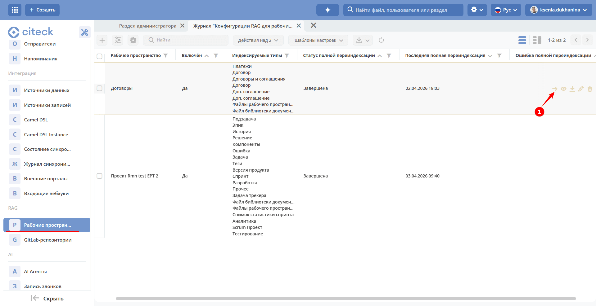
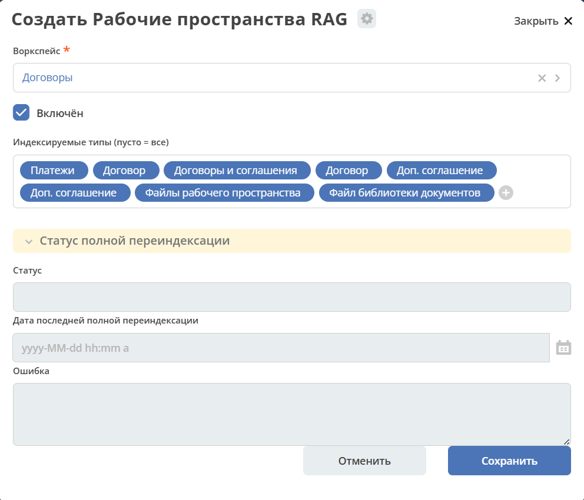
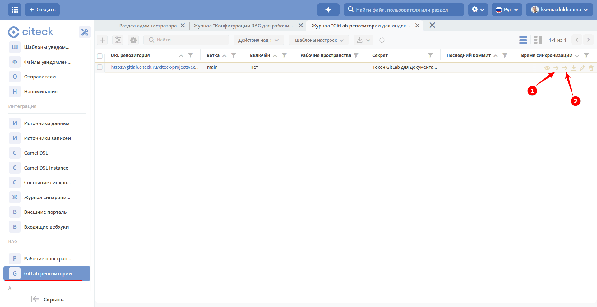
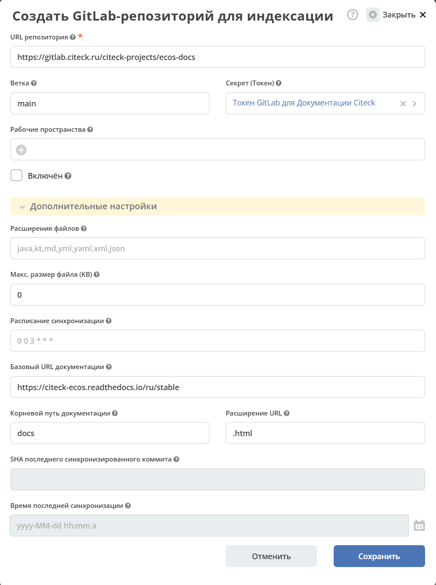

.. _rag-config:

Настройка семантического поиска и индексации документов
===========================================================

Микросервис семантического поиска и индексации документов для платформы Citeck на базе RAG (Retrieval-Augmented Generation).

Сервис индексирует данные из **Citeck-записей** и **GitLab-репозиториев**, строит векторные представления с помощью OpenAI Embeddings и обеспечивает семантический поиск через Qdrant.

Возможности:

.. grid:: 1
   :gutter: 2

   .. grid-item-card:: Семантический поиск
      :class-header: sd-font-weight-bold

      По содержимому документов Citeck и исходному коду GitLab.

      - Поиск по записям Citeck и содержимому GitLab-репозиториев с использованием эмбеддингов (OpenAI ``text-embedding-3-small``) и векторной БД Qdrant.
      - Результаты фильтруются по правам пользователя и рабочему пространству, дедуплицируются и ранжируются по релевантности.

   .. grid-item-card:: Индексация рабочих пространств
      :class-header: sd-font-weight-bold

      - Для каждого рабочего пространства создаётся отдельная Qdrant-коллекция, что гарантирует изоляцию данных.
      - Инкрементальная индексация по событиям CRUD с объединением повторных изменений (debounce).
      - Параллельная полная переиндексация с пропуском неизменённых документов по SHA-256.

   .. grid-item-card:: Индексация GitLab-репозиториев
      :class-header: sd-font-weight-bold

      - Репозитории настраиваются через отдельный тип ``rag-gitlab-repo`` с указанием секрета-токена, списка расширений и предельного размера файла.
      - Инкрементальная синхронизация через GitLab Commits API — по расписанию или вручную.
      - Репозиторий можно привязать к одному или нескольким рабочим пространствам: тогда он участвует в поиске только внутри них; без привязки — доступен во всех пространствах.
      - При удалении репозитория соответствующая векторная коллекция удаляется автоматически.

   .. grid-item-card:: API поиска
      :class-header: sd-font-weight-bold

      - REST-эндпоинт ``POST /api/rag/search`` и ECOS Records DAO (source ID ``rag-search``).
      - Фильтрация по идентификаторам репозиториев (``includeRepoIds`` / ``excludeRepoIds``).
      - Вместе с документом публикуется базовый URL документации — результаты поиска могут ссылаться на публичные страницы документации.

   .. grid-item-card:: Развёртывание преднастроенных записей
      :class-header: sd-font-weight-bold

      - ECOS-артефакты для типов ``rag-gitlab-repo`` и ``rag-workspace-config`` позволяют разворачивать готовые конфигурации (например, документация Citeck ECOS) при старте приложения.
      - Изменения таких записей синхронизируются обратно через ``EventsService``.

   .. grid-item-card:: MCP-сервер
      :class-header: sd-font-weight-bold

      Интеграция с Claude Code и другими AI-моделями через Model Context Protocol.

Архитектура
-------------

Сервис состоит из двух модулей:

.. list-table::
   :header-rows: 1
   :widths: 25 10 65
   :class: tight-table

   * - Модуль
     - Порт
     - Описание
   * - ``citeck-rag-app``
     - 8614
     - Основной сервис: индексация, поиск, REST API, Records DAO
   * - ``citeck-rag-mcp``
     - 8615
     - MCP-сервер с инструментами для AI-моделей (поиск, переиндексация, статус, получение документа)

**Стек:**

- Java 17
- Spring Boot 3.x
- Spring AI 1.1.3
- OpenAI ``text-embedding-3-small`` (1536 dimensions)
- Qdrant
- GitLab4J
- ECOS Records API

Требования
----------------------------------------------------------------

Компоненты Citeck, необходимые для работы сервиса:

- zookeeper
- rabbitmq
- ecos-registry
- ecos-model (workspace-конфигурация)
- ecos-apps (Records API)

Внешние зависимости:

- **Qdrant** — векторная БД, gRPC-порт ``6334``
- **OpenAI API** — сервис эмбеддингов, ключ передаётся через переменную ``CTK_OPENAI_API_KEY``

Параметры сервера
----------------------------------------------------------------

.. list-table::
   :header-rows: 1
   :widths: 45 20 35
   :class: tight-table

   * - Параметр
     - По умолчанию
     - Описание
   * - ``CTK_OPENAI_API_KEY``
     - —
     - API-ключ OpenAI для эмбеддингов
   * - ``QDRANT_HOST``
     - ``localhost``
     - Хост Qdrant
   * - ``QDRANT_GRPC_PORT``
     - ``6334``
     - gRPC-порт Qdrant
   * - ``citeck.rag.search.default-top-k``
     - ``5``
     - Количество результатов поиска
   * - ``citeck.rag.search.default-threshold``
     - ``0.7``
     - Порог сходства (cosine similarity)
   * - ``citeck.rag.chunking.default-chunk-size``
     - ``800``
     - Размер чанка в токенах
   * - ``citeck.rag.chunking.code-chunk-size``
     - ``1200``
     - Размер чанка для файлов с кодом

MCP-сервер
----------------------------------------------------------------

``citeck-rag-mcp`` (порт **8615**) предоставляет инструменты для AI-моделей через Model Context Protocol:

- ``search`` — семантический поиск по проиндексированным данным
- ``reindex`` — запуск переиндексации workspace или репозитория
- ``status`` — статус индексации и коллекций Qdrant
- ``document`` — получение содержимого документа по идентификатору

Records API
----------------------------------------------------------------

Сервис предоставляет Records DAO для интеграции с платформой Citeck:

- ``rag-search`` — семантический поиск через ECOS Records Query
- ``rag-index`` — управление индексацией
- ``gitlab-sync`` — управление синхронизацией GitLab-репозиториев
- ``workspace-reindex`` — переиндексация рабочего пространства

REST API
----------------------------------------------------------------

.. list-table::
   :header-rows: 1
   :widths: 12 42 46
   :class: tight-table

   * - Метод
     - Эндпоинт
     - Описание
   * - ``POST``
     - ``/api/rag/search``
     - Семантический поиск
   * - ``POST``
     - ``/api/rag/indexing/full-reindex``
     - Полная переиндексация
   * - ``POST``
     - ``/api/rag/indexing/incremental``
     - Инкрементальная синхронизация
   * - ``POST``
     - ``/api/rag/indexing/document``
     - Индексация одного документа
   * - ``DELETE``
     - ``/api/rag/indexing/document``
     - Удаление документа из индекса
   * - ``GET``
     - ``/api/rag/status``
     - Статус индексации и коллекций
   * - ``GET``
     - ``/api/rag/document``
     - Получение содержимого документа

Журналы настройки
---------------------------

В рабочем пространстве администратора в разделе **RAG** доступны журналы для управления:

- **Рабочие пространства** — какие рабочие пространства участвуют в семантическом поиске и какие типы записей индексируются.
- **GitLab‑репозитории** — какие GitLab‑репозитории подключены к поиску.

Рабочие пространства
~~~~~~~~~~~~~~~~~~~~~

Действия помимо стандартных:

  - **(1) Принудительная переиндексация** — полная переиндексация всех записей рабочего пространства вне зависимости от расписания. Применяйте, если данные в индексе рассинхронизировались с реальными записями или после изменения настроек индексируемых типов.

**Создание новой настройки:**

Настройки:

- **Воркспейс** — ограничивает, какие рабочие пространства участвуют в поиске. Оставьте пустым — запись доступна в поиске во ВСЕХ рабочих пространствах (глобальная документация). Укажите список — запись подключается к поиску только внутри выбранных пространств. На индексацию не влияет: записи всегда индексируются в свою отдельную коллекцию.
- **Включён** — при выключении запланированная синхронизация не выполняется. Уже проиндексированные векторы не удаляются — при повторном включении поиск продолжит работать без переиндексации.
- **Индексируемые типы** (пусто = все) — типы записей, которые индексируются для этого рабочего пространства. Если пусто — индексируются все типы. Если указано — индексируются только записи этих типов.

Статус (заполняется автоматически):

- **Статус** — статус синхронизации.
- **Дата последней полной переиндексации** — дата последней полной переиндексации всех данных этого рабочего пространства.
- **Ошибка** — ошибки, возникшие при последней попытке синхронизации.

GitLab‑репозитории
~~~~~~~~~~~~~~~~~~~

Действия помимо стандартных:

  - **(1) Принудительная синхронизация** — инкрементальная синхронизация: обрабатываются только изменения начиная с последнего зафиксированного коммита (по SHA). По результату идентична плановому запуску по расписанию, но выполняется немедленно.
  - **(2) Принудительная переиндексация** — полная переиндексация: весь репозиторий сканируется заново, SHA сбрасывается. Применяйте, если индекс повреждён или после изменения параметров (расширения файлов, максимальный размер файла).

**Создание новой настройки:**

Основные:

- **URL репозитория** — полный URL GitLab-репозитория для индексации. Должен содержать схему, хост и путь проекта (Группа/Проект).
- **Ветка** — Git-ветка для индексации. Данные загружаются только из этой ветки.
- **Секрет (Токен)** — секрет ECOS с GitLab Personal/Project Access Token (права ``read_api`` и ``read_repository``). У владельца токена в проекте должна быть роль не ниже Reporter. Обязателен для приватных репозиториев.
- **Рабочие пространства** — ограничивает, в каких рабочих пространствах этот репозиторий участвует в поиске. Оставьте пустым — репозиторий доступен в поиске во ВСЕХ рабочих пространствах (глобальная документация). Укажите список — репозиторий подключается к поиску только внутри выбранных пространств. На индексацию не влияет: репозиторий всегда индексируется в свою отдельную коллекцию.
- **Включён** — при выключении запланированная синхронизация не выполняется, а репозиторий исключается из поиска. Уже проиндексированные векторы не удаляются — при повторном включении поиск продолжит работать без переиндексации.

Индексация:

- **Расширения файлов** — список расширений файлов для индексации через запятую (без точки). Файлы с другими расширениями пропускаются. Если пусто — применяется значение по умолчанию из настроек сервера.
- **Макс. размер файла (KB)** — файлы больше указанного размера пропускаются, чтобы избежать проблем с памятью и лишних расходов на эмбеддинги. Оставьте пустым или ``0``, чтобы использовать значение по умолчанию из настроек сервера.
- **Расписание синхронизации** — Cron-выражение в формате Spring (6 полей: секунды минуты часы день месяц день_недели) для инкрементальной синхронизации этого репозитория. Если пусто — используется общее расписание из настроек сервера.

Публикация документации:

- **Базовый URL документации** — базовый URL опубликованного сайта документации. Вместе с «Корневой путь документации» и «Расширение URL» используется для построения публичной ссылки на страницу-источник в результатах поиска. Оставьте пустым, если репозиторий не публикуется на сайт.
- **Корневой путь документации** — путь внутри репозитория, соответствующий корню опубликованного сайта. Например, при ``docsRootPath=docs`` файл ``docs/guide/intro.md`` отображается на ``/guide/intro``.
- **Расширение URL** — расширение, подставляемое в конце URL на опубликованном сайте вместо расширения исходного файла. Например, ``.html`` для статических сайтов (ReadTheDocs, MkDocs) или пустая строка, если сайт использует «чистые» URL без расширения.

Служебные (заполняются автоматически):

- **SHA последнего синхронизированного коммита** — SHA последнего коммита, обработанного инкрементальной синхронизацией. Используется для вычисления изменений при следующем запуске. Очистите поле, чтобы принудительно пересканировать ветку целиком.
- **Время последней синхронизации** — время последней успешной синхронизации этого репозитория.
