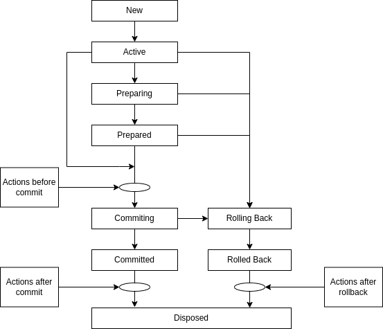
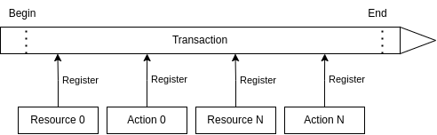

Транзакции в ECOS
=================

В ECOS реализованы транзакции на базе двухфазного коммита.

Описание сущностей:

 1. **Транзакционный ресурс** - ресурс, который поддерживает работу с транзакциями (например - база данных);

 2. **Транзакционное действие** - действие, которое привязывается к жизненному циклу транзакции и выполняется в одном из трех случаев - перед коммитом, после коммита, после отката транзакции;

 3. **Транзакция** - сущность, в рамках которой можно регистрировать транзакционные ресурсы и действия. Если в ходе транзакции поисходит ошибка, то транзакция откатывается и система возвращается к состоянию до начала транзакции;

 4. **Транзакционный менеджер** - менеджер, который управляет транзакциями. 

Жизненный цикл транзакции:

Общая схема работы:

Текстовое описание:

    1. Транзакция начинается.

    2. В ходе работы идет работа с ресурсами, которые регистрируются в транзакции

    3. Так же в ходе работы возникают действия, которые нужно выполнить перед коммитом, после коммита или после ролбэка.

    4. Перед коммитом выполняются все транзакционные действия, которые зарегистрировались в транзакции

    5. Перед коммитом проверяется количество ресурсов. Если ресурс один, то выполняется однофазный коммит. Если ресурсов несколько, то выполняется подготовка к коммиту и коммит подготовленной транзакции.

    6. После коммита выполняются все транзакционные действия, которые зарегистрировались в транзакции

    7. Если что-то пошло не так в ходе транзакции, то все ресурсы откатываются к исходногому состоянию и выполнятются действия после ролбэка, кторые успели зарегистироваться в ходе транзакции.

Работа с транзакциями в котлин коде:

.. code-block::

    val result = TxnContext.doInTxn {
        "выполняем нужные действия и возвращаем результат"
    }

Работа с транзакциями в java коде:

.. code-block::

    String result = TxnContext.doInTxnJ(() -> {
        return "выполняем нужные действия и возвращаем результат";
    });

Данные методы создают транзакцию? если её нет или используют существующую. Если требуется принудительно выполнить действие в новой транзакции, то следует использовать методы ``doInNewTxn`` и ``doInNewTxnJ`` соответственно.

Для Records API транзакции запускаются автоматически в момент, когда к нам приходит запрос извне нашего приложения. 