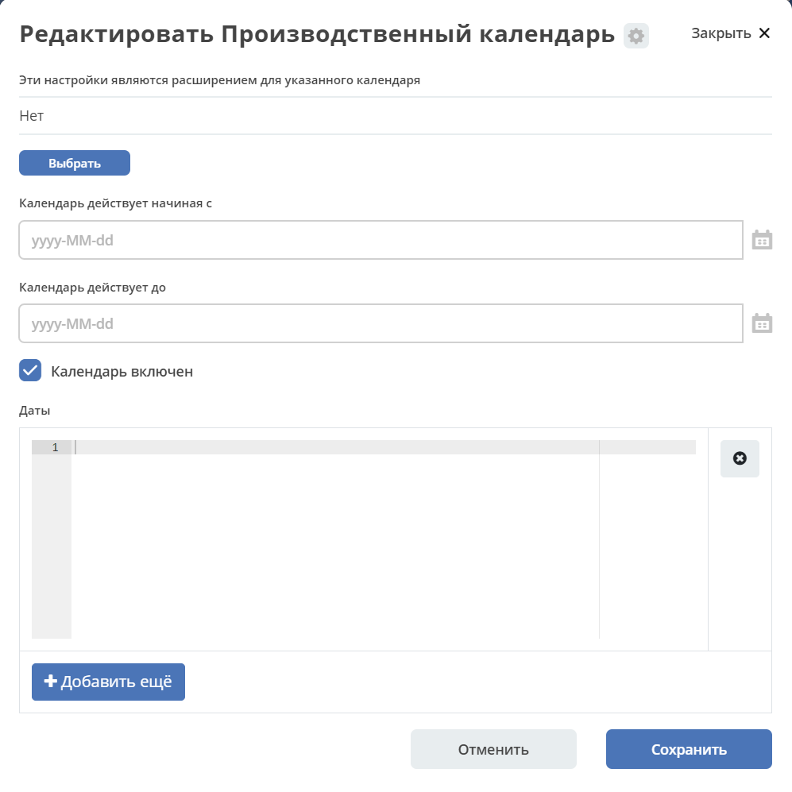
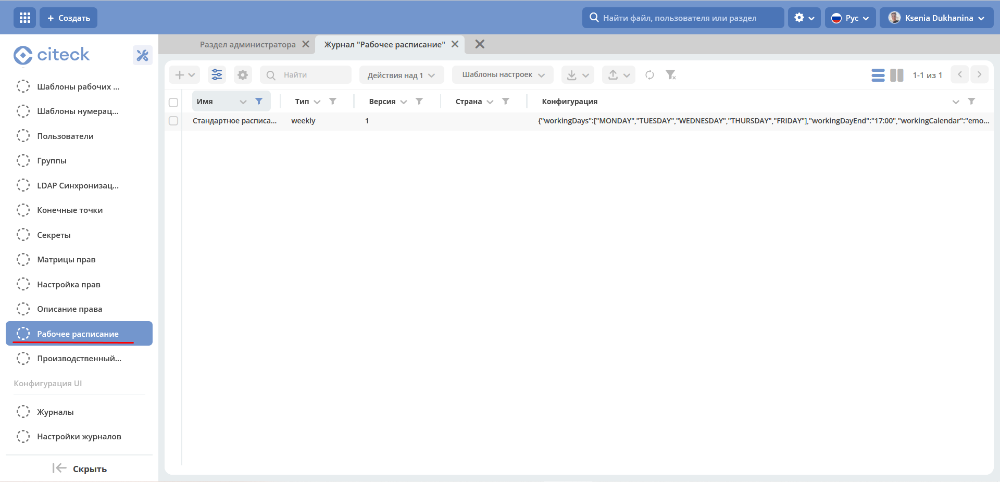

Рабочее расписание Working Schedule
====================================

.. _working-schedule:

.. note::

  Для использования рабочего расписания необходимо наличие лицензии "features.working-schedule" 

  Без наличия лицензии рабочее расписание при расчетах будет учитывать только обычные выходные дни без учета производственного календаря.

.. contents::
   :depth: 3

Рабочее расписание используется для четырех видов операций:

    1. Добавить рабочее время к определенной дате и времени.
    2. Добавить рабочие дни к определенной дате.
    3. Рассчитать количество рабочих дней между двумя датами.
    4. Рассчитать количество рабочих дней между двумя датами с временем.

Привязка рабочего расписания к пользователю или группе
-------------------------------------------------------

Для привязки рабочего расписания к пользователю или группе нужно создать ассоциацию ``has-working-schedule:schedule``

Часовые пояса
----------------

При расчетах на основе рабочего расписания используется следующая логика при обработке часовых поясов:

Если мы делаем расчеты с учетом рабочего времени, то есть следующие варианты:

  1. В дате часовой пояс не указан - используется часовой пояс из рабочего расписания, результат не будет содержать часовой пояс.
  2. В дате часовой пояс указан - дата/время, которые получает сервис он переводит в часовой пояс рабочего расписания. После выполнения всех операций результат переводится в исходный часовой пояс. 

Настройка рабочего расписания
------------------------------

В системе предусмотрены 2 сущности для настройки работы рабочего расписания.

Производственный календарь
~~~~~~~~~~~~~~~~~~~~~~~~~~~~

Cущность нужна для формирования списка дат, которые изменяют обычный распорядок рабочих дней.

Журнал: http://localhost/v2/admin?journalId=working-calendar&type=JOURNAL

|

Атрибуты:

.. list-table:: 
      :widths: 10 10 10
      :header-rows: 1

      * - ID
        - Тип 
        - Описание
      * - id
        - String 
        - Идентификатор
      * - extensionFor
        - EntityRef 
        - Ссылка на календарь, который мы расширяем своей конфигурацией
      * - from
        - LocalDate
        - Дата начала действия календаря
      * - until
        - LocalDate
        - Дата окончания действия календаря
      * - enabled
        - Boolean
        - Активен ли календарь
      * - dates
        - List<WorkingCalendarDay>
        - Список дней календаря

**WorkingCalendarDay** содержит следующие поля:

.. list-table:: 
      :widths: 10 10 10
      :header-rows: 1

      * - ID
        - Тип 
        - Описание
      * - date
        - LocalDate
        - Конкретная дата или дата начала диапазона если задано значение until
      * - until
        - LocalDate
        - Дата окончания диапазона (включительно)
      * - type
        - String
        - | Тип даты или всех дат в диапазоне
          | Допустимые типы: 
             
             * WORKING - рабочий день. Имеет смысл указывать, когда выходной день становится рабочим
             * HOLIDAY - праздник
             * SHORTDAY - сокращенный на 1ч рабочий день 
             * WEEKEND - выходной
             * NON_WORKING - не рабочий день
      * - description
        - MLText
        - Описание дня или диапазона

Рабочее расписание
~~~~~~~~~~~~~~~~~~~~~

Определяет обычный распорядок рабочих дней.

Журнал: http://localhost/v2/admin?journalId=type$working-schedule&type=JOURNAL

|

Атрибуты:

.. list-table:: 
      :widths: 10 10 10
      :header-rows: 1

      * - ID
        - Тип 
        - Описание
      * - id
        - String
        - Идентификатор
      * - name
        - MLText
        - Имя расписания
      * - type
        - String
        - Тип расписания. Сейчас поддерживается только weekly
      * - config
        - ObjectData
        - Конфигурация для типа расписания

Конфигурация расписания для типа weekly:

.. list-table:: 
      :widths: 10 10 10
      :header-rows: 1

      * - ID
        - Тип 
        - Описание
      * - workingDayStart
        - LocalTime
        - Начало рабочего дня
      * - workingDayEnd
        - LocalTime
        - Завершение рабочего дня
      * - workingDayTimeZone
        - ZoneId
        - Часовой пояс рабочего дня
      * - workingDays
        - List<DayOfWeek>
        - Список рабочих дней
      * - workingCalendar
        - EntityRef
        - Ссылка на производственный календарь

Использование сервиса WorkingScheduleService в java/kotlin коде
-----------------------------------------------------------------

1. Добавляем сервис ``ru.citeck.ecos.wkgsch.lib.schedule.WorkingScheduleService`` как spring бин.

2. Получаем рабочее расписание используя один из методов для поиска:

.. code-block::

  fun getScheduleById(id: String)
  fun getScheduleForGroup(groupId: String)
  fun getScheduleForUser(userName: String)
  fun querySchedule(query: WorkingScheduleQuery)

3. Используя методы интерфейса ``ru.citeck.ecos.wkgsch.lib.schedule.WorkingSchedule`` производим вычисления даты и/или времени в зависимости от рабочего расписания:

.. code-block::

  /**
  * This interface stands as a contract for defining working schedules.
  * It provides a range of functions that manipulate and interpret dates
  * with respect to a working calendar/week - which may vary depending on the locale
  * or the specific needs of a business.
  */
  interface WorkingSchedule {
  
      /**
      * Adjusts a given date to its nearest following working day.
      * If the specified date is already a working day, no changes will be made.
      * Note: If the date has time and/or timeZone components, these will be preserved in the returned date.
      *
      * @param date any of date or datetime values Instant, LocalDate, LocalDateTime, OffsetDateTime, ZonedDateTime
      */
      fun <T : Temporal> correctDate(date: T): T
  
      /**
      * Adjusts a given date to its nearest following working day and then adds specified working days to it.
      * Note: If the date has time and/or timeZone components, these will be preserved in the returned date.
      *
      * @param date any of date or datetime values Instant, LocalDate, LocalDateTime, OffsetDateTime, ZonedDateTime
      */
      fun <T : Temporal> addWorkingDays(date: T, days: Int): T
  
      /**
      * Computes the number of working days between two dates.
      *
      * @param from the start date from which working days are counted. Accepted values: Instant, LocalDate, LocalDateTime, OffsetDateTime, ZonedDateTime
      * @param to the end date up to which working days are counted. Accepted values: Instant, LocalDate, LocalDateTime, OffsetDateTime, ZonedDateTime
      */
      fun getWorkingDays(from: Temporal, to: Temporal): Int
  
      /**
      * Adds a specified working time to a certain date.
      *
      * @param date any of date or datetime values Instant, LocalDate, LocalDateTime, OffsetDateTime, ZonedDateTime
      */
      fun <T : Temporal> addWorkingTime(date: T, time: Duration): T
  
      /**
      * Get working time between two dates.
      *
      * @param from the start time from which working time are counted. Accepted values: Instant, LocalDateTime, OffsetDateTime, ZonedDateTime
      * @param to the end time up to which working time are counted. Accepted values: Instant, LocalDateTime, OffsetDateTime, ZonedDateTime
      */
      fun getWorkingTime(from: Temporal, to: Temporal): Duration
  }

Records API в браузере
-----------------------

Добавить рабочее время
~~~~~~~~~~~~~~~~~~~~~~

.. code-block::

    await Records.queryOne({
        sourceId: 'emodel/working-schedule-action',
        query: {
            type: 'add-working-time',
            config: {date: '2023-03-05T14:00:00', time: '10h'},
            query: {scheduleId: 'DEFAULT'}
        }
    }, "data")

Результат:

.. code-block::

    '2023-03-07T11:00'

Добавить рабочие дни
~~~~~~~~~~~~~~~~~~~~~~

.. code-block::

    await Records.queryOne({
        sourceId: 'emodel/working-schedule-action',
        query: {
            type: 'add-working-days',
            config: {date: '2023-03-05', days: 10},
            query: {scheduleId: 'DEFAULT'}
        }
    }, "data")

Результат:

.. code-block::

    '2023-03-21'

Рассчитать количество рабочих дней между двумя датами
~~~~~~~~~~~~~~~~~~~~~~~~~~~~~~~~~~~~~~~~~~~~~~~~~~~~~~~~~~

.. code-block::

    await Records.queryOne({
        sourceId: 'emodel/working-schedule-action',
        query: {
            type: 'get-working-days',
            config: {from: '2023-03-05', to: '2023-03-21'},
            query: {scheduleId: 'DEFAULT'}
        }
    }, "data")

Результат:

.. code-block::

    '11'

Рассчитать количество рабочих дней между двумя датами с временем
~~~~~~~~~~~~~~~~~~~~~~~~~~~~~~~~~~~~~~~~~~~~~~~~~~~~~~~~~~~~~~~~~~

.. code-block::

    await Records.queryOne({
        sourceId: 'emodel/working-schedule-action',
        query: {
            type: 'get-working-time',
            config: {from: '2023-03-05', to: '2023-03-21'},
            query: {}
        }
    }, "data")

Результат:

.. code-block::

    'PT80H'

Во всех запросах есть поле ``query``, которое может иметь следующие поля:

.. list-table:: 
      :widths: 10 10 10
      :header-rows: 1

      * - ID
        - Тип 
        - Описание
      * - user
        - String
        - | Пользователь, для которого нам нужно найти рабочее расписание. 
          | Если расписание для пользователя не найдено, то берется DEFAULT.
      * - group
        - String
        - | Группа, для которой нам нужно найти рабочее расписание. 
          | Если расписание для группы не найдено, то берется DEFAULT.
      * - scheduleId
        - String
        - | Идентификатор конкретного рабочего расписания. 
          | Если задан, то user и group игнорируются.
          | Примеры идентификатора: 'DEFAULT', "some-id" 
