.. _intellij_idea_plugin:

Плагин для IntelliJ IDEA для работы с платформой Citeck
========================================================

.. contents::
   :depth: 2

Плагин для IntelliJ IDEA ускоряет работу с проектами и артефактами платформы Citeck. Поддерживаются `Community и Ultimate версии IntelliJ IDEA <https://www.jetbrains.com/idea/download>`_.

Исходный код плагина: `ecos-idea-plugin <https://github.com/Citeck/ecos-idea-plugin>`_

.. note::

   Минимально необходимые версии:

   * IntelliJ IDEA — 2022.2.5.
   * Citeck — 4.2

Установка плагина
------------------

Скачайте дистрибутив плагина из `release page <https://github.com/Citeck/ecos-idea-plugin/releases>`_ или соберите из исходников самостоятельно.

Далее установите плагин в IDEA: **Settings -> Plugins -> Install Plugin from disk**

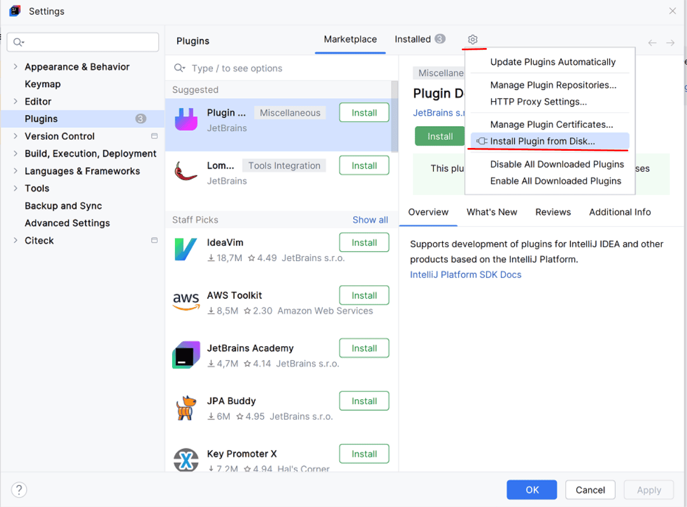

Обновление плагина
-------------------

Для обновления скачайте последнюю версию дистрибутива плагина из `release page <https://github.com/Citeck/ecos-idea-plugin/releases>`_

Удалите старую версию из **Settings -> Plugins** и установите последнюю версию плагина **Settings -> Plugins -> Install Plugin from disk**

Функционал плагина
------------------

Создание новых проектов Citeck
~~~~~~~~~~~~~~~~~~~~~~~~~~~~~~~

Плагин позволяет создавать новые проекты Citeck (приложение, микросервис).

.. _plugin_app_mks:

**File -> New project**

Доступен пункт **Citeck** и варианты создания :ref:`приложения<applications>`/ :ref:`микросервиса<mcs_setup>`:

.. grid:: 2
   :gutter: 2

   .. grid-item::

      .. image:: _static/idea_plugin/01.png
         :width: 500
         :align: left

   .. grid-item::

      .. image:: _static/idea_plugin/02.png
         :width: 500
         :align: left

Создается проект с соответствующей структурой:

.. grid:: 2
   :gutter: 2

   .. grid-item::

      **Приложение**

      .. image:: _static/idea_plugin/03.png
         :width: 400
         :align: left

   .. grid-item::

      **Микросервис**

      .. image:: _static/idea_plugin/04.png
         :width: 400
         :align: left

Создание артефактов по шаблону
~~~~~~~~~~~~~~~~~~~~~~~~~~~~~~~

По правой кнопке в контекстном меню доступен пункт **New - Citeck Artifact**:

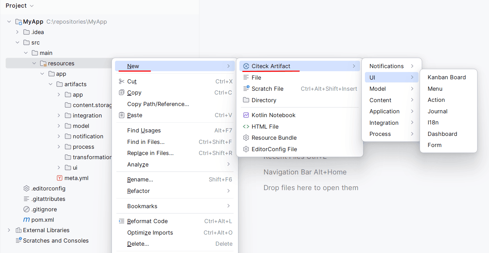

Вводим название:

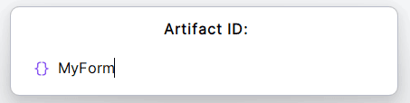

Артефакт генерируется в соответствии с шаблоном:

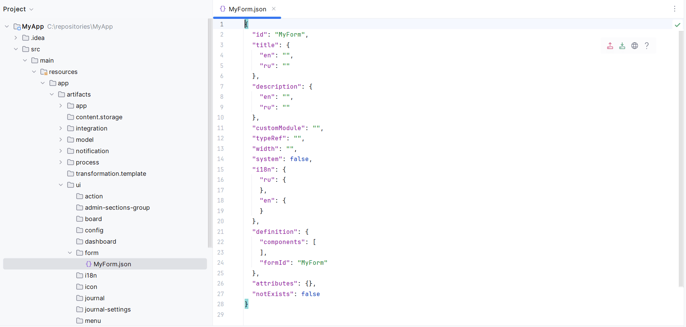

Загрузка и выгрузка артефактов
~~~~~~~~~~~~~~~~~~~~~~~~~~~~~~~

Загрузка/выгрузка артефактов на/с локального сервера (формы, журналы, дашборды, процессы).

Для артефакта доступны следующие действия:

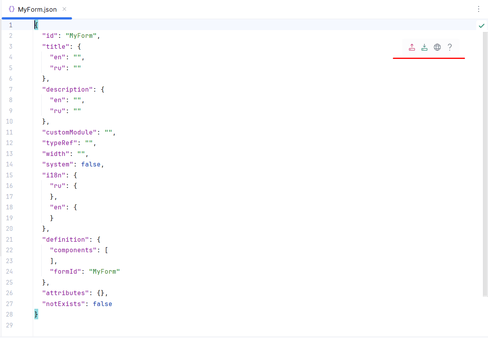

* **Deploy File** — выгрузка артефакта на сервер.
* **Fetch File** — загрузка артефакта с сервера
* **Open In Browser** — просмотр артефакта в браузере
* **Open Documentation** — переход на страницу с документацией по артефакту

.. dropdown:: Пример: редактирование формы через no-code редактор
   :color: secondary

   1. Выгрузите артефакт по кнопке **Deploy File** на стенд или локально:

      .. grid:: 3
         :gutter: 2

         .. grid-item::

            .. image:: _static/idea_plugin/deploy_a.png
               :width: 200
               :align: left

         .. grid-item::

            .. image:: _static/idea_plugin/select_server.png
               :width: 200
               :align: left

         .. grid-item::

            .. image:: _static/idea_plugin/deploy_b.png
               :width: 250
               :align: left

   2. Откройте артефакт (например, форму) по кнопке **Open In Browser** в no-code редакторе на стенде или локально, отредактируйте:

      .. grid:: 2
         :gutter: 2

         .. grid-item::

            .. image:: _static/idea_plugin/form_1.png
               :width: 500
               :align: left

         .. grid-item::

            .. image:: _static/idea_plugin/form_2.png
               :width: 500
               :align: left

   3. Загрузите измененный артефакт обратно по кнопке **Fetch File**:

      .. image:: _static/idea_plugin/08_1.png
         :width: 600
         :align: center

JSON-схемы для артефактов
~~~~~~~~~~~~~~~~~~~~~~~~~~

Доступна подсветка синтаксиса при конфигурировании json/yaml артефактов.

.. grid:: 2
   :gutter: 2

   .. grid-item::

      .. image:: _static/idea_plugin/scheme_01.png
         :width: 600
         :align: left

   .. grid-item::

      .. image:: _static/idea_plugin/scheme_02.png
         :width: 600
         :align: left

Поиск артефактов
~~~~~~~~~~~~~~~~~

Поиск артефактов по их идентификаторам (расширение для search everywhere):

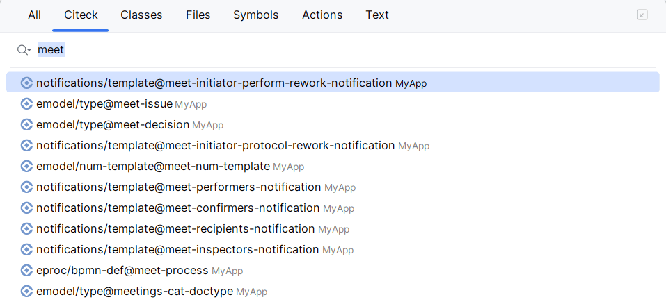

Навигация в коде по артефактам
~~~~~~~~~~~~~~~~~~~~~~~~~~~~~~~

Навигация в коде по артефактам Citeck через гиперссылки:

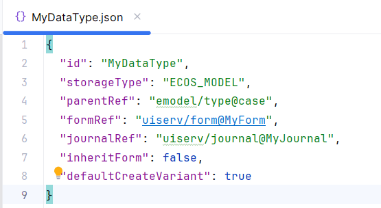

Автодополнение кода JavaScript
~~~~~~~~~~~~~~~~~~~~~~~~~~~~~~~

Типы
^^^^^

Для атрибутов **formRef**, **journalRef** и **parentRef**:

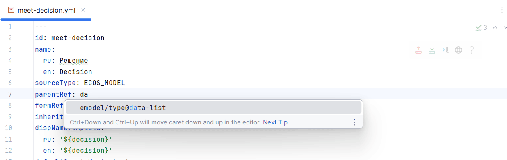

Формы
^^^^^^

Автодополнение объекта **data** списком компонент формы (IDEA Ultimate):

.. grid:: 2
   :gutter: 2

   .. grid-item::

      .. image:: _static/idea_plugin/11.png
         :width: 500
         :align: left

   .. grid-item::

      .. image:: _static/idea_plugin/12.png
         :width: 500
         :align: left

Навигация в файлах
~~~~~~~~~~~~~~~~~~~

- Формы (быстрый переход к компонентам по их имени);
- Журналы (навигация по колонкам);
- Типы данных (быстрый переход к атрибутам, ролям, статусам и т.д.)

.. grid:: 2
   :gutter: 2

   .. grid-item::

      .. image:: _static/idea_plugin/13.png
         :width: 500
         :align: left

   .. grid-item::

      .. image:: _static/idea_plugin/13_1.png
         :width: 500
         :align: left

Инспекции кода
~~~~~~~~~~~~~~~

Формы — проверка уникальности ключей компонентов форм с учетом областей (container, datagrid).

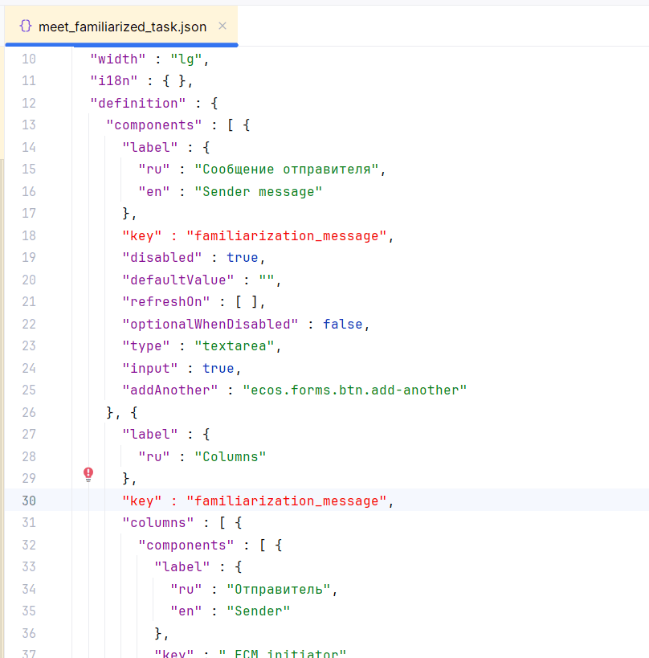

Генерация компонентов формы
~~~~~~~~~~~~~~~~~~~~~~~~~~~~

Если в форме задан **typeRef**:

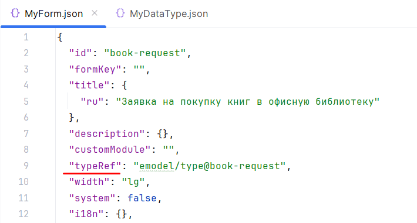

то доступна генерация компонентов по атрибутам указанного в typeRef типа данных.

.. grid:: 3
   :gutter: 2

   .. grid-item::

      .. image:: _static/idea_plugin/comp_gen_02.png
         :width: 500
         :align: left

   .. grid-item::

      .. image:: _static/idea_plugin/comp_gen_03.png
         :width: 500
         :align: left

   .. grid-item::

      .. image:: _static/idea_plugin/comp_gen_04.png
         :width: 500
         :align: left

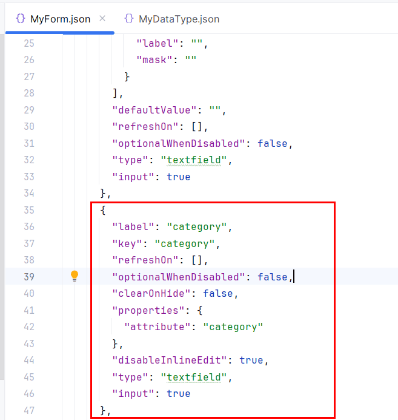

Расширение областей поиска
~~~~~~~~~~~~~~~~~~~~~~~~~~~

Расширение областей поиска файлами, содержащими артефакты Citeck:

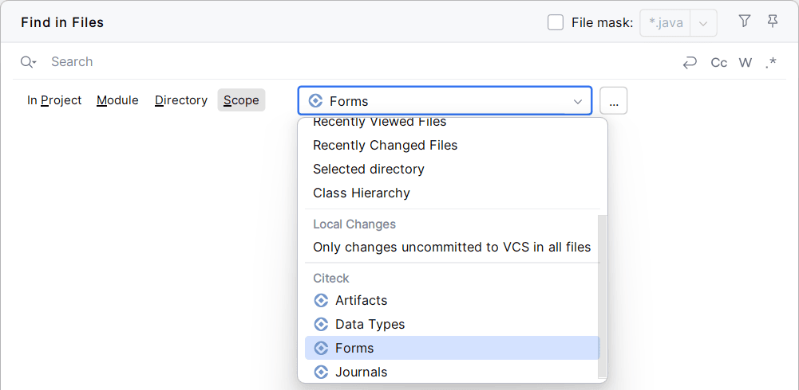

Конвертация YAML и JSON
~~~~~~~~~~~~~~~~~~~~~~~~

Конвертация **YAML -> JSON**, **JSON -> YAML**:

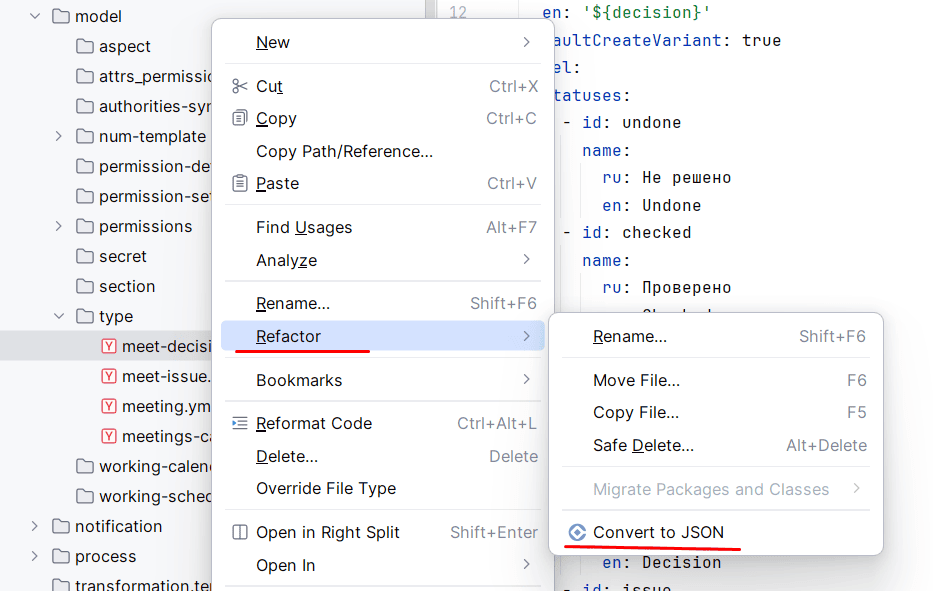

Language Injection (JavaScript) в формах
~~~~~~~~~~~~~~~~~~~~~~~~~~~~~~~~~~~~~~~~~

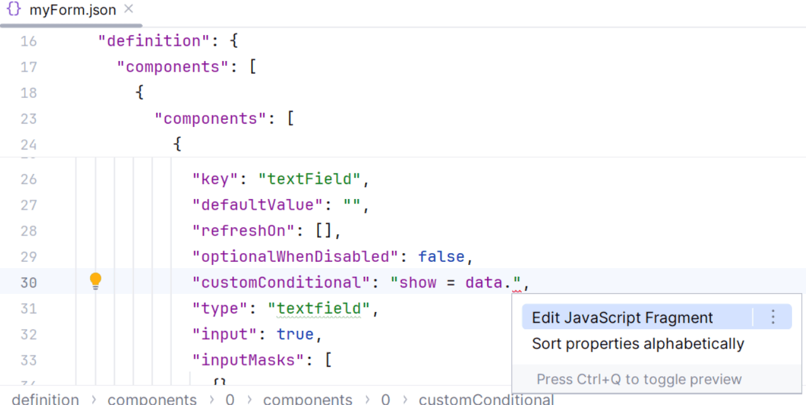

Деплой проекта
~~~~~~~~~~~~~~~

Деплой проекта возможен из **meta.yml** по нажатию на **Deploy File**:

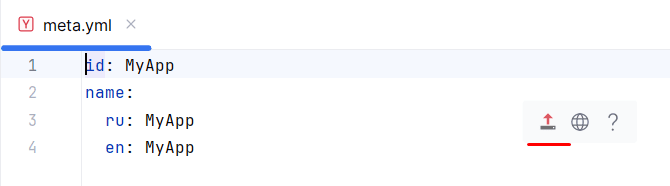

Далее можно нажать **Open In Browser**, чтобы посмотреть и отредактировать приложение в Citeck:

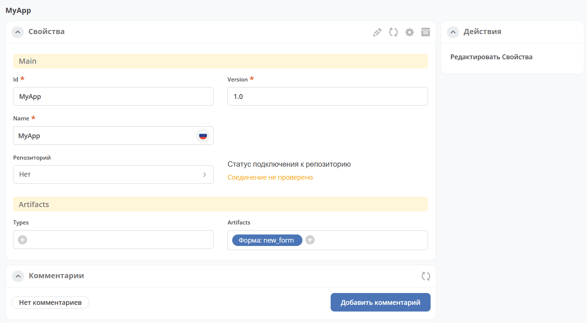

Также деплоить можно из контекстного меню, выбрав **Citeck-Deploy Application**:

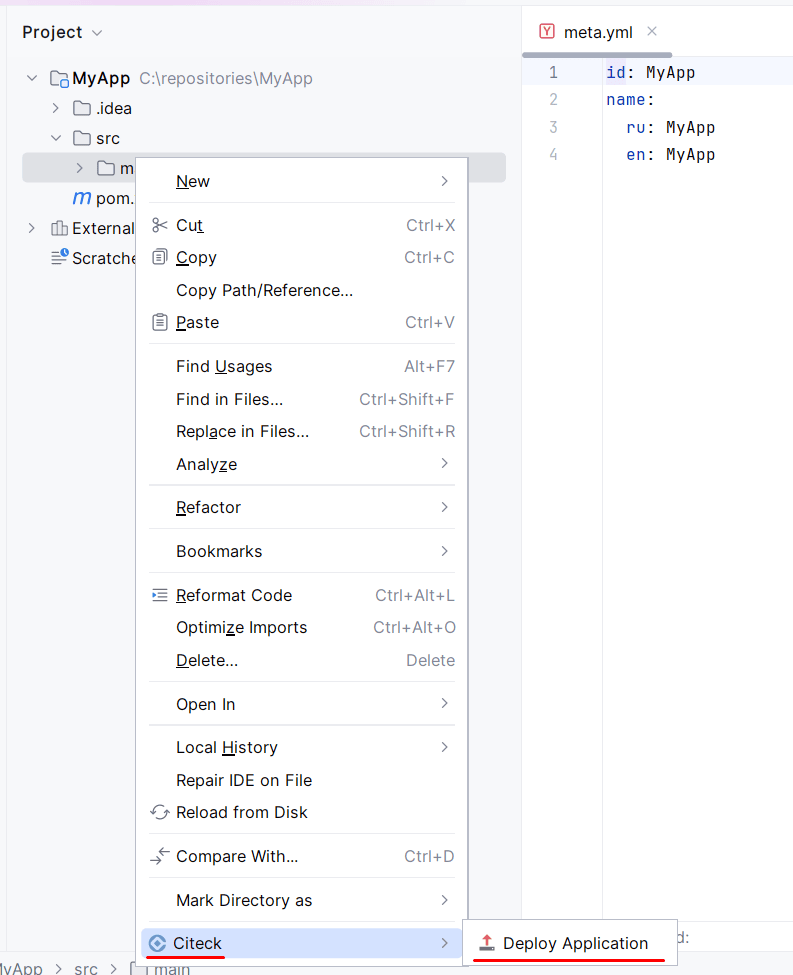

Конфигурация серверов
----------------------

Настройка серверов Citeck: **Settings -> Citeck -> Servers**.

Достаточно указать **host**, остальные параметры опциональны. Примеры настройки:

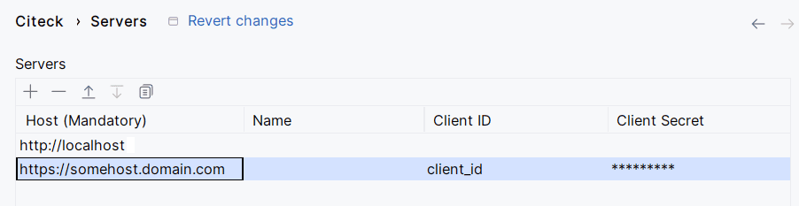

Для локального стенда используется метод **basic**.

Ввод логина и пароля для OIDC происходит в окне браузера, и плагин никак не взаимодействует с логином и паролем напрямую.

Для метода OAuth2 **Client ID** и **Client Secret** можно получить в соответствии с :ref:`инструкцией<keycloak_postman>`.

Сборка дистрибутива плагина
-----------------------------

1. Для корректной сборки дистрибутива плагина необходимо убедиться, что используемая версия **Gradle JVM не ниже 17**.

   Настроить используемую JVM для Gradle в IDEA можно по следующему пути: **Settings -> Build, Execution, Deployment -> Build Tools -> Gradle -> Gradle JVM**

2. Сборка осуществляется **Gradle** задачей **buildPlugin**.

3. Собранный дистрибутив будет расположен по следующему пути: ``build/distributions/``

Разработка
-----------

Для разработки плагина можно использовать Gradle задачу **runIde**.

При выполнении задачи будет запущен новый экземпляр IDEA с пересобранным плагином.
