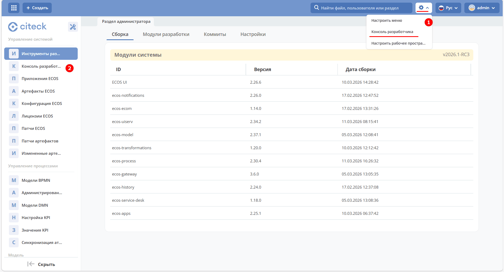
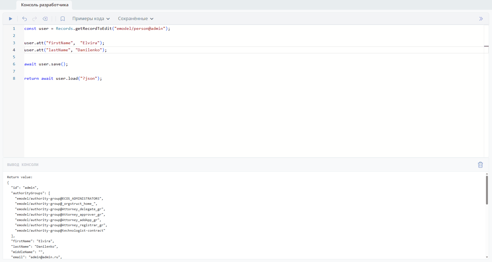
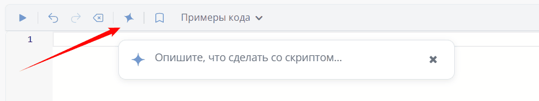
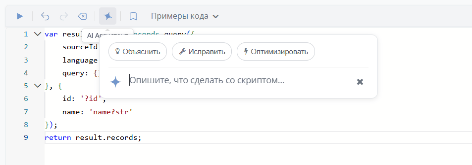

.. _developer_console:

Консоль разработчика
========================================

Консоль разработчика для администраторов позволяет выполнять **JavaScript код** непосредственно в браузере с отображением результатов.

Вызвать консоль можно из рабочего пространства "Раздел администратора" в верхнем правом углу через шестеренку **(1)** или через соответствующий пункт меню **(2)**:

Общий вид панели консоли разработчика:

- Вверху **панель инструментов** с кнопками управления (**Выполнить, Отменить, Повторить, Очистить, Сохранить код**), выпадающие меню **«Примеры кода»** и **«Сохранённые»**, переключение расположения панели.
- Основная область — **редактор кода** с нумерацией строк и синтаксической подсветкой.
- Внизу секция **«Вывод консоли»**.

Код можно запустить и по сочетанию клавиш **Shift + Enter**.

Работа со сниппетами
----------------------------------------

**Сниппет** — готовый фрагмент кода, который можно вставить одним кликом, чтобы не писать с нуля.

.. list-table::
   :header-rows: 1
   :widths: 30 70
   :class: tight-table

   * - Действие
     - Результат
   * - Сохранение кода
     - Кнопка **«Сохранить код»** → ввести название сниппета. Сниппет появляется в выпадающем меню **«Сохранённые»** и доступен для быстрой вставки.
   * - Повторное сохранение с тем же названием
     - Код активного сниппета обновляется. В модальном окне отображается подсказка **«Существующий сниппет будет обновлён»**.
   * - Удаление сниппета из меню «Сохранённые»
     - Появляется модальное окно с запросом подтверждения. После подтверждения сниппет удаляется.

Кнопка AI-ассистент
-------------------------------------

.. note::

   Доступно только в enterprise версии.

В панель инструментов консоли разработчика добавлена кнопка :ref:`AI-ассистента <AI_assistant>` — позволяет использовать AI для генерации и редактирования кода прямо в консоли.

Например, можно попросить AI-ассистента написать код для получения списка всех пользователей:

.. grid:: 2
   :gutter: 2

   .. grid-item::

      .. image:: _static/console/04.png
         :width: 400
         :align: left

   .. grid-item::

      .. image:: _static/console/05.png
         :width: 700
         :align: left

Если в редакторе уже есть код, то при запросе к AI-ассистенту появятся подсказки:

