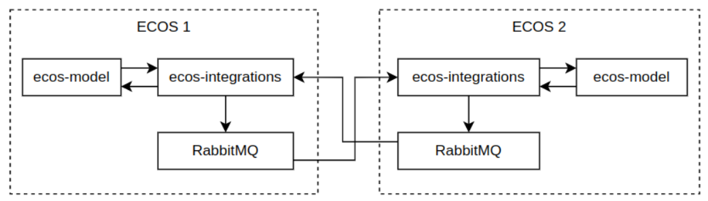
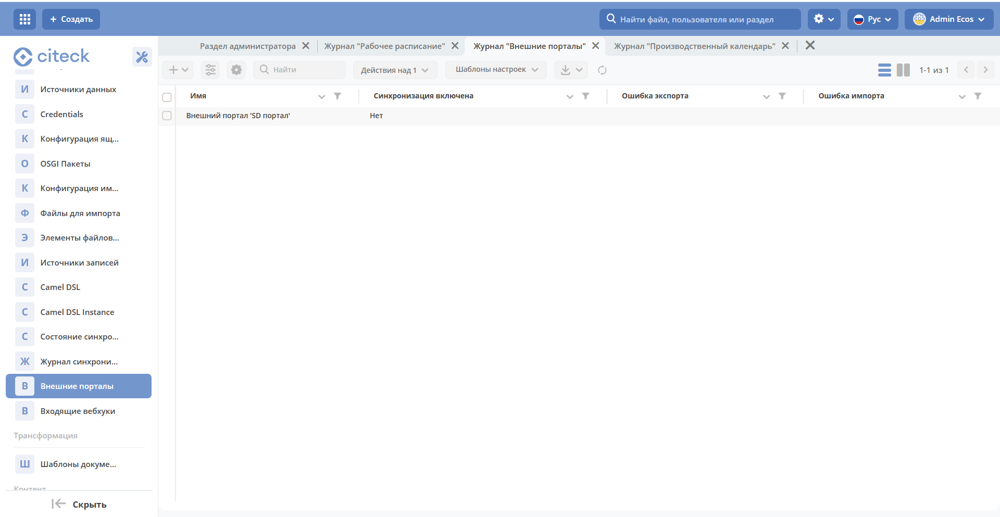
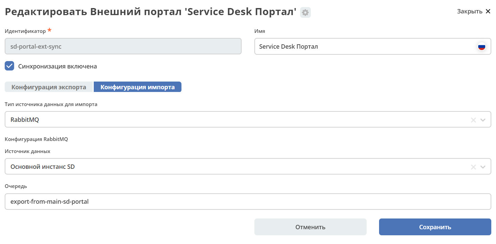
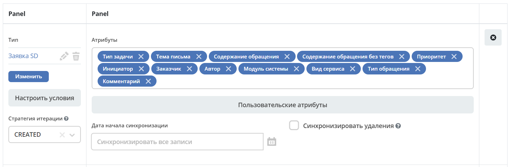
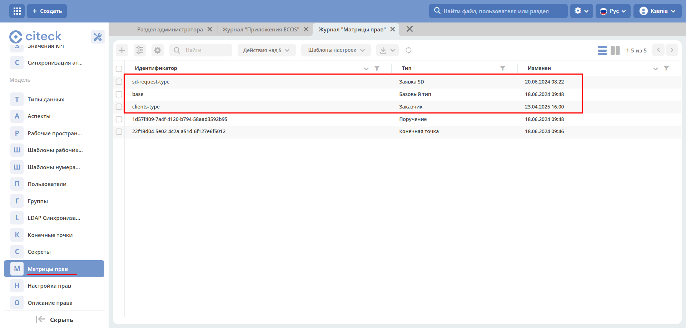
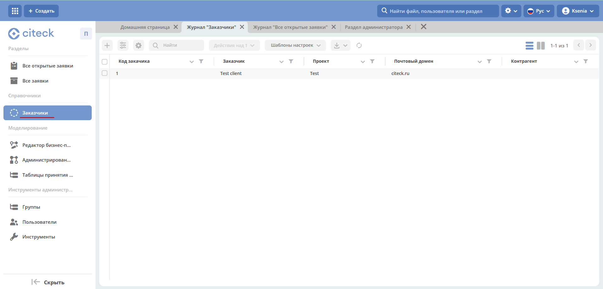
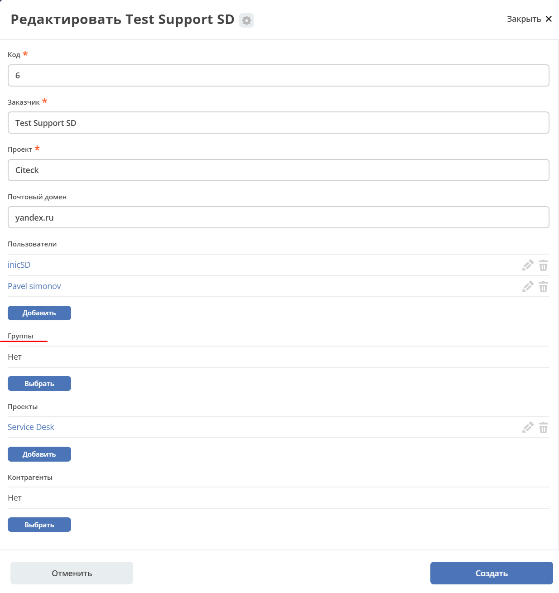
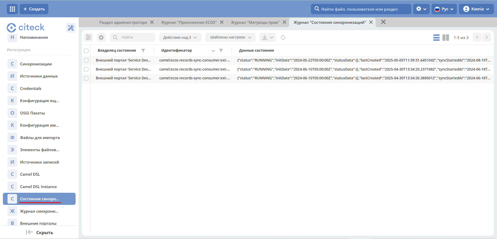
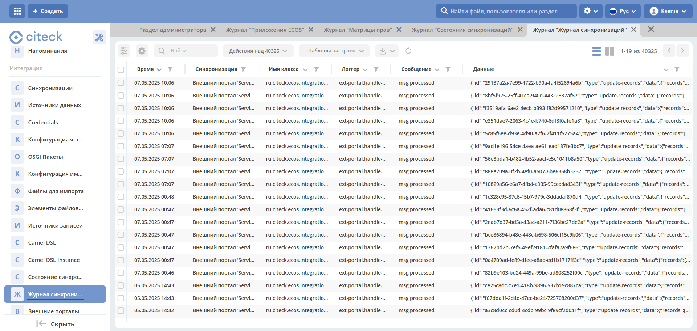

Внешний портал
===============

.. _ext_portal:

.. note:: 

       Доступно только в enterprise версии.

.. contents::
   :depth: 3

Функционал, который позволяет синхронизировать между 2 стендами данные определённых типов. 

Пример найстройки в **values.yaml** для стенда:

.. code-block:: yaml

    # Настройка tls для rabbitmq
    RabbitmqApp:
    tls:
        enabled: true # по умолчанию открывается порт 5671. Чтобы tls заработал нужно чтобы на стенде был ecos-tls-secret
    
    # Дефолтные настройки из чарта
    tls:
        enabled: false
        trustedCa:
        secretName: ecos-tls-secret
        keyName: trusted-ca
        keySecret:
        secretName: ecos-tls-secret
        keyName: rabbitmq-app-tls
        port: 5671
        verifyPeer: verify_peer
        failIfNoPeerCert: true

Настройка подключения к внешнему RMQ:

.. code-block::

    EcosIntegrationsApp:
    cloudConfig:
        ecos:
        webapp:
            dataSources:
            sd-main-instance-rmq: #это id датасорса. На него ссылается ext-portal конфиг внутри системы
                name: Основной инстанс SD # это имя видно на форме ext-portal конфига
                type: rabbitmq
                host: host
                port: 5671 # важно - для tls.enabled true/false разные порты
                username: ******
                password: ******
                tls:
                enabled: true # в идеале подключаться к внешнему RMQ через tls, но не обязательно
                clientKey: application
                trustedCerts: citeck-test-ca # этот CA зашит внутрь микросервиса. настройка пока не сделана
                verifyHostname: false

Настройки доступны в журнале **«Интеграции» (Рабочее пространство "Раздел администратора" - Интеграции)**.

Журнал доступен по адресу: https://portal_host/v2/journals?journalId=ext-portals&viewMode=table&ws=admin$workspace 

Форма настройки
----------------

* **Идентификатор**, **Имя** как у любого артефакта
* **Конфигурация экспорта**, **Конфигурации импорта** подробно см. ниже
* **«Синхронизация включена»**- если ее выключить соответственно синхронизация работать не будет.

Конфигурация импорта
---------------------

* **Тип источника данных для импорта**. На данный момент доступен только **RabbitMQ**. 
* **Источник данных** (Внешний инстанс SD, Internal RabbitMQ) указывается из какого инстанса RabbitMQ данные должны импортироваться. В answers стенда настраивается список подключений, и на UI подтягиваются этот список.

    *Внешний инстанс SD – enterprise в данном случае.*

* **Очередь**. Из какой очереди выбранного источника импортировать.

Пример:

.. code-block:: yaml

    ---
    id: sd-portal-main-sync
    name:
    ru: SD портал
    en: SD portal
    exportConfig:
    endpoint:
        type: rabbitmq
        config:
        queue: export-from-main-sd-portal 
        dataSource: main-rabbitmq
    typesToSync:
        - typeRef: emodel/type@sd-request-type
        initDate: null
        syncDeletions: false
        queryPredicate: '{}'
        filterPredicate: '{}' 
        attributesToSync:
            - _status
            - author
            - deadline
            - title
            - description
        iterationStrategy: CREATED_MODIFIED
    importConfig:
    endpoint:
        type: rabbitmq
        config:
        queue: export-from-external-sd-portal 
        dataSource: sd-ext-instance-rmq

Конфигурация экспорта 
-----------------------

.. image:: _static/external_portal/04.png
    :width: 600
    :align: center

* **Очередь для экспорта**. Настроен по умолчанию на RabbitMQ текущего стенда. Выбора не предполагается.
* **Дата начала синхронизации по умолчанию**. Заявки и комментарии, которые были созданы до указанной даты, не будут обрабатываться.

Пример:

.. code-block:: yaml

    id: sd-portal-ext-sync
    exportConfig:
    endpoint:
        type: rabbitmq
        config:
        queue: export-from-external-sd-portal 
        dataSource: main-rabbitmq
    typesToSync:
        - typeRef: emodel/type@sd-request-type 
        initDate: null
        syncDeletions: false
        queryPredicate: |-
            {
            "t": "empty",
            "a": "ext-portal-sync: importSyncId"
            }
        filterPredicate:
        attributesToSync:
            - author
            - title
            - description
            - deadline
    importConfig:
    endpoint:
        type: rabbitmq
        config:
        queue: export-from-main-sd-portal 
        dataSource: export-from-main-sd-portal 

Типы и атрибуты для экспорта
~~~~~~~~~~~~~~~~~~~~~~~~~~~~~~

Выбираем **типы данных**, выбираем **атрибуты** выбранного типа, которые необходимо синхронизировать:

Настроить условия
~~~~~~~~~~~~~~~~~~

После выбора типа можно настроить условия: 

2 поля для условий:

    -	**Предикат для запроса** означает, что мы в query запросе прямо отправляем - получить заявки, которые были созданы после выбранной даты (Дата начала синхронизации по умолчанию) и для которых выполняется указанное условие. 
    -	**Предикат для in-memory фильтрации.** Проверяется после выгрузки в ecos-integrations. То есть мы сначала сформировали запрос, отправили его, получили 100 записей, например, и каждую запись мы проверяем по этому дополнительному предикату. 

Предикат для in-memory фильтрации позволяет фильтровать данные на основании любых атрибутов. Этот метод фильтрации обладает максимальной гибкостью, однако по возможности рекомендуется использовать предикат для запроса, чтобы сократить время обработки.

В запросе очень многие вещи проверить нельзя. Например, обратиться к атрибуту parent’a, сложный вложенный атрибут. Некоторые источники данных не умеют нормально преобразовывать предикаты в join.

В то же время предикат для in-memory фильтрации позволяет делать условия на любые атрибуты, в том числе и на очень вложенные.

Пример предиката для in-memory фильтрации:

То есть перед тем, как отправить поисковый запрос со списком атрибутов для загрузки из предиката для in-memory фильтрации вытягиваются все атрибуты, которые необходимы для проверки условий. Соответственно, их дополнительно настраивать не нужно.

В  предикате для **in-memory фильтрации** указываем необходимый атрибут и в момент отправки запроса он будет также вытянут, а потом проверен.

Перечисляем **атрибуты** из модели, которые дальше обрабатываются в зависимости от их типа.

Атрибуты **простые** (текст, число, булево) загружаются из целевого источника данных, который определяется по типу, и отправляются в RabbitMQ.

Для более сложных, например, ассоциаций:
    -	Если **Target-ассоциация**, так выгружается ссылка; 
    -	Если **Child-ассоциация**, то работает дополнительная логика, которая позволяет вытягивать все атрибуты, которые заданы у типа дочерней сущности, попадают в выгрузку,  и сами сущности дочерние так же попадают в выгрузку. Если мы в списке атрибутов это укажем.

Как альтернативный вариант можно не указывать атрибуты с дочерними сущностями, а отдельный строкой **в типах для экспорта** показать, что необходимо выгрузить сущности и выгрузить их parent.
Так, например, сделано для **вложения**.

То есть вложение крепятся по docs:document (дочерняя ассоциация) и выгружаются как отдельный тип.

Пользовательские атрибуты
~~~~~~~~~~~~~~~~~~~~~~~~~~

Возможность настроить что-то сложное.

* **Ключ** - под каким алиасом результат будет загружен в RabbitMQ и, соответственно, на другой стенд.
* **Значение** – то, что нужно загрузить.

Для частных случаев. Дополнительная логика не используется, всё, что написано загружается и отправляется.

Дата начала синхронизации
~~~~~~~~~~~~~~~~~~~~~~~~~~

**Дата начала синхронизации** – настройка аналогична Дата начала синхронизации по умолчанию для конкретного типа. 

Если не указана, то используется **Дата начала синхронизации по умолчанию**.

Если **Дата начала синхронизации по умолчанию** и **Дата начала синхронизации** не указаны, то обрабатываются все записи. 

Синхронизировать удаления 
~~~~~~~~~~~~~~~~~~~~~~~~~~

Если запись удаляется на текущем инстансе Citeck, то она так же будет удалена и на внешнем портале.

Стратегия итерации
~~~~~~~~~~~~~~~~~~~~

Стратегия итерации записей определяет последовательность обработки записей.

    * **CREATED** – записи обрабатываются только по дате создания. Изменённые записи после первоначальной синхронизации не обрабатываются повторно.
    * **CREATED_MODIFIED** – записи обрабатываются сначала по дате создания, затем по дате изменения. Универсальная стратегия, которая гарантирует обработку всех записей в порядке их создания. Записи могут быть пересинхронизированы дважды (сначала по дате создания, затем по дате изменения).
    * **MODIFIED** – записи обрабатываются только по дате изменения. Все записи обрабатываются, но порядок создания не учитывается.

Комментарии. Особенности настройки
~~~~~~~~~~~~~~~~~~~~~~~~~~~~~~~~~~~~~~~~

Комментарии выгружаются с условием, что **importSyncId** отсутствует:

**importSyncId** проставляется, когда у нас синхронизированные данные приходит извне. То есть когда выгружаются с одного стенда на другой, то на другом внешнем стенде **importSyncId** будет заполнен идентификатором синхронизации *sd-portal-main-sync*.

Такое условие гарантирует, что в выгрузку с текущего стенда на внешний портал попадут только те комментарии, которые были созданы именно здесь и не импортированы извне. И на другом портале то же самое условие, которое гарантирует, что комментарии один и тот же не будет синхронизироваться до бесконечности.

Настроен **предикат для in-memory фильтрации**. Проверяются тип записи (sd-request-type), к которой комментарий добавлен:

.. code-block::

    {
      "t": "eq",
      "a": "record._type?localId", 
      "v": "sd-request-type"
    },

и проверяется, что тэг комментария не внутренний: 

.. code-block::

    {
      "t": "not-contains",
      "a": "tags[].type",
      "v": "INTERNAL"
    }

то есть внутренний комментарий не выгружается.

Стратегия **CREATED_MODIFIED**: при создании комментарий будет прокинут на внешний сервер, и если будет отредактирован, то так же. 

Вложения. Особенности настройки
~~~~~~~~~~~~~~~~~~~~~~~~~~~~~~~~

Для атрибута Содержимое особая логика.

.. image:: _static/external_portal/12.png
    :width: 600
    :align: center

Содержимое в исходном поисковом запросе не запрашивается, чтобы не было out of memory ошибок в ecos-model.
Потом данные фильтруются следующими запросами:

Сначала первым фильтром в поиске, потом вторым фильтром после загрузки.
Когда все фильтры пройдены подгружается содержимое. На данный момент base64. И отправляется в RabbitMQ на экспорт.

Приложение sd-ext-portal-ecos-app
----------------------------------

Меню и прочие артефакты определены в журнале **"Приложениях ECOS" (Рабочее пространство "Раздел администратора" - Управление системой)** для sd-ext-portal-ecos-app:

Матрицы прав
-------------

Важная особенность – добавлены следующие матрицы прав:

Настройка базового типа:

У базового типа настроено, что администраторы могут записывать всё, все прочие только читать. 

В рамках задачи по внешним порталам была добавлена возможность определять права для ролей, который не заданы в типе данных. Такие роли начинаются на **ROLE_**

В типе данных они могут быть не заданы, но они проверяются у пользователя в списке authorities.

Если мы запросим authorities - все authority, которые начинаются на **ROLE_**, они в запросе получения ролей пользователя вернутся.

Такие неявные глобальные роли, на которые теперь можно настраивать права. Самый базовый тип не менялся.

Администратор может редактировать то, для чего не настроена своя матрица. 

То есть матрица на базовый тип используется, если не найдена другая матрица для конкретного типа.

Если у нас настроена матрица для SD заявки, то используется она, и матрица для базового типа не используется. 

Список заказчиков виден технологу, и  пользователям, которые добавлены в карточке заказчика. Редактирование их происходит на основном стенде.

В матрице есть 3 роли:

    -	Инициатор;
    -	Support организации, который  определяется в карточке заказчика (client);
    -	Технолог citeck определяется по группе 

Заказчики
---------
 
В Заказчике появились группы. Просмотр и редактирование Заказчика доступны только на основном стенде в журнале https://host/v2/journals?journalId=sd-clients-journal 

 
Пользователей лучше убрать и использовать группы, т.к. при добавлении пользователя в группу будет производиться динамическое изменение прав. 

Логирование
-------------

Ошибки импорта, экспорта доступны в логах микросервиса интеграции, в журналах **Состояние синхронизации**, **Журнал синхронизации** **(Рабочее пространство "Раздел администратора" - Интеграция)**.

Состояние синхронизации
~~~~~~~~~~~~~~~~~~~~~~~~~

**Состояния синхронизации** определяют то, в каком сейчас состоянии находится синхронизация.

Состояния настроены для следующих типов:

    -	**sd-request-type** - Заявка
    -	**ecos-comment** - Комментарий
    -	**attachment**- Содержание

Работает через ECOS Camel, такой же функционал как для миграции данных.

* **Владелец состояния** - настройка Service desk portal
* **Идентификатор** содержит  в себе префикс Camel. Например:

*camel:ecos-records-sync-consumer:ext-portal-sd-portal-ext-sync-attachment*, где

    -	**ecos-records-sync-consumer**  - consumer синхронизации 
    -	**ext-portal-sd-portal-ext-sync** – id синхронизации
    -	**attachment** – идентификатор типа

Если настроек для типа несколько, то добавляется индекс. 

В таком случае важен порядок в массиве **typesToSync**:

Конфигурация:

-	**Status** – статусы синхронизации. RUNNING, если ERROR то выдается текст ошибки.
-	**initDate** – дата начала синхронизации. Заносится в state и остается константой до тез пор, пока state не убьется или дата не будет изменена вручную. Изменение даты синхронизации в настройках портала не меняет initDate. 
-	**lastCreated** – дата последней созданной записи.
-	**syncStartedAt** – когда запустилась синхронизация.
-	**strategyStates** – состояния по стратегии. (CREATED, MODIFIED, CREATED_MODIFIED). Если CREATED_MODIFIED, то 2. Если CREATED, MODIFIED, то 1.
-	**processedCount** – сколько записей обработано
-	**initialSyncCompletedAt** – дата синхронизации всех записей и ожидания новых. Если не задан, то синхронизация не закончилась. 

Журнал синхронизации
~~~~~~~~~~~~~~~~~~~~~

В журнале хранится информация о получаемых данных.

В случае ошибки содержит подробную информация о ней.

Создание заявки
----------------

Доступны следующие варианты:

    -	на внешнем портале;
    -	через почту – заявки создаются на основном портале, потом экспортируются внешний портал;
    -	на основном портале, потом экспортируются внешний портал.

Номер присваивается на основном портале. И возвращается статус.

См. пользовательское описание :ref:`портала технической поддержки<portal_sd>`