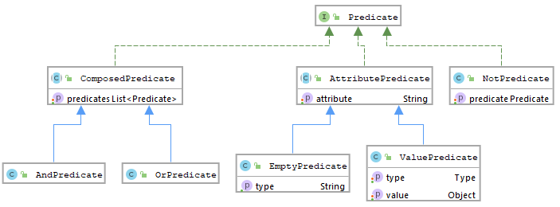

.. _ecos-predicate_main:

Язык предикатов
================

Предназначение: язык, с которым легко работать как на frontend так и на backend (модифицировать, анализировать и пр.).

Абстрактное определение предиката - это  некоторая функция, которая на вход получает элемент множества и возвращает ``True/False``.

В библиотеке ecos-records добавлена реализация данной концепции.

Есть два агрегатных состояния предиката - JSON или JAVA классы. Для конвертации между этими двумя состояниями есть сервис PredicateService и методы ``writeJson/readJson``.
Java представление - это просто модель. 
Обработка модели - отдельная задача, которая лежит на источниках данных или на преобразователях запросов
(например: для запросов в alfresco предикаты трансформируются в fts-alfresco запрос в классе PredicateToFtsAlfrescoConverter).

JAVA представление
------------------

- Predicate - базовый маркерный интерфейс без методов
- AttributePredicate - предикат связанный с некоторым аттрибутом
- EmptyPredicate - предикат "Значение аттрибута пустое"
- ValuePredicate - предикат "Значение аттрибута равно/содержит/одно из/больше/меньше/похоже/больше  или равно/меньше или равно
- Тип сравнения определяется полем type. Значение для сравнения в поле value
- NotPredicate - предикат "НЕ какой_то_другой_предикат"
- ComposedPredicate - предикат, который объединяет другие предикаты
- AndPredicate - предикат И
- OrPredicate - предикат ИЛИ
- VoidPredicate - пустой предикат, который получается если t (тип) не задан. Как правило означает, что при фильтрации/поиске никаких проверок не нужно (берем все записи).

JSON представление
------------------

Пример::

 {
    "t": "and",
    "val": [
        {
            "t": "or",
            "val": [
                {
                    "att": "country",
                    "t": "contains",
                    "val": "milan"
                },
                {
                    "att": "state",
                    "t": "contains",
                    "val": "milan"
                },
                {
                    "att": "name",
                    "t": "contains",
                    "val": "milan"
                }
            ]
        }
    ]
 }

В поле "t" записывается тип предиката, в "att" название аттрибута (если тип предиката его требует) и в "val" значение (опять же имеет смысл не для всех предикатов).

Для конвертации java предикатов в json и обратно::

 String predicateStr = Json.getMapper().toString(predicate);
 Predicate predicate = Json.getMapper().read(predicateStr, Predicate.class);

Для чтения предикатов из запроса RecordsQuery::

 Predicate predicate = recordsQuery.getQuery(Predicate.class);

Типы предикатов
---------------

.. list-table:: Типы предикатов
  :widths: 10 40 10
  :header-rows: 1
  :class: tight-table  

  * - Предикат
    - Описание
    - FTS
  * - **starts**
    - | Строка начинается с val.
      | Пример: {t: «starts», att:«cm:title», val: «startsWIth»}"
    - ``@cm:title:«startsWith``
  * - **ends**
    - | Строка заканчивается с val.
      | Пример: {t: «ends», att:«cm:title», val: «endsWIth»}
    - ``@cm:title:«*endsWith``
  * - **or**
    - | Объединение массива предикатов в val по ИЛИ.
      | Пример: {t: «or», val: [{t: «starts», att:«cm:title», val: «startsWIth»}, {t: «ends», att:«cm:title», val: «endsWIth»}]}"
    - 
  * - **and**
    - | Объединение массива предикатов в val по И.
      | Пример: {t: «and», val: [{t: «starts», att:«cm:title», val: «startsWIth»}, {t: «ends», att:«cm:title», val: «endsWIth»}]}"
    - 
  * - **empty**
    - | Поле в att пустое.
      | Пример: {t: «empty», att: «cm:title»}
    - 
  * - **not**
    - | Отрицание предиката в val.
      | Пример: {t: «not», val:{t: «empty», att: «cm:title»}}. 
      | Этот предикат можно автоматически добавлять к  другим добавляя префикс «not-». 
      | Пример: {t: «not-eq», att:«cm:title», val: «startsWIth»}"
    - 
  * - **eq**
    - | Значение поля att точно равно val.
      | Пример: {t: «eq», att:«cm:title», val: «SomeValue»}"
    - 
  * - **gt**
    - | Значение поля att больше val
    - 
  * - **ge**
    - | ЗЗначение поля att больше или равно val
    - 
  * - **lt**
    - | Значение поля att меньше val
    - 
  * - **le**
    - | Значение поля att меньше или равно val
    - 
  * - **like**
    - | Значение att подходит под паттерн val. 
      | В паттерне используется % как заменитель любого кол-ва символов (как в SELECT запросе БД)
    - 
  * - **in**
    - | Значение att подходит под паттерн val. 
    - 
  * - **contains**
    - | Значение att содержит подстроку val (работает и для ассоциаций)
    - 

Дополнительные возможности предикатов
--------------------------------------

.. list-table:: Доп. возможности предикатов
 :widths: 20 70
 :header-rows: 1
 :class: tight-table  

 * - Фича
   - Описание
 * - Промежутки и продолжительность
   - | Для атрибутов типа date и datetime добавлена возможность вычислять продолжительность и промежутки
     | При указании промежутка первой границей он вычисляется от текущей даты-времени
     | При указании промежутка второй границей он вычисляется от первой границы
     | Поиск идёт включительно границ т.е. [DurationOrDateTime1, DurationOrDateTime2]
     | Добавлены две константы $NOW - текущая дата время, $TODAY текущая дата
     | Примеры: 
     | -{t: "ge", att:"cm:created", val: "-P10D"} - Найти документы которые были созданы в течении 10 суток
     | -{t: "eq", att:"cm:created", val: "-P2Y/P1Y"} - Ищем документы у которых от $NOW - два года, до ($NOW - два года) - плюс год
     | -{t: "eq", att:"cm:created", val: "-P2Y/$NOW"} - Найти документы которые были созданы в течении 2-х лет, до текущей даты-времени
     | -{t: "eq", att:"cm:created", val: "-P2Y/$TODAY"} - Найти документы которые были созданы в течении 2-х лет, до сегодняшнего дня
     | -{t: "eq", att:"cm:created", val: "2020-01-01T00:00:00Z/2020-02-01T00:00:00Z"} - от 2020-01-01 до 2020-02-01
     | -{t: "eq", att:"cm:created", val: "2020-01-01T00:00:00Z/P1M"} - от 2020-01-01 до 2020-01-01 плюс 1 месяц
     | -{t: "eq", att:"cm:created", val: "-P10D/2020-01-01T00:00:00Z"} - от минус 10 дней до 2020-01-01
     | -{t: "eq", att:"cm:created", val: "$TODAY"}