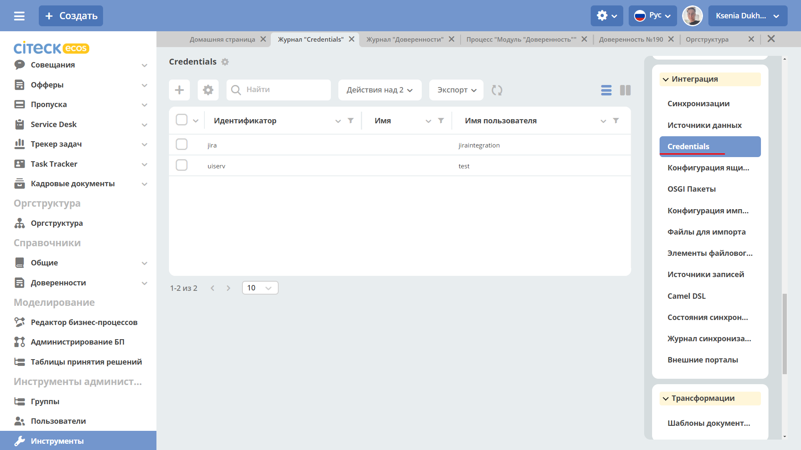
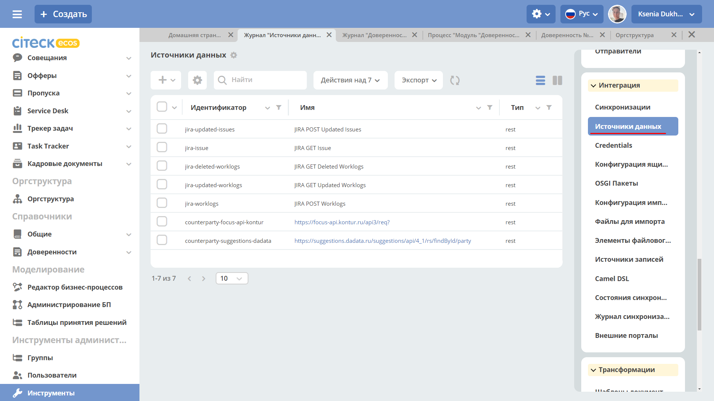

Использование Camel DSL
=======================

Общие сведения
----------------------------------

**Apache Camel** — открытый кроссплатформенный java-фреймворк, который позволяет проводить интеграцию приложений в простой и понятной форме.

Camel использует доменные языки (Domain Specific Language - DSL) для описания проектных шаблонов интеграции или маршрутов. 

В ECOS используется Yaml DSL для описания маршрутов в формате YAML и XML DSL.

**Camel-контекст** – главная сущность Camel. Контекст является контейнером среды выполнения Camel. Контекст предоставляет много полезных сервисов, наиболее значимыми являются маршруты, компоненты, языки, конверторы типов, реестр, endpointы и форматы данных.

**Маршрут** – определение `интеграционного потока <https://camel.apache.org/manual/routes.html>`_ 
Например, для объединения двух систем маршрут определяет как именно эти системы взаимодействуют.

**Компоненты**  - подробно описано по `ссылке <https://camel.apache.org/components/3.16.x/index.html>`_

* **Bean** – для вызова методов Java-бинов, хранящихся в реестре;
* **Direct** – вызывает другой endpoint из того же контекста синхронно;
* **Direct VM** - вызывает другой endpoint из любого контекста на той же JVM синхронно;
* **File** – читает и записывает файлы;
* **Timer** – генерирует сообщения с определенным интервалом, используя java.util.Timer;
* **JDBC** – предоставляет доступ к базам данных через JDBC;
* **Jetty** – предоставляет endpoint на основе HTTP для получения и отправки HTTP запросов.

Пример контекста с маршрутом:

.. note::
    Атрибут = свойство = поле

    Целевая БД = БД назначения = целевой источник данных – куда данные помещаются

    Исходная БД = исходный источник данных – откуда данные берутся

Выборка из БД
----------------------------------

Для выборки данных из БД необходимо:

1.	Создать **“Credentials”** для подключения:

**Главное меню: Инструменты администратора -> Инструменты**

.. image:: _static/camel/Camel_2.png
       :width: 800
       :align: center

**Неосновное меню: Интеграция  -> Credentials**

2.	Создать **“Источник данных”** DB Data Source, в результате источник будет с типом db.

**Главное меню: Инструменты администратора -> Инструменты**

**Неосновное меню: Интеграция  -> Источники данных**

.. image:: _static/camel/Camel_5.png
       :width: 600
       :align: center   

3.	Создать **“Camel DSL”** 

**Главное меню: Инструменты администратора -> Инструменты**

**Неосновное меню: Интеграция  -> Camel DSL**

.. image:: _static/camel/Camel_6.png
       :width: 800
       :align: center
 
Контекст Camel DSL должен содержать маршрут выборки из БД. Например:

.. code-block::

	- route:
	   from: "timer:start?delay=-1&repeatCount=1"
	   steps:
		 - set-body:
			 constant: "select * from actions"
		 - to: "jdbc:datasource"
		 - split:
			 simple: "${body}"
			 steps:
			   - to: "stream:out"

  
где

* **datasource** – имя источника данных, созданного в п.2 при его использовании в маршруте нужно добавлять префикс **«jdbc:»**;

* **actions** – имя таблицы БД, из которой делается выборка;

* **timer** – таймер, который запускает маршрут **delay=-1** - немедленно при старте контекста и только один раз **repeatCount=1**;

* **блок split** разделяет результат выборки на строки, которые выводятся в трассу **stream:out**

4.	Для выполнения содержимого контекста нужно изменить состояние Camel DSL на **Started**

Подключение RecordsDaoEndpoint
----------------------------------

Для записи данных в RecordsDao в содержании контекста Camel DSL нужно описать ``RecordsDaoEndpoint``. Для этого до маршрутов описывается секция **beans**. Например: 

.. code-block::

	- beans:
	   - name: "recordsDaoEndpoint"
		 type: ru.citeck.ecos.integrations.domain.cameldsl.service.RecordsDaoEndpoint
		 properties:
		   sourceId: testDao
		   pkProp: id
		   columnMap:
			 name: content
			 state: currentState
			 type: type
		   valueConvertMap: |
			 {"type": {"*": "YAML"}, "state": {"1":"STARTED", "*": "STOPPED"}}
	- route:
	   from: "timer:start?delay=-1&repeatCount=1"
	   steps:
		 - set-body:
			 constant: "select * from actions"
		 - to: "jdbc:datasource"
		 - split:
			 simple: "${body}"
			 steps:
			   - to: "bean:recordsDaoEndpoint"           

Где 

* **recordsDaoEndpoint** – имя ``RecordsDaoEndpoint``, при его использовании в маршруте нужно добавлять префикс **«bean:»**;
* **type** – класс бина, всегда указывается **ru.citeck.ecos.integrations.domain.cameldsl.service.RecordsDaoEndpoint**
* в секции **properties** описываются настройки ``RecordsDaoEndpoint``:
* **appName** - целевой идентификатор приложения, например alfresco:
	* **sourceId** - целевой идентификатор источника данных, куда будут помещаться данные. Обязательное свойство;
	* **pkProp** – атрибут исходного источника, который является первичным ключом;
	* **columnMap** – соответствие атрибутов исходного источника и атрибутов назначения. В приведенном примере значение атрибута **name** из источника будет перекладываться в атрибут **content** назначения, **state** в **currentState**, **type** в **type**. Общий вид карты:

    .. code-block:: text

        sourcePropName1: targetPropName1
        sourcePropName2: targetPropName2
        …
        sourcePropNameN: targetPropNameN
        чтоБерем: кудаКладем

    * **valueConvertMap** – карта преобразований исходных значений перед записью их в БД назначения. Карта пишется в формате JSON, символ **'*'** означает любое значение атрибута. В приведенном примере перед записью в атрибут **currentState** значение поля **state** будет заменено на **STARTED**, если оно равно **1**, и на **STOPPED** во всех других случаях. Таким образом, атрибут **currentState** в результирующей таблице будет содержать только два значения: **STARTED** или **STOPPED**. Общий вид карты:
    
    .. code-block:: text

        {“sourcePropName1”: 
        {“value1”:”resultValue1”,
            “value2”:”resultValue2”,
            … 
            “valueN”:”resultValueN”},
        “sourcePropName2”: 
        {“value21”:”resultValue21”,
            “value22”:”resultValue22”,
            … 
            “value2N”:”resultValue2N”},
        …
        “sourcePropNameM”: 
        {“valueM1”:”resultValueM1”,
            “valueM2”:”resultValueM2”,
            … 
            “valueMN”:”resultValueMN”}}

    Так как **valueConvertMap** многострочное свойство, то перед значением необходимо указать символ **«|»**.

В одном контексте может быть описано несколько ``RecordsDaoEndpoint``.

.. code-block::

    	- beans:
	   - name: "recordsTestDaoEndpoint"
		 type: ru.citeck.ecos.integrations.domain.cameldsl.service.RecordsDaoEndpoint
		 properties:
		   sourceId: recordsTestDao
		   pkProp: id
	   - name: "testDaoEndpoint"
		 type: ru.citeck.ecos.integrations.domain.cameldsl.service.RecordsDaoEndpoint
		 properties:
		   sourceId: testDao
		   pkProp: id
		   columnMap:
			 name: content
			 state: currentState
			 type: type
		   valueConvertMap: |
			 {"type": {"*": "YAML"}}
	 - name: "…"
	   …

``RecordsDaoEndpoint`` также может обрабатывать данные полученные из XML-файла, CSV-файла или текстового файла, содержащего строковые представления **Map**.

Пример контекста, содержащего маршруты для обработки ``RecordsDaoEndpoint`` данных из файлов:

.. code-block::

    	- beans:
		- name: "recordsDaoEndpoint"
		  type: ru.citeck.ecos.integrations.domain.cameldsl.service.RecordsDaoEndpoint
		  properties:
			sourceId: testDao
			pkProp: id
			columnMap:
			  name: content
			  state: currentState
			delimiter: ","
	- route:
		id: "fromXmlFileToDb"
		from: "direct:fromXmlFileToDb"
		steps:
		  - split:
			  xpath: "//someObject"
			  steps:
				- to: "bean:recordsDaoEndpoint"
	- route:
		id: "fromTxtFileToDb"
		from: "direct:fromTxtFileToDb"
		steps:
		  - split:
			  tokenize: "\n"
			  steps:
				- to: "bean:recordsDaoEndpoint"

Маршрут **fromXmlFileToDb** делит входной XML-поток из файла на элементы **someObject** и передает их в ``RecordsDaoEndpoint``.

Пример входного XML-файла:

.. code-block::

    	<?xml version="1.0" encoding="UTF-8"?>
	<massages>
		<someObject id="50" usage ="Additional">
			<name>Test route name James</name>
			<purpose>Test endpoint</purpose>        
		</someObject>
		<someObject id="210" usage ="Standard">
			<name>Route 61</name>
			<purpose>Test</purpose>
			<city>Moscow</city>
		</someObject>
	</massages>

В приведенном примере для установки значений доступны атрибуты записи **id**, **usage**, **name** и **purpose**.

Маршрут **fromTxtFileToDb** делит входной текстовый поток из файла на строки. Пример CSV-файла:

.. code-block::

    id,name,value
	10,SomeName,
	908,- route:,additional
	77,,

Пример файла со строковыми представлениями Map:

.. code-block::

    id=15, name=Test
	id=64, name=Route, value=null
	id=48, name=Open route, value=null

Для работы со строковыми данными используются настройки ``RecordsDaoEndpoint`` **delimiter** и **keyValueSeparator**. 
* **delimiter** – определяет строку-разделитель значений в строке для CSV-файла и пар ключ-значение для строкового представления Map, по умолчанию значение **«,»**
* **keyValueSeparator** – определяет строку-разделитель ключа и значения в строковом представлении Map, по умолчанию значение **«=»**

Удаление данных из БД
----------------------------------

Для удаления данных из БД необходимо создать **Credentials**, **Источник данных** и **Camel DSL** как указано в пункте **«Выборка из БД»**. При этом, содержимое маршрута должно включать в себя SQL-запрос на удаление данных. 

Например, следующий маршрут **clearValues** удаляет все записи из таблицы **simple** источника данных **datasource**, кроме тех у которых атрибут **id** равен **'1'** или **'2'**.

.. code-block::

    	- route:
		id: "clearValues"
		from: "timer:start?delay=-1&repeatCount=1"
		steps:
		  - set-body:
			  constant: "delete from simple where id not in ('1','2')"
		  - to: "jdbc:datasource"

Пример контекста, который берет данные из источника данных **todb**, обрабатывает их через R`RecordsDaoEndpoint`` **daoEndpoint**  и очищает таблицу **simple**, из которой взял данные:

.. code-block::

    	- beans:
		- name: "daoEndpoint"
		  type: ru.citeck.ecos.integrations.domain.cameldsl.service.RecordsDaoEndpoint
		  properties:
			sourceId: testDao
			pkProp: id
			columnMap:
			  name: content
			  state: currentState
			  type: type
	- route:
		id: "getValues"
		from: "timer:start?delay=-1&repeatCount=1"
		steps:
		  - set-body:
			  constant: "select * from simple"
		  - to: "jdbc:todb"
		  - split:
			  simple: "${body}"
			  steps:
				- to: "bean:daoEndpoint"
				- to: "direct:clearValues"
	- route:
		id: "clearValues"
		from: "direct:clearValues"
		steps:
		  - set-body:
			  constant: "delete from simple"
		  - to: "jdbc:todb"    

.. note::
    Особенности контекста: 
    Содержимое constant переводится в нижний регистр. Например, выборка **"select * from simple order by COMPANY_ID"** приводит к ошибке **ERROR: column "company_id" does not exist**
