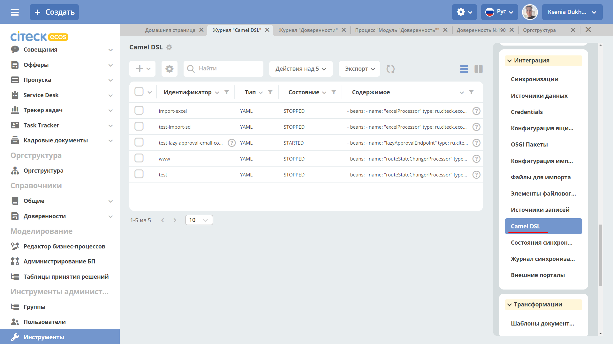

Использование Camel DSL
=======================

.. contents::
     :depth: 2

**ECOS Camel** - это надстройка над Apache Camel, которая адаптирована для работы с платформой Citeck ECOS.

Общие сведения
---------------

**Apache Camel** — открытый кроссплатформенный java-фреймворк, который позволяет проводить интеграцию приложений в простой и понятной форме.

Camel использует доменные языки (Domain Specific Language - DSL) для описания проектных шаблонов интеграции или маршрутов. 

В ECOS используется Yaml DSL для описания маршрутов в формате **YAML** и **XML DSL**.

**Camel-контекст** – главная сущность Camel. Контекст является контейнером среды выполнения Camel. Контекст предоставляет много полезных сервисов, наиболее значимыми являются маршруты, компоненты, языки, конверторы типов, реестр, endpointы и форматы данных.

**Маршрут** – определение `интеграционного потока <https://camel.apache.org/manual/routes.html>`_ 
Например, для объединения двух систем маршрут определяет как именно эти системы взаимодействуют.

**Компоненты**  - подробно описано по `ссылке <https://camel.apache.org/components/4.0.x/>`_

  * **Bean** – для вызова методов Java-бинов, хранящихся в реестре;
  * **Direct** – вызывает другой endpoint из того же контекста синхронно;
  * **Direct VM** - вызывает другой endpoint из любого контекста на той же JVM синхронно;
  * **File** – читает и записывает файлы;
  * **Timer** – генерирует сообщения с определенным интервалом, используя java.util.Timer;
  * **JDBC** – предоставляет доступ к базам данных через JDBC;
  * **Jetty** – предоставляет endpoint на основе HTTP для получения и отправки HTTP запросов.

Пример контекста с маршрутом:

.. image:: _static/camel/Camel_1.png
       :width: 600
       :align: center    

.. note::
    Атрибут = свойство = поле

    Целевая БД = БД назначения = целевой источник данных – куда данные помещаются

    Исходная БД = исходный источник данных – откуда данные берутся

Выборка из БД
----------------------------------

Для выборки данных из БД необходимо:

1.  Создать **«Credentials»** для подключения:

**Главное меню: Инструменты администратора -> Инструменты**

**Неосновное меню: Интеграция  -> Credentials**

.. image:: _static/camel/Camel_3.png
       :width: 800
       :align: center

2.  Создать **«Источник данных»** DB Data Source, в результате источник будет с типом db.

**Главное меню: Инструменты администратора -> Инструменты**

**Неосновное меню: Интеграция  -> Источники данных**

.. image:: _static/camel/Camel_4.png
       :width: 800
       :align: center

1.  Создать **«Camel DSL»** 

**Главное меню: Инструменты администратора -> Инструменты**

**Неосновное меню: Интеграция  -> Camel DSL**

 
Контекст Camel DSL должен содержать маршрут выборки из БД. Например:

.. code-block:: yaml

    - route:
        from:
          uri: "timer:start?delay=-1&repeatCount=1"
          steps:
            - setBody:
                constant: "select * from actions"
            - to: "jdbc:datasource"
            - split:
                simple: "${body}"
                steps:
                  - to: "stream:out"

  
где

    * **datasource** – имя источника данных, созданного в п.2 при его использовании в маршруте нужно добавлять префикс **«jdbc:»**;
    * **actions** – имя таблицы БД, из которой делается выборка;
    * **timer** – таймер, который запускает маршрут **delay=-1** - немедленно при старте контекста и только один раз **repeatCount=1**;
    * **блок split** разделяет результат выборки на строки, которые выводятся в трассу **stream:out**

4.  Для выполнения содержимого контекста нужно изменить состояние Camel DSL на **Started**

Подключение RecordsDaoEndpoint
----------------------------------

Для записи данных в RecordsDao в содержании контекста Camel DSL нужно описать ``RecordsDaoEndpoint``. Для этого до маршрутов описывается секция **beans**. Например: 

.. code-block:: yaml

    - beans:
        - name: "recordsDaoEndpoint"
          type: ru.citeck.ecos.integrations.domain.cameldsl.service.RecordsDaoEndpoint
          properties:
            sourceId: testDao
            pkProp: id
            columnMap:
            name: content
            state: currentState
            type: type
            valueConvertMap: |
              {"type": {"*": "YAML"}, "state": {"1":"STARTED", "*": "STOPPED"}}
    - route:
        from:
          uri: "timer:start?delay=-1&repeatCount=1"
          steps:
            - setBody:
                constant: "select * from actions"
            - to: "jdbc:datasource"
            - split:
                simple: "${body}"
                steps:
                  - to: "bean:recordsDaoEndpoint"       

Где 

    * **recordsDaoEndpoint** – имя ``RecordsDaoEndpoint``, при его использовании в маршруте нужно добавлять префикс **«bean:»**;
    * **type** – класс бина, всегда указывается **ru.citeck.ecos.integrations.domain.cameldsl.service.RecordsDaoEndpoint**
    * в секции **properties** описываются настройки ``RecordsDaoEndpoint``:
    * **appName** - целевой идентификатор приложения, например alfresco:
    * **sourceId** - целевой идентификатор источника данных, куда будут помещаться данные. Обязательное свойство;
    * **pkProp** – атрибут исходного источника, который является первичным ключом;
    * **columnMap** – соответствие атрибутов исходного источника и атрибутов назначения. В приведенном примере значение атрибута **name** из источника будет перекладываться в атрибут **content** назначения, **state** в **currentState**, **type** в **type**. Общий вид карты:

  .. code-block:: text

      sourcePropName1: targetPropName1
      sourcePropName2: targetPropName2
      …
      sourcePropNameN: targetPropNameN
      чтоБерем: кудаКладем

* **valueConvertMap** – карта преобразований исходных значений перед записью их в БД назначения. Карта пишется в формате JSON, символ **'*'** означает любое значение атрибута. В приведенном примере перед записью в атрибут **currentState** значение поля **state** будет заменено на **STARTED**, если оно равно **1**, и на **STOPPED** во всех других случаях. Таким образом, атрибут **currentState** в результирующей таблице будет содержать только два значения: **STARTED** или **STOPPED**. Общий вид карты:
    
  .. code-block:: text

      {“sourcePropName1”: 
      {“value1”:”resultValue1”,
          “value2”:”resultValue2”,
          … 
          “valueN”:”resultValueN”},
      “sourcePropName2”: 
      {“value21”:”resultValue21”,
          “value22”:”resultValue22”,
          … 
          “value2N”:”resultValue2N”},
      …
      “sourcePropNameM”: 
      {“valueM1”:”resultValueM1”,
          “valueM2”:”resultValueM2”,
          … 
          “valueMN”:”resultValueMN”}}

Так как **valueConvertMap** многострочное свойство, то перед значением необходимо указать символ **«|»**.

В одном контексте может быть описано несколько ``RecordsDaoEndpoint``.

.. code-block:: yaml

   - beans:
     - name: "recordsTestDaoEndpoint"
       type: ru.citeck.ecos.integrations.domain.cameldsl.service.RecordsDaoEndpoint
       properties:
         sourceId: recordsTestDao
         pkProp: id
     - name: "testDaoEndpoint"
       type: ru.citeck.ecos.integrations.domain.cameldsl.service.RecordsDaoEndpoint
       properties:
         sourceId: testDao
         pkProp: id
         columnMap:
         name: content
         state: currentState
         type: type
         valueConvertMap: |
           {"type": {"*": "YAML"}}
     - name: "…"
       …

``RecordsDaoEndpoint`` также может обрабатывать данные полученные из XML-файла, CSV-файла или текстового файла, содержащего строковые представления **Map**.

Пример контекста, содержащего маршруты для обработки ``RecordsDaoEndpoint`` данных из файлов:

.. code-block:: yaml

  - beans:
      - name: "recordsDaoEndpoint"
        type: ru.citeck.ecos.integrations.domain.cameldsl.service.RecordsDaoEndpoint
        properties:
          sourceId: testDao
          pkProp: id
          columnMap:
            name: content
            state: currentState
          delimiter: ","
  - route:
      id: "fromXmlFileToDb"
      from:
        uri: "direct:fromXmlFileToDb"
        steps:
          - split:
              xpath: "//someObject"
              steps:
                - to: "bean:recordsDaoEndpoint"
  - route:
      id: "fromTxtFileToDb"
      from:
        uri: "direct:fromTxtFileToDb"
        steps:
          - split:
              tokenize: "\n"
              steps:
                - to: "bean:recordsDaoEndpoint"

Маршрут **fromXmlFileToDb** делит входной XML-поток из файла на элементы **someObject** и передает их в ``RecordsDaoEndpoint``.

Пример входного XML-файла:

.. code-block:: xml

 <?xml version="1.0" encoding="UTF-8"?>
  <massages>
    <someObject id="50" usage ="Additional">
      <name>Test route name James</name>
      <purpose>Test endpoint</purpose>        
    </someObject>
    <someObject id="210" usage ="Standard">
      <name>Route 61</name>
      <purpose>Test</purpose>
      <city>Moscow</city>
    </someObject>
  </massages>

В приведенном примере для установки значений доступны атрибуты записи **id**, **usage**, **name** и **purpose**.

Маршрут **fromTxtFileToDb** делит входной текстовый поток из файла на строки. Пример CSV-файла:

.. code-block::

  id,name,value
  10,SomeName,
  908,- route:,additional
  77,,

Пример файла со строковыми представлениями Map:

.. code-block::

  id=15, name=Test
  id=64, name=Route, value=null
  id=48, name=Open route, value=null

Для работы со строковыми данными используются настройки ``RecordsDaoEndpoint`` **delimiter** и **keyValueSeparator**. 

  * **delimiter** – определяет строку-разделитель значений в строке для CSV-файла и пар ключ-значение для строкового представления Map, по умолчанию значение **«,»**
  * **keyValueSeparator** – определяет строку-разделитель ключа и значения в строковом представлении Map, по умолчанию значение **«=»**

Удаление данных из БД
----------------------------------

Для удаления данных из БД необходимо создать **Credentials**, **Источник данных** и **Camel DSL** как указано в пункте **«Выборка из БД»**. При этом, содержимое маршрута должно включать в себя SQL-запрос на удаление данных. 

Например, следующий маршрут **clearValues** удаляет все записи из таблицы **simple** источника данных **datasource**, кроме тех у которых атрибут **id** равен **'1'** или **'2'**.

.. code-block:: yaml

  - route:
      id: "clearValues"
      from:
        uri: "timer:start?delay=-1&repeatCount=1"
        steps:
          - setBody:
              constant: "delete from simple where id not in ('1','2')"
          - to: "jdbc:datasource"

Пример контекста, который берет данные из источника данных **todb**, обрабатывает их через R`RecordsDaoEndpoint`` **daoEndpoint**  и очищает таблицу **simple**, из которой взял данные:

.. code-block:: yaml

  - beans:
      - name: "daoEndpoint"
        type: ru.citeck.ecos.integrations.domain.cameldsl.service.RecordsDaoEndpoint
        properties:
          sourceId: testDao
          pkProp: id
          columnMap:
            name: content
            state: currentState
            type: type
  - route:
      id: "getValues"
      from:
        uri: "timer:start?delay=-1&repeatCount=1"
        steps:
          - setBody:
              constant: "select * from simple"
          - to: "jdbc:todb"
          - split:
              simple: "${body}"
              steps:
                - to: "bean:daoEndpoint"
                - to: "direct:clearValues"
  - route:
    id: "clearValues"
    from:
      uri: "direct:clearValues"
      steps:
        - setBody:
            constant: "delete from simple"
        - to: "jdbc:todb" 

.. note::
    Особенности контекста: 
    Содержимое constant переводится в нижний регистр. Например, выборка **"select * from simple order by COMPANY_ID"** приводит к ошибке **ERROR: column "company_id" does not exist**

Получение сообщений из RabbitMQ и отправка события ECOS
---------------------------------------------------------

Пример чтения из rabbitmq и отправка события ECOS:

1. Создаем новый секрет для подключения к RMQ
2. Создаем новый endpoint с id 'rabbitmq-endpoint' (можно любой id, но в camel конфиге мы на него ссылаемся) для подключения к RMQ и устанавливаем секрет из п.1 в него
3. Заходим в журнал Camel DSL и создаем новый контекст со следующим конфигом: 

.. code-block:: yaml
  
  - beans:
      - name: rabbitConnectionFactory
        type: org.springframework.amqp.rabbit.connection.CachingConnectionFactory
        properties:
          uri: '{{ecos-endpoint:rabbitmq-endpoint/url}}'
          username: '{{ecos-endpoint:rabbitmq-endpoint/credentials/username}}'
          password: '{{ecos-endpoint:rabbitmq-endpoint/credentials/password}}'
  - route:
      from:
        uri: spring-rabbitmq:default # default здесь -это дефолтный exchange в RMQ. Обычно он обозначается пустой строкой, но в camel endpoint'е вместо этого пишется "default"
        parameters:
          connectionFactory: '#bean:rabbitConnectionFactory'
          queues: test-queue
        steps:
          - removeHeaders: # если в дальнейшем предполагается переотправка сообщения в RMQ, то лучше удалить заголовки, которые относятся к RMQ. Здесь этот этап просто для примера.
              pattern: "CamelRabbitmq*" #"CamelRabbitmqRoutingKey"
          - to: log:rmq-test # вывод в лог. Можно убрать
          - to: ecos-event:test-event-type # отправка события с типом "test-event-type". В теле отправляется DataValue.of(exchange.message.body)

Подписка на событие ECOS
------------------------

.. code-block:: yaml
  
  - route:
      from:
        uri: 'ecos-event:record-created' # подписываемся на событие "Запись создана"
        parameters:
          attributes:
            recordId: 'record?id' # указываем какие атрибуты нам нужны из события
          filter: # устанавливаем фильтр 
            t: not-eq 
            a: conditionField
            v: true
        steps:
          - to: log:record-was-created

Чтение из RabbitMQ -> роутинг по jsonPath -> переотправка в Ecos Event + Dead Letter Queue
------------------------------------------------------------------------------------------

.. code-block:: yaml

   - beans:
       - name: myRabbitConnectionFactory
         type: org.springframework.amqp.rabbit.connection.CachingConnectionFactory
         properties:
           uri: '{{ecos-endpoint:my-rabbitmq-endpoint/url}}'
           username: '{{ecos-endpoint:my-rabbitmq-endpoint/credentials/username}}'
           password: '{{ecos-endpoint:my-rabbitmq-endpoint/credentials/password}}'
   - route:
       from:
         uri: "spring-rabbitmq:income-test-data"
         parameters:
           connectionFactory: '#bean:myRabbitConnectionFactory'
           queues: test-data-queue
           autoDeclare: true
           deadLetterExchange: income-test-data
           deadLetterQueue: test-data-queue-dlq
           deadLetterRoutingKey: deadLetterTestData
           retryDelay: 5000
           arg.queue.durable: true
           arg.queue.autoDelete: false
         steps:
           - to:
               uri: "log:income?level=INFO&showAll=true"
           - choice:
               when:
                 - jsonpath:
                     expression: "$.[?(@.operation == 'CREATE')]"
                   steps:
                     - to: "ecos-event:test-data-create"
                 - jsonpath:
                     expression: "$.[?(@.operation == 'UPDATE')]"
                   steps:
                     - to: "ecos-event:test-data-update"
               otherwise:
                 steps:
                   - throwException:
                       exceptionType: "java.lang.IllegalArgumentException"
                       message: "Unsupported operation. Only CREATE and UPDATE are supported."

Компоненты
-------------

**Компоненты** используются для подключения маршрутов к внешним системам и сервисам.

Подробнее - https://camel.apache.org/manual/component.html 

EcosRecordsSync camel component
~~~~~~~~~~~~~~~~~~~~~~~~~~~~~~~~~~~~

**EcosRecordsSyncComponent** - компонент camel, созданный для перебора/обновления записей через RecordsAPI. Ключ для использования компонента в camel-контексте: *ecos-records-sync*

Компонент включает в себя как потребителя *EcosRecordsSyncConsumer*, так и производителя EcosRecordsSyncProducer по терминологии camel

Ниже будут примеры регистрации компонента в yaml формате, например, при регистрации через Camel DSL.

1. **EcosRecordsSyncConsumer**. Расширяет стандартный ScheduledBatchPollingConsumer, реализует перебор записей по ecos типу + sourceId. Возможные настройки для  *ecos-records-sync* консьюмера: 

.. list-table::
      :widths: 5 20
      :header-rows: 1
      :class: tight-table  

      * - Key
        - Value
      * - syncId
        - | уникальное значение в рамках инстанса приложения, на котором запускаются camel контексты. На основе этого значения создается стейт для периодического пуллинга из sourceId 
          | см: journalId=ecos-sync-state
      * - syncMode
        - | DEFAULT | CREATE | UPDATE
          | DEFAULT, UPDATE - перебор записей по дате обновления
          | CREATE - перебор записей по дате создания 
      * - sourceId
        - sourceId типа
      * - typeRef
        - ecos тип
      * - batchSize
        - размер батча при пуллинге 

Пример использования:  

.. code-block::

   - route:
       from:
         uri: ecos-records-sync:testEcosRecordsSync
         parameters:
           delay: 15000
           sourceId: emodel/test-type-mig-from
           typeRef: emodel/type@test-type-mig-from
           batchSize: 5
         steps:
         - to: log:ers-test

2. **EcosRecordsSyncProducer** Расширяет DefaultProducer, реализует обновление записи через RecordsAPI. Данные для обновления берется из тела сообщения (id из тела из проперти сообщения - CamelEcosRecordsSyncEntityRef). Возможные настройки для  *ecos-records-sync* продюсера: 

.. list-table::
      :widths: 10 20
      :header-rows: 1
      :class: tight-table  

      * - Key
        - Value
      * - syncId
        - любое значение, скорее информационное
      * - sourceId
        - sourceId типа

Пример использования:  

.. code-block::

   - route:
       from:
         uri: .....
         steps:
         - to:
             uri: ecos-records-sync:test-type-mig-to
             parameters:
               sourceId: emodel/test-type-mig-to

Конечные точки
----------------

**Конечные точки** используются для чтения или записи данных в определенном источнике.

Подробнее - https://camel.apache.org/manual/endpoint.html

FileFromCamelDslEndpoint
~~~~~~~~~~~~~~~~~~~~~~~~~~

Данный компонент позволяет работать с файлом, добавленным на форму конфигурации Camel Dsl:

Ключ для использования компонента в camel-контексте: *file-from-camel-dsl*

FileFromCamelDslConsumer вычитывает данные из файла в виде ByteArray и кладет их в exchange для дальнейшей обработки

Пример:

.. code-block::

   - route:
       from:
         uri: "file-from-camel-dsl:randomName"
         steps:
           - process:
               ref: csvToListOfDataProcessor
           - split:
               simple: "${body}"
               steps:
                 - to: ecos-records-mutate:?sourceId=emodel/camel-example-employee

EcosRecordsSyncConsumer
~~~~~~~~~~~~~~~~~~~~~~~~~~

Эндпоинт для последовательной выгрузки любого количества записей из указанного источника данных.

URI
"""""

**ecos-records-sync-consumer:syncName**

**ecos-records-sync-consumer** - константа

**syncName** - имя синхронизации. Может быть любым и используется для сохранения и доступа к состоянию. Т.е. если поменять syncName, то консьюмер будет работать "с нуля".

Выходные данные:
""""""""""""""""""""

Тип данных: **List<DataValue>**

Описание: Лист **DataValue** объектов с атрибутами, которые были загружены у записей. Глобальный идентификатор записи в атрибуты не попадает. Если он нужен, то следует его явно прописать в атрибутах:

.. code-block::

  attributes:
    ?id: ?id

Параметры
""""""""""""""""

.. list-table::
      :widths: 5 5 5 5 20
      :header-rows: 1
      :class: tight-table  

      * - Параметр
        - Тип
        - Значение по умолчанию
        - Обязательность
        - Описание
      * - sourceId
        - String?
        - null
        - Нет
        - | Идентификатор источника данных откуда мы будем загружать записи.
          | Можно не задавать если указан ecosType.
          | Примеры: *emodel/source0, emodel/source1*
      * - ecosType
        - String?
        - null
        - Нет
        - | Локальный идентификатор типа.
          | Если не укзан sourceId, то он берется из типа.
          | Примеры: *contract, attorney*
      * - predicate
        - Predicate?
        - Always True
        - Нет
        - | Критерии поиска записей.
          | Примеры: {"t": "eq", "a": "_type", "v": "emodel/type@case"}
      * - batchSize
        - Int
        - 100
        - Нет
        - Размер пачки одновременно обрабатываемых записей
      * - attributes
        - Map<String, String>
        - 
        - Да
        - Атрибуты для загрузки у записей
      * - addAuditAttributes
        - Boolean
        - true
        - Нет
        - Добавить атрибуты аудита (_created,_creator,_modified,_modifier) в список атрибутов для загрузки
      * - delay
        - Long
        - 500
        - Нет
        - Количество миллисекунд между обработкой пачек записей 
      * - greedy
        - Boolean
        - false
        - Нет
        - Если true и количество обработанных записей больше нуля, то не ждать delay перед следующей обработкой, а сразу вызвать следующий poll  
      * - initialDelay
        - Long
        - 1000
        - Нет
        - Задержка перед первой обработкой записей

.. note::

  Доп. параметры можно посмотреть в исходниках класса org.apache.camel.support.ScheduledPollEndpoint

Пример использования
"""""""""""""""""""""

.. code-block::

   - route:
       from:
         uri: ecos-records-sync-consumer:alf-legalEntity-mgr-from
         parameters:
           delay: 30000
           sourceId: alfresco/
           predicate:
             t: eq
             a: type
             v: idocs:legalEntity
           addAuditAttributes: true
           attributes:
             ?id: ?id
             id: ?localId
             title: cm:title
             name: cm:name
         steps:
           - to: log:ecos-records-sync

Принцип работы
""""""""""""""""

Раз в **{delay}** миллисекунд идет запрос в источник данных **{sourceId}** который или задан явно или загружается из **{ecosType}**. Из источника данных загружается пачка записей размером <= **{batchSize}**. Загруженная пачка отправляется в обработку на указанные в роуте шаги. 

Обновление стейта происходит только если пачка записей обработана успешно. В случае ошибки стейт остается старым и при следующем срабатывании загрузка продолжится с предыдущего стейта.

Индивидуальная обработка записей
"""""""""""""""""""""""""""""""""""

Если требуется индивидуальная обработка записей, то можно разделить элементы листа и обрабатывать каждый по отдельности:

.. code-block::

   - route:
       from:
         uri: ecos-records-sync-consumer:alf-routeStage-mgr-from
         parameters:
           initialDelay: 10000
           delay: 15000
           sourceId: alfresco/
           predicate:
             t: eq
             a: type
             v: idocs:routeStage
           batchSize: 30
           addAuditAttributes: true
           attributes:
             id: ?localId
             title: cm:title
             name: cm:name
         steps:
           - split:
               simple: "${body}"
               steps:
                 - to: log:result # в этих шагах каждый элемент будет обработан отдельно

Если требуется как-то индивидуально обработать записи и затем опять собрать их в одну пачку, то можно воспользоваться стратегией агрегации:

.. code-block::

   - beans:
       - name: customJsonPatch
         type: ru.citeck.ecos.camel.processor.data.JsonPatchOperationsProcessor
    
       - name: collectToListStrategy
         type: org.apache.camel.processor.aggregate.GroupedBodyAggregationStrategy
   - route:
       from:
         uri: ecos-records-sync-consumer:alf-routeStage-mgr-from
         parameters:
           initialDelay: 10000
           delay: 15000
           sourceId: alfresco/
           predicate:
             t: eq
             a: type
             v: idocs:routeStage
           batchSize: 30
           addAuditAttributes: true
           attributes:
             id: ?localId
             title: cm:title
             name: cm:name
         steps:
           - split:
               simple: "${body}"
               aggregationStrategy: collectToListStrategy # это ключевое отличие
               steps:
                 - setHeader:
                     name: JsonPatchOperations
                     constant:
                       - op: set
                         path: "_parentAtt"
                         value: templateRouteApprovingStages
                 - process:
                     ref: customJsonPatch
           - to: log:result # после split мы будем обрабатывать лист, который собрался после индивидуальной обработки записей

Стратегии
""""""""""""""""

Итерация выполняется несколькими стратегиями. При каждом срабатывании poll'а (обработка следующей пачки записей) выполняется запрос следующей пачки записей через одну из описанных ниже стратегий. Используется первый не пустой результат и дальнейший перебор стратегий не выполняется. Каждая стратегия имеет состояние, которое хранит данные для продолжения итерации с последнего обработанного места.

**1. По дате создания**

Перебор идет по атрибуту **_created** от начала эпохи (1970-01-01T00:00:00Z)

**Состояние:**

.. list-table::
      :widths: 5 5 5 20
      :header-rows: 1
      :class: tight-table  

      * - Свойство
        - Тип
        - По умолчанию
        - Описание
      * - totalCount
        - Long
        - -1
        - | Ожидаемое полное количество всех записей для синхронизации. 
          | Заполняется в начале и не обновляется в ходе итерации
      * - lastCreated 
        - Instant
        - Instant.EPOCH
        - Дата последней созданной ноды, которую мы обработали
      * - lastRef
        - EntityRef
        - EntityRef.EMPTY
        - Ссылка на последнюю обработанную запись
      * - skipCount
        - Int
        - 0
        - | Количество элементов, которые нужно пропустить при следующем запросе. 
          | Используется для обработки записей, у которых дата создания совпадает. 
      * - processedCount
        - Long
        - 0
        - Количество обработанных записей
      * - lastCreatedCounter
        - Int
        - 0
        - | Счетчик записей с одинаковой датой создания. 
          | Используется чтобы в результирующих данных скорректировать дату создания добавив к ней lastCreatedCounter микросекунд. 
          | Это нужно чтобы после загрузки этих данных в другую БД сохранился порядок при сортировке по полю _created.

**Особенности стратегии:**

Сохранение порядка - если в выгружаемых данных записи имеют одинаковую дату создания, то первая из них будет иметь оригинальную дату, а все последующие будут иметь дату создания на N микросекунд больше. Количество микросекунд увеличивается с каждой новой записью с одинаковой датой создания.

**2. По дате изменения**

Перебор идет по атрибуту **_modified** от даты начала синхронизации.

**Состояние:**

.. list-table::
      :widths: 5 5 5 20
      :header-rows: 1
      :class: tight-table  

      * - Свойство
        - Тип
        - По умолчанию
        - Описание
      * - lastModified
        - Instant
        - Дата начала синхронизации
        - Дата последней измененной записи, которую мы обработали
      * - lastRef
        - EntityRef
        - EntityRef.EMPTY
        - Ссылка на последнюю обработанную запись
      * - skipCount
        - Int
        - 0
        - | Количество элементов, которые нужно пропустить при следующем запросе. 
          | Используется для обработки записей, у которых дата изменения совпадает. 
      * - processedCount
        - Long
        - 0
        - Количество обработанных записей

**Особенности стратегии:**

Синхронизация проходит только для тех записей, которые были созданы до даты создания последней синхронизованной записи из первой стратегии.  

Процессоры
----------------

**Процессор** - это обработчик, который обрабатывает сообщение произвольным образом.

Подробнее - https://camel.apache.org/manual/processor.html

CsvToListOfDataProcessor
~~~~~~~~~~~~~~~~~~~~~~~~~

Данный процессор предназначен для чтения CSV-данных и преобразования их в список объектов *DataValue*:

.. image:: _static/camel/Proc_02.png
       :width: 700
       :align: center   

Первая строка файла - заголовки, последующие - данные, соответствующие заголовкам

Параметры:

.. list-table::
      :widths: 10 20
      :header-rows: 1
      :class: tight-table  

      * - Key
        - Value
      * - delimiter
        - Разделитель. По умолчанию запятая

Пример:

.. code-block::

   - beans:
       - name: "csvToListOfDataProcessor"
         type: ru.citeck.ecos.camel.processor.reader.CsvToListOfDataProcessor
         properties:
           delimiter: ";"
   - route:
       from:
         uri: "file-from-camel-dsl:randomName"
         steps:
           - process:
               ref: csvToListOfDataProcessor
           - split:
               simple: "${body}"
               steps:
                 - to: ecos-records-mutate:?sourceId=emodel/camel-example-employee

ExcelToListOfDataProcessor
~~~~~~~~~~~~~~~~~~~~~~~~~~~~

Данный процессор предназначен для чтения данных из формата Excel (XLSX) и преобразования их в список объектов *DataValue*:

Параметры:

.. list-table::
      :widths: 10 20
      :header-rows: 1
      :class: tight-table  

      * - Key
        - Value
      * - sheetName
        - Название листа Excel. По умолчанию используется первый лист
      * - tableStartCellReference
        - Ссылка на начальную ячейку таблицы (откуда начинается срока с заголовками).  По умолчанию "A1"
      * - customAttNames
        - Ассоциативный массив пользовательских имен атрибутов, где ключ - это буква столбца (например, "A"), а значение - желаемое имя атрибута.

Пример:

.. code-block::

   - beans:
       - name: "excelProcessor"
         type: ru.citeck.ecos.camel.processor.reader.ExcelToListOfDataProcessor
         properties:
           sheetName: SomeRandomSheetName
           tableStartCellReference: C11
           customAttNames:
             B: employeeSalary
             F: employeeManager
   - route:
       from:
         uri: "file-from-camel-dsl:randomName"
         steps:
           - process:
               ref: excelProcessor
           - split:
               simple: "${body}"
               steps:
                 - to: "ecos-records-mutate:?sourceId=emodel/camel-example-employee"

AssocRefByAttributeProcessor
~~~~~~~~~~~~~~~~~~~~~~~~~~~~~~

Данный процессор принимает объект *DataValue* и на основании переданных заголовков (обязательных) находит EntityRef необходимой ассоциации и проставляет это значение в *DataValue*:

Параметры заголовков ("setHeader" должен быть под именем "AssocRefByAttributeConfig"):

.. list-table::
      :widths: 10 20
      :header-rows: 1
      :class: tight-table  

      * - Key
        - Value
      * - sourceId
        - ID источника данных где будем искать ассоциацию
      * - findByAttribute
        - Системное имя атрибута, по которому будем искать ассоциацию
      * - attributeKey
        - Название ключа атрибута в переданном DataValue

Пример:

.. code-block::

   - beans:
       - name: "csvToListOfDataProcessor"
         type: ru.citeck.ecos.camel.processor.reader.CsvToListOfDataProcessor
       - name: "assocRefByAttributeProcessor"
         type: ru.citeck.ecos.camel.processor.data.AssocRefByAttributeProcessor
   - route:
       from:
         uri: "file-from-camel-dsl:randomName"
         steps:
           - process:
               ref: csvToListOfDataProcessor
           - setHeader:
               name: AssocRefByAttributeConfig
               constant:
                 sourceId: "emodel/camel-example-position"
                 findByAttribute: "name"
                 attributeKey: "position"
           - process:
               ref: assocRefByAttributeProcessor
           - split:
               simple: "${body}"
               steps:
                 - to: "ecos-records-mutate:?sourceId=emodel/camel-example-employee"

CopyJournalSettingsProcessor
~~~~~~~~~~~~~~~~~~~~~~~~~~~~~~

Данный процессор преобразует данные о шаблонах журнала, помогая тем самым перекопировать шаблоны от 1 журнала к другому.

Для его использования необходимо добавить его, с соответствующей конфигурацией, в свой конфигурационный **yml** файл:

.. code-block::

   - beans:
       - name: copyJournalSettings
         type: ru.citeck.ecos.camel.processor.data.CopyJournalSettingsProcessor
         properties:
           journalSettingMappingConfigs:
             - journalId: test-journal
               journalOldId: test-old-journal
               mapping:
                 attFieldName: attOldFieldName
             - journalId: signerType
               journalOldId: old-signerType
               mapping:
                 stTitle: old:stType
                 stDescription: old:stDescription

Где:

- **name** - Имя процессора, которое мы будем использовать в роутах Camel DSL
- **type** - Класс, на основе которого создается процессор (Неизменяемый параметр)
- **properties** - Конфигурация нашего класса. Нам необходимо заполнить переменную **journalSettingMappingConfigs**, которая является списком настроек для копирования шаблонов для журналов. Переменные настроек:

     - **journalId** - Id журнала в котором мы хотим создавать шаблоны
     - **journalOldId** - Id журнала из которого мы будем забирать шаблоны и переносить их в новый журнал
     - **mapping** - маппинг сопостовления колонок между старым журналом и новым. В качестве ключа указывается Id колонки из журнала в который мигрируем, а в качестве значения - из которого мигрируем

Далее мы просто успользуем данный процессор в своем Caml DSL роуте.

Пример полноценного роута с данным процессором:

.. code-block::

  ---
  - beans:
      - name: copyJournalSettings
        type: ru.citeck.ecos.camel.processor.data.CopyJournalSettingsProcessor
        properties:
          journalSettingMappingConfigs:
            - journalId: test-journal
              journalOldId: test-old-journal
              mapping:
                attFieldName: attOldFieldName
            - journalId: signerType
              journalOldId: old-signerType
              mapping:
                stTitle: old:stType
                stDescription: old:stDescription
  
  # copy-journal-settings
  - route:
      from:
        uri: ecos-records-sync-consumer:copy-journal-settings
        parameters:
          delay: 60000
          sourceId: uiserv/journal-settings
          predicate:
            t: and
            v:
              - t: not
                v:
                  t: ends
                  a: id
                  v: -mgr
              - t: in
                a: journalId
                v:
                  - old-signerType
          attributes:
            id: ?localId
            name: name?json
            authority: authority
            journalId: journalId
            settings: settings
        steps:
          - split:
              simple: "${body}"
              steps:
                - process:
                    ref: copyJournalSettings
                - to:
                    uri: ecos-records-mutate:?sourceId=uiserv/journal-settings

Примечания:

  - В предикате поиска мы указываем 2 предиката: **1-ый** проверяет, что **id**шаблона не заканчивается на *-mgr*, поскольку данный суфикс будут иметь перекопированные шаблоны и их не нужно обрабатывать. **2-ой** указывает список журналов из которых мы хотим брать шаблоны для перекопирования (По идее тут должны быть журналы их конфигурации процессора, которые записаны в параметры journalOldId).
  - **attributes** остаются без изменения, поскольку данные поля обрабатываются в процессоре и переносятся в новый журнал.
  - В шаге роута используется **split** чтобы обрабатывать каждый шаблон по отдельности.

CreateEcosHistoryDocumentMirrorProcessor
~~~~~~~~~~~~~~~~~~~~~~~~~~~~~~~~~~~~~~~~~~~~

**Класс**

ru.citeck.ecos.camel.processor.data.CreateEcosHistoryDocumentMirrorProcessor

**Вход/Выход**

На вход принимается либо объекты конвертируемые в DataValue, либо список таких объектов.

Если на входе Collection, то на выходе List<DataValue>.

Если на входе DataValue в виде листа, то на выходе новый лист с DataValue объектами после обработки.

Если на входе объект, конвертируемый в DataValue, то на выходе новый DataValue объект после обработки. 

**Описание**

Создает связь между двумя записями **DocumentRef** и **DocumentMirrorRef** в БД ecos-history чтобы при загрузке истории для записи **DocumentMirrorRef** так же подтягивалась история записи **DocumentRef**.

При обработке сами записи истории не меняются и можно безопасно вызывать этот процессор для одной и той же записи многократно.

Процессор используется при миграции сущностей из одного хранилища в другое.

**Свойства**

.. list-table::
      :widths: 5 5 20
      :header-rows: 1
      :class: tight-table  

      * - Name
        - Тип
        - Описание
      * - documentMirrorSourceId
        - String
        - см. хидеры → CreateEcosHistoryDocumentMirrorMirrorSourceId
      * - documentMirrorRefIdPrefix
        - String
        - см. хидеры → CreateEcosHistoryDocumentMirrorDocumentMirrorRefIdPrefix
      * - documentRefIdPrefix
        - String
        - см. хидеры → CreateEcosHistoryDocumentMirrorDocumentRefIdPrefix

**Хидеры**

.. list-table::
      :widths: 5 5 10 10
      :header-rows: 1
      :class: tight-table  

      * - Name
        - Тип
        - По умолчанию
        - Описание
      * - CreateEcosHistoryDocumentMirrorConfig
        - Объект:

          .. code-block::

            documentMirrorRefIdPrefix: String = "",
            documentRefIdPrefix: String = "",
            documentMirrorSourceId: String = "",
            documentRef: String = "",
            documentMirrorRef: String = ""

        - {}
        - | Общий объект конфигурации для всех настроек, которые описаны ниже. 
          | Имеет меньший приоритет по сравнению с соответствующими хидерами ниже.
      * - CreateEcosHistoryDocumentMirrorDocumentRef
        - String
        - | Берется атрибут "id" из value и к нему  добавляется префикс, который задан в
          | documentRefIdPrefix (CreateEcosHistoryDocumentMirrorDocumentRefIdPrefix)
        - Документ, из которого мы хотим передавать историю 
      * - CreateEcosHistoryDocumentMirrorDocumentRefIdPrefix
        - String
        - ""
        - Используется для формирования полного рефа в documentRef на базе атрибута "id" в обрабатываемом значении.
      * - CreateEcosHistoryDocumentMirrorDocumentMirrorRef
        - String
        - | Берется атрибут "id" из value и к нему  добавляется префикс, который задан в
          | documentMirrorRefIdPrefix (CreateEcosHistoryDocumentMirrorDocumentMirrorRefIdPrefix)
          | Если префикс не задан или атрибут id отсутствует, то берется documentRef и у него меняется sourceId на
          | documentMirrorSourceId (CreateEcosHistoryDocumentMirrorMirrorSourceId)
        - Документ, которому мы хотим передавать историю
      * - CreateEcosHistoryDocumentMirrorDocumentMirrorRefIdPrefix
        - String
        - ""
        - Используется для формирования полного рефа в documentMirrorRef на базе атрибута "id" в обрабатываемом значении.
      * - CreateEcosHistoryDocumentMirrorMirrorSourceId
        - String
        - ""
        - Используется для формирования полного рефа в documentMirrorRef на базе значения documentRef с заменой sourceId на указанное здесь значение.

**Пример Camel YAML DSL конфига**

.. code-block::

  ---
  - beans:
      - name: createHistoryDocumentMirror
        type: ru.citeck.ecos.camel.processor.data.CreateEcosHistoryDocumentMirrorProcessor
  - route:
      from:
        uri: ecos-records-sync-consumer:alf-route-template-code
        parameters
          sourceId: alfresco/
          predicate:
            t: eq
            a: _type
            v: route-template-code
          addAuditAttributes: true
          attributes:
            id: ?localId
        steps:
          - setHeader:
              name: CreateEcosHistoryDocumentMirrorConfig
              constant:
                documentRefIdPrefix: 'alfresco/@workspace://SpacesStore/'
                documentMirrorRefIdPrefix: 'emodel/route-template-code@'
          - process:
              ref: createHistoryDocumentMirror

Примеры реализации
-------------------

Пример импорта данных из Excel в ECOS
~~~~~~~~~~~~~~~~~~~~~~~~~~~~~~~~~~~~~~~

В данном примере будет показан пример роута с использованием следующих camel-элементов:

 - FileFromCamelDslEndpoint

 - ExcelToListOfDataProcessor

 - MappingProcessor

 - AssocRefByAttributeProcessor

 - EcosRecordsMutateEndpoint

Допустим в системе есть два пользовательских типа данных - **Работник** и **Позиция**

**Работник**:

**Позиция** (справочный тип, является ассоциацией в типе Работник):

Необходимо импортировать следующие данные из Excel-файла (xlsx):

.. image:: _static/camel/XLS_import_03.png
       :width: 700
       :align: center   

Комментарии к столбцам таблицы: 

   1. **Работник** - никакая дополнительная обработка не требуется. Значение будет записано в виде строки
   2. **Должность** - тут видно, что в таблице используется свойство "Наименование" (системное название name) ассоциации с типом Должность. Для корректного сохранения в систему нужно будет определить RecordRef должности
   3. **Работает больше года** -  логическое значение которое перед сохранением в систему надо преобразовать в соответствующие true - false
   4. **Зарплата** - числовое значение. Показаны разные варианты записи: с разрядностью, точкой и запятой в качестве разделителя, отрицательные числа (просто ради примера). Текст заголовка намекает на то, что он может периодически редактироваться. Кроме работы с заголовком никакая дополнительная обработка числовых значений не потребуется. Они корректно запишутся как соответствующие числовые значения
   5. **Дата приема** - данный столбец в таблице имеет тип Дата и для примера показаны разные типы форматирования. Никакая дополнительная обработка значений не потребуется

Для импорта данных необходимо будет прикрепить Excel файл на форму Camel Dsl и прописать следующую конфигурацию:

.. code-block::

   - beans:
       - name: "excelProcessor"
         type: ru.citeck.ecos.camel.processor.reader.ExcelToListOfDataProcessor
         properties:
             sheetName: Таблица персонала
             tableStartCellReference: C4
             customAttNames:
                 F: salary
       - name: "mappingProcessor"
         type: ru.citeck.ecos.camel.processor.data.MappingProcessor
         properties:
           keysMapping:
             Работник: name
             Должность: position
             Работает больше года: moreThenYear
             Дата приема: startDate
           valuesMapping:
             moreThenYear: 
                Да: true
                Нет: false
       - name: "assocRefByAttributeProcessor"
         type: ru.citeck.ecos.camel.processor.data.AssocRefByAttributeProcessor
   - route:
        from:
            uri: "file-from-camel-dsl:randomName"
            steps:
                - process:
                      ref: excelProcessor
                - process:
                      ref: mappingProcessor
                - setHeader:
                      name: AssocRefByAttributeConfig
                      constant:
                        sourceId: "emodel/camel-example-position"
                        findByAttribute: "name"
                        attributeKey: "position"
                - process:
                       ref: assocRefByAttributeProcessor
                - split:
                     simple: "${body}"
                     steps:
                         - to: ecos-records-mutate:?sourceId=emodel/camel-example-employee

Комментарии:

.. image:: _static/camel/XLS_import_04.png
       :width: 800
       :align: center   

После импорта получаем:

