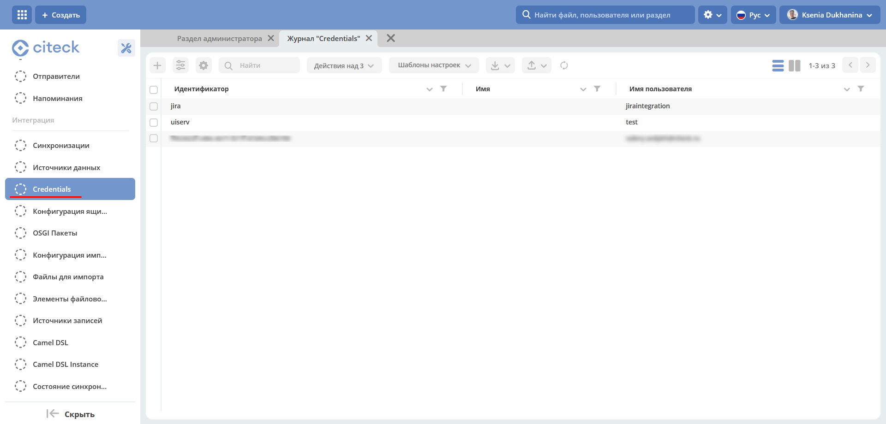
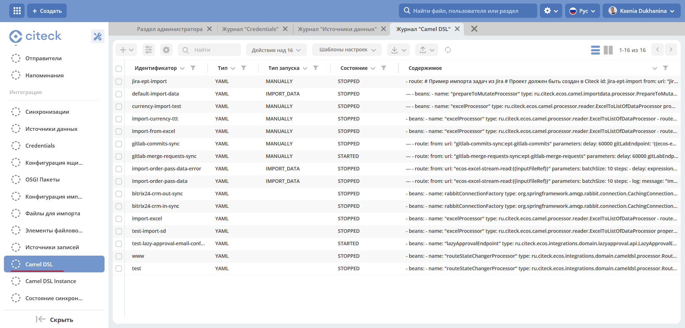
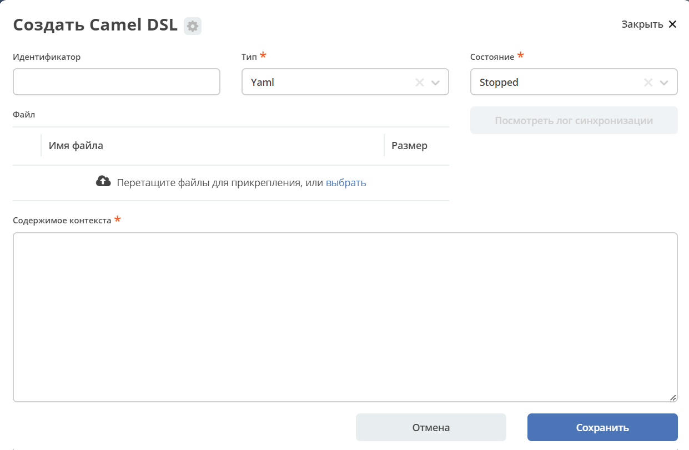

Выборка из БД
===============

Для выборки данных из БД необходимо:

1.  Создать **«Credentials»** для подключения:

Перейти в журнал **"Credentials" (Рабочее пространство "Раздел администратора" - Интеграция)**

2.  Создать **«Источник данных»** DB Data Source, в результате источник будет с типом db.

Перейти в журнал **"Источники данных" (Рабочее пространство "Раздел администратора" - Интеграция)**

.. image:: _static/BD_selection/Camel_5.png
       :width: 600
       :align: center   

3.  Создать **«Camel DSL»** 

Перейти в журнал **"Camel DSL" (Рабочее пространство "Раздел администратора" - Интеграция)**

Контекст Camel DSL должен содержать маршрут выборки из БД. Например:

.. code-block:: yaml

    - route:
        from:
          uri: "timer:start?delay=-1&repeatCount=1"
          steps:
            - setBody:
                constant: "select * from actions"
            - to: "jdbc:datasource"
            - split:
                simple: "${body}"
                steps:
                  - to: "stream:out"

  
где

    * **datasource** – имя источника данных, созданного в п.2 при его использовании в маршруте нужно добавлять префикс **«jdbc:»**;
    * **actions** – имя таблицы БД, из которой делается выборка;
    * **timer** – таймер, который запускает маршрут **delay=-1** - немедленно при старте контекста и только один раз **repeatCount=1**;
    * **блок split** разделяет результат выборки на строки, которые выводятся в трассу **stream:out**

4.  Для выполнения содержимого контекста нужно изменить состояние Camel DSL на **Started**