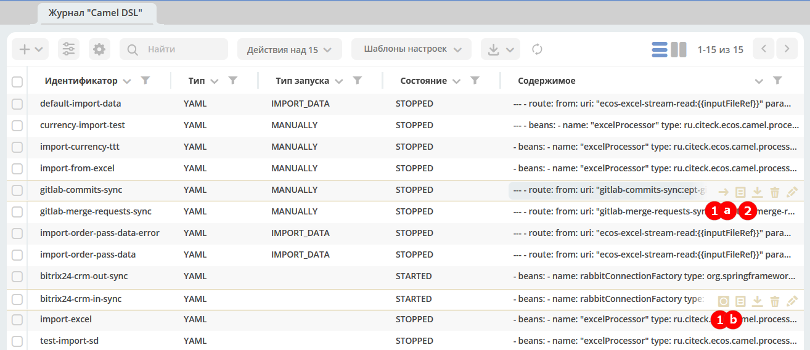
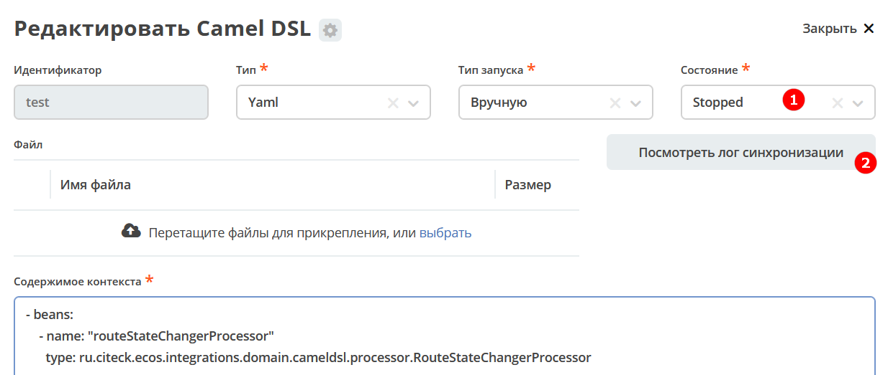

Действия, доступные с Camel DSL
================================

.. _camel_dsl_actions:

|

Помимо стандартных (скачать, удалить, редактировать) доступны дополнительные действия:

* **1a** / **1b** - Старт/Стоп для запуска и остановки контекста.
* **2** -  просмотр лога по последней синхронизации.

Аналогично:

|

Контекст после запуска сразу же останавливался если в нем больше никакой работы не выполняется (как в случае с импортом из файла).