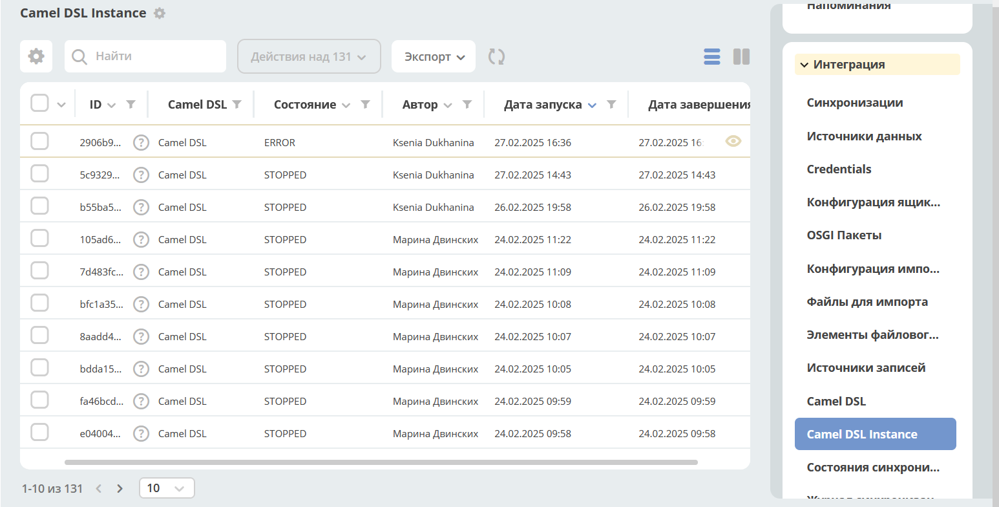
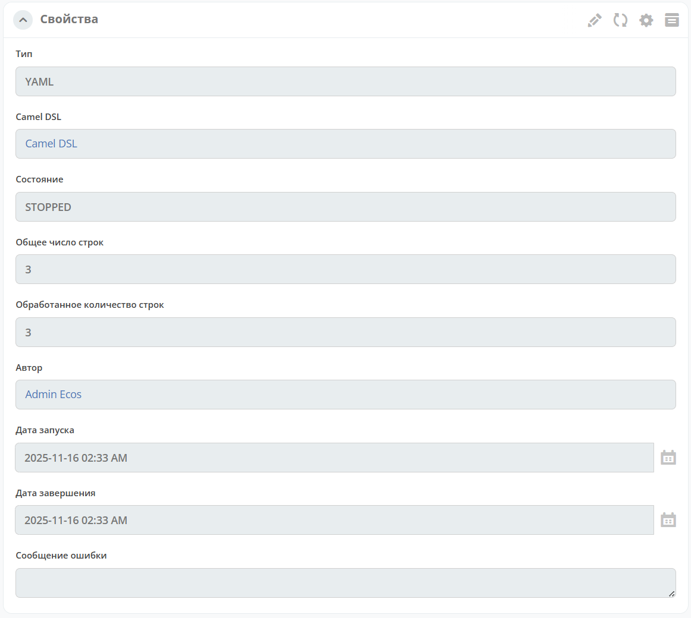

Инстансы контекста Camel DSL
==============================

.. _camel_instance:

Журнал содержит информацию запущенных отдельных инстансах Camel контекста импорта данных.

Журнал доступен по адресу: ``v2/admin?journalId=ecos-camel-dsl-instance-journal&type=JOURNAL``

Подробная информация об инстансе:

Возможные состояния Camel DSL Instance:

* **RUNNING** - Контекст запущен и выполняется работа
* **STOPPED** - Контекст успешно выполнил работу и завершен
* **ERROR**	- Во время выполнения произошла ошибка, контекст остановлен

