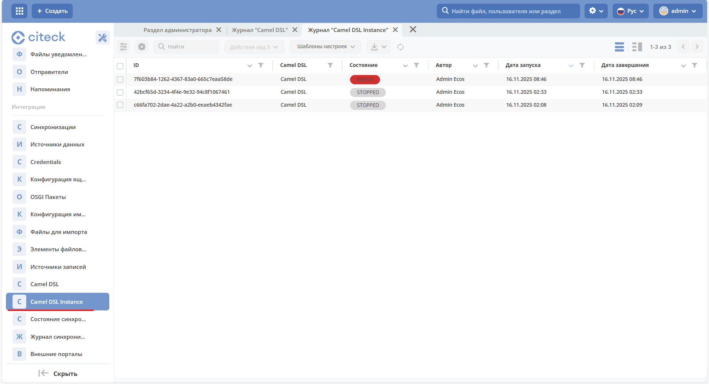
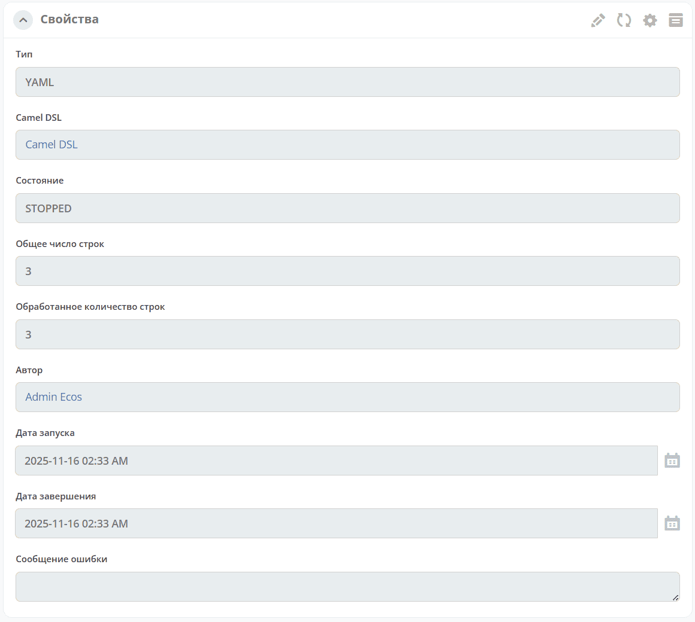

.. _camel_instance:

Инстансы контекста Camel DSL
=============================================

Журнал содержит информацию о запущенных отдельных инстансах Camel контекста импорта данных.

Журнал доступен по адресу: ``v2/journals?journalId=ecos-camel-dsl&viewMode=table&ws=admin$workspace``

Подробная информация об инстансе:

Возможные состояния Camel DSL Instance:

.. list-table::
   :widths: 20 80
   :header-rows: 1
   :class: tight-table

   * - Состояние
     - Описание
   * - RUNNING
     - Контекст запущен и выполняется работа
   * - STOPPED
     - Контекст успешно выполнил работу и завершён
   * - ERROR
     - Во время выполнения произошла ошибка, контекст остановлен
