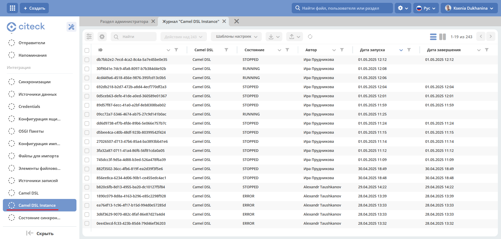
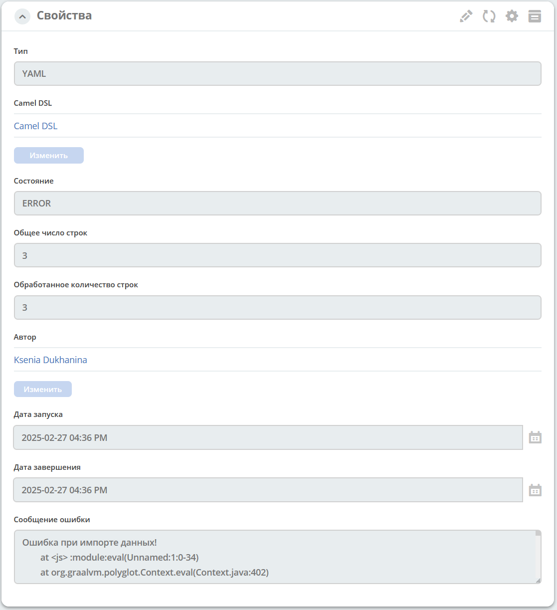

Инстансы контекста Camel DSL
==============================

.. _camel_instance:

Журнал содержит информацию запущенных отдельных инстансах Camel контекста импорта данных.

Журнал доступен по адресу: ``v2/journals?journalId=ecos-camel-dsl&viewMode=table&ws=admin$workspace``

Подробная информация об инстансе:

Возможные состояния Camel DSL Instance:

       * **RUNNING** - Контекст запущен и выполняется работа
       * **STOPPED** - Контекст успешно выполнил работу и завершен
       * **ERROR**	- Во время выполнения произошла ошибка, контекст остановлен

