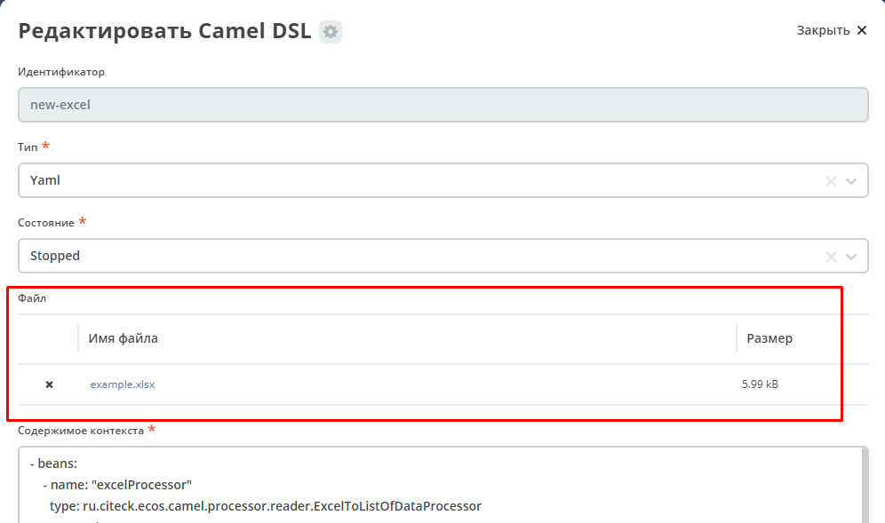

Конечные точки
================

.. _endpoints_dsl:

.. contents::
		:depth: 3

**Конечные точки** используются для чтения или записи данных в определенном источнике.

Подробнее - https://camel.apache.org/manual/endpoint.html

FileFromCamelDslEndpoint
--------------------------

.. _FileFromCamelDslEndpoint:

Данный компонент позволяет работать с файлом, добавленным на форму конфигурации Camel DSL:

Ключ для использования компонента в camel-контексте: *file-from-camel-dsl*

**FileFromCamelDslConsumer** вычитывает данные из файла в виде ByteArray и кладет их в exchange для дальнейшей обработки

Пример:

.. code-block::

   - route:
       from:
         uri: "file-from-camel-dsl:randomName"
         steps:
           - process:
               ref: csvToListOfDataProcessor
           - split:
               simple: "${body}"
               steps:
                 - to: ecos-records-mutate:?sourceId=emodel/camel-example-employee

EcosRecordsSyncConsumer
-----------------------

.. _EcosRecordsSyncConsumer:

Эндпоинт для последовательной выгрузки любого количества записей из указанного источника данных.

URI
~~~

**ecos-records-sync-consumer:syncName**

**ecos-records-sync-consumer** - константа

**syncName** - имя синхронизации. Может быть любым и используется для сохранения и доступа к состоянию. Т.е. если поменять syncName, то консьюмер будет работать "с нуля".

Выходные данные
~~~~~~~~~~~~~~~~~~

Тип данных: **List<DataValue>**

Описание: Лист **DataValue** объектов с атрибутами, которые были загружены у записей. Глобальный идентификатор записи в атрибуты не попадает. Если он нужен, то следует его явно прописать в атрибутах:

.. code-block::

  attributes:
    ?id: ?id

Параметры
~~~~~~~~~~

.. list-table::
      :widths: 5 5 5 5 20
      :header-rows: 1
      :class: tight-table  

      * - Параметр
        - Тип
        - Значение по умолчанию
        - Обязательность
        - Описание
      * - sourceId
        - String?
        - null
        - Нет
        - | Идентификатор источника данных откуда мы будем загружать записи.
          | Можно не задавать если указан ecosType.
          | Примеры: *emodel/source0, emodel/source1*
      * - ecosType
        - String?
        - null
        - Нет
        - | Локальный идентификатор типа.
          | Если не укзан sourceId, то он берется из типа.
          | Примеры: *contract, attorney*
      * - predicate
        - Predicate?
        - Always True
        - Нет
        - | Критерии поиска записей.
          | Примеры: {"t": "eq", "a": "_type", "v": "emodel/type@case"}
      * - batchSize
        - Int
        - 100
        - Нет
        - Размер пачки одновременно обрабатываемых записей
      * - attributes
        - Map<String, String>
        - 
        - Да
        - Атрибуты для загрузки у записей
      * - addAuditAttributes
        - Boolean
        - true
        - Нет
        - Добавить атрибуты аудита (_created,_creator,_modified,_modifier) в список атрибутов для загрузки
      * - delay
        - Long
        - 500
        - Нет
        - Количество миллисекунд между обработкой пачек записей 
      * - greedy
        - Boolean
        - false
        - Нет
        - Если true и количество обработанных записей больше нуля, то не ждать delay перед следующей обработкой, а сразу вызвать следующий poll  
      * - initialDelay
        - Long
        - 1000
        - Нет
        - Задержка перед первой обработкой записей

.. note::

  Доп. параметры можно посмотреть в исходниках класса org.apache.camel.support.ScheduledPollEndpoint

Пример использования
~~~~~~~~~~~~~~~~~~~~~

.. code-block::

   - route:
       from:
         uri: ecos-records-sync-consumer:legalEntity-mgr-from
         parameters:
           delay: 30000
           sourceId: emodel/source1
           predicate:
             t: eq
             a: type
             v: legalEntity
           addAuditAttributes: true
           attributes:
             ?id: ?id
             id: ?localId
             title: title
             name: name
         steps:
           - to: log:ecos-records-sync

Принцип работы
~~~~~~~~~~~~~~~~~

Раз в **{delay}** миллисекунд идет запрос в источник данных **{sourceId}** который или задан явно или загружается из **{ecosType}**. Из источника данных загружается пачка записей размером <= **{batchSize}**. Загруженная пачка отправляется в обработку на указанные в роуте шаги. 

Обновление стейта происходит только если пачка записей обработана успешно. В случае ошибки стейт остается старым и при следующем срабатывании загрузка продолжится с предыдущего стейта.

Индивидуальная обработка записей
~~~~~~~~~~~~~~~~~~~~~~~~~~~~~~~~~~~~

Если требуется индивидуальная обработка записей, то можно разделить элементы листа и обрабатывать каждый по отдельности:

.. code-block::

   - route:
       from:
         uri: ecos-records-sync-consumer:routeStage-mgr-from
         parameters:
           initialDelay: 10000
           delay: 15000
           sourceId:emodel/source1
           predicate:
             t: eq
             a: type
             v: routeStage
           batchSize: 30
           addAuditAttributes: true
           attributes:
             id: ?localId
             title: title
             name: name
         steps:
           - split:
               simple: "${body}"
               steps:
                 - to: log:result # в этих шагах каждый элемент будет обработан отдельно

Если требуется как-то индивидуально обработать записи и затем опять собрать их в одну пачку, то можно воспользоваться стратегией агрегации:

.. code-block::

   - beans:
       - name: customJsonPatch
         type: ru.citeck.ecos.camel.processor.data.JsonPatchOperationsProcessor
    
       - name: collectToListStrategy
         type: org.apache.camel.processor.aggregate.GroupedBodyAggregationStrategy
   - route:
       from:
         uri: ecos-records-sync-consumer:routeStage-mgr-from
         parameters:
           initialDelay: 10000
           delay: 15000
           sourceId: emodel/source1
           predicate:
             t: eq
             a: type
             v: routeStage
           batchSize: 30
           addAuditAttributes: true
           attributes:
             id: ?localId
             title: title
             name: name
         steps:
           - split:
               simple: "${body}"
               aggregationStrategy: collectToListStrategy # это ключевое отличие
               steps:
                 - setHeader:
                     name: JsonPatchOperations
                     constant:
                       - op: set
                         path: "_parentAtt"
                         value: templateRouteApprovingStages
                 - process:
                     ref: customJsonPatch
           - to: log:result # после split мы будем обрабатывать лист, который собрался после индивидуальной обработки записей

Стратегии
~~~~~~~~~

Итерация выполняется несколькими стратегиями. При каждом срабатывании poll'а (обработка следующей пачки записей) выполняется запрос следующей пачки записей через одну из описанных ниже стратегий. Используется первый не пустой результат и дальнейший перебор стратегий не выполняется. Каждая стратегия имеет состояние, которое хранит данные для продолжения итерации с последнего обработанного места.

**1. По дате создания**

Перебор идет по атрибуту **_created** от начала эпохи (1970-01-01T00:00:00Z)

**Состояние:**

.. list-table::
      :widths: 5 5 5 20
      :header-rows: 1
      :class: tight-table  

      * - Свойство
        - Тип
        - По умолчанию
        - Описание
      * - totalCount
        - Long
        - -1
        - | Ожидаемое полное количество всех записей для синхронизации. 
          | Заполняется в начале и не обновляется в ходе итерации
      * - lastCreated 
        - Instant
        - Instant.EPOCH
        - Дата последней созданной ноды, которую мы обработали
      * - lastRef
        - EntityRef
        - EntityRef.EMPTY
        - Ссылка на последнюю обработанную запись
      * - skipCount
        - Int
        - 0
        - | Количество элементов, которые нужно пропустить при следующем запросе. 
          | Используется для обработки записей, у которых дата создания совпадает. 
      * - processedCount
        - Long
        - 0
        - Количество обработанных записей
      * - lastCreatedCounter
        - Int
        - 0
        - | Счетчик записей с одинаковой датой создания. 
          | Используется чтобы в результирующих данных скорректировать дату создания добавив к ней lastCreatedCounter микросекунд. 
          | Это нужно чтобы после загрузки этих данных в другую БД сохранился порядок при сортировке по полю _created.

**Особенности стратегии:**

Сохранение порядка - если в выгружаемых данных записи имеют одинаковую дату создания, то первая из них будет иметь оригинальную дату, а все последующие будут иметь дату создания на N микросекунд больше. Количество микросекунд увеличивается с каждой новой записью с одинаковой датой создания.

**2. По дате изменения**

Перебор идет по атрибуту **_modified** от даты начала синхронизации.

**Состояние:**

.. list-table::
      :widths: 5 5 5 20
      :header-rows: 1
      :class: tight-table  

      * - Свойство
        - Тип
        - По умолчанию
        - Описание
      * - lastModified
        - Instant
        - Дата начала синхронизации
        - Дата последней измененной записи, которую мы обработали
      * - lastRef
        - EntityRef
        - EntityRef.EMPTY
        - Ссылка на последнюю обработанную запись
      * - skipCount
        - Int
        - 0
        - | Количество элементов, которые нужно пропустить при следующем запросе. 
          | Используется для обработки записей, у которых дата изменения совпадает. 
      * - processedCount
        - Long
        - 0
        - Количество обработанных записей

**Особенности стратегии:**

Синхронизация проходит только для тех записей, которые были созданы до даты создания последней синхронизованной записи из первой стратегии.  

EcosRecordsMutateEndpoint 
--------------------------

.. _EcosRecordsMutateEndpoint:

Эндпоинт для выполнения мутации через RecordsAPI

URI
~~~

**ecos-records-mutate:?sourceId={sourceId}**

  - **ecos-records-mutate** - константа

  - **sourceId** - идентификатор источника данных куда следует отправить запрос мутации. Например: 'emodel/contract', 'emodel/custom-type'

Входные данные
~~~~~~~~~~~~~~~

Конечная точка принимает либо одно **map-like значение**, либо список.

**map-like значение** - **Map<String, Any?>**, **DataValue**, **ObjectData** и другие, которые могут быть сконвертированы в **Map<String, Any?>**.

**map-like значение** по структуре содержит список атрибутов, которые будут использованы для мутации.

Если среди атрибутов есть **"?id"** с полным ref мутируемой сущности, то мутация будет выполнена именно для этой сущности.

Если среди атрибутов есть **"id"** (локальный id сущности), то мутация либо обновит существующую сущность, либо создаст новую если такой еще нет.