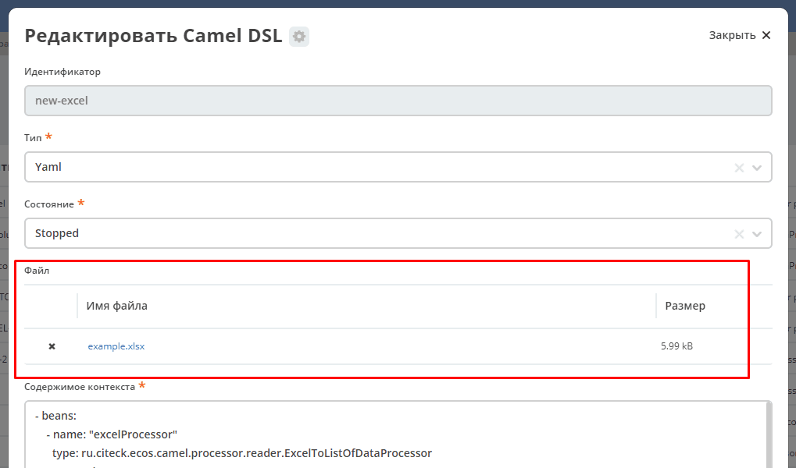

.. _endpoints_dsl:

Конечные точки
================================

.. contents::
   :depth: 3

**Конечные точки** используются для чтения или записи данных в определенном источнике.

Подробнее - https://camel.apache.org/manual/endpoint.html

.. _camel_file_from_camel_dsl:

FileFromCamelDslEndpoint
--------------------------

Данный компонент позволяет работать с файлом, добавленным на форму конфигурации Camel DSL:

Ключ для использования компонента в camel-контексте: *file-from-camel-dsl*

**FileFromCamelDslConsumer** вычитывает данные из файла в виде ByteArray и кладет их в exchange для дальнейшей обработки

Пример:

.. code-block:: yaml

   - route:
       from:
         uri: "file-from-camel-dsl:randomName"
         steps:
           - process:
               ref: csvToListOfDataProcessor
           - split:
               simple: "${body}"
               steps:
                 - to: ecos-records-mutate:?sourceId=emodel/camel-example-employee

.. _camel_ecos_records_sync_consumer:

EcosRecordsSyncConsumer
-----------------------

Эндпоинт для последовательной выгрузки любого количества записей из указанного источника данных.

URI
~~~

**ecos-records-sync-consumer:syncName**

**ecos-records-sync-consumer** - константа

**syncName** - имя синхронизации. Может быть любым и используется для сохранения и доступа к состоянию. Т.е. если поменять syncName, то консьюмер будет работать "с нуля".

Выходные данные
~~~~~~~~~~~~~~~~~~~~~~~~~~~~~~

Тип данных: **List<DataValue>**

Описание: Лист **DataValue** объектов с атрибутами, которые были загружены у записей. Глобальный идентификатор записи в атрибуты не попадает. Если он нужен, то следует его явно прописать в атрибутах:

.. code-block:: yaml

  attributes:
    ?id: ?id

Параметры
~~~~~~~~~~~~~~~~~~

.. list-table::
      :widths: 5 5 5 5 20
      :header-rows: 1
      :class: tight-table

      * - Параметр
        - Тип
        - Значение по умолчанию
        - Обязательность
        - Описание
      * - sourceId
        - String?
        - null
        - Нет
        - | Идентификатор источника данных откуда мы будем загружать записи.
          | Можно не задавать если указан ecosType.
          | Примеры: *emodel/source0, emodel/source1*
      * - ecosType
        - String?
        - null
        - Нет
        - | Локальный идентификатор типа.
          | Если не указан sourceId, то он берется из типа.
          | Примеры: *contract, attorney*
      * - predicate
        - Predicate?
        - Always True
        - Нет
        - | Критерии поиска записей.
          | Примеры: {"t": "eq", "a": "_type", "v": "emodel/type@case"}
      * - initDate
        - Instant
        - 1970-01-01T00:00:00Z
        - Нет
        - | Дата, начиная с которой выполняется перебор записей.
          | Записи, созданные раньше этой даты, в выгрузку не попадут.
          | Значение запоминается в состоянии синхронизации при первом запуске и в дальнейшем берется оттуда, поэтому изменение параметра у уже работающего консьюмера ни на что не влияет. Чтобы применить новую дату, нужно поменять syncName.
      * - iterationStrategy
        - CREATED_MODIFIED | CREATED | MODIFIED
        - CREATED_MODIFIED
        - Нет
        - | Какие стратегии перебора будут использованы (см. раздел «Стратегии» ниже).
          | CREATED_MODIFIED — сначала перебор по дате создания, затем по дате изменения;
          | CREATED — только перебор по дате создания;
          | MODIFIED — только перебор по дате изменения.
      * - batchSize
        - Int
        - 100
        - Нет
        - Размер пачки одновременно обрабатываемых записей
      * - attributes
        - Map<String, String>
        -
        - Да
        - Атрибуты для загрузки у записей
      * - addAuditAttributes
        - Boolean
        - true
        - Нет
        - Добавить атрибуты аудита (_created,_creator,_modified,_modifier) в список атрибутов для загрузки
      * - delay
        - Long
        - 500
        - Нет
        - Количество миллисекунд между обработкой пачек записей
      * - greedy
        - Boolean
        - false
        - Нет
        - Если true и количество обработанных записей больше нуля, то не ждать delay перед следующей обработкой, а сразу вызвать следующий poll
      * - initialDelay
        - Long
        - 1000
        - Нет
        - Задержка перед первой обработкой записей

.. note::

  Доп. параметры можно посмотреть в исходниках класса org.apache.camel.support.ScheduledPollEndpoint

Пример использования
~~~~~~~~~~~~~~~~~~~~~~~~~~~~~~~~~~~~~~~~

.. code-block:: yaml

   - route:
       from:
         uri: ecos-records-sync-consumer:legalEntity-mgr-from
         parameters:
           delay: 30000
           sourceId: emodel/source1
           predicate:
             t: eq
             a: type
             v: legalEntity
           addAuditAttributes: true
           attributes:
             ?id: ?id
             id: ?localId
             title: title
             name: name
         steps:
           - to: log:ecos-records-sync

Принцип работы
~~~~~~~~~~~~~~~~~~~~~~~~~~~~

Раз в **{delay}** миллисекунд идет запрос в источник данных **{sourceId}** который или задан явно или загружается из **{ecosType}**. Из источника данных загружается пачка записей размером <= **{batchSize}**. Загруженная пачка отправляется в обработку на указанные в роуте шаги.

Обновление стейта происходит только если пачка записей обработана успешно. В случае ошибки стейт остается старым и при следующем срабатывании загрузка продолжится с предыдущего стейта.

Индивидуальная обработка записей
~~~~~~~~~~~~~~~~~~~~~~~~~~~~~~~~~~~~~~~~~~~~~~~~~~~~~~~~~~~~~~~~~~~~~~~~~~~~~~~~

Если требуется индивидуальная обработка записей, то можно разделить элементы листа и обрабатывать каждый по отдельности:

.. code-block:: yaml

   - route:
       from:
         uri: ecos-records-sync-consumer:routeStage-mgr-from
         parameters:
           initialDelay: 10000
           delay: 15000
           sourceId: emodel/source1
           predicate:
             t: eq
             a: type
             v: routeStage
           batchSize: 30
           addAuditAttributes: true
           attributes:
             id: ?localId
             title: title
             name: name
         steps:
           - split:
               simple: "${body}"
               steps:
                 - to: log:result # в этих шагах каждый элемент будет обработан отдельно

Если требуется как-то индивидуально обработать записи и затем опять собрать их в одну пачку, то можно воспользоваться стратегией агрегации:

.. code-block:: yaml

   - beans:
       - name: customJsonPatch
         type: ru.citeck.ecos.camel.processor.data.JsonPatchOperationsProcessor

       - name: collectToListStrategy
         type: org.apache.camel.processor.aggregate.GroupedBodyAggregationStrategy
   - route:
       from:
         uri: ecos-records-sync-consumer:routeStage-mgr-from
         parameters:
           initialDelay: 10000
           delay: 15000
           sourceId: emodel/source1
           predicate:
             t: eq
             a: type
             v: routeStage
           batchSize: 30
           addAuditAttributes: true
           attributes:
             id: ?localId
             title: title
             name: name
         steps:
           - split:
               simple: "${body}"
               aggregationStrategy: collectToListStrategy # это ключевое отличие
               steps:
                 - setHeader:
                     name: JsonPatchOperations
                     constant:
                       - op: set
                         path: "_parentAtt"
                         value: templateRouteApprovingStages
                 - process:
                     ref: customJsonPatch
           - to: log:result # после split мы будем обрабатывать лист, который собрался после индивидуальной обработки записей

Стратегии
~~~~~~~~~~~~~~~~~~

Итерация выполняется одной или несколькими стратегиями. При каждом срабатывании poll'а (обработка следующей пачки записей) выполняется запрос следующей пачки записей через одну из описанных ниже стратегий. Используется первый не пустой результат и дальнейший перебор стратегий не выполняется. Каждая стратегия имеет состояние, которое хранит данные для продолжения итерации с последнего обработанного места.

Набор стратегий задается параметром **iterationStrategy**:

.. list-table::
      :widths: 5 20
      :header-rows: 1
      :class: tight-table

      * - Значение
        - Используемые стратегии
      * - CREATED_MODIFIED
        - Обе стратегии: сначала «по дате создания», затем «по дате изменения». Значение по умолчанию
      * - CREATED
        - Только «по дате создания». Изменения уже обработанных записей не подхватываются
      * - MODIFIED
        - Только «по дате изменения»

Перебор в обеих стратегиях начинается с даты, заданной параметром **initDate**.

По дате создания
^^^^^^^^^^^^^^^^^^^^^^

Перебор идет по атрибуту **_created** от начала эпохи (1970-01-01T00:00:00Z)

**Состояние:**

.. list-table::
      :widths: 5 5 5 20
      :header-rows: 1
      :class: tight-table

      * - Свойство
        - Тип
        - По умолчанию
        - Описание
      * - totalCount
        - Long
        - -1
        - | Ожидаемое полное количество всех записей для синхронизации.
          | Заполняется в начале и не обновляется в ходе итерации
      * - lastCreated
        - Instant
        - Instant.EPOCH
        - Дата последней созданной ноды, которую мы обработали
      * - lastRef
        - EntityRef
        - EntityRef.EMPTY
        - Ссылка на последнюю обработанную запись
      * - skipCount
        - Int
        - 0
        - | Количество элементов, которые нужно пропустить при следующем запросе.
          | Используется для обработки записей, у которых дата создания совпадает.
      * - processedCount
        - Long
        - 0
        - Количество обработанных записей
      * - lastCreatedCounter
        - Int
        - 0
        - | Счетчик записей с одинаковой датой создания.
          | Используется чтобы в результирующих данных скорректировать дату создания добавив к ней lastCreatedCounter микросекунд.
          | Это нужно чтобы после загрузки этих данных в другую БД сохранился порядок при сортировке по полю _created.

**Особенности стратегии:**

Сохранение порядка — если в выгружаемых данных записи имеют одинаковую дату создания, то первая из них будет иметь оригинальную дату, а все последующие будут иметь дату создания на N микросекунд больше. Количество микросекунд увеличивается с каждой новой записью с одинаковой датой создания.

По дате изменения
^^^^^^^^^^^^^^^^^^^^^^

Перебор идет по атрибуту **_modified** от даты начала синхронизации.

**Состояние:**

.. list-table::
      :widths: 5 5 5 20
      :header-rows: 1
      :class: tight-table

      * - Свойство
        - Тип
        - По умолчанию
        - Описание
      * - lastModified
        - Instant
        - Дата начала синхронизации
        - Дата последней измененной записи, которую мы обработали
      * - lastRef
        - EntityRef
        - EntityRef.EMPTY
        - Ссылка на последнюю обработанную запись
      * - skipCount
        - Int
        - 0
        - | Количество элементов, которые нужно пропустить при следующем запросе.
          | Используется для обработки записей, у которых дата изменения совпадает.
      * - processedCount
        - Long
        - 0
        - Количество обработанных записей

**Особенности стратегии:**

Синхронизация проходит только для тех записей, которые были созданы до даты создания последней синхронизованной записи из первой стратегии.

.. _EcosRecordsMutateEndpoint:

EcosRecordsMutateEndpoint
--------------------------

Эндпоинт для выполнения мутации через RecordsAPI

URI
~~~

**ecos-records-mutate:?sourceId={sourceId}**

  - **ecos-records-mutate** - константа

  - **sourceId** - идентификатор источника данных куда следует отправить запрос мутации. Например: 'emodel/contract', 'emodel/custom-type'

Параметры
~~~~~~~~~~~~~~~~~~

.. list-table::
      :widths: 5 5 5 5 20
      :header-rows: 1
      :class: tight-table

      * - Параметр
        - Тип
        - Значение по умолчанию
        - Обязательность
        - Описание
      * - sourceId
        - String?
        - null
        - Нет
        - | Идентификатор источника данных, куда отправляется запрос мутации.
          | Можно не задавать, если указан ecosType.
      * - ecosType
        - String?
        - null
        - Нет
        - | Локальный идентификатор типа. Если sourceId не указан, источник данных берется из типа.
          | Если не заданы ни sourceId, ни ecosType, маршрут не запустится с ошибкой «You should define sourceId or ecosType».
      * - ignoreIdScalarAtt
        - Boolean
        - false
        - Нет
        - | Если true, атрибут **?id** удаляется из данных и не используется как ссылка на изменяемую запись — мутация всегда создает новую запись.
          | Если false, значение **?id** определяет, какая запись будет изменена.

.. note::

  Мутация выполняется от имени системы (**AuthContext.runAsSystem**), то есть без учета прав текущего пользователя.

Входные данные
~~~~~~~~~~~~~~~~~~~~~~~~~~~~

Конечная точка принимает либо одно **map-like значение**, либо список.

**map-like значение** — **Map<String, Any?>**, **DataValue**, **ObjectData** и другие, которые могут быть сконвертированы в **Map<String, Any?>**.

**map-like значение** по структуре содержит список атрибутов, которые будут использованы для мутации.

Если среди атрибутов есть **"?id"** с полным ref мутируемой сущности, то мутация будет выполнена именно для этой сущности.

Если среди атрибутов есть **"id"** (локальный id сущности), то мутация либо обновит существующую сущность, либо создаст новую если такой еще нет.

.. _EcosEventEndpoint:

EcosEventEndpoint
--------------------------

Эндпоинт для работы с событиями ECOS. Может использоваться и как потребитель (подписка на событие), и как производитель (публикация события).

Примеры подписки на события с фильтрами приведены в разделе :ref:`Подписка на событие Citeck <camel_subscription>`.

URI
~~~

**ecos-event:eventType**

  - **ecos-event** - константа

  - **eventType** - тип события. Обязателен. Например: *record-created*, *record-status-changed*

Параметры
~~~~~~~~~~~~~~~~~~

.. list-table::
      :widths: 5 5 5 5 20
      :header-rows: 1
      :class: tight-table

      * - Параметр
        - Тип
        - Значение по умолчанию
        - Обязательность
        - Описание
      * - attributes
        - Map<String, String>
        -
        - Нет
        - | Атрибуты события, которые нужно получить. Ключ — имя атрибута в теле сообщения, значение — схема атрибута.
          | Телом сообщения становится объект со всеми перечисленными атрибутами.
      * - attribute
        - String?
        - null
        - Нет
        - | Один атрибут вместо набора. Телом сообщения становится значение самого атрибута, без объекта-обертки.
          | Задавать одновременно с **attributes** нельзя — маршрут не запустится с ошибкой «You should define property 'attribute' or 'attributes' but not both».
      * - filter
        - Predicate
        - Always True
        - Нет
        - Условие, при котором событие попадет в маршрут
      * - transactional
        - Boolean
        - false
        - Нет
        - | Если true, обработка выполняется в транзакции источника события, и исключение в маршруте пробрасывается наружу — то есть приводит к откату транзакции.
          | Если false, ошибка обработки на источник события не влияет.
      * - outputType
        - DEFAULT | DATA_VALUE | JSON_STRING | JAVA
        - DEFAULT
        - Нет
        - | Во что преобразуется тело сообщения:
          | DEFAULT и DATA_VALUE — объект **DataValue** (поведение совпадает);
          | JSON_STRING — строка с JSON;
          | JAVA — обычный объект Java (Map, List, String и т.д.).

Пример подписки
~~~~~~~~~~~~~~~~~~~~~~~~~~~~~~~~~~~~~~~~

.. code-block:: yaml

   - route:
       from:
         uri: 'ecos-event:record-created'
         parameters:
           attribute: 'record?id'
           outputType: JSON_STRING
         steps:
           - to: log:record-was-created

Публикация события
~~~~~~~~~~~~~~~~~~~~~~~~~~~~~~~~~~~~~~~~

При использовании эндпоинта в шаге **to** тело сообщения публикуется как событие указанного типа. Источник события — *camel*. Публикация выполняется от имени системы (**AuthContext.runAsSystem**).

.. code-block:: yaml

   - route:
       from:
         uri: .....
         steps:
           - to: 'ecos-event:my-custom-event'

.. _EcosRecordsQueryEndpoint:

EcosRecordsQueryEndpoint
--------------------------

Эндпоинт для выполнения запроса к RecordsAPI.

URI
~~~

**ecos-records-query:**

Параметры
~~~~~~~~~~~~~~~~~~

.. list-table::
      :widths: 5 5 5 5 20
      :header-rows: 1
      :class: tight-table

      * - Параметр
        - Тип
        - Значение по умолчанию
        - Обязательность
        - Описание
      * - outputType
        - DEFAULT | DATA_VALUE | JSON_STRING | JAVA
        - DEFAULT
        - Нет
        - | В каком виде атрибуты каждой найденной записи попадут в результат:
          | DEFAULT и DATA_VALUE — объект **DataValue**;
          | JSON_STRING — строка с JSON;
          | JAVA — обычный объект Java.

Входные данные
~~~~~~~~~~~~~~~~~~~~~~~~~~~~

Тело сообщения — объект, преобразуемый в **RecordsQuery**. Дополнительно в нем можно указать поле **attributes**: массив имен атрибутов либо объект вида «псевдоним — атрибут».

Выходные данные
~~~~~~~~~~~~~~~~~~~~~~~~~~~~~~

Тело сообщения заменяется списком. Если **attributes** не заданы, элементы списка — строковые ссылки на найденные записи. Если заданы — атрибуты каждой записи (идентификатор добавляется автоматически, если его нет среди запрошенных атрибутов) в формате, заданном **outputType**.

Заголовки:

.. list-table::
      :widths: 10 20
      :header-rows: 1
      :class: tight-table

      * - Заголовок
        - Значение
      * - EcosRecordsQueryHasMore
        - Признак того, что есть еще записи за пределами выданной страницы
      * - EcosRecordsQueryTotalCount
        - Общее количество найденных записей

.. note::

  Запрос выполняется от имени системы, то есть без учета прав текущего пользователя.

.. _EcosRecordsDeleteEndpoint:

EcosRecordsDeleteEndpoint
--------------------------

Эндпоинт для удаления записей через RecordsAPI.

URI
~~~

**ecos-records-delete:**

Параметры
~~~~~~~~~~~~~~~~~~

.. list-table::
      :widths: 5 5 5 5 20
      :header-rows: 1
      :class: tight-table

      * - Параметр
        - Тип
        - Значение по умолчанию
        - Обязательность
        - Описание
      * - sourceId
        - String?
        - null
        - Нет
        - | Идентификатор источника данных, который подставляется ссылкам, заданным без него.
          | Значение можно переопределить для конкретного сообщения заголовком **EcosRecordsDeleteSourceId**.
      * - ignoreInvalidRefs
        - Boolean
        - false
        - Нет
        - Если true, некорректные ссылки пропускаются. Иначе обработка завершается ошибкой.

Входные данные
~~~~~~~~~~~~~~~~~~~~~~~~~~~~

Тело сообщения — одна ссылка либо коллекция ссылок. Допустимые формы: **String**, **EntityRef**, **Map**, **DataValue**, **ObjectData**; в последних трех идентификатор читается из атрибута **?id**.

Тело сообщения после обработки не изменяется. Результат удаления записывается в лог синхронизации под именем *records-delete*.

.. note::

  Удаление выполняется от имени системы, то есть без учета прав текущего пользователя.

.. _EcosAttributesMapperEndpoint:

EcosAttributesMapperEndpoint
------------------------------

Эндпоинт для приведения «сырых» строковых значений атрибутов к модели атрибутов ECOS-типа. Применяется при импорте данных из внешних источников, где все значения приходят строками.

URI
~~~

**ecos-attributes-mapper:typeId**

  - **ecos-attributes-mapper** - константа

  - **typeId** - локальный идентификатор ECOS-типа, по модели атрибутов которого выполняется преобразование. Обязателен

Параметры
~~~~~~~~~~~~~~~~~~

.. list-table::
      :widths: 5 5 5 5 20
      :header-rows: 1
      :class: tight-table

      * - Параметр
        - Тип
        - Значение по умолчанию
        - Обязательность
        - Описание
      * - delimiter
        - String
        - ,
        - Нет
        - Разделитель, по которому строка разбивается на несколько значений для многозначных атрибутов
      * - assocMapping
        - JSON
        - {}
        - Нет
        - | Карта вида «атрибут — список атрибутов», по которым искать связанную запись.
          | Задается строкой с JSON. По умолчанию поиск идет по атрибуту **_name**.

Входные и выходные данные
~~~~~~~~~~~~~~~~~~~~~~~~~~~~

Тело сообщения — список объектов **DataValue**, каждый из которых представляет собой набор пар «идентификатор атрибута — строковое значение». Тело заменяется тем же списком с преобразованными значениями:

.. list-table::
      :widths: 10 20
      :header-rows: 1
      :class: tight-table

      * - Тип атрибута
        - Преобразование
      * - BOOLEAN
        - Распознаются значения *да*, *нет*, *yes*, *no*, *true*, *false*
      * - OPTIONS
        - Отображаемое название варианта заменяется его значением
      * - ASSOC, PERSON, AUTHORITY_GROUP, AUTHORITY
        - | Значение ищется среди записей по атрибутам из **assocMapping** и заменяется ссылкой на найденную запись.
          | Если запись не найдена, значение считается готовой ссылкой и используется как есть.

.. _EcosFtpEndpoint:

EcosFtpEndpoint
--------------------------

Эндпоинт для работы с FTP, SFTP и FTPS, в котором адрес и учетные данные берутся из :ref:`конечной точки ECOS <endpoints_dsl>` и связанного с ней :ref:`секрета <ecos_secret>`. Благодаря этому в тексте маршрута не оказывается ни пароля, ни ключа.

URI
~~~

**ecos-ftp:endpointId**

  - **ecos-ftp** - константа

  - **endpointId** - идентификатор конечной точки ECOS, из которой берутся протокол, адрес, каталог и учетные данные. Обязателен

Параметры
~~~~~~~~~~~~~~~~~~

Собственных параметров у эндпоинта нет. Все остальные параметры строки запроса передаются без изменений в стандартный компонент camel-ftp, camel-sftp или camel-ftps, которому эндпоинт делегирует работу.

.. warning::

  Параметры, содержащие учетные данные, запрещены и приводят к ошибке: **username**, **password**, **account**, **privatekey** и производные от него, **passphrase**, **keypair**, а также любой составной параметр, имя которого заканчивается на *password*, *keypassword* или *passphrase*. Учетные данные задаются только через секрет конечной точки ECOS.

Входные и выходные данные
~~~~~~~~~~~~~~~~~~~~~~~~~~~~

Совпадают с входными и выходными данными стандартного компонента camel-ftp: в режиме производителя тело сообщения — содержимое файла, имя задается заголовком **CamelFileName**; в режиме потребителя маршрут получает прочитанные файлы. Собственных заголовков эндпоинт не добавляет.

.. note::

  Если для SFTP отключена проверка ключа хоста (**strictHostKeyChecking=no**, значение по умолчанию в camel-ftp), в лог выводится предупреждение.

.. _EcosExcelStreamReadEndpoint:

EcosExcelStreamReadEndpoint
------------------------------

Эндпоинт для потокового построчного чтения XLSX-файла. В отличие от :ref:`ExcelToListOfDataProcessor <camel_dsl_processors>`, файл не загружается в память целиком, а выдается в маршрут пачками строк, поэтому подходит для больших файлов.

URI
~~~

**ecos-excel-stream-read:contentRef**

  - **ecos-excel-stream-read** - константа

  - **contentRef** - ссылка на запись с содержимым XLSX-файла. Обязательна. Тип содержимого должен быть XLSX

Параметры
~~~~~~~~~~~~~~~~~~

.. list-table::
      :widths: 5 5 5 5 20
      :header-rows: 1
      :class: tight-table

      * - Параметр
        - Тип
        - Значение по умолчанию
        - Обязательность
        - Описание
      * - batchSize
        - Int
        - 100
        - Нет
        - Количество строк, накапливаемых перед отправкой пачки в маршрут
      * - sheetName
        - String?
        - null
        - Нет
        - Название листа Excel
      * - headRowNumber
        - Int?
        - null
        - Нет
        - Номер строки с заголовками, если он отличается от значения по умолчанию
      * - customAttNames
        - Map<String, String>
        - {}
        - Нет
        - Переименование колонок: ключ — название колонки в заголовке файла, значение — желаемое имя атрибута

Выходные данные
~~~~~~~~~~~~~~~~~~~~~~~~~~~~~~

Тело сообщения — **List<DataValue>**, по одному объекту на строку файла в формате «заголовок колонки — значение ячейки». Значения даты и времени сдвигаются на часовой пояс пользователя, десятичные числа передаются строкой без экспоненциальной записи.

По ходу чтения публикуются события управления импортом: начало, обработка пачки, завершение и ошибка.
