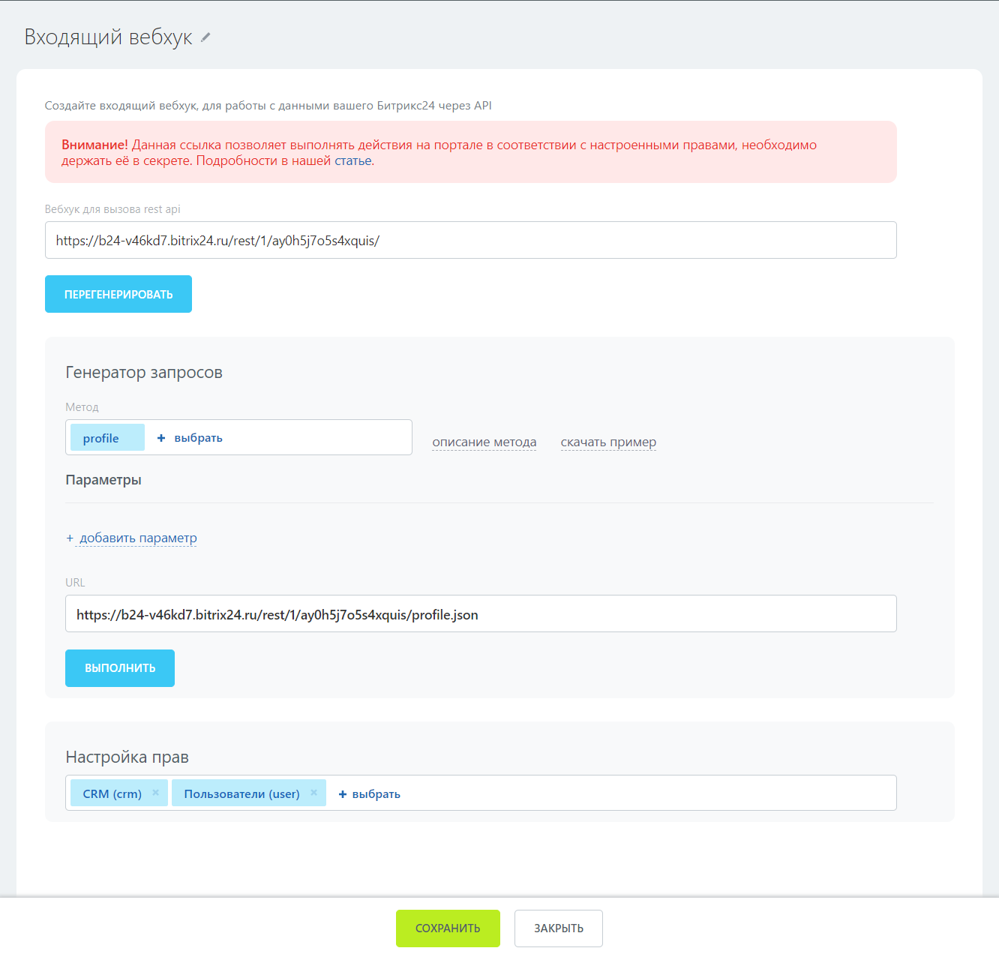
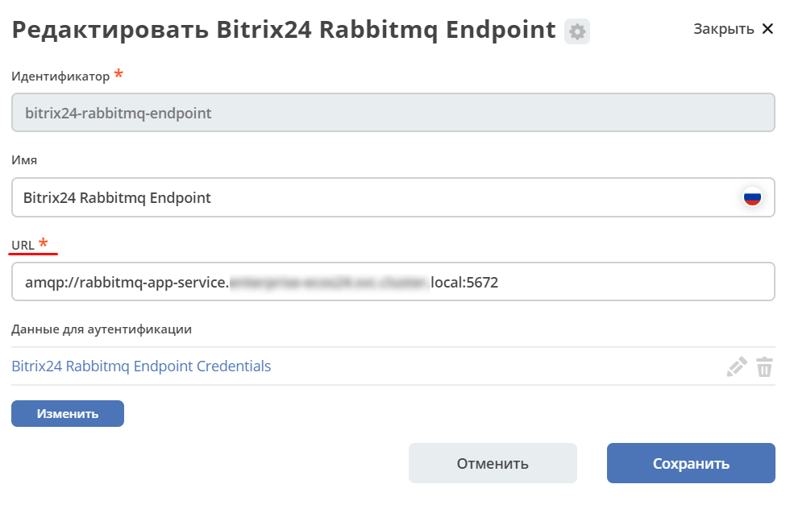

Примеры реализации
====================

.. contents::
   :depth: 3

Локальный импорт данных из Excel в Citeck
---------------------------------------------

.. _Excel-import:

Пример простой
~~~~~~~~~~~~~~~~~~

Пример подходит для простых случаев, когда данные для импорта не содержат ассоциаций, не требуется маппинг и для вас подходит упрощенный формат файла. 

1. В **Рабочее пространство "Раздел администратора"→ Интеграция → Camel DSL** нажмите **"+"** :

2. В форме заполните поля:

- **id:** import-from-excel (можно задать свой. главное чтобы id был уникален среди всех Camel DSL)
- **Тип:** Yaml
- **Состояние:** Stopped
- **Файл:** здесь будет необходимо загрузить excel файл с данными (пример см. ниже). Можно это сделать позднее.
- **Содержимое контекста**:

.. code-block::

 - beans:
     - name: "excelProcessor"
       type: ru.citeck.ecos.camel.processor.reader.ExcelToListOfDataProcessor
 - route:
     from:
       uri: "file-from-camel-dsl:import"
       steps:
         - process:
             ref: excelProcessor
         - split:
             simple: "${body}"
             steps:
               - to: "ecos-records-mutate:?sourceId=emodel/import-test"

В содержимом нужно поменять только **import-test** на **sourceId** для вашего типа. По умолчанию sourceId равен id типа. 

3. Сохраните.

4. Если файл с данными уже приложен, то остается только запустить через **действие** в журнале или через изменение состояния **Stopped -> Started** на форме редактирования:

.. list-table:: 
      :widths: 40 40
      :align: center 

      * - 

            .. image:: _static/examples/simple_xls_02.png
                 :width: 600
                 :align: center   

        - 

             .. image:: _static/examples/simple_xls_03.png
                  :width: 600
                  :align: center    

:download:`Пример файла с данными <../files/excel-test.xlsx>`

В файле:

 - Первая строка - id атрибутов. 
 - Остальные строки - данные, которые необходимо импортировать.

Пример сложнее
~~~~~~~~~~~~~~~~~~

Пример подходит для сложных случаев (добавления маппинга, работы с ассоциациями, работы с нетривиальными форматами excel файла).

В данном примере будет показан пример роута с использованием следующих camel-элементов:

 - :ref:`FileFromCamelDslEndpoint<FileFromCamelDslEndpoint>`

 - :ref:`ExcelToListOfDataProcessor<ExcelToListOfDataProcessor>`

 - MappingProcessor

 - :ref:`AssocRefByAttributeProcessor<AssocRefByAttributeProcessor>`

 - :ref:`EcosRecordsMutateEndpoint<EcosRecordsMutateEndpoint>`

Допустим в системе есть два пользовательских типа данных - **Работник** и **Позиция**.

**Работник**:

.. image:: _static/examples/XLS_import_01.png
       :width: 700
       :align: center   

**Позиция** (справочный тип, является ассоциацией в типе Работник):

.. image:: _static/examples/XLS_import_02.png
       :width: 600
       :align: center   

Необходимо импортировать следующие данные из Excel-файла (xlsx):

Комментарии к столбцам таблицы: 

   1. **Работник** - никакая дополнительная обработка не требуется. Значение будет записано в виде строки
   2. **Должность** - тут видно, что в таблице используется свойство "Наименование" (системное название name) ассоциации с типом Должность. Для корректного сохранения в систему нужно будет определить RecordRef должности
   3. **Работает больше года** -  логическое значение которое перед сохранением в систему надо преобразовать в соответствующие true - false
   4. **Зарплата** - числовое значение. Показаны разные варианты записи: с разрядностью, точкой и запятой в качестве разделителя, отрицательные числа (просто ради примера). Текст заголовка намекает на то, что он может периодически редактироваться. Кроме работы с заголовком никакая дополнительная обработка числовых значений не потребуется. Они корректно запишутся как соответствующие числовые значения
   5. **Дата приема** - данный столбец в таблице имеет тип Дата и для примера показаны разные типы форматирования. Никакая дополнительная обработка значений не потребуется

Для импорта данных необходимо будет прикрепить Excel файл на форму Camel DSL и прописать следующую конфигурацию:

.. code-block::

   - beans:
       - name: "excelProcessor"
         type: ru.citeck.ecos.camel.processor.reader.ExcelToListOfDataProcessor
         properties:
             sheetName: Таблица персонала
             tableStartCellReference: C4
             customAttNames:
                 F: salary
       - name: "mappingProcessor"
         type: ru.citeck.ecos.camel.processor.data.MappingProcessor
         properties:
           keysMapping:
             Работник: name
             Должность: position
             Работает больше года: moreThenYear
             Дата приема: startDate
           valuesMapping:
             moreThenYear: 
                Да: true
                Нет: false
       - name: "assocRefByAttributeProcessor"
         type: ru.citeck.ecos.camel.processor.data.AssocRefByAttributeProcessor
   - route:
        from:
            uri: "file-from-camel-dsl:randomName"
            steps:
                - process:
                      ref: excelProcessor
                - process:
                      ref: mappingProcessor
                - setHeader:
                      name: AssocRefByAttributeConfig
                      constant:
                        sourceId: "emodel/camel-example-position"
                        findByAttribute: "name"
                        attributeKey: "position"
                - process:
                       ref: assocRefByAttributeProcessor
                - split:
                     simple: "${body}"
                     steps:
                         - to: ecos-records-mutate:?sourceId=emodel/camel-example-employee

Комментарии:

После импорта получаем:

.. image:: _static/examples/XLS_import_05.png
       :width: 700
       :align: center 

Синхронизация Bitrix24 – CRM
------------------------------

.. _bitrix24_crm:

Конфиги Camel DSL
~~~~~~~~~~~~~~~~~~

В **Рабочее пространство "Раздел администратора" → Интеграция → Camel DSL** были написаны 2 Camel DSL конфига:

**bitrix24-crm-in-sync** - Входящая интеграция. Из Bitrix24 в Citeck CRM.

Для Входящей интеграции создан вебхук **bitrix24-webhook**, через который принимаются запросы от Bitrix24 на создание или изменение Сделок.
Входящая интеграция в Сделках использует атрибут **bitrixId** для определения какую сделку обновлять. 

При создании сделки из Bitrix24 этот атрибут задается сразу. При обновлении в Bitrix24 если в Citeck CRM нет сделки с таким **id**, то она создается как новая.

**bitrix24-crm-out-sync** - Исходящая интеграция. Из Citeck CRM в Bitrix24.

Исходящая интеграция синхронизирует в Bitrix24 создание и обновление сделок.

Атрибуты, которые синхронизируются в текущей реализации:

.. list-table:: 
      :widths: 10 20 20
      :header-rows: 1
      :align: center
      :class: tight-table 

      * - Атрибут в deal Citeck CRM
        - Атрибут в Bitrix24
        - Комментарий
      * - bitrixId
        - ID
        - 
      * - name
        - TITLE
        - 
      * - amount
        - OPPORTUNITY
        - 
      * - dateReceived
        - DATE_CREATE
        - 
      * - company
        - crm.company.get?id=COMPANY_ID -> TITLE
        - В COMPANY_ID хранится ID связанной со Сделкой Компанией. 
      * - manager
        - user.get?id=ASSIGNED_BY_ID
        - | В ASSIGNED_BY_ID хранится ID менеджера сделки.
          | Получаем email пользователя из Bitrix24, и если по этому значению найден пользователь в системе, задаем его как менеджера.
      * - contacts
        - 
        - | Контакты в Bitrix24 хранятся в отдельных сущностях. 
          | Получаем список id контактов и по каждому id получаем данные контакта
      * - contactFio
        - LAST_NAME NAME SECOND_NAME
        - Формируется из нескольких полей в Bitrix24
      * - contactPhone
        - contact.PHONE
        - 
      * - contactEmail
        - contact.EMAIL
        - 

Настройка синхронизации с Bitrix24
~~~~~~~~~~~~~~~~~~~~~~~~~~~~~~~~~~~~

.. _bitrix24_sync:

Для работы синхронизаций необходимо настроить Bitrix24, Конечные точки, Секреты и Входящий вебхук:

1. В **Bitrix24** создать Исходящий вебхук (для входящей интеграции). См. подробно `как <https://helpdesk.bitrix24.ru/open/20886106/>`_  

1.1 В **URL** указать адрес до Входящего вебхука, созданного в Citeck, вида

http://host/gateway/integrations/pub/webhook/bitrix24-webhook?token=testAuthToken 

   * bitrix24-webhook – **id**, указанный при создании вебхука.
   * token - параметр, который был задан на форме
   * testAuthToken - сам токен, который был задан в Секрете

1.2 В **События** необходимо указать **Создание сделки (ONCRMDEALADD)**, **Обновление сделки (ONCRMDEALUPDATE)**

.. image:: _static/examples/bitrix_02.png
       :width: 600
       :align: center 

1.3 В Citeck перейти в **Рабочее пространство "Раздел администратора" → Модель → Секреты** в **bitrix24-webhook-token** указать **Токен приложения**.

2. В Bitrix24 создать Входящий вебхук (для запросов в Birix24).

2.1 Указать Настройку прав **crm** и **user**

2.2 В Citeck перейти в **Рабочее пространство "Раздел администратора" →
Модель → Конечные точки** в **bitrix24-rest-endpoint** указать **URL**
Входящего вебхука Bitrix24 вида ``https://<your-subdomain>.bitrix24.ru/rest/``
(замените ``<your-subdomain>`` на поддомен вашего портала Bitrix24)

2.3 В Citeck перейти в **Рабочее пространство "Раздел администратора" → Модель → Секреты** в **bitrix24-rest-credentials** указать **Имя пользователя** и **Пароль**
(значения из URL Входящего вебхука Bitrix24 **..../rest/{имя пользователя}/{пароль})**

3. В Citeck перейти в **Рабочее пространство "Раздел администратора" → Модель → Конечные точки** в **bitrix24-rabbitmq-endpoint** указать **URL** до Rabbitmq по AMQP:

4. В Citeck перейти в **Рабочее пространство "Раздел администратора" → Модель → Секреты** в **bitrix24-rabbitmq-credentials** указать **Имя пользователя** и **Пароль** для аутентификации в rabbitmq. Пользователь должен быть с правами администратора.

5. :ref:`Запустить<camel_dsl_actions>` в Camel DSL синхронизации **bitrix24-crm-in-sync**, **bitrix24-crm-out-sync**.

Глобальный импорт данных
---------------------------

.. _data_import:

.. note:: 

  Импорт по умолчанию уже настроен в системе - подробнее :ref:`о его функционале<default_data_import>`.

Возможность добавить в журнал нужного типа кнопку **«Импорт»**. При нажатии на которую появляется список возможных вариантов шаблона, где пользователь сначала выгружает шаблон в Excel, заполняет данные и загружает файл назад в Систему. 

После окончания обработки файла пользователю выводится сообщение о завершении процесса и статус (Успех/Ошибка) и в системе создаются карточки определенного типа.

Для настройки кастомного Импорта данных необходимо выполнить следующие шаги:

**1)**	В **Рабочее пространство "Раздел администратора" → Интеграция → Camel DSL** создать Camel DSL и описать в нем процесс обработки файла.

**Тип запуска** необходимо выбрать **Импорт данных**. 

Пример конфига для импорта данных:

.. code-block::

  ---
    - route:
        from:
          uri: "ecos-excel-stream-read:{{inputFileRef}}"
          parameters:
            batchSize: 10
            customAttNames:
                Название: title
                Описание: description
          steps:
            - log:
                message: "Import data ${body}"
            - to: ecos-records-mutate:?sourceId=emodel/order-pass

Конфиг импорта для варианта **«По умолчанию» - default-import-data** уже настроен в системе.

При описании обработки файла в Camel DSL следует использовать endpoint **ecos-excel-stream-read**. Он предназначен для потокового чтения файла XLSX.

Принимает на вход **recordRef** файла и ряд параметров:

  * **batchSize** - количество строк для обработки на каждой итерации (default = 100);
  * **sheetName** - имя листа в файле;
  * **headRowNumber** - номер строки, на которой начинается заголовок;
  * **customAttNames** - список маппинга заголовков.

При запуске импорта в контексте Camel доступны параметры:

  * **inputFileRef** - recordRef файла, который передали в форму импорта;
  * **user** - recordRef пользователя, который запустил импорт;
  * **typeId** - localId типа данных.

Если используется **default-import-data** вариант:

  * **sourceId** - sourceId из типа данных;
  *	**customAttNames** - Маппинг атрибутов из типов в виде {name: id, ......}
  *	**assocMapping** - список маппинга ассоциаций, который указали в аспекте

**2)**	При необходимости приложить шаблон файла в Camel DSL

Шаблон файла импорта для пользователя можно приложить в Camel DSL, тогда пользователь сможет его скачать при выборе варианта в журнале и заполнить.

При сабмите формы импорта, создается отдельный instance Camel контекста, который был указан в варианте. Состояние инстанса можно отследить в журнале :ref:`Camel DSL Instance<camel_instance>` ``v2/journals?journalId=ecos-camel-dsl&viewMode=table&ws=admin$workspace`` 

**3)**	Добавить в необходимый тип данных :ref:`аспект import-data-config (Импорт данных)<import-data-config_aspect>` и настроить вариант, указав Camel DSL созданный на предыдущем пункте.

