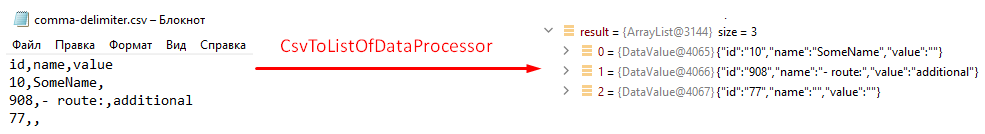
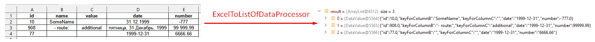
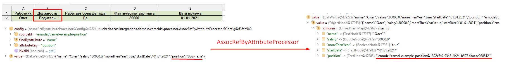

Процессоры
----------------

.. contents::
		:depth: 3

**Процессор** - это обработчик, который обрабатывает сообщение произвольным образом.

Подробнее - https://camel.apache.org/manual/processor.html

CsvToListOfDataProcessor
~~~~~~~~~~~~~~~~~~~~~~~~~

.. _CsvToListOfDataProcessor:

Данный процессор предназначен для чтения CSV-данных и преобразования их в список объектов *DataValue*:

Первая строка файла - заголовки, последующие - данные, соответствующие заголовкам

Параметры:

.. list-table::
      :widths: 10 20
      :header-rows: 1
      :class: tight-table  

      * - Key
        - Value
      * - delimiter
        - Разделитель. По умолчанию запятая

Пример:

.. code-block::

   - beans:
       - name: "csvToListOfDataProcessor"
         type: ru.citeck.ecos.camel.processor.reader.CsvToListOfDataProcessor
         properties:
           delimiter: ";"
   - route:
       from:
         uri: "file-from-camel-dsl:randomName"
         steps:
           - process:
               ref: csvToListOfDataProcessor
           - split:
               simple: "${body}"
               steps:
                 - to: ecos-records-mutate:?sourceId=emodel/camel-example-employee

ExcelToListOfDataProcessor
~~~~~~~~~~~~~~~~~~~~~~~~~~~~

.. _ExcelToListOfDataProcessor:

Данный процессор предназначен для чтения данных из формата Excel (XLSX) и преобразования их в список объектов *DataValue*:

Параметры:

.. list-table::
      :widths: 10 20
      :header-rows: 1
      :class: tight-table  

      * - Key
        - Value
      * - sheetName
        - Название листа Excel. По умолчанию используется первый лист
      * - tableStartCellReference
        - Ссылка на начальную ячейку таблицы (откуда начинается срока с заголовками).  По умолчанию "A1"
      * - customAttNames
        - Ассоциативный массив пользовательских имен атрибутов, где ключ - это буква столбца (например, "A"), а значение - желаемое имя атрибута.

Пример:

.. code-block::

   - beans:
       - name: "excelProcessor"
         type: ru.citeck.ecos.camel.processor.reader.ExcelToListOfDataProcessor
         properties:
           sheetName: SomeRandomSheetName
           tableStartCellReference: C11
           customAttNames:
             B: employeeSalary
             F: employeeManager
   - route:
       from:
         uri: "file-from-camel-dsl:randomName"
         steps:
           - process:
               ref: excelProcessor
           - split:
               simple: "${body}"
               steps:
                 - to: "ecos-records-mutate:?sourceId=emodel/camel-example-employee"

AssocRefByAttributeProcessor
~~~~~~~~~~~~~~~~~~~~~~~~~~~~~~

.. _AssocRefByAttributeProcessor:

Данный процессор принимает объект *DataValue* и на основании переданных заголовков (обязательных) находит EntityRef необходимой ассоциации и проставляет это значение в *DataValue*:

Параметры заголовков ("setHeader" должен быть под именем "AssocRefByAttributeConfig"):

.. list-table::
      :widths: 10 20
      :header-rows: 1
      :class: tight-table  

      * - Key
        - Value
      * - sourceId
        - ID источника данных где будем искать ассоциацию
      * - findByAttribute
        - Системное имя атрибута, по которому будем искать ассоциацию
      * - attributeKey
        - Название ключа атрибута в переданном DataValue

Пример:

.. code-block::

   - beans:
       - name: "csvToListOfDataProcessor"
         type: ru.citeck.ecos.camel.processor.reader.CsvToListOfDataProcessor
       - name: "assocRefByAttributeProcessor"
         type: ru.citeck.ecos.camel.processor.data.AssocRefByAttributeProcessor
   - route:
       from:
         uri: "file-from-camel-dsl:randomName"
         steps:
           - process:
               ref: csvToListOfDataProcessor
           - setHeader:
               name: AssocRefByAttributeConfig
               constant:
                 sourceId: "emodel/camel-example-position"
                 findByAttribute: "name"
                 attributeKey: "position"
           - process:
               ref: assocRefByAttributeProcessor
           - split:
               simple: "${body}"
               steps:
                 - to: "ecos-records-mutate:?sourceId=emodel/camel-example-employee"

CopyJournalSettingsProcessor
~~~~~~~~~~~~~~~~~~~~~~~~~~~~~~

.. _CopyJournalSettingsProcessor:

Данный процессор преобразует данные о шаблонах журнала, помогая тем самым перекопировать шаблоны от 1 журнала к другому.

Для его использования необходимо добавить его, с соответствующей конфигурацией, в свой конфигурационный **yml** файл:

.. code-block::

   - beans:
       - name: copyJournalSettings
         type: ru.citeck.ecos.camel.processor.data.CopyJournalSettingsProcessor
         properties:
           journalSettingMappingConfigs:
             - journalId: test-journal
               journalOldId: test-old-journal
               mapping:
                 attFieldName: attOldFieldName
             - journalId: signerType
               journalOldId: old-signerType
               mapping:
                 stTitle: old:stType
                 stDescription: old:stDescription

Где:

- **name** - Имя процессора, которое мы будем использовать в роутах Camel DSL
- **type** - Класс, на основе которого создается процессор (Неизменяемый параметр)
- **properties** - Конфигурация нашего класса. Нам необходимо заполнить переменную **journalSettingMappingConfigs**, которая является списком настроек для копирования шаблонов для журналов. Переменные настроек:

     - **journalId** - Id журнала в котором мы хотим создавать шаблоны
     - **journalOldId** - Id журнала из которого мы будем забирать шаблоны и переносить их в новый журнал
     - **mapping** - маппинг сопостовления колонок между старым журналом и новым. В качестве ключа указывается Id колонки из журнала в который мигрируем, а в качестве значения - из которого мигрируем

Далее мы просто успользуем данный процессор в своем Camel DSL роуте.

Пример полноценного роута с данным процессором:

.. code-block::

  ---
  - beans:
      - name: copyJournalSettings
        type: ru.citeck.ecos.camel.processor.data.CopyJournalSettingsProcessor
        properties:
          journalSettingMappingConfigs:
            - journalId: test-journal
              journalOldId: test-old-journal
              mapping:
                attFieldName: attOldFieldName
            - journalId: signerType
              journalOldId: old-signerType
              mapping:
                stTitle: old:stType
                stDescription: old:stDescription
  
  # copy-journal-settings
  - route:
      from:
        uri: ecos-records-sync-consumer:copy-journal-settings
        parameters:
          delay: 60000
          sourceId: uiserv/journal-settings
          predicate:
            t: and
            v:
              - t: not
                v:
                  t: ends
                  a: id
                  v: -mgr
              - t: in
                a: journalId
                v:
                  - old-signerType
          attributes:
            id: ?localId
            name: name?json
            authority: authority
            journalId: journalId
            settings: settings
        steps:
          - split:
              simple: "${body}"
              steps:
                - process:
                    ref: copyJournalSettings
                - to:
                    uri: ecos-records-mutate:?sourceId=uiserv/journal-settings

Примечания:

  - В предикате поиска мы указываем 2 предиката: **1-ый** проверяет, что **id**шаблона не заканчивается на *-mgr*, поскольку данный суфикс будут иметь перекопированные шаблоны и их не нужно обрабатывать. **2-ой** указывает список журналов из которых мы хотим брать шаблоны для перекопирования (По идее тут должны быть журналы их конфигурации процессора, которые записаны в параметры journalOldId).
  - **attributes** остаются без изменения, поскольку данные поля обрабатываются в процессоре и переносятся в новый журнал.
  - В шаге роута используется **split** чтобы обрабатывать каждый шаблон по отдельности.

CreateEcosHistoryDocumentMirrorProcessor
~~~~~~~~~~~~~~~~~~~~~~~~~~~~~~~~~~~~~~~~~~~~

.. _CreateEcosHistoryDocumentMirrorProcessor:

**Класс**

ru.citeck.ecos.camel.processor.data.CreateEcosHistoryDocumentMirrorProcessor

**Вход/Выход**

На вход принимается либо объекты конвертируемые в DataValue, либо список таких объектов.

Если на входе Collection, то на выходе List<DataValue>.

Если на входе DataValue в виде листа, то на выходе новый лист с DataValue объектами после обработки.

Если на входе объект, конвертируемый в DataValue, то на выходе новый DataValue объект после обработки. 

**Описание**

Создает связь между двумя записями **DocumentRef** и **DocumentMirrorRef** в БД ecos-history чтобы при загрузке истории для записи **DocumentMirrorRef** так же подтягивалась история записи **DocumentRef**.

При обработке сами записи истории не меняются и можно безопасно вызывать этот процессор для одной и той же записи многократно.

Процессор используется при миграции сущностей из одного хранилища в другое.

**Свойства**

.. list-table::
      :widths: 5 5 20
      :header-rows: 1
      :class: tight-table  

      * - Name
        - Тип
        - Описание
      * - documentMirrorSourceId
        - String
        - см. хидеры → CreateEcosHistoryDocumentMirrorMirrorSourceId
      * - documentMirrorRefIdPrefix
        - String
        - см. хидеры → CreateEcosHistoryDocumentMirrorDocumentMirrorRefIdPrefix
      * - documentRefIdPrefix
        - String
        - см. хидеры → CreateEcosHistoryDocumentMirrorDocumentRefIdPrefix

**Хидеры**

.. list-table::
      :widths: 5 5 10 10
      :header-rows: 1
      :class: tight-table  

      * - Name
        - Тип
        - По умолчанию
        - Описание
      * - CreateEcosHistoryDocumentMirrorConfig
        - Объект:

          .. code-block::

            documentMirrorRefIdPrefix: String = "",
            documentRefIdPrefix: String = "",
            documentMirrorSourceId: String = "",
            documentRef: String = "",
            documentMirrorRef: String = ""

        - {}
        - | Общий объект конфигурации для всех настроек, которые описаны ниже. 
          | Имеет меньший приоритет по сравнению с соответствующими хидерами ниже.
      * - CreateEcosHistoryDocumentMirrorDocumentRef
        - String
        - | Берется атрибут "id" из value и к нему  добавляется префикс, который задан в
          | documentRefIdPrefix (CreateEcosHistoryDocumentMirrorDocumentRefIdPrefix)
        - Документ, из которого мы хотим передавать историю 
      * - CreateEcosHistoryDocumentMirrorDocumentRefIdPrefix
        - String
        - ""
        - Используется для формирования полного рефа в documentRef на базе атрибута "id" в обрабатываемом значении.
      * - CreateEcosHistoryDocumentMirrorDocumentMirrorRef
        - String
        - | Берется атрибут "id" из value и к нему  добавляется префикс, который задан в
          | documentMirrorRefIdPrefix (CreateEcosHistoryDocumentMirrorDocumentMirrorRefIdPrefix)
          | Если префикс не задан или атрибут id отсутствует, то берется documentRef и у него меняется sourceId на
          | documentMirrorSourceId (CreateEcosHistoryDocumentMirrorMirrorSourceId)
        - Документ, которому мы хотим передавать историю
      * - CreateEcosHistoryDocumentMirrorDocumentMirrorRefIdPrefix
        - String
        - ""
        - Используется для формирования полного рефа в documentMirrorRef на базе атрибута "id" в обрабатываемом значении.
      * - CreateEcosHistoryDocumentMirrorMirrorSourceId
        - String
        - ""
        - Используется для формирования полного рефа в documentMirrorRef на базе значения documentRef с заменой sourceId на указанное здесь значение.

**Пример Camel YAML DSL конфига**

.. code-block::

  ---
  - beans:
      - name: createHistoryDocumentMirror
        type: ru.citeck.ecos.camel.processor.data.CreateEcosHistoryDocumentMirrorProcessor
  - route:
      from:
        uri: ecos-records-sync-consumer:alf-route-template-code
        parameters
          sourceId: alfresco/
          predicate:
            t: eq
            a: _type
            v: route-template-code
          addAuditAttributes: true
          attributes:
            id: ?localId
        steps:
          - setHeader:
              name: CreateEcosHistoryDocumentMirrorConfig
              constant:
                documentRefIdPrefix: 'alfresco/@workspace://SpacesStore/'
                documentMirrorRefIdPrefix: 'emodel/route-template-code@'
          - process:
              ref: createHistoryDocumentMirror