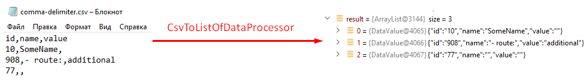
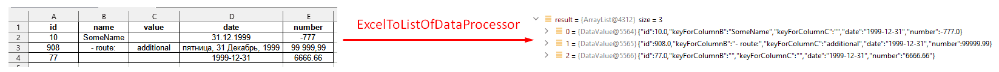
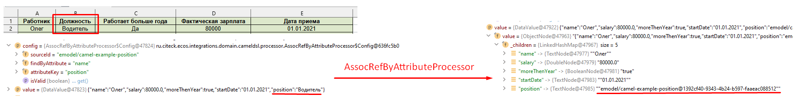

.. _camel_dsl_processors:

Процессоры
--------------------

.. contents::
   :depth: 3

**Процессор** - обработчик, который обрабатывает сообщение произвольным образом.

Подробнее - https://camel.apache.org/manual/processor.html

Процессор подключается к маршруту объявлением бина и шагом ``process``:

.. code-block:: yaml

   - beans:
       - name: myProcessor
         type: ru.citeck.ecos.camel.processor.data.ReverseArrayProcessor
         properties:
           someProperty: someValue
   - route:
       from:
         uri: .....
         steps:
           - process:
               ref: myProcessor

.. _camel_dsl_processors_binding:

Ограничения привязки свойств из yaml
~~~~~~~~~~~~~~~~~~~~~~~~~~~~~~~~~~~~~~~~

Не всякое свойство можно задать вложенной структурой yaml. Ограничения и принятые обходные пути:

.. list-table::
      :widths: 10 20
      :header-rows: 1
      :class: tight-table

      * - Что нужно задать
        - Как это делается
      * - Список значений
        - | Строкой через запятую: ``rejectedFirstBytes: "<,{"``.
          | Вложенная последовательность yaml не привязывается — загрузка маршрута завершается ошибкой *Unsupported type: SEQUENCE*.
      * - Список, элементы которого сами содержат запятую (например, регулярные выражения)
        - Строкой через точку с запятой: ``maskPatterns: "/rest/([0-9]+)/;token=([^&]+)"``.
      * - Упорядоченный набор пар «имя — значение»
        - | Строкой пар: ``fields: "a=header.A,b=header.B"``.
          | Вложенная карта привязывается плоскими ключами ``fields.<имя>`` и сортируется по имени, поэтому объявленный порядок молча теряется. Для процессоров, где порядок важен (подпись формы), это критично.
      * - Карта, порядок ключей которой не важен
        - Вложенной картой yaml, как у ``attributes`` в ``GetRecordAttsProcessor``.

.. _CsvToListOfDataProcessor:

CsvToListOfDataProcessor
~~~~~~~~~~~~~~~~~~~~~~~~~

Данный процессор предназначен для чтения CSV-данных и преобразования их в список объектов *DataValue*:

Первая строка файла - заголовки, последующие - данные, соответствующие заголовкам

Параметры:

.. list-table::
      :widths: 10 20
      :header-rows: 1
      :class: tight-table

      * - Key
        - Value
      * - delimiter
        - Разделитель. По умолчанию запятая

Пример:

.. code-block:: yaml

   - beans:
       - name: "csvToListOfDataProcessor"
         type: ru.citeck.ecos.camel.processor.reader.CsvToListOfDataProcessor
         properties:
           delimiter: ";"
   - route:
       from:
         uri: "file-from-camel-dsl:randomName"
         steps:
           - process:
               ref: csvToListOfDataProcessor
           - split:
               simple: "${body}"
               steps:
                 - to: ecos-records-mutate:?sourceId=emodel/camel-example-employee

.. _ExcelToListOfDataProcessor:

ExcelToListOfDataProcessor
~~~~~~~~~~~~~~~~~~~~~~~~~~~~

Данный процессор предназначен для чтения данных из формата Excel (XLSX) и преобразования их в список объектов *DataValue*:

Параметры:

.. list-table::
      :widths: 10 20
      :header-rows: 1
      :class: tight-table

      * - Key
        - Value
      * - sheetName
        - Название листа Excel. По умолчанию используется первый лист
      * - tableStartCellReference
        - Ссылка на начальную ячейку таблицы (откуда начинается строка с заголовками). По умолчанию "A1"
      * - lastDataRowNumber
        - Номер последней строки с данными в нумерации Excel (начиная с 1). По умолчанию -1 — читать до последней заполненной строки листа.
      * - customAttNames
        - Ассоциативный массив пользовательских имен атрибутов, где ключ - буква столбца (например, "A"), а значение - желаемое имя атрибута.

Пример:

.. code-block:: yaml

   - beans:
       - name: "excelProcessor"
         type: ru.citeck.ecos.camel.processor.reader.ExcelToListOfDataProcessor
         properties:
           sheetName: SomeRandomSheetName
           tableStartCellReference: C11
           customAttNames:
             B: employeeSalary
             F: employeeManager
   - route:
       from:
         uri: "file-from-camel-dsl:randomName"
         steps:
           - process:
               ref: excelProcessor
           - split:
               simple: "${body}"
               steps:
                 - to: "ecos-records-mutate:?sourceId=emodel/camel-example-employee"

.. _AssocRefByAttributeProcessor:

AssocRefByAttributeProcessor
~~~~~~~~~~~~~~~~~~~~~~~~~~~~~~

Данный процессор принимает объект *DataValue* и на основании переданных заголовков (обязательных) находит EntityRef необходимой ассоциации и проставляет это значение в *DataValue*:

Параметры заголовков ("setHeader" должен быть под именем "AssocRefByAttributeConfig"):

.. list-table::
      :widths: 10 20
      :header-rows: 1
      :class: tight-table

      * - Key
        - Value
      * - sourceId
        - ID источника данных где будем искать ассоциацию
      * - findByAttribute
        - Системное имя атрибута, по которому будем искать ассоциацию
      * - attributeKey
        - Название ключа атрибута в переданном DataValue

Пример:

.. code-block:: yaml

   - beans:
       - name: "csvToListOfDataProcessor"
         type: ru.citeck.ecos.camel.processor.reader.CsvToListOfDataProcessor
       - name: "assocRefByAttributeProcessor"
         type: ru.citeck.ecos.camel.processor.data.AssocRefByAttributeProcessor
   - route:
       from:
         uri: "file-from-camel-dsl:randomName"
         steps:
           - process:
               ref: csvToListOfDataProcessor
           - setHeader:
               name: AssocRefByAttributeConfig
               constant:
                 sourceId: "emodel/camel-example-position"
                 findByAttribute: "name"
                 attributeKey: "position"
           - process:
               ref: assocRefByAttributeProcessor
           - split:
               simple: "${body}"
               steps:
                 - to: "ecos-records-mutate:?sourceId=emodel/camel-example-employee"

.. _CopyJournalSettingsProcessor:

CopyJournalSettingsProcessor
~~~~~~~~~~~~~~~~~~~~~~~~~~~~~~

Данный процессор преобразует данные о шаблонах журнала, помогая тем самым перекопировать шаблоны от 1 журнала к другому.

Для его использования необходимо добавить его, с соответствующей конфигурацией, в свой конфигурационный **yml** файл:

.. code-block:: yaml

   - beans:
       - name: copyJournalSettings
         type: ru.citeck.ecos.camel.processor.data.CopyJournalSettingsProcessor
         properties:
           journalSettingMappingConfigs:
             - journalId: test-journal
               journalOldId: test-old-journal
               mapping:
                 attFieldName: attOldFieldName
             - journalId: signerType
               journalOldId: old-signerType
               mapping:
                 stTitle: old:stType
                 stDescription: old:stDescription

Где:

- **name** - Имя процессора, которое мы будем использовать в роутах Camel DSL
- **type** - Класс, на основе которого создается процессор (Неизменяемый параметр)
- **properties** - Конфигурация нашего класса. Нам необходимо заполнить переменную **journalSettingMappingConfigs**, которая является списком настроек для копирования шаблонов для журналов. Переменные настроек:

     - **journalId** - Id журнала в котором мы хотим создавать шаблоны
     - **journalOldId** - Id журнала из которого мы будем забирать шаблоны и переносить их в новый журнал
     - **mapping** - маппинг сопоставления колонок между старым журналом и новым. В качестве ключа указывается Id колонки из журнала в который мигрируем, а в качестве значения - из которого мигрируем

Далее мы просто используем данный процессор в своем Camel DSL роуте.

Пример полноценного роута с данным процессором:

.. code-block:: yaml

  ---
  - beans:
      - name: copyJournalSettings
        type: ru.citeck.ecos.camel.processor.data.CopyJournalSettingsProcessor
        properties:
          journalSettingMappingConfigs:
            - journalId: test-journal
              journalOldId: test-old-journal
              mapping:
                attFieldName: attOldFieldName
            - journalId: signerType
              journalOldId: old-signerType
              mapping:
                stTitle: old:stType
                stDescription: old:stDescription
  
  # copy-journal-settings
  - route:
      from:
        uri: ecos-records-sync-consumer:copy-journal-settings
        parameters:
          delay: 60000
          sourceId: uiserv/journal-settings
          predicate:
            t: and
            v:
              - t: not
                v:
                  t: ends
                  a: id
                  v: -mgr
              - t: in
                a: journalId
                v:
                  - old-signerType
          attributes:
            id: ?localId
            name: name?json
            authority: authority
            journalId: journalId
            settings: settings
        steps:
          - split:
              simple: "${body}"
              steps:
                - process:
                    ref: copyJournalSettings
                - to:
                    uri: ecos-records-mutate:?sourceId=uiserv/journal-settings

Примечания:

  - В предикате поиска мы указываем 2 предиката: **1-ый** проверяет, что **id**шаблона не заканчивается на *-mgr*, поскольку данный суффикс будут иметь перекопированные шаблоны и их не нужно обрабатывать. **2-ой** указывает список журналов из которых мы хотим брать шаблоны для перекопирования (По идее тут должны быть журналы их конфигурации процессора, которые записаны в параметры journalOldId).
  - **attributes** остаются без изменения, поскольку данные поля обрабатываются в процессоре и переносятся в новый журнал.
  - В шаге роута используется **split** чтобы обрабатывать каждый шаблон по отдельности.

.. _CreateEcosHistoryDocumentMirrorProcessor:

CreateEcosHistoryDocumentMirrorProcessor
~~~~~~~~~~~~~~~~~~~~~~~~~~~~~~~~~~~~~~~~~~~~

Класс
^^^^^^^^

**ru.citeck.ecos.camel.processor.data.CreateEcosHistoryDocumentMirrorProcessor**

Вход/Выход
^^^^^^^^^^^^^

На вход принимается либо объекты конвертируемые в **DataValue**, либо список таких объектов.

Если на входе **Collection**, то на выходе **List<DataValue>**.

Если на входе **DataValue** в виде листа, то на выходе новый лист с **DataValue** объектами после обработки.

Если на входе объект, конвертируемый в **DataValue**, то на выходе новый **DataValue** объект после обработки.

Описание
^^^^^^^^^^

Создает связь между двумя записями **DocumentRef** и **DocumentMirrorRef** в БД ecos-history чтобы при загрузке истории для записи **DocumentMirrorRef** так же подтягивалась история записи **DocumentRef**.

При обработке сами записи истории не меняются и можно безопасно вызывать этот процессор для одной и той же записи многократно.

Процессор используется при миграции сущностей из одного хранилища в другое.

Свойства
^^^^^^^^^^

.. list-table::
      :widths: 5 5 20
      :header-rows: 1
      :class: tight-table

      * - Name
        - Тип
        - Описание
      * - documentMirrorSourceId
        - String
        - см. хидеры → CreateEcosHistoryDocumentMirrorMirrorSourceId
      * - documentMirrorRefIdPrefix
        - String
        - см. хидеры → CreateEcosHistoryDocumentMirrorDocumentMirrorRefIdPrefix
      * - documentRefIdPrefix
        - String
        - см. хидеры → CreateEcosHistoryDocumentMirrorDocumentRefIdPrefix

Хидеры
^^^^^^^^

.. list-table::
      :widths: 5 5 10 10
      :header-rows: 1
      :class: tight-table

      * - Name
        - Тип
        - По умолчанию
        - Описание
      * - CreateEcosHistoryDocumentMirrorConfig
        - Объект:

          .. code-block:: text

            documentMirrorRefIdPrefix: String = "",
            documentRefIdPrefix: String = "",
            documentMirrorSourceId: String = "",
            documentRef: String = "",
            documentMirrorRef: String = ""

        - {}
        - | Общий объект конфигурации для всех настроек, которые описаны ниже.
          | Имеет меньший приоритет по сравнению с соответствующими хидерами ниже.
      * - CreateEcosHistoryDocumentMirrorDocumentRef
        - String
        - | Берется атрибут "id" из value и к нему добавляется префикс, который задан в
          | documentRefIdPrefix (CreateEcosHistoryDocumentMirrorDocumentRefIdPrefix)
        - Документ, из которого мы хотим передавать историю
      * - CreateEcosHistoryDocumentMirrorDocumentRefIdPrefix
        - String
        - ""
        - Используется для формирования полного рефа в documentRef на базе атрибута "id" в обрабатываемом значении.
      * - CreateEcosHistoryDocumentMirrorDocumentMirrorRef
        - String
        - | Берется атрибут "id" из value и к нему добавляется префикс, который задан в
          | documentMirrorRefIdPrefix (CreateEcosHistoryDocumentMirrorDocumentMirrorRefIdPrefix)
          | Если префикс не задан или атрибут id отсутствует, то берется documentRef и у него меняется sourceId на
          | documentMirrorSourceId (CreateEcosHistoryDocumentMirrorMirrorSourceId)
        - Документ, которому мы хотим передавать историю
      * - CreateEcosHistoryDocumentMirrorDocumentMirrorRefIdPrefix
        - String
        - ""
        - Используется для формирования полного рефа в documentMirrorRef на базе атрибута "id" в обрабатываемом значении.
      * - CreateEcosHistoryDocumentMirrorMirrorSourceId
        - String
        - ""
        - Используется для формирования полного рефа в documentMirrorRef на базе значения documentRef с заменой sourceId на указанное здесь значение.

Пример Camel YAML DSL конфига
^^^^^^^^^^^^^^^^^^^^^^^^^^^^^^^^

.. code-block:: yaml

  ---
  - beans:
      - name: createHistoryDocumentMirror
        type: ru.citeck.ecos.camel.processor.data.CreateEcosHistoryDocumentMirrorProcessor
  - route:
      from:
        uri: ecos-records-sync-consumer:alf-route-template-code
        parameters:
          sourceId: alfresco/
          predicate:
            t: eq
            a: _type
            v: route-template-code
          addAuditAttributes: true
          attributes:
            id: ?localId
        steps:
          - setHeader:
              name: CreateEcosHistoryDocumentMirrorConfig
              constant:
                documentRefIdPrefix: 'alfresco/@workspace://SpacesStore/'
                documentMirrorRefIdPrefix: 'emodel/route-template-code@'
          - process:
              ref: createHistoryDocumentMirror
.. _GetRecordAttsProcessor:

GetRecordAttsProcessor
~~~~~~~~~~~~~~~~~~~~~~~~~~~~

Класс: ``ru.citeck.ecos.camel.processor.GetRecordAttsProcessor``

Загружает заданный набор атрибутов записи, ссылка на которую лежит в теле сообщения, и заменяет тело картой атрибутов. Загрузка выполняется от имени системы.

.. list-table::
      :widths: 5 5 5 20
      :header-rows: 1
      :class: tight-table

      * - Свойство
        - Тип
        - Обязательность
        - Описание
      * - attributes
        - Map<String, String>
        - Да
        - Вложенная карта «псевдоним — схема атрибута». Порядок ключей значения не имеет

**Вход:** тело — ссылка на запись (**EntityRef** или строка, приводимая к ней).

**Выход:** тело заменяется картой загруженных атрибутов.

.. code-block:: yaml

   - beans:
       - name: getAtts
         type: ru.citeck.ecos.camel.processor.GetRecordAttsProcessor
         properties:
           attributes:
             name: _name
             created: _created

.. _EcosContentReadProcessor:

EcosContentReadProcessor
~~~~~~~~~~~~~~~~~~~~~~~~~~~~

Класс: ``ru.citeck.ecos.camel.processor.reader.EcosContentReadProcessor``

Читает содержимое записи и кладет его в тело сообщения, чтобы передать дальше по маршруту. Чтение выполняется от имени системы.

.. list-table::
      :widths: 5 5 5 20
      :header-rows: 1
      :class: tight-table

      * - Свойство
        - Тип
        - Значение по умолчанию
        - Описание
      * - contentAttribute
        - String
        - _content
        - Атрибут записи, из которого читается содержимое
      * - outputType
        - BYTE_ARRAY | STRING | BASE64
        - BYTE_ARRAY
        - | В каком виде содержимое попадет в тело: массив байт, текст или строка base64.
          | Значение разбирается с учетом регистра, неизвестное значение отклоняется при загрузке маршрута

**Вход:** тело — ссылка на запись.

**Ошибки на сообщении:** пустое тело, некорректная ссылка или отсутствующее содержимое.

.. _ListOfDataToCsvProcessor:

ListOfDataToCsvProcessor
~~~~~~~~~~~~~~~~~~~~~~~~~~~~

Класс: ``ru.citeck.ecos.camel.processor.writer.ListOfDataToCsvProcessor``

Собирает CSV из списка записей — обратная операция к :ref:`CsvToListOfDataProcessor <CsvToListOfDataProcessor>`. Типичный вход — результат ``ecos-records-query`` или ``ecos-records-sync-consumer``.

.. list-table::
      :widths: 5 5 5 20
      :header-rows: 1
      :class: tight-table

      * - Свойство
        - Тип
        - Значение по умолчанию
        - Описание
      * - columns
        - String
        -
        - | Колонки строкой через запятую: ``key`` либо ``key:Заголовок``.
          | Если не задано, колонки берутся из ключей первой записи
      * - delimiter
        - String
        - ,
        - Разделитель, ровно один символ
      * - withHeader
        - Boolean
        - true
        - Записывать ли строку заголовков
      * - recordSeparator
        - String
        - \\r\\n
        - Разделитель строк
      * - quoteMode
        - MINIMAL | ALL | NON_NUMERIC | NONE
        - MINIMAL
        - Режим экранирования кавычками
      * - escape
        - String
        -
        - | Символ экранирования, ровно один символ.
          | При ``quoteMode: NONE`` и незаданном значении используется ``\\``

**Вход:** тело — коллекция записей. Строка, не являющаяся объектом, отклоняется с указанием ее номера.

**Выход:** тело заменяется строкой CSV.

.. _MappingProcessor:

MappingProcessor
~~~~~~~~~~~~~~~~~~~~~~~~~~~~

Класс: ``ru.citeck.ecos.camel.processor.data.MappingProcessor``

Переименовывает ключи атрибутов и подменяет их значения — например, чтобы привести данные внешней системы к именам и значениям, принятым в ECOS.

.. list-table::
      :widths: 5 5 5 20
      :header-rows: 1
      :class: tight-table

      * - Свойство
        - Тип
        - Значение по умолчанию
        - Описание
      * - keysMapping
        - Map<String, String>
        - {}
        - Карта «старый ключ — новый ключ». Значение переносится, старый ключ удаляется
      * - valuesMapping
        - Map<String, Map>
        - {}
        - | Карта «атрибут — карта соответствия значений».
          | Ключ ``*`` — значение по умолчанию для всех значений, не перечисленных явно

**Вход и выход:** тело — объект, коллекция объектов или массив **DataValue**; обрабатывается каждый элемент. Значения ``null`` проходят без изменений.

.. code-block:: yaml

   - beans:
       - name: mapping
         type: ru.citeck.ecos.camel.processor.data.MappingProcessor
         properties:
           keysMapping:
             ID: id
             NAME: _name
           valuesMapping:
             status:
               NEW: draft
               "*": unknown

.. _JsonPatchOperationsProcessor:

JsonPatchOperationsProcessor
~~~~~~~~~~~~~~~~~~~~~~~~~~~~

Класс: ``ru.citeck.ecos.camel.processor.data.JsonPatchOperationsProcessor``

Применяет к каждому элементу тела последовательность операций правки JSON, позволяя менять структуру данных настройкой, а не скриптом.

.. list-table::
      :widths: 5 5 5 20
      :header-rows: 1
      :class: tight-table

      * - Свойство
        - Тип
        - Значение по умолчанию
        - Описание
      * - operations
        - List
        - []
        - | Последовательность операций. У каждой обязательно поле ``op``:
          | ``add`` — ``path``, ``value``, необязательный ``idx``;
          | ``remove`` — ``path``;
          | ``rename-key`` — ``path``, ``oldKey``, ``newKey``;
          | ``set`` — ``path``, ``value``, необязательный ``key``.
          | Неизвестное значение ``op`` отклоняется при загрузке маршрута

**Заголовок на входе:** ``JsonPatchOperations`` — дополнительные операции того же вида для одного сообщения; применяются после настроенных, после чтения заголовок удаляется из сообщения.

.. _StringValuesOperationsProcessor:

StringValuesOperationsProcessor
~~~~~~~~~~~~~~~~~~~~~~~~~~~~~~~~~~

Класс: ``ru.citeck.ecos.camel.processor.data.StringValuesOperationsProcessor``

Применяет цепочку строковых преобразований ко всем текстовым значениям в теле сообщения.

.. list-table::
      :widths: 5 5 5 20
      :header-rows: 1
      :class: tight-table

      * - Свойство
        - Тип
        - Значение по умолчанию
        - Описание
      * - operations
        - List
        - []
        - | Последовательность операций, у каждой поле ``op``: ``replace`` и ``replaceFirst`` (``substring`` либо ``substringRegex`` и ``replacement``), ``trim``, ``uppercase``, ``lowercase``, ``substringBefore``, ``substringAfter``, ``substringAfterLast`` (``delimiter``, необязательный ``missingDelimiterValue``).
          | Неизвестное значение ``op`` отклоняется при загрузке маршрута
      * - matchRegex
        - String
        -
        - Обрабатываются только значения, целиком совпадающие с этим выражением. Если не задано, обрабатываются все
      * - maxDepth
        - Int
        - 2
        - Глубина обхода вложенных объектов и массивов
      * - excludePaths
        - List<String>
        - []
        - Пути атрибутов через точку, которые пропускаются вместе с вложенными
      * - includePaths
        - List<String>
        - []
        - Если список не пуст, обрабатываются только эти пути и вложенные в них

**Заголовок на входе:** ``StringValuesOperations`` — дополнительные операции для одного сообщения; после чтения заголовок удаляется.

.. _MapAssocRefsProcessor:

MapAssocRefsProcessor
~~~~~~~~~~~~~~~~~~~~~~~~~~~~

Класс: ``ru.citeck.ecos.camel.processor.data.MapAssocRefsProcessor``

Переписывает значения ассоциаций в ссылки на записи другого источника данных. Значения, для которых соответствия не нашлось, остаются как есть — ошибки не возникает.

.. list-table::
      :widths: 5 5 5 20
      :header-rows: 1
      :class: tight-table

      * - Свойство
        - Тип
        - Значение по умолчанию
        - Описание
      * - ecosTypeToSourceIdMapping
        - Map<String, String>
        - {}
        - Карта «локальный идентификатор типа — целевой sourceId». Применяется, когда значение является объектом-ссылкой
      * - sourceIdByKeyMapping
        - Map<String, String>
        - {}
        - Карта «имя атрибута — целевой sourceId». Применяется, когда значение является строкой с локальным идентификатором
      * - ecosTypeAttribute
        - String
        - _type
        - Поле объекта-ссылки, в котором лежит тип
      * - assocRefAttribute
        - String
        - ?localId
        - Поле объекта-ссылки, в котором лежит локальный идентификатор

.. _AuthorityNameToRefProcessor:

AuthorityNameToRefProcessor
~~~~~~~~~~~~~~~~~~~~~~~~~~~~

Класс: ``ru.citeck.ecos.camel.processor.data.AuthorityNameToRefProcessor``

Заменяет имена пользователей и групп в указанных атрибутах на ссылки на соответствующие записи. Неразрешенное имя остается без изменений.

.. list-table::
      :widths: 5 5 5 20
      :header-rows: 1
      :class: tight-table

      * - Свойство
        - Тип
        - Значение по умолчанию
        - Описание
      * - attributes
        - List<String>
        - []
        - Атрибуты тела, значения которых являются именами пользователей или групп. Значение атрибута может быть строкой или массивом строк

**Заголовок на входе:** ``AuthorityNameToRefAttributes`` — дополнительные имена атрибутов для одного сообщения, строкой через запятую или списком.

.. _MutateInnerRecordsProcessor:

MutateInnerRecordsProcessor
~~~~~~~~~~~~~~~~~~~~~~~~~~~~

Класс: ``ru.citeck.ecos.camel.processor.data.MutateInnerRecordsProcessor``

Сохраняет вложенные записи, встроенные в тело под указанными атрибутами, и заменяет их ссылками на сохраненные записи. Применяется, когда вместе с основной записью приходят связанные с ней дочерние.

.. list-table::
      :widths: 5 5 5 20
      :header-rows: 1
      :class: tight-table

      * - Свойство
        - Тип
        - Значение по умолчанию
        - Описание
      * - sourceId
        - String
        -
        - | Источник данных, в котором сохраняются вложенные записи.
          | Значение можно переопределить заголовком ``MutateInnerRecordsSourceId``. Если оно не задано ни свойством, ни заголовком, обработка сообщения завершается ошибкой
      * - assocAtts
        - String либо List<String>
        - []
        - Атрибуты тела, в которых лежат вложенные записи. Строкой через запятую или списком

**Заголовки на входе:** ``MutateInnerRecordsAssocAtts`` — дополнительные атрибуты; ``MutateInnerRecordsSourceId`` — источник данных для одного сообщения.

.. _ReverseArrayProcessor:

ReverseArrayProcessor
~~~~~~~~~~~~~~~~~~~~~~~~~~~~

Класс: ``ru.citeck.ecos.camel.processor.data.ReverseArrayProcessor``

Меняет порядок элементов списка или массива в теле сообщения на обратный — например, чтобы перевернуть порядок результатов запроса. Свойств нет. Тело другого вида остается без изменений, ошибки не возникает.

.. _PrepareToMutateProcessor:

PrepareToMutateProcessor
~~~~~~~~~~~~~~~~~~~~~~~~~~~~

Класс: ``ru.citeck.ecos.camel.importdata.processor.PrepareToMutateProcessor``

Дополняет набор атрибутов записи перед сохранением: проставляет рабочее пространство и, если тип является делом (case), выставляет состояние ``draft``. Настраивается не свойствами, а заголовком сообщения.

**Заголовок на входе:** ``PrepareToMutateProcessorConfig`` — объект с полями ``typeId`` (обязателен) и ``workspace`` (необязателен).

**Ошибки на сообщении:** пустой ``typeId``; отсутствие в теле хотя бы одного ключа, похожего на идентификатор атрибута.

.. _HmacSignatureProcessor:

HmacSignatureProcessor
~~~~~~~~~~~~~~~~~~~~~~~~~~~~

Класс: ``ru.citeck.ecos.camel.processor.HmacSignatureProcessor``

Вычисляет подпись по упорядоченному набору значений и записывает ее в заголовок или в поле тела — чтобы маршрут мог подписывать исходящие запросы настройкой, а не скриптом.

Значения задаются ссылками: ``const.<литерал>``, ``header.<имя>``, ``variable.<имя>``, ``body.<поле>``, а также ``secret.username``, ``secret.password``, ``secret.token``.

.. list-table::
      :widths: 5 5 5 20
      :header-rows: 1
      :class: tight-table

      * - Свойство
        - Тип
        - Значение по умолчанию
        - Описание
      * - components
        - String
        -
        - | Обязательно. Ссылки на значения строкой через запятую, в порядке склейки перед подписью
      * - algorithm
        - sha256 | hmac-sha256
        - sha256
        - Алгоритм подписи, регистр не важен
      * - keyComponent
        - String
        -
        - Ссылка на значение ключа. Обязательна при ``algorithm: hmac-sha256``, при ``sha256`` не используется
      * - secretId
        - String
        -
        - Идентификатор секрета. Обязателен, если хотя бы одна ссылка начинается с ``secret.``
      * - signatureHeader
        - String
        -
        - Заголовок, в который записывается подпись
      * - signatureBodyField
        - String
        -
        - Поле тела, в которое записывается подпись

Должно быть задано ровно одно из ``signatureHeader`` и ``signatureBodyField``. Подпись записывается строкой шестнадцатеричных символов в нижнем регистре.

Пример: ``ecos-camel-examples/hmac-signature``.

.. _MaskedExceptionDescriberProcessor:

MaskedExceptionDescriberProcessor
~~~~~~~~~~~~~~~~~~~~~~~~~~~~~~~~~~~~

Класс: ``ru.citeck.ecos.camel.processor.MaskedExceptionDescriberProcessor``

Предназначен для обработчика ошибок маршрута. Описывает перехваченное исключение в переменные обмена, маскируя учетные данные, чтобы они не попали в журнал. Процессор никогда не бросает исключений: при отсутствии исключения он записывает значения по умолчанию, а не ломает обработчик ошибок.

.. list-table::
      :widths: 5 5 5 20
      :header-rows: 1
      :class: tight-table

      * - Свойство
        - Тип
        - Значение по умолчанию
        - Описание
      * - maskFields
        - String
        -
        - | Имена полей строкой через запятую. Скрывается значение поля в трех формах: ``поле=значение``, ``"поле": "значение"`` и ``{поле=значение}``, а также в заголовке авторизации
      * - maskPatterns
        - String
        -
        - | Регулярные выражения строкой через точку с запятой (не через запятую: запятая встречается внутри выражений).
          | Скрывается содержимое групп захвата, текст вокруг сохраняется; выражение без групп скрывается целиком
      * - variablePrefix
        - String
        -
        - Префикс имен переменных на выходе

**Переменные на выходе** (без префикса; с префиксом ``mango`` имя становится ``mangoExceptionType`` и так далее):

.. list-table::
      :widths: 10 20
      :header-rows: 1
      :class: tight-table

      * - Переменная
        - Значение
      * - exceptionType
        - Имя класса исключения, либо ``UnknownError``, если исключения нет
      * - maskedErrorMessage
        - Сообщение исключения после маскировки, либо ``No message``
      * - maskedStackTrace
        - Стек вызовов после маскировки
      * - isHttpException
        - Признак того, что в цепочке причин найден отказ http
      * - httpStatusCode
        - Код ответа. Записывается только для отказа http
      * - responseBody
        - Тело ответа после маскировки. Записывается только для отказа http

Пример: ``ecos-camel-examples/masked-exception-describer``.

.. _BinaryBodyGuardProcessor:

BinaryBodyGuardProcessor
~~~~~~~~~~~~~~~~~~~~~~~~~~~~

Класс: ``ru.citeck.ecos.camel.processor.BinaryBodyGuardProcessor``

Проверяет, что полученное тело действительно является двоичным файлом, а не страницей ошибки в html или json, отданной с кодом 200. Результат записывается в переменные обмена, исключение не бросается — маршрут сам выбирает ветку по вердикту.

.. list-table::
      :widths: 5 5 5 20
      :header-rows: 1
      :class: tight-table

      * - Свойство
        - Тип
        - Значение по умолчанию
        - Описание
      * - maxSize
        - Long
        - 0
        - | Предел размера тела в байтах, 0 — без ограничения.
          | Если тело сообщает свой размер заранее (заголовок ``Content-Length``, длина ``StreamCache``), превышение определяется до чтения тела в память
      * - rejectedContentTypes
        - String
        - text/,/json,+json,/xml,+xml,/html,+html
        - | Подстроки ``Content-Type``, при которых тело отклоняется, строкой через запятую.
          | Пустая строка отключает проверку
      * - rejectedFirstBytes
        - String
        - <,{
        - | Символы, с которых не может начинаться двоичный файл, строкой через запятую. Ведущие пробелы и BOM пропускаются.
          | Пустая строка отключает проверку
      * - variablePrefix
        - String
        - body
        - Префикс имен переменных на выходе

**Переменные на выходе** (при префиксе по умолчанию): ``bodyAccepted`` — признак того, что тело принято; ``bodyRejectReason`` — причина отказа, пустая строка при успехе; ``bodySize`` — размер тела, всегда **Long**.

**Тело на выходе:** тело, которое читается один раз (``InputStream``, ``Reader``, ``StreamCache``), заменяется прочитанными байтами, чтобы следующий шаг маршрута получил данные, а не опустошенный поток. Отклоненное тело тоже остается байтами, чтобы маршрут смог записать в журнал страницу ошибки.

Пример: ``ecos-camel-examples/binary-body-guard``.

.. _FormUrlEncodedBodyProcessor:

FormUrlEncodedBodyProcessor
~~~~~~~~~~~~~~~~~~~~~~~~~~~~

Класс: ``ru.citeck.ecos.camel.processor.FormUrlEncodedBodyProcessor``

Собирает тело ``application/x-www-form-urlencoded`` из именованных значений обмена в заданном порядке и выставляет соответствующий заголовок ``Content-Type``.

.. list-table::
      :widths: 5 5 5 20
      :header-rows: 1
      :class: tight-table

      * - Свойство
        - Тип
        - Значение по умолчанию
        - Описание
      * - fields
        - String
        -
        - | Обязательно. Пары ``<имя>=<ссылка>`` строкой через запятую, в порядке отправки.
          | Ссылки: ``const.<литерал>``, ``header.<имя>``, ``variable.<имя>``, ``body.<поле>``.
          | Ссылки ``secret.*`` запрещены — значение передается заголовком из ``{{ecos-secret:...}}``

.. warning::

  Свойство ``fields`` задается именно строкой. Вложенная карта привязывается плоскими ключами ``fields.<имя>``, которые сортируются по имени, поэтому объявленный порядок полей молча теряется — а провайдер, подписывающий форму, ожидает документированный порядок.

**Выход:** тело заменяется строкой вида ``имя=значение&имя2=значение2`` в кодировке UTF-8; заголовок ``Content-Type`` выставляется в ``application/x-www-form-urlencoded``. Значения всех полей вычисляются до замены тела, поэтому несколько ссылок ``body.*`` читают исходное тело.

Пример: ``ecos-camel-examples/form-urlencoded-body``.
