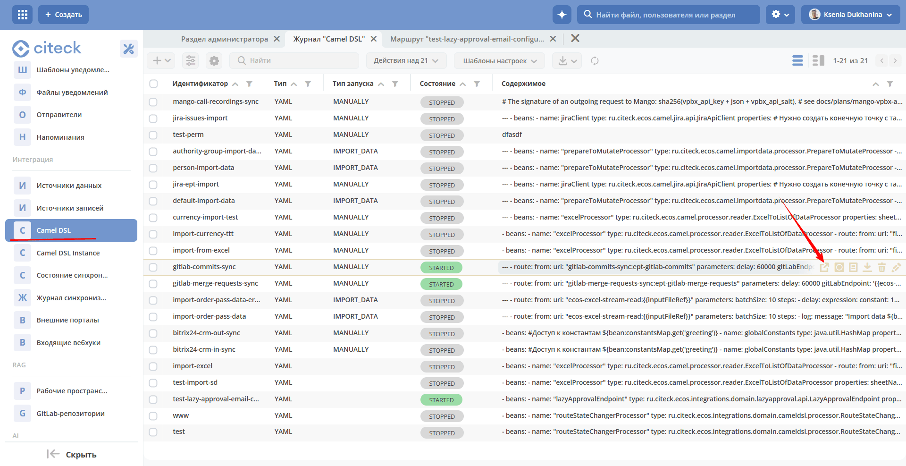
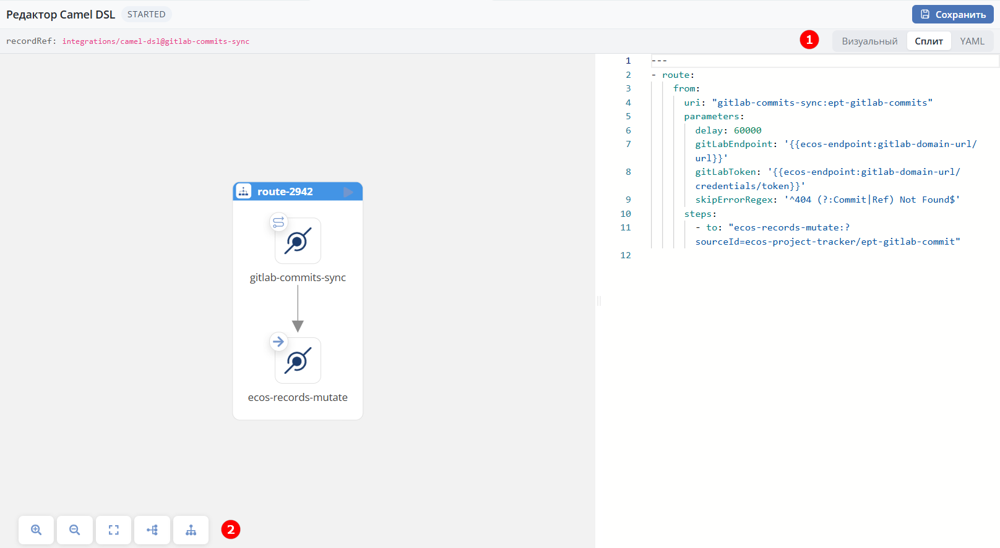
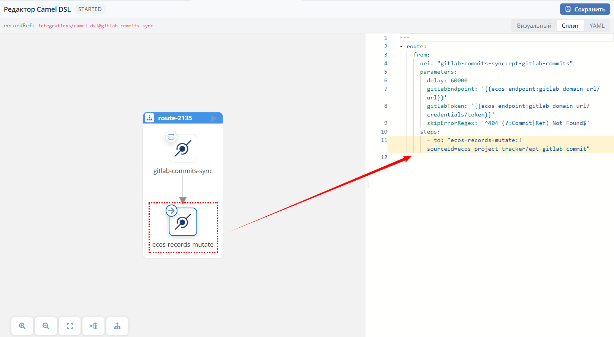
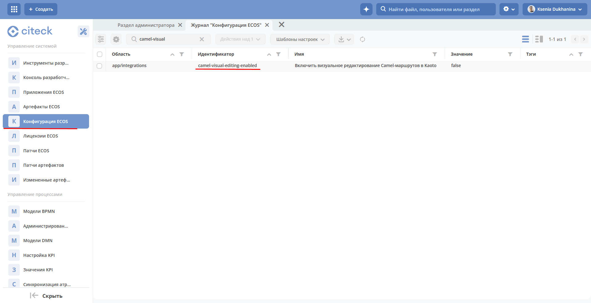

.. _camel_dsl_visual_editor:

Визуальный просмотрщик маршрутов (Kaoto)
========================================

**Визуальный просмотрщик Camel DSL** — визуальный редактор Camel-маршрутов на базе `Kaoto <https://kaoto.io>`_, встроенный в интерфейс Citeck. Он показывает маршрут в виде наглядной схемы рядом с текстовым YAML. Формат маршрута и его исполнение в ``ecos-integrations`` не меняются — это тот же Camel YAML DSL, что и в текстовой форме.

.. contents::
   :depth: 2

.. note::

   В текущей версии просмотрщик работает в режиме **только чтение** (read-only): редактирование выполняется в YAML, а схема служит «живым превью». 
   
   Полноценное визуальное редактирование (правка маршрута мышью на схеме) выключено по умолчанию и включается отдельным флагом (см. ниже).

Как открыть
-----------

Просмотрщик открывается из журнала **Camel DSL** (доступен по адресу: ``v2/journals?journalId=ecos-camel-dsl&viewMode=table&ws=admin$workspace``) действием **«Открыть в редакторе»** над записью маршрута. 

Действие открывает страницу ``/v2/camel-dsl-editor?recordRef=<ссылка-на-маршрут>`` в новой вкладке Citeck:

.. note::

 Доступ к редактору соответствует существующей модели прав: запись маршрута читается и пишется через тот же источник ``integrations/camel-dsl`` и тот же Records API, что и текстовая форма; журнал доступен только участникам рабочего пространства администратора. Просмотрщик не предоставляет дополнительных прав.

Режимы отображения
------------------

В правом верхнем углу расположен переключатель режимов **(1)**:

 - **Визуальный** — схема маршрута на всю ширину.
 - **Сплит** *(режим по умолчанию)* — слева схема, справа YAML-редактор (Monaco).
 - **YAML** — только текстовый YAML-редактор.

В режиме "только чтение" по умолчанию открывается **Сплит**: вы редактируете маршрут в YAML, а схема слева перерисовывается автоматически (с небольшой задержкой) и отражает текущее содержимое.

Панель инструментов
--------------------

В панели инструментов **(2)** доступны:

 - Увеличение и уменьшение масштаба.
 - Сброс вида.
 - Переключение раскладки схемы: горизонтальная или вертикальная.

Навигация «клик по схеме → строка YAML»
---------------------------------------

В режиме "только чтение" клик по узлу на схеме подсвечивает соответствующую строку в YAML-редакторе и прокручивает к ней. Это помогает быстро находить место шага (``from``, ``to``, ``choice`` и т. д.) в тексте маршрута. На схеме отображается бейдж **«просмотр (только чтение)»**.

Что недоступно в режиме "только чтение"
----------------------------------------

Поскольку схема работает как превью, элементы визуального редактирования скрыты: верхний тулбар (New/Undo/Redo/Copy/Export), кнопка добавления шага «+», палитра компонентов (Open Catalog), контекстное меню узла, перетаскивание узлов и панель свойств. 

Доступны навигация по схеме (масштаб, центрирование, авто-раскладка) и click-to-source. Все изменения маршрута вносятся в YAML.

Ограничения
-----------

 - **Только чтение по умолчанию.** Изменения вносятся через YAML; визуальная правка мышью выключена.
 - **Откат к текстовой форме.** Маршрут всегда можно отредактировать в стандартной форме записи Camel DSL (поле «Содержимое контекста», ACE-редактор) — она остаётся доступной и совместима по формату.
 - **Размер бандла.** Редактор подгружается лениво (~3–5 МБ) — при первом открытии возможна короткая загрузка.

Включение визуального редактирования
------------------------------------

Полноценное визуальное редактирование (запись изменений со схемы обратно в YAML) управляется флагом ``ecos-config`` ``app/integrations$camel-visual-editing-enabled`` (тип BOOLEAN, по умолчанию ``false``).

Журнал доступен по адресу: ``v2/journals?journalId=ecos-configs&viewMode=table&ws=admin$workspace``

- ``false`` (по умолчанию) — режим только чтение, описанный выше.
- ``true`` — на схеме становятся доступны палитра, добавление/перетаскивание шагов и панель свойств; изменения пишутся в YAML.

Флаг служит «выключателем» (kill-switch) и средством канареечного развертывания (Canary Deployment): его можно включить точечно на нужном стенде. Доведение режима визуального редактирования до продакшн-готовности ведётся отдельно.
