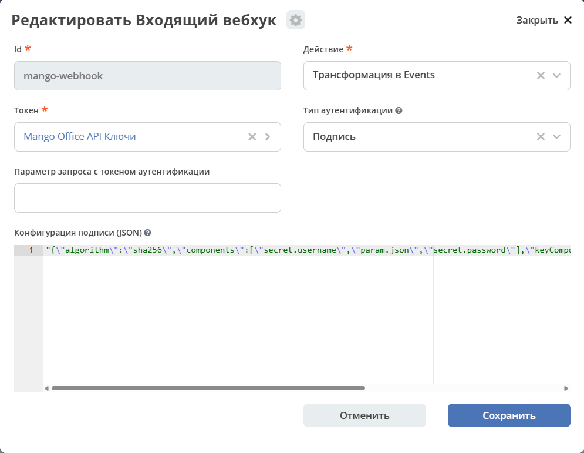

.. _mango_office_operations:

Mango Office: обработка записей звонков
=======================================

.. contents::
   :depth: 2
   :local:

Назначение и область применения
-------------------------------

Инструкция предназначена для администраторов интеграции Mango Office с CRM.

Маршрут ``mango-call-recordings-sync`` из ``ecos-integrations`` обрабатывает записи звонков:

1. Уведомление Mango поступает во входящий вебхук ``mango-webhook``.
2. Событие обрабатывается через RabbitMQ: маршрут связывает звонок с документом CRM и создаёт активность.
3. Маршрут скачивает запись звонка.
4. Вызывает STT для расшифровки и сохраняет результат.

.. note::

   AI-резюме необязательно: ошибка его формирования не отменяет сохранение записи и расшифровки.
   Ссылка на карточку звонка хранится в HTML поля ``text`` для виджета активностей.
   Блок «Работа менеджера» в форме звонка не требуется.

.. note::

   В более ранних версиях маршрута интервалы и механизм повторов отличаются от описанных в этой инструкции.

Общие механизмы описаны в разделах :ref:`webhooks` и :ref:`integration`.

Первичная настройка
-------------------

Подготовка Citeck
~~~~~~~~~~~~~~~~~

Маршрут использует общее подключение RabbitMQ платформы: отдельное подключение для Mango создавать не нужно. Маршрут сам объявляет свои очереди и exchange, поэтому у штатного подключения должны быть соответствующие права. Перед запуском убедитесь, что RabbitMQ доступен.

Для интеграции необходимы:

 * ``ecos-integrations`` с артефактами Mango и поддержкой подписи входящих вебхуков;
 * CRM с:

   * типами лидов, сделок и контрагентов;
   * вычисляемым атрибутом ``phoneDigits`` для поиска по номеру телефона;
   * рабочим пространством ``crm-workspace``;

 * тип ``call-activity`` с аспектом ``recording-aspect`` и формой записи звонка;
 * ``citeck-stt-sidecar`` с возможностью приёма сырого тела ``audio/mpeg`` на ``/transcribe-diarize``;
 * исходящий доступ из интеграции к Mango API и STT;
 * входящий публичный HTTPS-адрес для уведомлений Mango.

.. note::

   ``citeck-ai`` нужен для необязательного резюме, но не для скачивания и расшифровки.

.. note::

    Маршрут поставляется остановленным. Сначала настройте доступы и адреса, затем запускайте его.

Секрет и адреса сервисов
""""""""""""""""""""""""""

В административном разделе заполните существующие артефакты:

.. list-table::
   :header-rows: 1
   :widths: 40 60
   :class: tight-table

   * - Артефакт
     - Настройка
   * - | ``emodel/secret@mango-api``
       | Журнал доступен по адресу: ``v2/journals?journalId=endpoints&viewMode=table&ws=admin$workspace``
     - | Тип ``BASIC``. 
       | В ``username`` укажите ``vpbx_api_key``, в ``password`` — ``vpbx_api_salt`` из настроек API вашей АТС.
   * - | ``emodel/endpoint@mango-office``
       | Журнал доступен по адресу: ``v2/journals?journalId=endpoints&viewMode=table&ws=admin$workspace``
     - URL ``https://app.mango-office.ru``, credentials — ``emodel/secret@mango-api``.
   * - | ``emodel/endpoint@stt-sidecar``
       | Журнал доступен по адресу: ``v2/journals?journalId=endpoints&viewMode=table&ws=admin$workspace``
     - | Базовый URL STT, доступный из процесса интеграции. Например,
       | - ``http://citeck-stt-sidecar:8090`` в общей Docker-сети или
       | - ``http://localhost:8090``, если оба сервиса запущены на хосте.

.. note::

   Проверяйте доступность endpoint именно из той среды, где работает ``ecos-integrations``:
   ``localhost`` внутри контейнера не означает другой контейнер или хост.

Уникальный код АТС не заменяет API-ключ и соль (Salt); отдельного поля для него маршрут не требует.

.. important::

   Часть значений привязывается к Camel-контексту при его создании, поэтому одной замены
   секрета или endpoint в журнале недостаточно. После изменения секрета или endpoint
   остановите и заново запустите Camel-контекст.

Входящий вебхук
""""""""""""""""""

Поставляемый ``integrations/in-webhook@mango-webhook`` уже настроен на проверку подписи Mango.
Переводить его на token-аутентификацию или добавлять ``?token=`` к публичному адресу не требуется.

Журнал доступен по адресу: ``v2/journals?journalId=in-webhook-journal&viewMode=table&ws=admin$workspace``

Проверьте конфигурацию:

.. code-block:: yaml

   token: emodel/secret@mango-api
   actionType: toEvent
   authType: signature
   authParameter: ""
   signatureConfig:
     algorithm: sha256
     payloadParam: json
     signatureParam: sign
     components:
       - secret.username
       - param.json
       - secret.password

Маршрут пересчитывает подпись по алгоритму ``sha256`` из полей ``username`` + ``json`` + ``password`` (``components`` выше) и сверяет её со значением поля ``sign`` формы запроса. Тело события маршрут
берёт из поля ``json``. Если подпись отсутствует или не совпадает с вычисленной, запрос отклоняется.

Адрес и события в Mango
~~~~~~~~~~~~~~~~~~~~~~~

В настройках API АТС укажите **базовый адрес вебхука**, включая путь до ``mango-webhook``.
Если существующая внешняя система используется другой интеграцией, настройте отдельную запись внешней системы для Citeck, чтобы не прервать её работу.

Адрес зависит от схемы проксирования публичного HTTPS-доступа к ``ecos-integrations``:

.. tab-set::

   .. tab-item:: Через gateway

      Типовой адрес:

      .. code-block:: text

         https://<домен-стенда>/gateway/integrations/pub/webhook/mango-webhook

   .. tab-item:: Прямое проксирование

      При прямом проксировании на HTTP-порт ``ecos-integrations``:

      .. code-block:: text

         https://<публичный-домен>/pub/webhook/mango-webhook

Маршрутизация reverse proxy стенда должна соответствовать выбранному варианту.
Если сертификат публичного HTTPS-адреса выпущен публичным центром сертификации, в настройках Mango выберите проверку по доверенному сертификату.

.. note::

   Указывайте полный базовый адрес, а не только домен. К базовому адресу Mango самостоятельно
   добавляет путь события, например ``/events/summary`` или ``/events/record/added`` — эти
   суффиксы в базовое поле добавлять не нужно.

Разрешите нужные для этого сценария события:

 * ``events/summary`` — итоговая информация о звонке;
 * ``events/record/added`` — готовность файла записи.

В интерфейсе с флажками **«Не отправлять…»** соответствующие флажки должны быть **сняты**.
Промежуточные события ``events/call`` и состояние записи ``events/recording`` текущему маршруту не нужны — по ним активность не создаётся. Остальные события для этого сценария также не требуются.

Проверьте, что тестовые номера не исключены фильтром отправки событий.

Для тестового сотрудника или направления включите запись разговоров. Используемые настройки и услуги АТС должны позволять получать запись через API.
Само создание сотрудника с добавочным номером не подтверждает готовность интеграции.

Локальный стенд через HTTPS-туннель
~~~~~~~~~~~~~~~~~~~~~~~~~~~~~~~~~~~

Если ``ecos-integrations`` запущен на хосте на порту ``8082``, для временной проверки можно проксировать его через установленный ``cloudflared``:

.. code-block:: bash

   cloudflared tunnel --protocol http2 --url http://localhost:8082

Полученный публичный домен используйте с путём ``/pub/webhook/mango-webhook``.
При смене домена обновите адрес внешней системы в Mango.

.. note::

   Процесс туннеля должен работать всё время тестирования. Для постоянной эксплуатации нужен
   стабильный HTTPS-адрес — временный туннель не гарантирует непрерывную доставку.

Запуск и проверочный звонок
~~~~~~~~~~~~~~~~~~~~~~~~~~~

1. Запустите Camel-контекст ``mango-call-recordings-sync`` и проверьте состояние ``STARTED``, наличие потребителей ``mango-events`` и ``mango-recordings``.

.. note::

  Журнал доступен по адресу: ``v2/journals?journalId=ecos-camel-dsl&viewMode=table&ws=admin$workspace``

2. Выполните входящий звонок на номер АТС, ответьте, произнесите тестовую фразу и завершите разговор. Текущий сценарий обрабатывает **входящие отвеченные** звонки:
   ``call_direction=1``, ``entry_result=1``. Активность не ожидается сразу при наборе номера.
3. Проверьте получение ``summary`` и создание активности. Если номер не найден среди подходящих сделок или лидов, маршрут создаёт новый лид в ``crm-workspace``.
   Заранее заносить номер звонящего не обязательно. При нескольких совпадениях выбирается наиболее недавно изменённый подходящий документ, и добавляется отметка
   ``[mango:ambiguous]``.
4. После готовности записи проверьте ``record/added`` того же ``entryId``, скачивание, расшифровку, аудиофайл и длительность в карточке. Файл записи может появиться
   позже, чем завершится сам звонок.
5. Убедитесь, что пользователь CRM имеет доступ к рабочему пространству и документу через предусмотренные роли. Если видите ошибку «Нет доступа» — это не значит,
   что лид не был создан: проверьте ссылку, рабочее пространство и права.
6. Проверьте отсутствие новых сообщений в DLQ. Зафиксируйте ``entryId`` и ссылки на лид/сделку и активность для последующей диагностики.

Автоматические повторы
----------------------

Записи звонков
~~~~~~~~~~~~~~

Первая попытка начинается сразу после получения сообщения из ``mango-recordings``.
При ошибке, допускающей повтор, выполняются ещё пять попыток с паузами **1, 2, 5, 10 и 30 минут между попытками**. Это шесть попыток и 48 минут ожидания
плюс время скачивания, расшифровки и сохранения. Время восстановления зависимостей и доставки брокером может дополнительно увеличить этот срок.

Ожидание проходит в устойчивых quorum-очередях ``mango-recordings-retry-<delayMillis>``. При этом:

 * поток потребителя на время паузы освобождается;
 * очереди создаются при первом использовании — их отсутствие до первой ошибки нормально;
 * после истечения TTL RabbitMQ возвращает сообщение в ``mango-recordings``;
 * перезапуск приложения не сбрасывает счётчик повторов.

Исходное сообщение подтверждается только после подтверждённой публикации отложенного повтора. Если публикация не удалась, исходное сообщение остаётся необработанным для передачи в
``mango-recordings-dlq``.

.. note::

   Для этой схемы нужен RabbitMQ с поддержкой quorum at-least-once dead lettering (3.10+ с включённым ``stream_queue``), а данные брокера должны храниться на постоянном томе.

Каждая новая попытка снова скачивает и расшифровывает запись. Перед повтором маршрут проверяет активность и пропускает повтор, если запись уже успешно обработана. При ошибке сохранения
результата выполняется один отдельный повтор через 5 секунд; если он не помог, ошибка выходит на уровень обработки сообщения.

.. note::

   Доставка допускает дубли: сбой между подтверждением публикации повтора и подтверждением исходного сообщения может привести к повторной работе. Проверка завершённой активности
   не исключает одновременную обработку двух ещё не завершённых сообщений одного звонка.

Повторяющиеся ошибки
~~~~~~~~~~~~~~~~~~~~

При скачивании и вызове STT повторяются сетевые ошибки ввода-вывода, таймауты, HTTP 5xx и HTTP ``401``, ``403``, ``408``, ``425``, ``429``. При ``401``/ ``403`` администратор должен проверить доступы и настройки интеграции; повтор сам по себе неверные настройки не исправляет.

Остальные HTTP 4xx на этих этапах считаются постоянными. Автоматический повтор не назначается: при ошибке скачивания фиксируется ошибка записи; при постоянной ошибке STT маршрут сохраняет
аудио без расшифровки. Отбракованное содержимое скачанного файла также может завершить обработку со статусом ошибки без DLQ.

После исчерпания отложенных повторов маршрут пытается установить ``download-failed`` или ``transcription-failed``, а сообщение попадает в ``mango-recordings-dlq``. Если обновление активности тоже не удалось, её статус может
остаться промежуточным. Повреждённый JSON может попасть в DLQ без изменения активности: состояние звонка ещё не удалось прочитать.

.. important::

   Ошибка в карточке не всегда означает наличие сообщения в DLQ. 
   И наоборот, отсутствие статуса ошибки не гарантирует, что обработка продолжается.
   Проверяйте одновременно карточку, очереди и логи.

События и первичная публикация
~~~~~~~~~~~~~~~~~~~~~~~~~~~~~~

У ``mango-events`` отдельная политика: три повтора через 30, 60 и 120 секунд, затем ``mango-events-dlq``. Эти короткие повторы выполняются внутри обработки события,
чтобы сохранить порядок событий завершения звонка и готовности записи.

При первичной публикации уведомления в очередь предусмотрены два повтора через 500 мс. Если публикация окончательно не удалась, в лог записываются ошибка ``LOST`` и исходное уведомление
для ручного восстановления.

.. warning::

   Успешный HTTP-ответ вебхука не гарантирует последующую запись события в RabbitMQ — это окно
   потери. Автоматического восстановления таких уведомлений маршрут не выполняет.

Мониторинг маршрута администратором
------------------------------------------

.. list-table::
   :header-rows: 1
   :widths: 35 65
   :class: tight-table

   * - Объект
     - Проверка
   * - ``integrations/camel-dsl@mango-call-recordings-sync``
     - Состояние ``STARTED``; в логах нет ошибки запуска контекста.
   * - Сервисы
     - | Доступны ``ecos-integrations``, RabbitMQ, Records API, Mango API и STT.
       | Endpoint ``stt-sidecar`` доступен именно из среды запуска интеграции.
   * - ``mango-events`` и ``mango-recordings``
     - | Есть потребители, очередь не растёт непрерывно.
       | В поставляемом маршруте один потребитель событий и два потребителя записей.
   * - ``mango-recordings-retry-*``
     - | Наличие сообщений означает ожидание повторов. Обычных потребителей в этих очередях нет по замыслу.
       | Длительное накопление требует проверки целевого exchange, привязок очередей и состояния RabbitMQ.
   * - ``mango-events-dlq`` и ``mango-recordings-dlq``
     - Любое сообщение требует разбора; автоматически эти очереди не опустошаются.
   * - Карточка активности
     - | Статус записи, аудиофайл, длительность, расшифровка. 
       | Отсутствие только AI-резюме проверяется отдельно от сохранения аудио.
   * - Логи интеграции
     - | - ошибки по ``entryId`` звонка; 
       | - строки ``scheduled for retry`` с номером попытки и задержкой; 
       | - ошибки публикации, сохранения статуса и ``LOST``.

Для наблюдения за очередями используйте RabbitMQ Management выбранного стенда.
Сопоставляйте ``entryId`` из логов и сообщения с полем активности ``recording-aspect:meetingUrl``
вида ``mango://entry/<entryId>``.

.. warning::

   Не включайте API-ключи, подписи запросов и содержимое записей в общедоступные отчёты.

Восстановление из DLQ
---------------------

1. Определите звонок и причину по сообщению и логам. Сохраните исходное тело сообщения и его свойства в доступном только администраторам месте.
2. Устраните причину: восстановите STT или Records API, исправьте endpoint либо доступ к Mango. Убедитесь, что маршрут запущен и у целевой очереди есть потребитель.
3. Опубликуйте исходное тело в exchange ``mango-call-recordings`` с соответствующим routing key. Используйте persistent-сообщение и подтвердите успешную маршрутизацию и публикацию до удаления исходного сообщения из DLQ.

   .. list-table::
      :header-rows: 1
      :class: tight-table

      * - Исходная очередь
        - Routing key
      * - ``mango-events-dlq``
        - ``mango-events``
      * - ``mango-recordings-dlq``
        - ``mango-recordings``

4. Для нового бюджета повторов записи удалите заголовок ``mango-recording-retry-attempt``. Перемещение сообщения с сохранением этого
   заголовка не сбрасывает бюджет. Не меняйте ``entryId``, ``recordingId`` и ссылки на активность в JSON.
5. После подтверждённой публикации удалите исходное сообщение из DLQ. Не очищайте всю очередь командой Purge. При чтении сообщения для осмотра используйте режим
   с возвратом в очередь, чтобы не потерять его до публикации.
6. Проверьте логи обработки, состояние очередей и карточку звонка. Если запись уже завершена, ожидаемый результат — пропуск повторной обработки без новой активности.

.. warning::

   При ручной работе через Management UI не выполняйте одновременно несколько переносов одного сообщения. Для массового восстановления нужен контролируемый инструмент с
   подтверждениями публикации и учётом уже перенесённых сообщений. Обычный перенос через Shovel не следует считать сбросом счётчика повторов: отдельно проверьте заголовки.

Если ошибка постоянная и сообщение было успешно обработано со статусом ошибки, в DLQ его может не быть. После исправления причины требуется повторная подача исходного
события или сохранённого сообщения, а не только изменение статуса в карточке.

Настройка интервалов
--------------------

.. list-table::
   :header-rows: 1
   :widths: 30 30 30
   :class: tight-table

   * - Параметр
     - Значение по умолчанию
     - Назначение
   * - ``mango.recording.retryDelaysMillis``
     - ``60000,120000,300000,600000,1800000``
     - Паузы повторов записей, мс
   * - ``mango.queue.maximumRedeliveries``
     - ``3``
     - Повторы событий
   * - ``mango.queue.redeliveryDelay``
     - ``30000``
     - Первая пауза событий, мс
   * - ``mango.queue.useExponentialBackOff``
     - ``true``
     - Удвоение паузы событий
   * - ``mango.queue.maximumRedeliveryDelay``
     - ``120000``
     - Максимальная пауза событий, мс
   * - ``mango.queue.entryMaximumRedeliveries``
     - ``2``
     - Повторы первичной публикации
   * - ``mango.queue.entryRedeliveryDelay``
     - ``500``
     - Пауза первичной публикации, мс
   * - ``mango.queue.saveRetryDelay``
     - ``5000``
     - Пауза повтора сохранения, мс

Параметры разрешает Camel через JVM system properties или переменные окружения, а не через ``application.yml`` Spring. 

Пример JVM-параметра:

.. code-block:: text

   -Dmango.recording.retryDelaysMillis=60000,120000,300000,600000,1800000

После изменения параметра пересоздайте Camel-контекст. Если менялись параметры запуска JVM — перезапустите приложение целиком.

.. note::

   Уже опубликованные сообщения остаются в очередях с прежним TTL: изменение настройки не переносит их в новые очереди.

Ограничения и восстановление после простоя
------------------------------------------

 * Устойчивые сообщения, уже принятые RabbitMQ, переживают перезапуск приложения. Это не распространяется на удаление очередей или потерю данных брокера.
 * Обрыв публичного HTTPS-туннеля прерывает доставку вебхуков. Повторы записей не восстанавливают события, которые вообще не дошли до Citeck. После восстановления связи сверяйте звонки Mango с активностями CRM; не рассчитывайте на автоматическую повторную отправку пропущенных уведомлений.
 * При ошибке ``LOST`` первичной публикации восстановление выполняется из сохранённого уведомления в логах. Если уведомления нет ни в очередях, ни в логах, возврат из DLQ невозможен — сначала необходимо получить исходные данные звонка.
 * Если одна обработка длится дольше настроенного ``consumer_timeout`` RabbitMQ, брокер может закрыть канал и вернуть неподтверждённое сообщение. Для длинных записей согласуйте таймаут с максимальным временем обработки. Паузы в retry-очередях этот таймаут потребителя не расходуют.
 * Повреждённое аудио, на которое STT отвечает HTTP 500, сейчас повторяется как временная ошибка и после исчерпания попыток попадает в DLQ. Не запускайте бесконечный ручной повтор такого сообщения: сначала устраните проблему с файлом.
