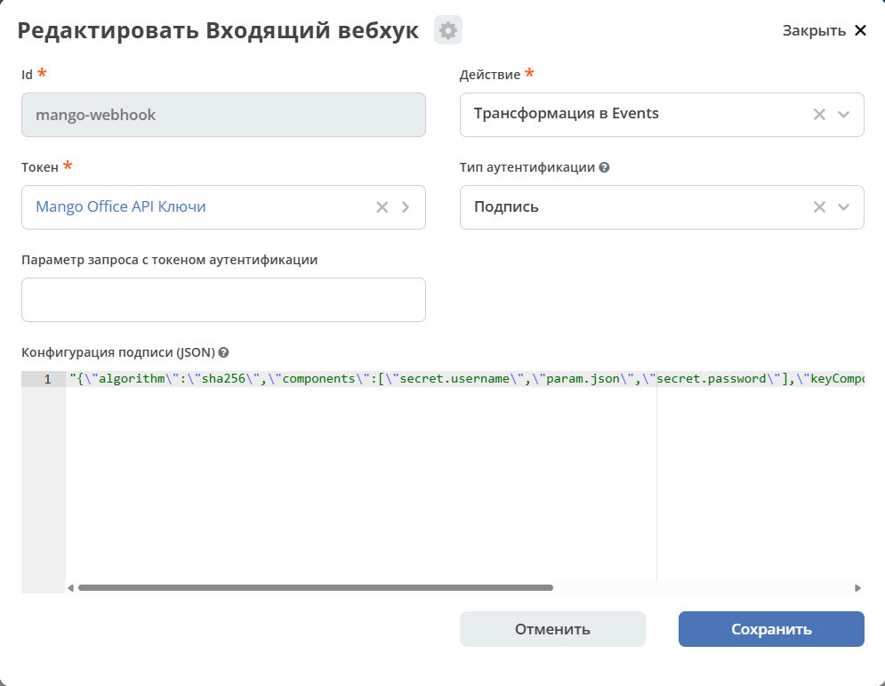

.. _mango_setup:

Подключение и настройка
=======================

.. contents::
   :depth: 2
   :local:

Требования и предварительные условия
------------------------------------

На стороне MANGO OFFICE
~~~~~~~~~~~~~~~~~~~~~~~

- Подключён API-коннектор. Для него получены код ВАТС (``vpbx_api_key``) и соль — ключ для создания подписи (``vpbx_api_salt``).
- Тариф и настройки API позволяют получать уведомления об итоге вызова (``/events/summary``) и о добавлении аудиозаписи в облако (``/events/record/added``). Доступность уведомлений зависит от тарифа, её следует уточнить у MANGO OFFICE.
- Запись разговоров включена для нужных линий и сотрудников, и аудиозаписи сохраняются в облачное хранилище. Если аудиозаписи только отправляются на почту, уведомление о записи не придёт, а аудиозапись нельзя будет получить по API.

.. note::

   Само создание сотрудника с добавочным номером не подтверждает готовность интеграции: для тестового сотрудника или направления должна быть включена запись разговоров, а используемые настройки и услуги ВАТС должны позволять получать аудиозапись через API.

На стороне Citeck
~~~~~~~~~~~~~~~~~

.. list-table::
   :header-rows: 1
   :widths: 40 40 20
   :class: tight-table

   * - Компонент
     - Назначение
     - Обязательность
   * - Микросервис ``ecos-integrations`` с артефактами MANGO OFFICE и поддержкой подписи входящих вебхуков
     - Приём уведомлений, маршрут обработки
     - Обязательно
   * - Модуль CRM
     - Типы сделок, лидов и контрагентов с вычисляемым атрибутом ``phoneDigits`` для поиска по телефону
     - Обязательно
   * - Модель данных с типом «Звонок» (``call-activity``) и аспектом ``recording-aspect``
     - Хранение звонка, аудиозаписи и расшифровки, форма карточки звонка
     - Обязательно
   * - Рабочее пространство ``crm-workspace``
     - Размещение создаваемых лидов
     - Обязательно
   * - Брокер RabbitMQ платформы
     - Очереди уведомлений и аудиозаписей
     - Обязательно
   * - Сервис распознавания речи ``citeck-stt-sidecar`` с приёмом сырого тела ``audio/mpeg`` на ``/transcribe-diarize``
     - Расшифровка аудиозаписей
     - Обязательно для обработки аудиозаписей
   * - Модуль Citeck AI (микросервис ``citeck-ai``)
     - Построение резюме
     - Необязательно

Тип «Звонок» и аспект ``recording-aspect`` поставляет модель данных платформы (``ecos-model``). Модуль ``citeck-ai`` нужен только для необязательного резюме, но не для скачивания и расшифровки. Сервис ``citeck-stt-sidecar`` и модуль Citeck AI доступны в Enterprise-версии Citeck.

Кроме того, должны выполняться следующие условия:

- **Вычисляемое поле** ``phoneDigits`` есть у сделок и лидов (из контактов) и у контрагентов, и его значение вычислено у существующих записей (см. :ref:`mango_step_crm_check`). Без него поиск по номеру ничего не находит, и на каждый звонок создаётся новый лид.
- **Брокер RabbitMQ.** Используется RabbitMQ платформы (источник данных ``main-rabbitmq``): на настроенном стенде отдельное подключение для MANGO OFFICE создавать не нужно. Перед запуском убедитесь, что RabbitMQ доступен. Условия:

  - соединение без TLS: с TLS маршрут не запускается;
  - версия RabbitMQ 3.10 или новее с включённым флагом функциональности ``stream_queue``;
  - маршрут сам объявляет свои очереди и exchange, поэтому штатному подключению нужны соответствующие права;
  - данные брокера хранятся на постоянном томе.

- **Модуль Citeck AI** предоставляет источник резюме звонков ``ai/call-summary``. Для этого в модуле включается свойство ``citeck.ai.call-recording.enabled=true``.

.. _mango_user_rights:

Права пользователей
^^^^^^^^^^^^^^^^^^^

Лиды и активности создаются от имени системы. У созданного лида менеджер не указан, поэтому роль «Менеджер» по матрице прав лида получает группа менеджеров CRM (``GROUP_crm-manager``): лид виден всей группе как неразобранный.

Администратор системы или рабочего пространства без членства в группах CRM созданные лиды не видит, поэтому проверяйте интеграцию под пользователем из группы менеджеров или администраторов CRM. Ошибка «Нет доступа» сама по себе не означает, что лид не создан: проверьте ссылку, рабочее пространство и права.

Совместимость версий
~~~~~~~~~~~~~~~~~~~~

.. important::

   Интеграция подготовлена к выпуску в ``ecos-integrations`` 2.37.0. До выхода релизов ``ecos-integrations`` 2.37.0 и библиотеки ``ecos-camel-core`` 1.16.0 документ описывает предварительную версию интеграции.

Интеграция работает только при согласованных версиях компонентов платформы. Перед подключением убедитесь, что установлены:

.. list-table::
   :header-rows: 1
   :widths: 30 25 45
   :class: tight-table

   * - Компонент
     - Версия
     - Что в ней нужно интеграции
   * - ``ecos-integrations``
     - 2.37.0 или новее
     - Артефакты интеграции MANGO OFFICE; проверка подписи входящих вебхуков и приём по вложенным путям (появились в 2.34.0)
   * - ``ecos-camel-core`` (библиотека в составе ``ecos-integrations``)
     - 1.16.0 или новее
     - Подпись запросов к API MANGO OFFICE, формирование тела запроса, проверка загруженного ответа, маскирование учётных данных в ошибках
   * - ``ecos-model``
     - Версия, поставляющая аспект ``recording-aspect`` для типа «Звонок»
     - Хранение аудиозаписи, расшифровки и статуса; форма карточки звонка
   * - CRM (``ecos-crm``, ``ecos-common-data-list``)
     - Релиз 2026.3 или новее
     - Вычисляемое поле ``phoneDigits`` у сделок, лидов и контрагентов
   * - ``citeck-stt-sidecar``
     - Сборка, принимающая ``audio/mpeg`` в теле запроса к ``/transcribe-diarize``
     - Распознавание речи
   * - ``citeck-ai`` (необязательно)
     - Версия с источником ``ai/call-summary``
     - Резюме разговора

Точные номера версий для вашей инсталляции уточните в поддержке Citeck.

.. _mango_stt_service:

Сервис распознавания речи
~~~~~~~~~~~~~~~~~~~~~~~~~

Сервис ``citeck-stt-sidecar`` распознаёт речь локальной моделью GigaAM и разделяет текст по говорящим (диаризация). Подробнее о сервисе — в статье «Микросервис для транскрипции аудио и диаризации». Требования к развёртыванию:

.. list-table::
   :header-rows: 1
   :widths: 25 75
   :class: tight-table

   * - Параметр
     - Требование
   * - Образ
     - ``harbor.citeck.ru/enterprise/citeck-stt-sidecar``
   * - Память
     - Около 1,5 ГБ после загрузки модели. Лимит памяти контейнера задавайте с запасом: при лимите 2 ГБ сервис может аварийно завершаться (код 137).
   * - Процессор
     - 1–2 ядра. Распознавание нагружает процессор, и его время растёт с длительностью разговора.
   * - Первый запуск
     - Сервис скачивает модель (около 1,5 ГБ, 3–5 минут). Чтобы не скачивать её после каждого перезапуска, подключите постоянный том для кеша моделей.
   * - Диаризация
     - Для разделения текста по говорящим задайте токен HuggingFace в переменной окружения ``HF_TOKEN``. Без него текст распознаётся, но реплики не разделяются по говорящим.
   * - Проверка
     - Запрос ``GET <адрес сервиса>/health`` возвращает ``status: ok``; значение ``diarization_available: true`` подтверждает, что разделение по говорящим работает.
   * - Вызов из маршрута
     - ``POST <адрес сервиса>/transcribe-diarize?language=ru``, mp3-файл передаётся в теле запроса с типом ``audio/mpeg``.

Сетевые требования
~~~~~~~~~~~~~~~~~~

- Входящий публичный HTTPS-адрес Citeck доступен из интернета с IP-адресов MANGO OFFICE по протоколу TLS 1.2. Другие версии протокола MANGO OFFICE не поддерживает. Путь вебхука доступен без авторизации пользователя.
- У микросервиса ``ecos-integrations`` есть исходящий HTTPS-доступ к ``app.mango-office.ru`` и к ссылкам на файлы аудиозаписей, которые выдаёт MANGO OFFICE.
- Микросервис ``ecos-integrations`` имеет сетевой доступ к сервису распознавания речи.
- Если в личном кабинете MANGO OFFICE включено ограничение IP-адресов для запросов внешней системы, в список добавлен исходящий IP-адрес Citeck. Иначе запросы на загрузку аудиозаписей будут отклоняться.

.. _mango_resources:

Ресурсы и хранилище
~~~~~~~~~~~~~~~~~~~

.. list-table::
   :header-rows: 1
   :widths: 25 75
   :class: tight-table

   * - Ресурс
     - Требование
   * - Объём хранилища
     - mp3-файл каждого обработанного звонка хранится в хранилище содержимого Citeck, поэтому объём растёт пропорционально числу и длительности звонков. Фактический размер аудиозаписи виден в логе в сообщении ``is downloaded, N bytes`` для контрольного звонка. Заложите этот рост в размер хранилища содержимого и резервных копий.
   * - Память микросервиса
     - При сохранении аудиозапись целиком находится в памяти ``ecos-integrations`` и кодируется в base64 (плюс треть объёма); одновременно обрабатываются до двух аудиозаписей. Учитывайте это при выделении памяти, если аудиозаписи близки к пределу 50 МБ.

Настройка
---------

Интеграция поставляется набором готовых артефактов. Перед запуском нужно заполнить секрет (код ВАТС и соль) и указать адрес сервиса распознавания речи для вашей инсталляции.

.. important::

   Маршрут поставляется остановленным (``STOPPED``). Сначала настройте доступы и адреса, затем запускайте маршрут, и только после этого указывайте адрес уведомлений в MANGO OFFICE. Уведомления, пришедшие при остановленном маршруте, теряются.

.. _mango_step_crm_check:

Шаг 1. Проверка данных CRM
~~~~~~~~~~~~~~~~~~~~~~~~~~

Сделку или лид интеграция ищет только по заполненному вычисляемому полю ``phoneDigits``. После установки или обновления CRM это поле вычисляется у существующих сделок, лидов и контрагентов фоновым пересчётом. Пересчёт идёт асинхронно и на больших базах занимает заметное время.

1. Выберите несколько сделок, лидов и контрагентов с заполненным телефоном и убедитесь, что у них заполнено поле ``phoneDigits`` (например, запросом Records API к этому атрибуту). Для номера ``+7 (900) 000-00-00`` значение — ``79000000000``.
2. Если у сделок, лидов или контрагентов с телефоном поле пусто, дождитесь окончания пересчёта. Если поле так и не заполнилось, администратор платформы запускает пересчёт вычисляемых атрибутов (групповое действие ``update-calculated-atts``) для сделок, лидов и контрагентов.

Пока поле не заполнено, интеграция не находит существующие сделки и лиды и на каждый звонок создаёт новый лид.

Шаг 2. Подключение API-коннектора в личном кабинете MANGO OFFICE
~~~~~~~~~~~~~~~~~~~~~~~~~~~~~~~~~~~~~~~~~~~~~~~~~~~~~~~~~~~~~~~~

1. В личном кабинете MANGO OFFICE откройте настройки API-коннектора (в зависимости от версии кабинета — «Интеграции» → «API коннектор» или «Настройки» → «API») и подключите его.
2. На странице API-коннектора скопируйте **уникальный код ВАТС** (``vpbx_api_key``) и **ключ для создания подписи** (``vpbx_api_salt``).
3. Убедитесь, что запись разговоров включена и аудиозаписи сохраняются в облачное хранилище.

Названия разделов личного кабинета приведены по документации `MANGO OFFICE VPBX API версии 1.9 <https://www.mango-office.ru/upload/api/MangoOffice_VPBX_API_v1.9.pdf>`_ и могут отличаться в текущей версии кабинета.

Шаг 3. Заполнение секрета и конечных точек
~~~~~~~~~~~~~~~~~~~~~~~~~~~~~~~~~~~~~~~~~~

В административном разделе заполните существующие артефакты (журналы **«Секреты»** и **«Конечные точки»**, Рабочее пространство «Раздел администратора» — Модель):

.. list-table::
   :header-rows: 1
   :widths: 35 65
   :class: tight-table

   * - Артефакт
     - Настройка
   * - ``emodel/secret@mango-api``
     - Тип ``BASIC``. В «Имя пользователя» (``username``) укажите код ВАТС ``vpbx_api_key``, в «Пароль» (``password``) — соль ``vpbx_api_salt`` из настроек API вашей ВАТС.
   * - ``emodel/endpoint@mango-office``
     - URL ``https://app.mango-office.ru``, учётные данные — ``emodel/secret@mango-api``.
   * - ``emodel/endpoint@stt-sidecar``
     - Базовый URL сервиса распознавания, доступный из процесса интеграции. Например, ``http://citeck-stt-sidecar:8090`` в общей Docker-сети или ``http://localhost:8090``, если оба сервиса запущены на хосте.

Адреса журналов:

- «Секреты» — ``v2/journals?journalId=ecos-secrets&viewMode=table&ws=admin$workspace``;
- «Конечные точки» — ``v2/journals?journalId=endpoints&viewMode=table&ws=admin$workspace``.

Пока секрет не заполнен, вебхук отвечает MANGO OFFICE ошибкой, а маршрут не запускается.

.. note::

   ``localhost`` внутри контейнера не означает другой контейнер или хост. Проверяйте доступность конечной точки из той же среды, где работает ``ecos-integrations``.

После любого изменения секрета или конечной точки перезапустите маршрут (см. :ref:`mango_credentials_change`).

Шаг 4. Проверка входящего вебхука
~~~~~~~~~~~~~~~~~~~~~~~~~~~~~~~~~

Поставляемый ``integrations/in-webhook@mango-webhook`` уже настроен на проверку подписи MANGO OFFICE. Переводить его на token-аутентификацию или добавлять ``?token=`` к публичному адресу не требуется. Откройте журнал **«Входящие вебхуки»** (Рабочее пространство «Раздел администратора» — Интеграция) и проверьте конфигурацию.

Журнал доступен по адресу: ``v2/journals?journalId=in-webhook-journal&viewMode=table&ws=admin$workspace``

.. tab-set::

   .. tab-item:: В YAML артефакта

      .. code-block:: yaml

         token: emodel/secret@mango-api
         actionType: toEvent
         authType: signature
         authParameter: ""
         signatureConfig:
           algorithm: sha256
           payloadParam: json
           signatureParam: sign
           components:
             - secret.username
             - param.json
             - secret.password

   .. tab-item:: В интерфейсе

      - «Тип аутентификации» — «Подпись»;
      - в поле «Токен» выбран секрет ``mango-api``;
      - «Действие» — «Трансформация в Events»;
      - «Конфигурация подписи (JSON)» — схема MANGO OFFICE:

      .. code-block:: json

         {
           "algorithm": "sha256",
           "payloadParam": "json",
           "signatureParam": "sign",
           "components": ["secret.username", "param.json", "secret.password"]
         }

В конфигурации ``components`` задаёт, из чего и в каком порядке собирается подпись, ``signatureParam`` — поле запроса с подписью, ``payloadParam`` — поле запроса, значение которого становится телом события Citeck. Как выполняется проверка подписи, описано в разделе :ref:`mango_receive`.

Идентификатор ``mango-webhook`` изменять нельзя: на него ссылается маршрут обработки.

Шаг 5. Запуск маршрута
~~~~~~~~~~~~~~~~~~~~~~

1. Откройте журнал **«Camel DSL»** (Рабочее пространство «Раздел администратора» — Интеграция). Журнал доступен по адресу: ``v2/journals?journalId=ecos-camel-dsl&viewMode=table&ws=admin$workspace``.
2. Найдите маршрут ``mango-call-recordings-sync`` и выполните действие **«Запустить»**. Действие доступно администратору.
3. Проверьте состояние ``STARTED`` и наличие потребителей у очередей ``mango-events`` и ``mango-recordings``.

При запуске маршрут сам объявляет обменник и очереди RabbitMQ. Схему маршрута можно посмотреть действием «Открыть в редакторе» в журнале Camel DSL.

.. note::

   После обновления микросервиса ``ecos-integrations`` проверьте состояние маршрута (см. :ref:`mango_after_update`).

Шаг 6. Адрес и уведомления в MANGO OFFICE
~~~~~~~~~~~~~~~~~~~~~~~~~~~~~~~~~~~~~~~~~

В настройках API ВАТС укажите **базовый адрес вебхука**, включая путь до ``mango-webhook``. Маршрутизация обратного прокси стенда должна соответствовать выбранному варианту:

.. tab-set::

   .. tab-item:: Через gateway

      .. code-block:: text

         https://<домен-стенда>/gateway/integrations/pub/webhook/mango-webhook

   .. tab-item:: Прямое проксирование на HTTP-порт ecos-integrations

      .. code-block:: text

         https://<публичный-домен>/pub/webhook/mango-webhook

При указании адреса:

- не указывайте только домен;
- к базовому адресу MANGO OFFICE добавляет путь с типом уведомления, например ``/events/summary`` или ``/events/record/added``; эти суффиксы в базовое поле не добавляются;
- для сертификата публичного центра сертификации используйте проверку доверенного сертификата;
- если существующая внешняя система используется другой интеграцией, настройте отдельную запись внешней системы для Citeck, чтобы не прервать её работу.

Перед указанием адреса проверьте его доступность из внешней сети (пример для варианта через gateway):

.. code-block:: bash

   curl -i -X POST https://<домен-стенда>/gateway/integrations/pub/webhook/mango-webhook/events/summary -d 'json={}'

Ожидаемый ответ — HTTP 401 ``Webhook signature is not valid``: запрос дошёл до Citeck и был отклонён проверкой подписи, потому что подписи в нём нет. Ответы 404, 403, 502 или перенаправление на страницу входа означают, что путь закрыт шлюзом или прокси.

Разрешите отправку уведомлений об итоге вызова ``events/summary`` и о готовности файла аудиозаписи ``events/record/added``. В интерфейсе с флажками **«Не отправлять…»** соответствующие флажки должны быть **сняты**. Промежуточные уведомления ``events/call`` и уведомления о состоянии записи ``events/recording`` текущему маршруту не нужны; по ним активность не создаётся. Остальные уведомления для этого сценария не требуются (о ``events/record/tagged`` см. :ref:`mango_delivery_limits`). Проверьте, что тестовые номера не исключены фильтром отправки уведомлений.

Если перед Citeck стоит обратный прокси или межсетевой экран, путь вебхука и все пути под ним должны быть доступны без авторизации пользователя и разрешены для IP-адресов MANGO OFFICE (см. :ref:`mango_ip_addresses`).

.. dropdown:: Локальный стенд через HTTPS-туннель
   :color: secondary

   Если ``ecos-integrations`` запущен на хосте на порту ``8082``, для временной проверки можно проксировать его через установленный ``cloudflared``:

   .. code-block:: bash

      cloudflared tunnel --protocol http2 --url http://localhost:8082

   Полученный публичный домен используйте с путём ``/pub/webhook/mango-webhook``. При смене домена обновите адрес внешней системы в MANGO OFFICE. Процесс туннеля должен работать всё время тестирования.

   Для постоянной эксплуатации нужен стабильный HTTPS-адрес; временный туннель не гарантирует непрерывную доставку.

.. _mango_step_check:

Шаг 7. Проверочный звонок
~~~~~~~~~~~~~~~~~~~~~~~~~

Проверяйте под пользователем из группы менеджеров или администраторов CRM (см. :ref:`mango_user_rights`).

1. Выполните входящий звонок на номер ВАТС, ответьте, произнесите тестовую фразу и завершите разговор. Текущий сценарий обрабатывает **входящие отвеченные** звонки: ``call_direction=1``, ``entry_result=1``. Активность не ожидается сразу при наборе номера.
2. Проверьте получение ``summary`` и создание активности «Входящий звонок ``<номер>``» в карточке сделки или лида. Если номер не найден среди подходящих сделок или лидов, маршрут создаёт новый лид в ``crm-workspace``; при необходимости удалите его после проверки. При нескольких совпадениях выбирается наиболее недавно изменённый подходящий документ и добавляется отметка ``[mango:ambiguous]``.
3. После готовности аудиозаписи проверьте ``record/added`` того же ``entry_id``, скачивание, расшифровку, аудиофайл и длительность в карточке. Файл может стать доступен позже завершения звонка.
4. Убедитесь, что пользователь CRM имеет доступ к рабочему пространству и документу через предусмотренные роли.
5. Сверьте время звонка в карточке со временем в личном кабинете MANGO OFFICE (см. :ref:`mango_call_time`). Если время отличается ровно на 3 часа, сообщите в поддержку Citeck до ввода в эксплуатацию: исправление требует доработки интеграции.
6. Проверьте отсутствие новых сообщений в ``mango-events-dlq`` и ``mango-recordings-dlq``. Зафиксируйте ``entry_id`` и ссылки на лид или сделку и активность для последующей диагностики.

Ориентиры по времени:

.. list-table::
   :header-rows: 1
   :widths: 30 70
   :class: tight-table

   * - Этап
     - Когда ожидать
   * - Активность в карточке сделки или лида
     - Через несколько секунд после окончания звонка
   * - Аудиозапись и расшифровка
     - После того как MANGO OFFICE поместит аудиозапись в облако и сервис распознавания её обработает. В зависимости от процессора распознавание занимает от нескольких секунд на минуту разговора до времени, сравнимого с длительностью разговора.
   * - Очередь в часы пик
     - Одновременно обрабатываются две аудиозаписи, остальные ждут в очереди ``mango-recordings``, поэтому статус ``downloading`` держится дольше
   * - Когда проверять
     - С учётом отложенных повторов (48 минут ожидания) статус ``downloading``, который не меняется больше полутора часов, требует проверки лога и очередей ``mango-recordings-retry-*`` и ``mango-recordings-dlq``

Если активность не появилась, воспользуйтесь разделом :ref:`mango_monitoring`.

Дополнительная настройка
------------------------

.. _mango_intervals:

Настройка интервалов повторов
~~~~~~~~~~~~~~~~~~~~~~~~~~~~~

Параметры разрешает Camel через JVM system properties или переменные окружения, а не через ``application.yml`` Spring. Перечень параметров и значения по умолчанию приведены в разделе :ref:`mango_route_params`.

.. tab-set::

   .. tab-item:: Свойство JVM

      .. code-block:: text

         -Dmango.recording.retryDelaysMillis=60000,120000,300000,600000,1800000

   .. tab-item:: Переменная окружения

      .. code-block:: text

         MANGO_QUEUE_REDELIVERYDELAY=60000

После изменения параметров обеспечьте пересоздание Camel-контекста; при изменении параметров запуска JVM перезапустите приложение.

Значения ``mango.recording.retryDelaysMillis`` должны быть положительными числами. Ошибка в этом параметре нарушает обработку сбоев аудиозаписей.

.. note::

   Уже опубликованные сообщения остаются в очередях с прежним TTL: изменение настройки не переносит их в новые очереди. Прежние очереди ``mango-recordings-retry-*`` автоматически не удаляются — после того как они опустеют, удалите их вручную.

.. _mango_resolve_rules:

Правила выбора сделки или лида
~~~~~~~~~~~~~~~~~~~~~~~~~~~~~~

Правила выбора хранятся в YAML маршрута ``mango-call-recordings-sync``, в объекте ``mangoResolvePolicy``. Их можно изменить под модель CRM вашей организации. Правила задаются параметрами ``inactiveStatuses``, ``candidatesPageSize``, ``ambiguousMarker``, ``ambiguityNoteTemplate`` и ``sourceNoteTemplates``; их назначение и значения по умолчанию приведены в разделе :ref:`mango_route_params`.

В шаблонах пометок доступны подстановки:

.. list-table::
   :header-rows: 1
   :widths: 25 75
   :class: tight-table

   * - Подстановка
     - Значение
   * - ``{number}``
     - Номер звонящего
   * - ``{names}``
     - Названия найденных сделок, лидов или контрагентов
   * - ``{chosen}``
     - Выбранная сделка, лид или контрагент

Значения ``inactiveStatuses`` и ``sourceNoteTemplates`` — JSON-словари, записанные строкой в одинарных кавычках. Ключ — идентификатор источника (``emodel/deal``, ``emodel/lead``, ``emodel/ecos-counterparty``), значение — идентификаторы статусов через запятую (для ``sourceNoteTemplates`` — текст пометки). Пример — значение ``inactiveStatuses`` по умолчанию, в котором перечислены статусы из раздела :ref:`mango_search_order`:

.. code-block:: yaml

   inactiveStatuses: '{"emodel/deal":"completed,refusal,dropout,old","emodel/lead":"disqualified,deal_creation,spam_check","emodel/ecos-counterparty":""}'

Вне ``mangoResolvePolicy`` в YAML маршрута задаются:

- порядок источников поиска;
- рабочее пространство создаваемого лида (константа ``LEAD_WORKSPACE`` в шаге ``mango-create-lead-for-call``);
- коды HTTP-ответов, при которых загрузка и распознавание аудиозаписи повторяются (``recordingFailurePolicy.retryHttpStatuses``);
- наибольший размер аудиозаписи (``mangoRecordingGuard.maxSize``).

.. dropdown:: Порядок изменения
   :color: secondary

   1. Остановите маршрут действием «Остановить» в журнале Camel DSL.
   2. Измените YAML маршрута и сохраните его.
   3. Запустите маршрут действием «Запустить».
   4. Сделайте контрольный звонок.

.. warning::

   Ошибка в правилах не мешает маршруту запуститься, но ломает обработку звонков. К таким ошибкам относятся неверный JSON, нечисловое или неположительное значение ``candidatesPageSize``, удалённые ``ambiguousMarker`` или шаблон пометки (такая ошибка проявится на первом неоднозначном совпадении). Каждое затронутое уведомление повторяется три раза, задерживая остальные уведомления до трёх с половиной минут, и уходит в ``mango-events-dlq``. После исправления верните такие уведомления из очереди недоставленных.

.. important::

   Правила хранятся в содержимом поставляемого маршрута. Если при обновлении ``ecos-integrations`` изменился поставляемый маршрут, ваши правки YAML перезаписываются (см. :ref:`mango_after_update`). Храните копию изменённого YAML вне Citeck.

.. _mango_credentials_change:

Смена учётных данных API-коннектора
~~~~~~~~~~~~~~~~~~~~~~~~~~~~~~~~~~~

После любого изменения секрета ``mango-api`` или адреса любой конечной точки сразу остановите и заново запустите маршрут ``mango-call-recordings-sync`` (действия «Остановить» и «Запустить» в журнале Camel DSL). Часть значений привязывается при создании Camel-контекста, поэтому до перезапуска MANGO OFFICE отклоняет запросы на загрузку аудиозаписей. Проверка входящих уведомлений читает секрет при каждом запросе.

Что станет со звонком, аудиозапись которого не удалось загрузить из-за такого отказа, зависит от ответа MANGO OFFICE:

- ответы 401 и 403, как и ответы 5xx, считаются временными: сообщение проходит отложенные повторы, после чего звонок получает статус ``download-failed``, а сообщение попадает в ``mango-recordings-dlq``;
- ответ с кодом ошибки MANGO OFFICE в JSON и HTTP-кодом 2xx, а также ответ с любым другим кодом 4xx считаются окончательными: звонок сразу получает статус ``download-failed``, а сообщение в очередь недоставленных не попадает.

По документации MANGO OFFICE ошибка в запросе возвращается кодом 3xxx в JSON, а ответ 401 приходит только после превышения квоты неверных запросов. Поэтому при смене учётных данных часть звонков, скорее всего, получит статус ``download-failed`` без отложенных повторов. После перезапуска маршрута верните сообщения из ``mango-recordings-dlq`` (см. :ref:`mango_dlq_restore`). Затем найдите звонки со статусом ``download-failed`` за время сбоя, сообщений которых нет в очереди недоставленных, и подайте для них уведомление о записи вручную (см. :ref:`mango_record_reupload`).

.. _mango_after_update:

Действия после обновления ecos-integrations
~~~~~~~~~~~~~~~~~~~~~~~~~~~~~~~~~~~~~~~~~~~

При обновлении микросервиса поставляемые артефакты интеграции разворачиваются заново, если в новой версии они изменились. Изменённый маршрут разворачивается с содержимым из поставки и в состоянии ``STOPPED``, поэтому ваши правки YAML (правила выбора, ``retryHttpStatuses``, ``maxSize``, рабочее пространство лида) перезаписываются. После каждого обновления:

1. Проверьте, что маршрут ``mango-call-recordings-sync`` запущен (``STARTED``).
2. Сверьте YAML маршрута с сохранённой копией своих изменений и при необходимости повторите их.
3. Проверьте адреса конечных точек ``mango-office`` и ``stt-sidecar`` и заполненность секрета ``mango-api``.
4. Сделайте контрольный звонок.

Отключение интеграции
~~~~~~~~~~~~~~~~~~~~~

1. Удалите адрес внешней системы в настройках API-коннектора в личном кабинете MANGO OFFICE.
2. Дождитесь, пока опустеют очереди ``mango-events``, ``mango-recordings`` и ``mango-recordings-retry-*``.
3. Остановите маршрут ``mango-call-recordings-sync`` действием «Остановить» в журнале Camel DSL.

.. warning::

   Если остановить маршрут, не убрав адрес в MANGO OFFICE, вебхук продолжит отвечать кодом 200, но уведомления никто не обработает. Они теряются без следа в логе, и MANGO OFFICE их не повторит. Сообщения, уже лежащие в очередях, сохраняются и обрабатываются после запуска маршрута.
