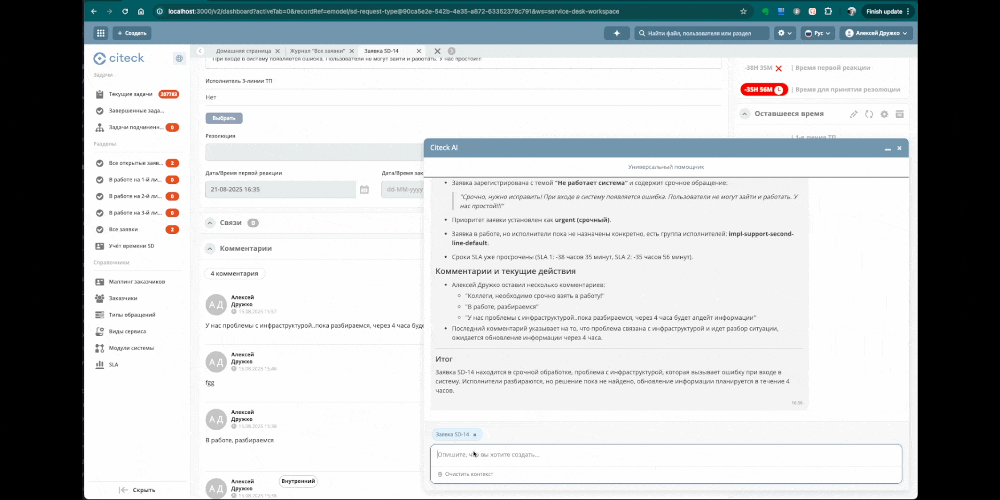
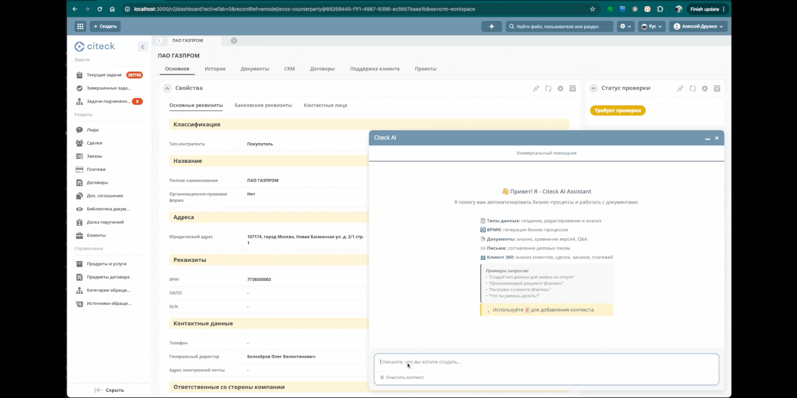

Интеллектуальный помощник
============================

.. _AI_assistant:

.. contents::
    :depth: 3

Интеллектуальный помощник для платформы Citeck с функционалом на основе искусственного интеллекта для автоматизации бизнес-процессов, работы с документами и управления данными.

.. note::

    Ассистент доступен в Enterprise версии Citeck при соблюдении следующих условий:

        1. Лицензия: наличие флага ``ai`` в лицензии
        2. Права пользователя: пользователь должен быть в группе ``GROUP_ai-feature-allowed`` или иметь права администратора/системы

.. contents::
    :depth: 3

Интерфейс пользователя
-----------------------

Основные функции UI
~~~~~~~~~~~~~~~~~~~~~

    -	**Два режима работы:** переключение между универсальным и контекстным помощником
    -	**Автокомплит с @:** быстрое добавление записей в контекст чата
    -	**Контекстные теги:** визуальное отображение добавленного контекста

Горячие клавиши
~~~~~~~~~~~~~~~~~~

    -	``Cmd+I`` (Mac) / ``Alt+I`` (Windows/Linux) - открыть/закрыть AI-ассистента
    -	``Enter`` - отправить сообщение
    -	``Shift+Enter`` - новая строка
    -	``Escape`` - закрыть чат
    -	``@`` - вызвать автокомплит для добавления контекста

Настройки
-----------

:ref:`См. подробно о конфигурации<AI_assistant_config>`

Универсальный помощник
-----------------------

Универсальный AI-ассистент с автоматическим определением намерений и контекстно-зависимым выбором инструментов.

Поддерживаемые задачи:
    -	**Ассистент по артефактам** - создание, редактирование и развертывание поддерживаемых артефактов.
    -	**Анализ документов** - извлечение информации и ответы на вопросы по документам.
    -	**Сравнение документов** - анализ различий между версиями документов.
    -   **Помощник написания писем** - составление деловых писем для лидов, клиентов и партнеров
    -   **Клиент 360** - комплексный анализ клиентов, сделок, заказов и взаимоотношений

Ассистент по артефактам
~~~~~~~~~~~~~~~~~~~~~~~~

Типы данных
""""""""""""""""""

    -	**Генерация** типов данных на основе текстового описания.
    -	**Редактирование** существующего типа данных. Для этого перейдите на карточку типа данных и добавьте `@запись` в контекст чата.
    -	**Развертывание** типа данных в системе.
    -	**Вопросы и анализ** по атрибутам, структуре и функционалу типов данных. Например: *Расскажи о чем тип данных @запись ? Какие есть атрибуты и логика?*

.. image:: _static/AI_Assistant/citeck_ai_data_type.gif
    :width: 700
    :align: center 

**Запросы:**

    * *Создай тип данных для согласования заявки на отпуск у руководителя*
    * *Добавь поле "количество дней отпуска", пусть рассчитывается автоматически*
    * *Какие атрибуты есть в типе данных @запись? Как рассчитывается атрибут количество дней отпуска?*

Анализ и сравнение документов
~~~~~~~~~~~~~~~~~~~~~~~~~~~~~~

    -	**Анализ документов** на основе их атрибутов и содержимого
    -	**Сравнение версий** документов, выделение изменений и юридических аспектов
    -	**Ответы на вопросы** по документам
    -	Возможность **указывать в контекст** несколько документов с одним типом данных

.. image:: _static/AI_Assistant/citeck_ai_document_analyse.gif
    :width: 700
    :align: center 

**Запросы:**

    * *1. Проанализируй @запись на соответствие законодательству РФ*
    * *2. Расскажи кратко, о чем этот договор?*
    * *3. Есть ли пункты, которые нарушают права сторон?*
    * *4. Предложи улучшения*

.. image:: _static/AI_Assistant/citeck_ai_document_atts_qa.gif
    :width: 700
    :align: center 

**Запросы:**

    * *В чем разница атрибутов договора @запись и @договор №4? Составь итоговую таблицу с различиями*

.. image:: _static/AI_Assistant/citeck_ai_document_content_compare.gif
    :width: 700
    :align: center 

**Запросы:**

    * *Какие были изменения в последней версии договора @запись?*
    * *Сравни версию 1.0 и 2.5 в @запись. Какие были различия?*

Помощник написания писем
~~~~~~~~~~~~~~~~~~~~~~~~~~~~~~

Составление деловых писем для различных типов получателей с персонализацией на основе истории взаимодействий.

    - **Составление деловых писем** по любой сущности из системы - для лидов, клиентов и сотрудников
    - **Персонализация писем** на основе истории взаимодействий и контекста
    - **Профессиональная подпись** с данными текущего пользователя
    - **Готовые к отправке письма** с возможностью редактирования и отправки из системы

**Запросы:**

    * *Помоги написать письмо лиду @запись*
    * *Составь ответ клиенту по поводу нашего предложения*
    * *Нужно написать деловое письмо партнеру*
    * **Измени стиль письма на более дружелюбный**
    * *Напиши письмо, необходимо проинформировать клиента о статусе его заявки в техподдержку @запись*

Клиент 360
~~~~~~~~~~~~~~~~~~

Комплексный анализ клиентов и контрагентов с полной картиной взаимодействий и бизнес-отношений.

    - **Комплексный анализ клиентов** - полная картина взаимодействий с контрагентами
    - **Анализ сделок** - статусы, суммы, успешность, тенденции развития
    - **Обзор заказов** - частота, объемы, предпочтения продуктов
    - **История платежей** - анализ платежной дисциплины и сумм
    - **Оценка взаимоотношений** - здоровье бизнес-отношений и возможности роста
    - **Анализ обращений в техподдержку** - контроль SLA и выявление проблем

**Запросы:**

    * *Расскажи о клиенте @запись*
    * *Какие у нас сделки с этим контрагентом?*
    * *Покажи все заказы клиента @запись*
    * *Какие платежи были от этого клиента?*
    * *История взаимодействий с клиентом*
    * *Полная информация по клиенту*
    * *Проведи анализ обращений клиента в техподдержку, есть ли проблемы с SLA?*

Помощник BPMN
-------------------

Специализированный помощник для работы с бизнес-процессами в BPMN-редакторе.

    -	**Генерация BPMN** - процессов из текстового описания
    -	**Редактирование BPMN** с помощью AI
    -	**Контекстная помощь** на основе текущего процесса и типа данных

.. image:: _static/AI_Assistant/citeck_ai_bpmn.gif
    :width: 700
    :align: center 

**Запросы:**

    * *Создай процесс согласования отпуска у руководителя на основе типа данных*

При генерации BPMN-процесса AI-ассистент учитывает выбранный тип данных в редакторе BPMN для указания ролей, статусов и смысловой нагрузки элементов процесса.

Контекстная работа
-------------------
Чем более детально вы сформируете свой вопрос / требования к генерации, тем более точный ответ вы получите.

Добавление контекста
~~~~~~~~~~~~~~~~~~~~

Используйте символ `@` для добавления дополнительного контекста к запросам:

    -	`@запись` - добавить данные текущей открытой записи
    -	`@имя_документа` - найти и добавить конкретный документ. На данный момент происходит поиск только по типу данных открытого документ. Например, если у вас открыт Договор, то можно искать договоры через `@договор`, `@№230` для добавления контекста.

Попробуйте создать :ref:`процесс заявки на закупку оборудования<sample_request_ai>` с помощью интеллектуального помощника.

Редактирование статей, и текстовых атрибутов у документов
-----------------------------------------------------------

Редактирование статьи:

.. list-table::
      :widths: 20 20
      :align: center

      * - |

            .. image:: _static/AI_Assistant/article_01.png
                  :width: 500
                  :align: center

        - |

            .. image:: _static/AI_Assistant/article_02.png
                  :width: 500
                  :align: center

Редактирование текстовых атрибутов у документов:

.. list-table::
      :widths: 20 20 20
      :align: center

      * - |

            .. image:: _static/AI_Assistant/text_01.png
                  :width: 500
                  :align: center

        - |

            .. image:: _static/AI_Assistant/text_02.png
                  :width: 500
                  :align: center

        - |

            .. image:: _static/AI_Assistant/text_03.png
                  :width: 500
                  :align: center

Демо видео по работе с ассистентом
-------------------------------------

`Проверка на спам Лидов <https://disk.360.yandex.ru/i/TYXthCoKRs_gHg>`_

`Клиент 360 <https://disk.360.yandex.ru/i/KcQgICKuFfXQUQ>`_

`Помощник написания писем <https://disk.360.yandex.ru/i/KbRBAAXBXSOhbw>`_

