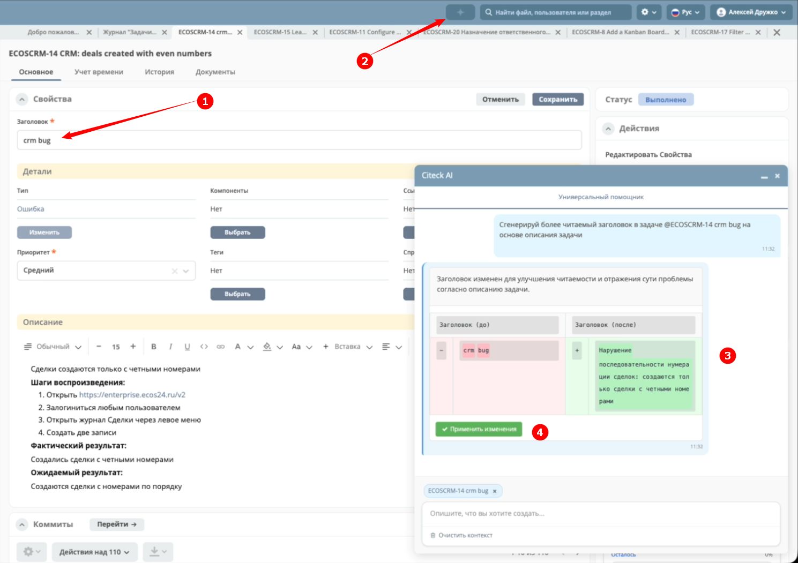
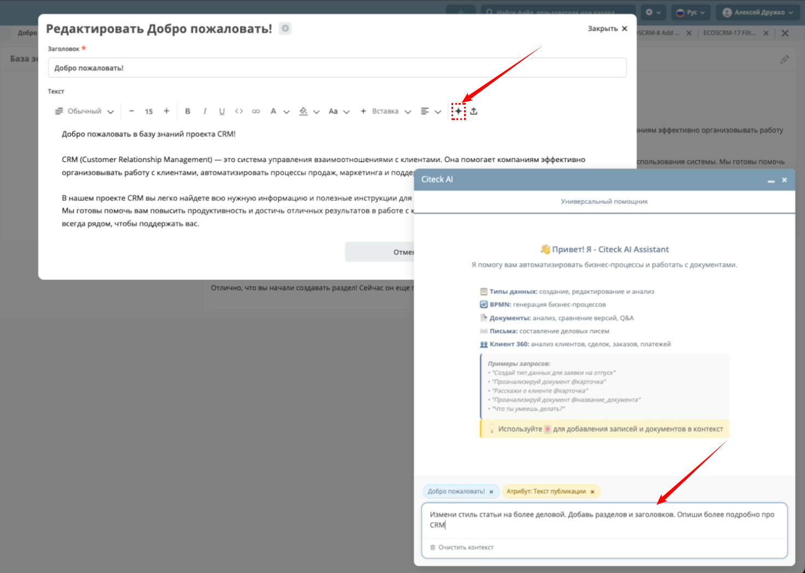
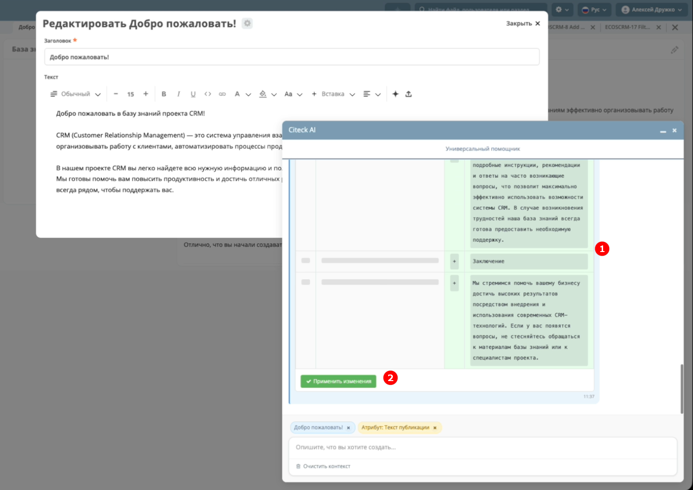
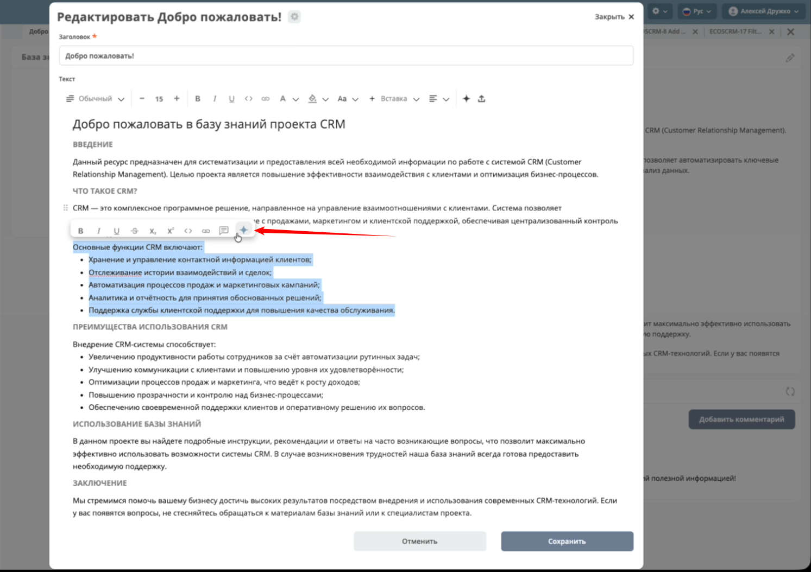
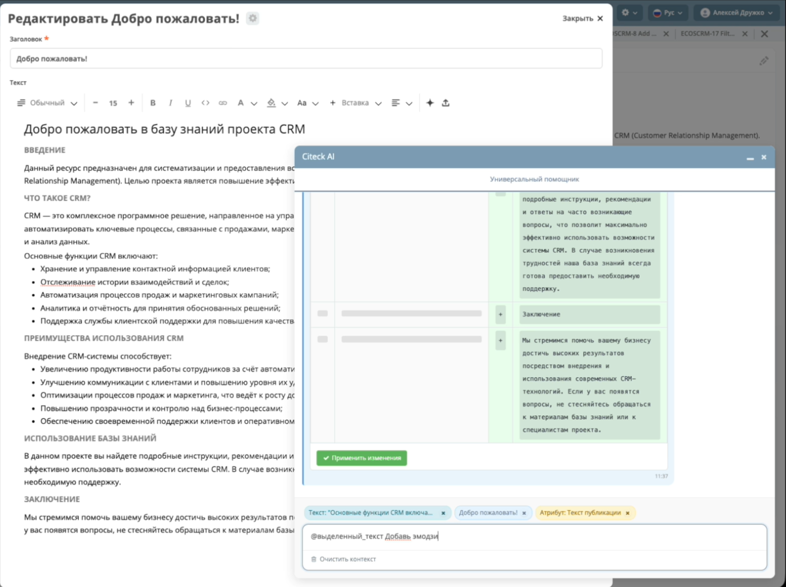
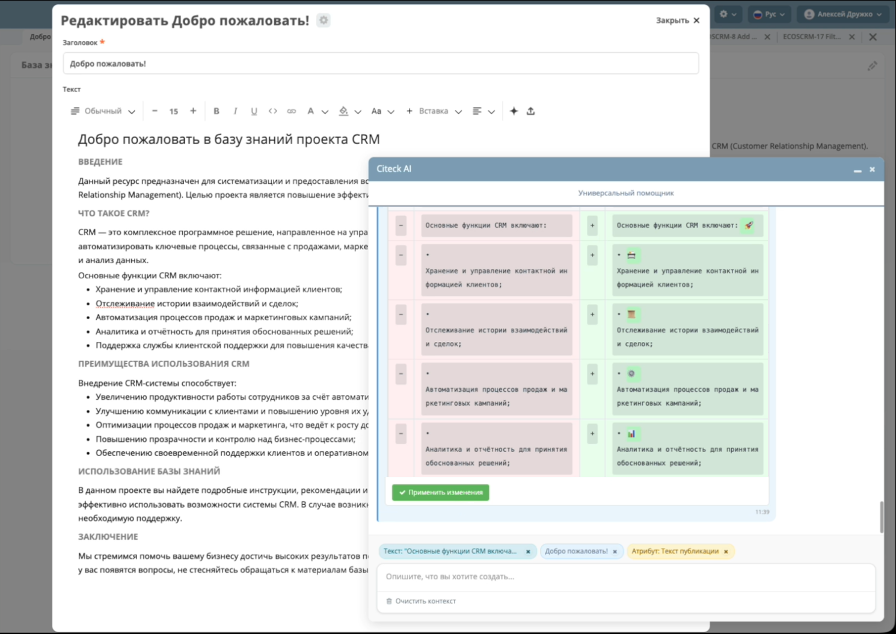

.. _AI_assistant:

Интеллектуальный помощник
============================

.. contents::
    :depth: 3

Интеллектуальный помощник для платформы Citeck с функционалом на основе искусственного интеллекта для автоматизации бизнес-процессов, работы с документами и управления данными.

.. note::

    Ассистент доступен в Enterprise версии Citeck при соблюдении следующих условий:

        1. **Лицензия:** наличие флага ``ai`` в лицензии
        2. **Права пользователя:** пользователь должен быть в группе ``GROUP_ai-feature-allowed`` или иметь права администратора/системы
        3. **Микросервис:** подключен и настроен микросервис ``ecos-ai`` (:ref:`см. конфигурацию<AI_assistant_config>`)

Интерфейс пользователя
-----------------------

Основные функции UI
~~~~~~~~~~~~~~~~~~~~~

    -	**Два режима работы:** переключение между универсальным и контекстным помощником
    -	**Автокомплит с @:** быстрое добавление записей в контекст чата
    -	**Контекстные теги:** визуальное отображение добавленного контекста

Горячие клавиши
~~~~~~~~~~~~~~~~~~

    -	``Cmd+I`` (Mac) / ``Alt+I`` (Windows/Linux) - открыть/закрыть AI-ассистента
    -	``Enter`` - отправить сообщение
    -	``Shift+Enter`` - новая строка
    -	``Escape`` - закрыть чат
    -	``@`` - вызвать автокомплит для добавления контекста

Настройки
-----------

:ref:`См. подробно о конфигурации<AI_assistant_config>`

Универсальный помощник
-----------------------

Универсальный AI-ассистент с автоматическим определением намерений и контекстно-зависимым выбором инструментов.

Поддерживаемые задачи:
    -	**Ассистент по артефактам** - создание, редактирование и развертывание поддерживаемых артефактов.
    -	**Генерация бизнес-приложений** - создание полноценных приложений с типами данных и процессами из текстового описания.
    -	**Ассистент написания скриптов** - создание и редактирование скриптов для различных контекстов Citeck.
    -	**Анализ документов** - извлечение информации и ответы на вопросы по документам.
    -	**Сравнение документов** - анализ различий между версиями документов.
    -   **Помощник написания писем** - составление деловых писем для лидов, клиентов и партнеров.
    -   **Клиент 360** - комплексный анализ клиентов, сделок, заказов и взаимоотношений.

Ассистент по артефактам
~~~~~~~~~~~~~~~~~~~~~~~~

Типы данных
""""""""""""""""""

    -	**Генерация** типов данных на основе текстового описания.
    -	**Редактирование** существующего типа данных. Для этого перейдите на карточку типа данных и добавьте `@запись` в контекст чата.
    -	**Развертывание** типа данных в системе.
    -	**Вопросы и анализ** по атрибутам, структуре и функционалу типов данных. Например: *Расскажи о чем тип данных @запись ? Какие есть атрибуты и логика?*

**Запросы:**

    * *Создай тип данных для согласования заявки на отпуск у руководителя*
    * *Добавь поле "количество дней отпуска", пусть рассчитывается автоматически*
    * *Какие атрибуты есть в типе данных @запись? Как рассчитывается атрибут количество дней отпуска?*

Генерация бизнес-приложений
~~~~~~~~~~~~~~~~~~~~~~~~~~~~

Создание полноценных бизнес-приложений из текстового описания с автоматической генерацией всех необходимых компонентов.

    - **Генерация приложений** - создание полноценных бизнес-приложений из текстового описания
    - **Типы данных** - автоматическое создание типов данных с атрибутами, ролями и статусами
    - **BPMN-процессы** - генерация бизнес-процессов для автоматизации логики
    - **Связанные сущности** - поддержка нескольких связанных типов данных в одном приложении
    - **Уточняющие вопросы** - интерактивный диалог для сбора недостающей информации
    - **Развертывание** - автоматическое развертывание созданных артефактов в системе

**Процесс работы:**

    1. Опишите бизнес-требования на естественном языке
    2. AI проанализирует запрос и при необходимости задаст уточняющие вопросы
    3. Система предложит структуру приложения с типами данных и процессами
    4. Подтвердите или запросите изменения
    5. AI автоматически создаст и развернет все компоненты в системе

.. raw:: html

   

   <iframe width="1280" height="720" src="https://vkvideo.ru/video_ext.php?oid=-235732609&id=456239021&hash=8f720b604b36dfaa&hd=3" allow="autoplay; encrypted-media; fullscreen; picture-in-picture; screen-wake-lock;" frameborder="0" allowfullscreen></iframe>
   

**Запросы:**

    * *Создай приложение для управления заявками на отпуск*
    * *Мне нужна система бронирования переговорных комнат*
    * *Сделай приложение для согласования командировок с руководителем и бухгалтерией*
    * *Создай систему учета оборудования с возможностью резервирования*

Ассистент написания скриптов
~~~~~~~~~~~~~~~~~~~~~~~~~~~~~

Специализированный помощник для создания и редактирования скриптов в Citeck ECOS.

Как использовать
"""""""""""""""""

1. Откройте любой редактор скриптов (BPMN Script Task, вычисляемый атрибут и др.)
2. Нажмите на кнопку AI-ассистента в правом нижнем углу редактора
3. В появившемся поле ввода опишите, что должен делать скрипт, или выберите быстрое действие
4. Ассистент сгенерирует код с подробным объяснением логики

**Поддерживаемые контексты:**

    - **BPMN Script Task** — скрипты внутри бизнес-процессов
    - **Gateway / Sequence Flow Condition** — условия маршрутизации процессов
    - **Computed Attribute** — вычисляемые атрибуты типов данных
    - **Computed Role** — динамическое определение участников ролей
    - **UI Action Script** — клиентские скрипты действий
    - **Journal Formatter** — форматирование ячеек журналов

**Возможности:**

    - **Генерация скриптов** на основе текстового описания
    - **Редактирование** и улучшение существующих скриптов
    - **Быстрые действия:** объяснение кода, исправление ошибок, оптимизация
    - **Валидация API** - проверка использования только доступных API для контекста
    - **Контекстно-зависимая генерация** - учёт метаданных типа данных, атрибутов, ролей и статусов

.. raw:: html

   

   <iframe src="https://vkvideo.ru/video_ext.php?oid=-235732609&id=456239026&hash=80fe89f1271502c9&hd=3" width="1280" height="720" allow="autoplay; encrypted-media; fullscreen; picture-in-picture; screen-wake-lock;" frameborder="0" allowfullscreen></iframe>
   

**Запросы:**

    * *Напиши скрипт для BPMN задачи, который отправляет уведомление руководителю*
    * *Создай вычисляемый атрибут для расчета суммы заказа*
    * *Объясни что делает этот скрипт*
    * *Исправь ошибки в скрипте*
    * *Оптимизируй этот скрипт*

Анализ и сравнение документов
~~~~~~~~~~~~~~~~~~~~~~~~~~~~~~

    -	**Анализ документов** на основе их атрибутов и содержимого
    -	**Сравнение версий** документов, выделение изменений и юридических аспектов
    -	**Ответы на вопросы** по документам
    -	Возможность **указывать в контекст** несколько документов с одним типом данных

**Запросы (анализ документа):**

    * *Проанализируй @запись на соответствие законодательству РФ*
    * *Расскажи кратко, о чем этот договор?*
    * *Есть ли пункты, которые нарушают права сторон?*
    * *Предложи улучшения*

**Запросы (сравнение документов):**

    * *В чем разница атрибутов договора @запись и @договор №4? Составь итоговую таблицу с различиями*

**Запросы (сравнение версий):**

    * *Какие были изменения в последней версии договора @запись?*
    * *Сравни версию 1.0 и 2.5 в @запись. Какие были различия?*

.. raw:: html

   

   <iframe width="1280" height="720" src="https://vkvideo.ru/video_ext.php?oid=-235732609&id=456239017&hash=9131b0c0e337c378&hd=3" allow="autoplay; encrypted-media; fullscreen; picture-in-picture; screen-wake-lock;" frameborder="0" allowfullscreen></iframe>
   

Помощник написания писем
~~~~~~~~~~~~~~~~~~~~~~~~~~~~~~

Составление деловых писем для различных типов получателей с персонализацией на основе истории взаимодействий.

    - **Составление деловых писем** по любой сущности из системы - для лидов, клиентов и сотрудников
    - **Персонализация писем** на основе истории взаимодействий и контекста
    - **Профессиональная подпись** с данными текущего пользователя
    - **Готовые к отправке письма** с возможностью редактирования и отправки из системы

.. raw:: html

   

   <iframe width="1280" height="720" src="https://vkvideo.ru/video_ext.php?oid=-235732609&id=456239018&hash=0a539e43586fc87b&hd=3" allow="autoplay; encrypted-media; fullscreen; picture-in-picture; screen-wake-lock;" frameborder="0" allowfullscreen></iframe>
   

**Запросы:**

    * *Помоги написать письмо лиду @запись*
    * *Составь ответ клиенту по поводу нашего предложения*
    * *Нужно написать деловое письмо партнеру*
    * *Измени стиль письма на более дружелюбный*
    * *Напиши письмо, необходимо проинформировать клиента о статусе его заявки в техподдержку @запись*

Клиент 360
~~~~~~~~~~~~~~~~~~

Комплексный анализ клиентов и контрагентов с полной картиной взаимодействий и бизнес-отношений.

    - **Комплексный анализ клиентов** - полная картина взаимодействий с контрагентами
    - **Анализ сделок** - статусы, суммы, успешность, тенденции развития
    - **Обзор заказов** - частота, объемы, предпочтения продуктов
    - **История платежей** - анализ платежной дисциплины и сумм
    - **Оценка взаимоотношений** - здоровье бизнес-отношений и возможности роста
    - **Анализ обращений в техподдержку** - контроль SLA и выявление проблем

.. raw:: html

   

   <iframe width="1280" height="720" src="https://vkvideo.ru/video_ext.php?oid=-235732609&id=456239024&hash=a4b8c3cf93be71ba&hd=3" allow="autoplay; encrypted-media; fullscreen; picture-in-picture; screen-wake-lock;" frameborder="0" allowfullscreen></iframe>
   

**Запросы:**

    * *Расскажи о клиенте @запись*
    * *Какие у нас сделки с этим контрагентом?*
    * *Покажи все заказы клиента @запись*
    * *Какие платежи были от этого клиента?*
    * *История взаимодействий с клиентом*
    * *Полная информация по клиенту*
    * *Проведи анализ обращений клиента в техподдержку, есть ли проблемы с SLA?*

Помощник BPMN
-------------------

Специализированный помощник для работы с бизнес-процессами в BPMN-редакторе.

    -	**Генерация BPMN** - процессов из текстового описания
    -	**Редактирование BPMN** с помощью AI
    -	**Контекстная помощь** на основе текущего процесса и типа данных

**Запросы:**

    * *Создай процесс согласования отпуска у руководителя на основе типа данных*

При генерации BPMN-процесса AI-ассистент учитывает выбранный тип данных в редакторе BPMN для указания ролей, статусов и смысловой нагрузки элементов процесса.

**Видео: BPMN AI Task**

.. raw:: html

   

   <iframe width="1280" height="720" src="https://vkvideo.ru/video_ext.php?oid=-235732609&id=456239019&hash=dfd7713ac1f8c550&hd=3" allow="autoplay; encrypted-media; fullscreen; picture-in-picture; screen-wake-lock;" frameborder="0" allowfullscreen></iframe>
   

**Видео: Реализация спам-проверки через BPMN AI Task**

.. raw:: html

   

   <iframe width="1280" height="720" src="https://vkvideo.ru/video_ext.php?oid=-235732609&id=456239020&hash=cbd2e6d45050d407&hd=3" allow="autoplay; encrypted-media; fullscreen; picture-in-picture; screen-wake-lock;" frameborder="0" allowfullscreen></iframe>
   

Контекстная работа
-------------------
Чем более детально вы сформируете свой вопрос / требования к генерации, тем более точный ответ вы получите.

Добавление контекста
~~~~~~~~~~~~~~~~~~~~

Используйте символ `@` для добавления дополнительного контекста к запросам:

    -	`@запись` - добавить данные текущей открытой записи
    -	`@имя_документа` - найти и добавить конкретный документ по названию или номеру.

.. note::

    Поиск по `@` выполняется только среди записей того же типа данных, что и текущий открытый документ. Например, если открыт Договор — можно искать другие договоры через `@договор №230`.

Попробуйте создать :ref:`процесс заявки на закупку оборудования<sample_request_ai>` с помощью интеллектуального помощника.

**Видео: Пример создания заявки на закупку оборудования**

.. raw:: html

   

   <iframe width="1280" height="720" src="https://vkvideo.ru/video_ext.php?oid=-235732609&id=456239022&hash=e6b630c0043c6cc7&hd=3" allow="autoplay; encrypted-media; fullscreen; picture-in-picture; screen-wake-lock;" frameborder="0" allowfullscreen></iframe>
   

Редактирование текста
----------------------

Помощник по редактированию текста имеет 2 функции: 

    - **редактирование любого атрибута** документа; 
    - **интеграция с редактором Lexical.**

Помощник позволяет писать новые статьи, редактировать их, изменять текущий текст, улучшать описание задач, улучшать заголовки и прочее для работы с текстом.

Редактирование текстовых атрибутов документа
~~~~~~~~~~~~~~~~~~~~~~~~~~~~~~~~~~~~~~~~~~~~~~~~~~~~

Например, улучшим **заголовок задачи** **(1)**. 

Вызовем **ассистента** **(2)** и попросим его сгенерировать более понятный заголовок. Результат будет выдан в виде **diff-view** (наглядные различия между двумя наборами данных) **(3)**. При нажатии кнопки **Применить изменения** **(4)** будет отправлен update-запрос на изменение заголовка.

Интеграция с редактором Lexical
~~~~~~~~~~~~~~~~~~~~~~~~~~~~~~~~~~~~

Вызов ассистента доступен из Lexical-редактора. Редактор используется, например, в виджете «Свойства», «Комментарии», «Активности», при редактировании публикаций, статей в базе знаний.

В редакторе необходимо вызвать ассистент и попросить его, например, изменить стиль статьи, что-то добавить или изменить:

Результат так же будет выдан в виде **diff-view** **(1)**, где показано что конкретно было изменено. В данном режиме работы при нажатии кнопки **Применить изменения** **(2)** текст сразу подставляется в текущий редактор, чтобы его можно было дальше подредактировать, изменить и уже потом сохранить статью.

Точечное редактирование текста
~~~~~~~~~~~~~~~~~~~~~~~~~~~~~~~~~

Можно выделить какой-то абзац и вызвать помощника именно для этого абзаца:

В таком случае будет изменен только выделенный текст. Например, попросим добавить эмодзи в текст, который выделили:

Результат так же будет выдан в виде **diff-view** **(1)**, где показано что конкретно было изменено, далее **применяем изменения** **(2)** и сохраняем статью. 

