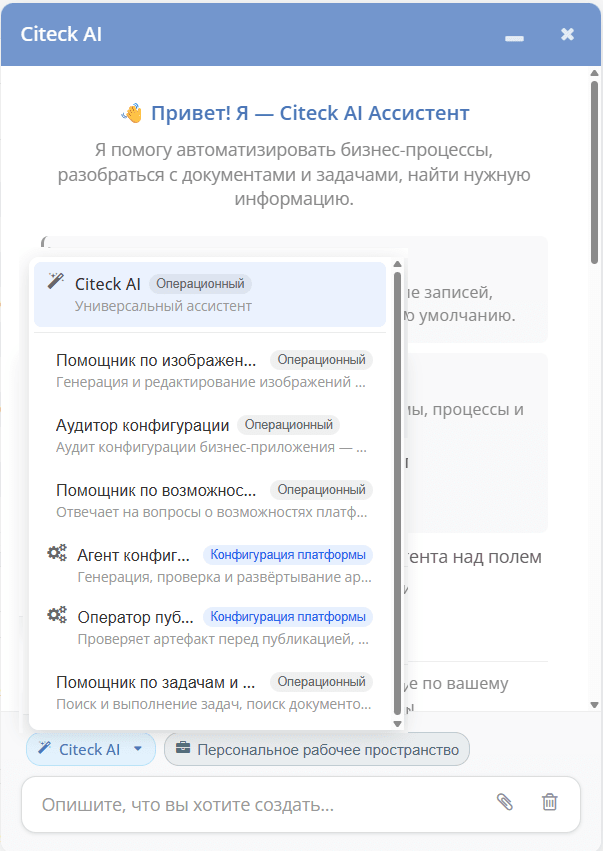
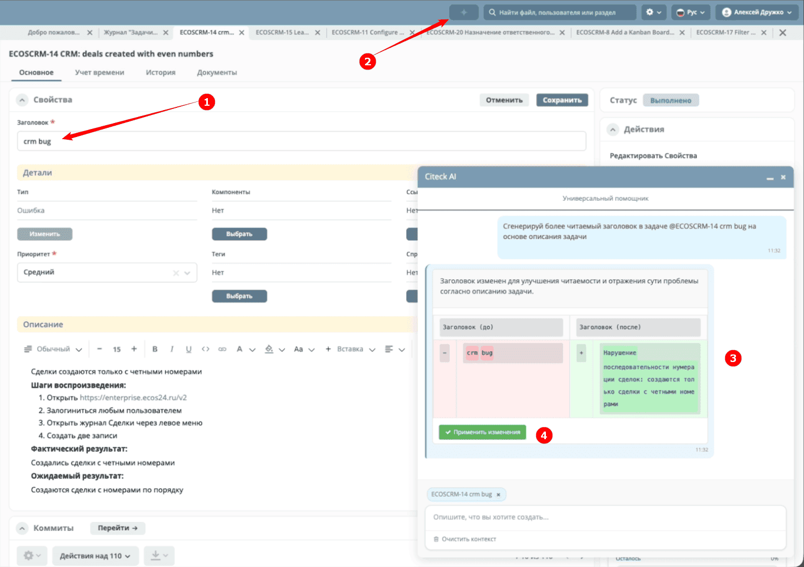
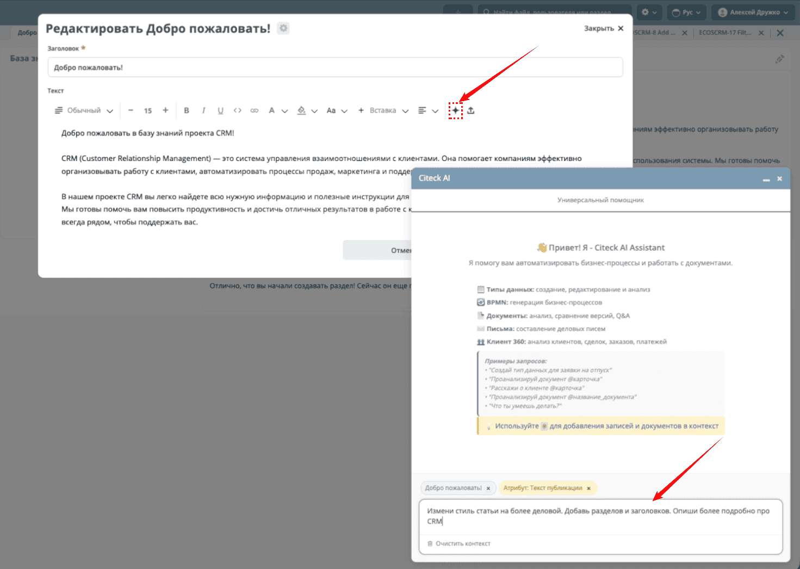
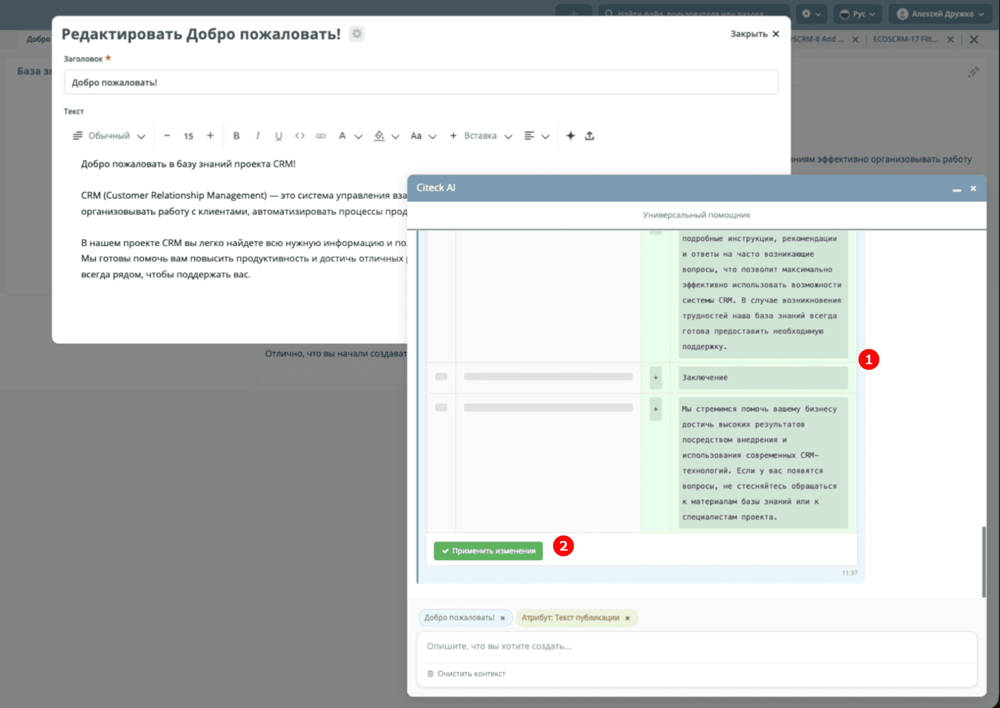
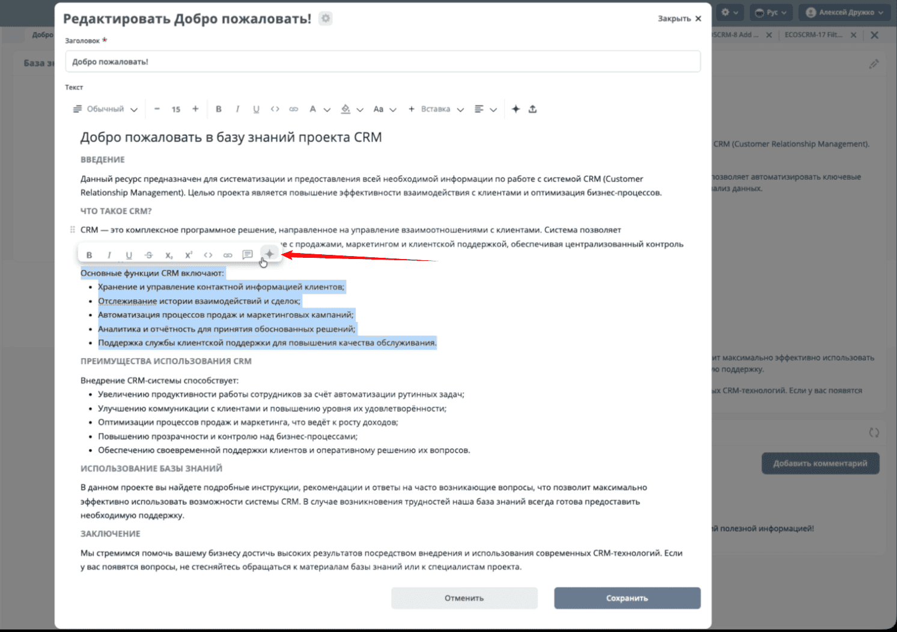
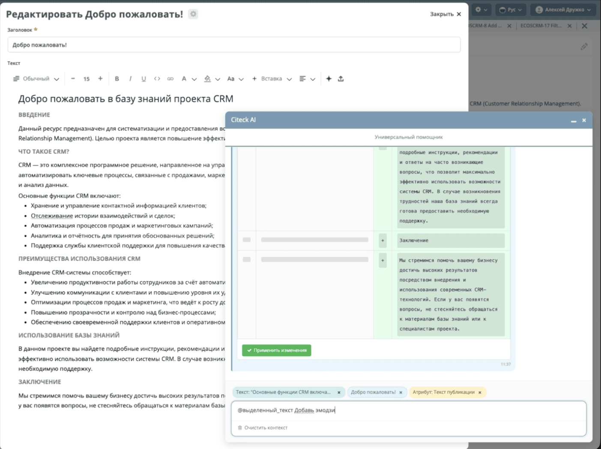
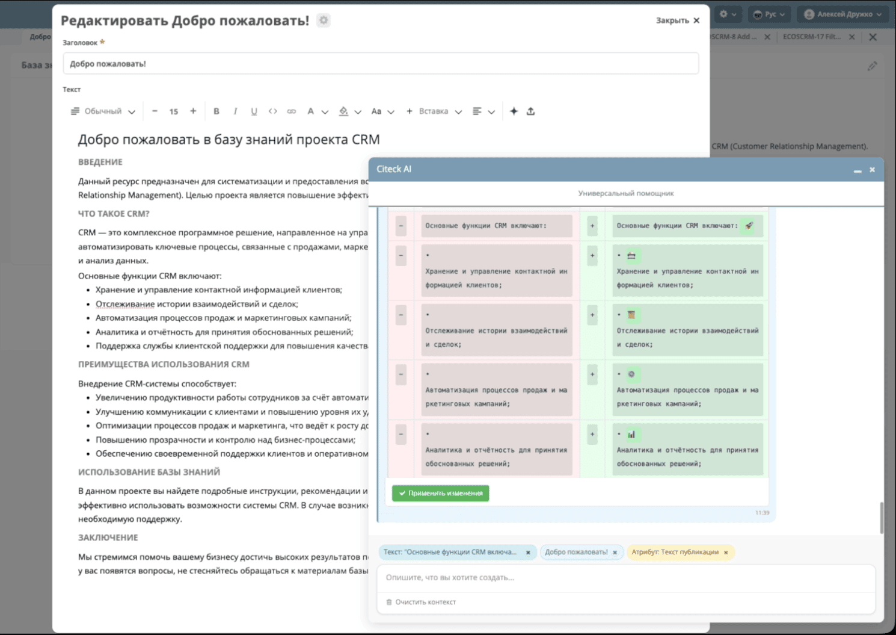

.. _AI_assistant:

Citeck AI Ассистент
==========================

.. contents::
    :depth: 4

Встроенный AI Ассистент платформы Citeck автоматизирует бизнес-процессы, упрощает работу с документами и помогает управлять данными.

.. note::

    Ассистент доступен в Enterprise версии Citeck при соблюдении следующих условий:

        1. **Лицензия:** наличие флага ``ai`` в лицензии
        2. **Права пользователя:** пользователь должен быть в группе ``GROUP_ai-feature-allowed`` или иметь права администратора/системы
        3. **Микросервис:** подключен и настроен микросервис ``ecos-ai`` (:ref:`см. конфигурацию<AI_assistant_config>`)

Интерфейс пользователя
-----------------------

.. grid:: 2
    :gutter: 2

    .. grid-item::

        .. image:: _static/AI_Assistant/main.png
            :width: 450
            :align: center

    .. grid-item::

        .. image:: _static/AI_Assistant/main_1.png
            :width: 350
            :align: center

.. list-table::
    :widths: 5 50
    :class: tight-table

    * - **1**
      - .. rst-class:: mb-1

        Режимы работы ассистента:

        - **Операционный режим** — включён по умолчанию. Работа с данными: поиск и создание записей, задачи, документы, аналитика.
        - **Конфигурация платформы** — настройка :ref:`приложения<applications>`: типы данных, формы, процессы и скрипты. Изменения выполняются пошагово и вступают в силу только после подтверждения пользователем.

    * - **2**
      - Выбор специализированного :ref:`агента <AI_context_and_agent>`.
    * - **3**
      - Выбранное рабочее пространство.
    * - **4**
      - Ввод и отправка запроса, добавление файла.
    * - **5**
      - Экспорт истории переписки. Сохраняет текстовый диалог текущего чата (сообщения пользователя и ассистента) в формате Markdown или HTML.
    * - **6**
      - Очистка контекста. Начинает новый диалог: история текущего чата очищается полностью, включая добавленный через `@` контекст записей и файлов.

.. _AI_context_and_agent:

Готовые агенты
~~~~~~~~~~~~~~~~~~~~~

Через меню выбора **(2)** доступны специализированные AI-агенты. **Агент** — предустановленная роль ассистента со своим набором инструментов и системным промптом, заточенная под конкретный круг задач, например работу с документами или конфигурацию платформы.

**Операционные:**

.. list-table::
    :class: tight-table

    * - **Помощник по задачам и документам**
      - Поиск и выполнение :ref:`задач<AI_tasks_work>`, поиск :ref:`документов<AI_document_search>` по метаданным и содержимому, анализ и изменение метаданных :ref:`документов<AI_records_work>`, :ref:`редактирование текста документов<AI_content_work>`, анализ и сравнение загруженных файлов и документов. Обслуживает чат по умолчанию, без явно выбранного агента.
    * - **Агент конфигурации платформы**
      - Создание, изменение и развёртывание артефактов платформы (:ref:`типов данных<AI_data_types>`, :ref:`форм<AI_form_generation>` и :ref:`BPMN-процессов<AI_bpmn_generation>`).
    * - **Помощник по изображениям**
      - :ref:`Генерация и редактирование изображений<AI_image_generation>` по текстовому описанию, анализ загруженных изображений.
    * - **Помощник по возможностям платформы**
      - Отвечает на вопросы о возможностях платформы по ее :ref:`документации<AI_docs_search>`, указывая ссылки на конкретные разделы.

**Конфигурация платформы:**

.. list-table::
    :class: tight-table

    * - **Аудитор конфигурации**
      - Аудит конфигурации бизнес-приложения: безопасность (права, роли, чувствительные данные) и качество (модель данных, статусы, процессы, формы). Только в режиме чтения.
    * - **Оператор публикации конфигурации**
      - Проверка артефакта перед публикацией, оценка влияния на зависимые артефакты и вынесение решения о публикации. Публикует только после подтверждения человеком.

См. :ref:`Примеры и подробное описание возможностей <AI_examples>`.

Полный состав инструментов и системные промпты агентов приведены в разделе :ref:`Преднастроенные агенты <preconfigured-agents>`.

Горячие клавиши
~~~~~~~~~~~~~~~~~~

.. list-table::
    :header-rows: 1
    :class: tight-table

    * - Клавиша
      - Действие
    * - ``Cmd+I`` (Mac) / ``Alt+I`` (Windows/Linux)
      - Открыть/закрыть AI Ассистента
    * - ``Enter``
      - Отправить сообщение
    * - ``Shift+Enter``
      - Новая строка
    * - ``Escape``
      - Закрыть чат
    * - ``@``
      - Вызвать автокомплит для добавления контекста

.. _AI_context_add:

Контекстная работа
-------------------

Чем более детально вы сформируете свой вопрос / требования к генерации, тем более точный ответ вы получите.

Добавление контекста
~~~~~~~~~~~~~~~~~~~~

Используйте символ **`@`** для добавления дополнительного контекста к запросам:

    -	`@запись` - добавить данные текущей открытой записи
    -	`@имя_документа` - найти и добавить конкретный документ по названию или номеру.

.. note::

    Поиск по `@` выполняется только среди записей того же типа данных, что и текущий открытый документ. Например, если открыт Договор — можно искать другие договоры через `@договор №230`.

Умное подключение контекста записей
~~~~~~~~~~~~~~~~~~~~~~~~~~~~~~~~~~~~~

- **Поиск артефакта по имени:** при работе с конфигурацией платформы AI Ассистент находит артефакт (тип данных, форму, процесс, журнал, дашборд, приложение) по названию прямо из запроса пользователя, без явного @-упоминания. Поиск идёт в рабочем пространстве диалога и в глобальной области, под правами пользователя
- **Уточнение при неоднозначности:** если под название подходит несколько артефактов, ассистент перечисляет найденные варианты и уточняет в диалоге, какой именно имелся в виду

.. raw:: html

   

   <iframe width="640" height="360" src="https://vkvideo.ru/video_ext.php?oid=-235732609&id=456239028&hash=8e8018c03cb6bc99&hd=4" allow="autoplay; encrypted-media; fullscreen; picture-in-picture; screen-wake-lock;" frameborder="0" allowfullscreen></iframe>
   

.. _AI_examples:

Примеры и подробное описание возможностей
--------------------------------------------

Генерация и автоматизация
~~~~~~~~~~~~~~~~~~~~~~~~~~~~

Возможности AI Ассистента по автоматической генерации артефактов платформы Citeck: от целых бизнес-приложений до отдельных типов данных, форм, BPMN-процессов и скриптов. Ассистент также умеет самостоятельно писать техническую документацию по созданным приложениям и искать ответы в документации Citeck.

Генерация бизнес-приложений
""""""""""""""""""""""""""""""""

.. _AI_app_generation:

Создание полноценных бизнес-приложений из текстового описания с автоматической генерацией всех необходимых компонентов.

    - **Генерация приложений** - создание полноценных бизнес-приложений из текстового описания
    - **Типы данных** - автоматическое создание типов данных с атрибутами, ролями и статусами
    - **BPMN-процессы** - генерация бизнес-процессов для автоматизации логики
    - **Связанные сущности** - поддержка нескольких связанных типов данных в одном приложении
    - **Уточняющие вопросы** - при недостаточно детальном запросе ассистент задаёт вопросы, при необходимости в несколько раундов. На каждом раунде доступны кнопки **Пропустить** (генерировать с разумными допущениями) и **Отмена**; вместо ответов на вопросы можно приложить файл спецификации
    - **Утверждение плана** - перед генерацией показывается план со структурой будущего приложения: атрибуты, статусы и роли типов данных, ключевые поля форм и шаги процессов. Генерация начинается только после подтверждения; свободным текстом можно попросить изменить план или задать вопрос о нём
    - **Пошаговый индикатор** - ход генерации отображается стадиями: анализ требований, уточняющие вопросы, типы данных, формы, процессы, развертывание
    - **Развертывание** - создание артефактов в системе; при отмене или ошибке индикатор явно сообщает о завершении, диалог продолжается штатно

.. dropdown:: Процесс работы
   :color: secondary

   1. Опишите бизнес-требования на естественном языке
   2. AI проанализирует запрос и при необходимости задаст уточняющие вопросы (можно пропустить или приложить спецификацию)
   3. Система предложит план приложения со структурой типов данных, форм и процессов
   4. Подтвердите план, запросите изменения или задайте вопрос о нём
   5. AI создаст и развернет все компоненты, показывая ход работы пошаговым индикатором

.. raw:: html

   

   <iframe width="640" height="360" src="https://vkvideo.ru/video_ext.php?oid=-235732609&id=456239021&hash=8f720b604b36dfaa&hd=3" allow="autoplay; encrypted-media; fullscreen; picture-in-picture; screen-wake-lock;" frameborder="0" allowfullscreen></iframe>
   

**Запросы:**

    * *Создай приложение для управления заявками на отпуск*
    * *Мне нужна система бронирования переговорных комнат*
    * *Сделай приложение для согласования командировок с руководителем и бухгалтерией*
    * *Создай систему учета оборудования с возможностью резервирования*

Типы данных
""""""""""""""""""

.. _AI_data_types:

    -	**Генерация** типов данных на основе текстового описания.
    -	**Редактирование** существующего типа данных. Для этого перейдите на карточку типа данных и добавьте `@запись` в контекст чата.
    -	**Развертывание** типа данных в системе.
    -	**Вопросы и анализ** по атрибутам, структуре и функционалу типов данных. Например: *Расскажи о чем тип данных @запись ? Какие есть атрибуты и логика?*

**Запросы:**

    * *Создай тип данных для согласования заявки на отпуск у руководителя*
    * *Добавь поле "количество дней отпуска", пусть рассчитывается автоматически*
    * *Какие атрибуты есть в типе данных @запись? Как рассчитывается атрибут количество дней отпуска?*

Генерация форм
""""""""""""""""""

.. _AI_form_generation:

- **Новый тип артефакта**: AI Ассистент умеет генерировать и редактировать формы Citeck на основе текстового описания
- **Диалоговый режим**: Генерация формы с предпросмотром черновика, возможностью уточнения и подтверждения перед публикацией
- **Валидация**: Автоматическая проверка структуры формы перед публикацией
- **Интеграция с бизнес-приложениями**: Генерация форм в составе конвейера генерации бизнес-приложений

.. raw:: html

   

   <iframe width="640" height="360" src="https://vkvideo.ru/video_ext.php?oid=-235732609&id=456239027&hash=8e8ddcd3371618a1&hd=4" allow="autoplay; encrypted-media; fullscreen; picture-in-picture; screen-wake-lock;" frameborder="0" allowfullscreen></iframe>
   

Помощник BPMN
""""""""""""""""""

.. _AI_bpmn_generation:

Работа с бизнес-процессами в BPMN-редакторе.

    -	**Генерация BPMN** процессов из текстового описания
    -	**Редактирование BPMN** с помощью AI
    -	**Контекстная помощь** на основе текущего процесса и типа данных
    -   **AI Task с прямыми вызовами LLM** - AI-задачи внутри BPMN-процессов могут делать прямые вызовы к LLM через BpmnAiService
    -   **Режим вопрос-ответ** -  ассистент поддерживает свободные вопросы пользователя

**Запросы:**

    * *Создай процесс согласования отпуска у руководителя на основе типа данных*

При генерации BPMN-процесса AI Ассистент учитывает выбранный тип данных в редакторе BPMN для указания ролей, статусов и смысловой нагрузки элементов процесса.

**Видео: BPMN AI Task**

.. raw:: html

   

   <iframe width="640" height="360" src="https://vkvideo.ru/video_ext.php?oid=-235732609&id=456239019&hash=dfd7713ac1f8c550&hd=3" allow="autoplay; encrypted-media; fullscreen; picture-in-picture; screen-wake-lock;" frameborder="0" allowfullscreen></iframe>
   

**Видео: Реализация спам-проверки через BPMN AI Task**

.. raw:: html

   

   <iframe width="640" height="360" src="https://vkvideo.ru/video_ext.php?oid=-235732609&id=456239020&hash=cbd2e6d45050d407&hd=3" allow="autoplay; encrypted-media; fullscreen; picture-in-picture; screen-wake-lock;" frameborder="0" allowfullscreen></iframe>
   

Попробуйте создать :ref:`процесс заявки на закупку оборудования<sample_request_ai>` с помощью интеллектуального помощника.

**Видео: Пример создания заявки на закупку оборудования**

.. raw:: html

   

   <iframe width="640" height="360" src="https://vkvideo.ru/video_ext.php?oid=-235732609&id=456239022&hash=e6b630c0043c6cc7&hd=3" allow="autoplay; encrypted-media; fullscreen; picture-in-picture; screen-wake-lock;" frameborder="0" allowfullscreen></iframe>
   

Ассистент написания скриптов
""""""""""""""""""""""""""""""""""""

.. _AI_script_assistant:

Создание и редактирование скриптов в процессах, вычисляемых полях, условиях, UI-действиях и журналах Citeck.

.. dropdown:: Как использовать
   :color: secondary

   1. Откройте любой редактор скриптов (BPMN Script Task, вычисляемый атрибут и др.)
   2. Нажмите на кнопку AI Ассистента в правом нижнем углу редактора
   3. В появившемся поле ввода опишите, что должен делать скрипт, или выберите быстрое действие
   4. Ассистент сгенерирует код с подробным объяснением логики

.. list-table::
    :header-rows: 1
    :class: tight-table

    * - Контекст
      - Описание
    * - **BPMN Script Task**
      - Скрипты внутри бизнес-процессов
    * - **Gateway / Sequence Flow Condition**
      - Условия маршрутизации процессов
    * - **Computed Attribute**
      - Вычисляемые атрибуты типов данных
    * - **Computed Role**
      - Динамическое определение участников ролей
    * - **UI Action Script**
      - Клиентские скрипты действий
    * - **Journal Formatter**
      - Форматирование ячеек журналов
    * - **Консоль разработчика**
      - Скрипты в консоли администратора

**Возможности:**

    - **Генерация скриптов** на основе текстового описания
    - **Редактирование** и **улучшение** существующих скриптов
    - **Быстрые действия:** объяснение кода, исправление ошибок, оптимизация
    - **Генерация** вычисляемых атрибутов и форматтеров журналов
    - **Валидация API** - проверка использования только доступных API для контекста
    - **Контекстно-зависимая генерация** - учёт метаданных типа данных, атрибутов, ролей и статусов

.. raw:: html

   

   <iframe width="640" height="360" src="https://vkvideo.ru/video_ext.php?oid=-235732609&id=456239026&hash=80fe89f1271502c9&hd=3" allow="autoplay; encrypted-media; fullscreen; picture-in-picture; screen-wake-lock;" frameborder="0" allowfullscreen></iframe>
   

**Запросы:**

    * *Напиши скрипт для BPMN задачи, который отправляет уведомление руководителю*
    * *Создай вычисляемый атрибут для расчета суммы заказа*
    * *Объясни что делает этот скрипт*
    * *Исправь ошибки в скрипте*
    * *Оптимизируй этот скрипт*

Аудит конфигурации бизнес-приложения
"""""""""""""""""""""""""""""""""""""

.. _AI_app_audit:

Проверка приложения по чек-листу безопасности и качества конфигурации. Агент **«Аудитор конфигурации»** работает только в режиме чтения: изучает состав приложения, но ничего не изменяет и не публикует.

    - **Безопасность** — права и роли доступа к типу данных, наличие и защищённость чувствительных данных, доступность записи на чтение/изменение в разных статусах
    - **Качество конфигурации** — модель данных (атрибуты, связи), статусная модель, бизнес-процессы, формы
    - **Отчёт с уровнями риска** — по каждому найденному замечанию указывается уровень риска, чтобы можно было расставить приоритеты в доработке

.. dropdown:: Как использовать
   :color: secondary

   1. Выберите агента **«Аудитор конфигурации»** (см. :ref:`Готовые агенты <AI_context_and_agent>`)
   2. Назовите приложение для проверки в запросе или добавьте его в контекст через `@`
   3. Ассистент изучает состав приложения — типы данных, формы, процессы, права доступа — и формирует отчёт с найденными замечаниями и их уровнями риска. 

**Запросы:**

    * *Проверь приложение «Договоры»*
    * *Есть ли в приложении «Заявки на отпуск» проблемы с правами доступа?*
    * *Проверь модель данных и статусы в приложении учёта оборудования*

.. grid:: 2
    :gutter: 2

    .. grid-item::

        .. image:: _static/AI_Assistant/audit_1.png
            :width: 300
            :align: center

    .. grid-item::

        .. image:: _static/AI_Assistant/audit_2.png
            :width: 300
            :align: center

Оператор публикации конфигурации
"""""""""""""""""""""""""""""""""""""

.. _AI_app_deploy_operator:

Проверка сгенерированного или изменённого артефакта непосредственно перед публикацией. Агент **«Оператор публикации конфигурации»** оценивает готовность артефакта и последствия его публикации, но выполняет публикацию только после подтверждения пользователем.

    - **Валидация** — структурная проверка артефакта перед публикацией
    - **Оценка влияния** — анализ зависимых артефактов, которые может затронуть публикация
    - **Вердикт** — решение «публиковать» или «вернуть на доработку» с обоснованием
    - **Публикация** — выполняется только после подтверждения человеком, с выбором области публикации

.. dropdown:: Как использовать
   :color: secondary

   1. Выберите агента **«Оператор публикации конфигурации»** (см. :ref:`Готовые агенты <AI_context_and_agent>`) — либо перейдите к проверке по предложению агента конфигурации платформы после генерации или изменения артефакта
   2. Укажите артефакт для проверки в запросе или добавьте его в контекст через `@`
   3. Ассистент проводит валидацию, оценивает влияние на зависимые артефакты и выносит вердикт с обоснованием
   4. Если артефакт готов к публикации — подтвердите публикацию и выберите её область; при наличии замечаний верните артефакт на доработку

**Запросы:**

    * *Проверь артефакт перед публикацией и скажи, можно ли его публиковать*
    * *Что изменится, если опубликовать эту форму?*
    * *Готов ли тип данных «Договор» к публикации?*

.. grid:: 2
    :gutter: 2

    .. grid-item::

        .. image:: _static/AI_Assistant/publish_1.png
            :width: 300
            :align: center

    .. grid-item::

        .. image:: _static/AI_Assistant/publish_2.png
            :width: 300
            :align: center

Документация приложений
"""""""""""""""""""""""""""

.. _AI_app_documentation:

Автоматическое написание технической документации на любое созданное приложение в Citeck.

.. dropdown:: Как использовать
   :color: secondary

   1. Прикрепите (@-упомяните) приложение, которое нужно задокументировать, или просто назовите его в запросе
   2. Опишите задачу словами, например: составьте документацию по этому приложению
   3. Ассистент сам заходит внутрь приложения и изучает все его составные части — типы данных, формы, бизнес-процессы (BPMN), журналы, уведомления, действия, дашборды
   4. Через минуту-две вы получаете готовый документ

**Запросы:**

    * *Составь документацию по этому приложению*
    * *Задокументируй приложение учёта заявок*
    * *Опиши структуру приложения — какие есть типы данных, формы и процессы*

Поиск по документации Citeck
"""""""""""""""""""""""""""""""

.. _AI_docs_search:

Отдельный, изолированный от общего поиска канал доступа к официальной документации платформы Citeck.

    -	**Ответы со ссылками на источники** — ассистент отвечает на вопросы о платформе и указывает документы, из которых взята информация
    -	**Поиск по документации платформы** — находит и цитирует содержимое документации (возможности, настройка, гайды по установке, принципы работы)

Задачи и работа с записями
~~~~~~~~~~~~~~~~~~~~~~~~~~~~

Работа с записями
""""""""""""""""""

.. _AI_records_work:

Ассистент может искать, показывать и изменять любые записи в системе Citeck — карточки клиентов, документы, договоры, заказы, обращения и другие объекты.

    -	**Поиск записей** — по названию, статусу, дате или другим признакам. Например: *покажи договоры с компанией X, подписанные в этом году*.
    -	**Просмотр данных записи** — все атрибуты, статус, ответственный, связанные объекты.
    -	**Работа с документами внутри записи** — чтение текста прикреплённого файла, просмотр истории версий (кто и когда менял).
    -	**Анализ документа** — не просто чтение, а содержательный ответ на вопрос по документу (о чём он, какие условия, есть ли риски и т.п.).
    -	**Связанные контакты** — кто участвует в сделке или обращении.
    -	**История активности по записи** — комментарии, звонки, письма, встречи, поручения.
    -	**Создание и изменение записей** — например, создание новой записи или обновление её полей. Это чувствительное действие, поэтому система всегда запрашивает подтверждение перед изменением.
    -	**Удаление записей** — только с подтверждением и не более 10 штук за раз (защита от случайного массового удаления).
    -	**Семантический поиск** (если включена такая возможность) — поиск документов и записей по смыслу запроса, а не по точному совпадению слов.

Работа с задачами
""""""""""""""""""

.. _AI_tasks_work:

Отдельного «модуля задач» в привычном понимании (список задач, кнопка «завершить задачу», комментарии к задаче) в системе нет — задачи в Citeck технически являются записями особого типа, поэтому:

    -	**Поиск задач** — так же, как поиск любых записей. Например: *покажи мои открытые задачи* или *найди задачи со словом "проверка" в названии*.
    -	**Завершение задачи или смена статуса** — тем же способом, что и изменение любой записи: ассистент меняет статус задачи на «выполнено» (с подтверждением).
    -	**Поручения и задачи, связанные с записью** — видны в истории активности документа или клиента, к которому они относятся.

Работа с контентом
~~~~~~~~~~~~~~~~~~~~~~

Возможности AI Ассистента по работе с текстовым и графическим контентом: редактирование текста документов и статей (в том числе через интеграцию с редактором Lexical), анализ и сравнение загруженных файлов и документов, составление деловых писем, а также генерация и редактирование изображений.

.. _AI_content_work:

Редактирование текста
""""""""""""""""""""""""

Помощник по редактированию текста имеет 2 функции:

    - **редактирование любого атрибута** документа;
    - **интеграция** с редактором Lexical.

Помощник позволяет писать новые статьи, редактировать их, изменять текущий текст, улучшать описание задач, улучшать заголовки и прочее для работы с текстом.

Доступны быстрые действия над выделенным текстом: **улучшить**, **упростить**, **расширить**, **резюмировать**, **исправить грамматику**, **формализовать**, **перевести** — а также произвольная правка свободным текстовым запросом. Правка скриптов, в отличие от текста, обслуживается агентом конфигурирования платформы — со своими быстрыми действиями (объяснить, исправить, оптимизировать) и доступом к метаданным типов.

Редактирование текстовых атрибутов документа
**********************************************

Например, улучшим **заголовок задачи** **(1)**.

Вызовем **ассистента** **(2)** и попросим его сгенерировать более понятный заголовок. Результат будет выдан в виде **diff-view** (наглядные различия между двумя наборами данных) **(3)**. При нажатии кнопки **Применить изменения** **(4)** будет отправлен update-запрос на изменение заголовка.

Интеграция с редактором Lexical
**************************************

Вызов ассистента доступен из Lexical-редактора. Редактор используется, например, в виджете «Свойства», «Комментарии», «Активности», при редактировании публикаций, статей в базе знаний.

В редакторе необходимо вызвать ассистент и попросить его, например, изменить стиль статьи, что-то добавить или изменить:

Результат так же будет выдан в виде **diff-view** **(1)**, где показано что конкретно было изменено. В данном режиме работы при нажатии кнопки **Применить изменения** **(2)** текст сразу подставляется в текущий редактор, чтобы его можно было дальше подредактировать, изменить и уже потом сохранить статью.

Точечное редактирование текста
**************************************

Можно выделить какой-то абзац и вызвать помощника именно для этого абзаца:

В таком случае будет изменен только выделенный текст. Например, попросим добавить эмодзи в текст, который выделили:

Результат так же будет выдан в виде **diff-view** **(1)**, где показано что конкретно было изменено, далее **применяем изменения** **(2)** и сохраняем статью.

Работа с файлами в чате
""""""""""""""""""""""""""""""""""""

Файл можно загрузить прямо в диалог с ассистентом — без предварительного создания записи:

    - **Анализ загруженного файла** - изображения анализируются по содержимому напрямую; PDF — напрямую, если модель агента поддерживает нативное чтение PDF (например, Anthropic Claude), иначе через извлечённый текст; офисные форматы (DOCX, XLSX) — через извлечённый текст или PDF-превью платформы. Максимальный размер файла настраивается (по умолчанию 10 МБ)
    - **Сохранение результата в запись** - когда ассистент создаёт или обрабатывает файл, в чате появляется карточка сохранения с выбором: заменить основной контент текущей записи, записать в её атрибут, создать новую запись (размещается в папке «Сгенерировано ИИ») — или отменить
    - **Несколько файлов одновременно** - каждый ожидающий файл имеет собственную карточку с кнопками; неподтверждённый файл автоматически удаляется через 30 минут

**Запросы:**

    * *Проанализируй этот файл* (с приложенным документом)
    * *Извлеки из счёта сумму и поставщика*
    * *Переведи документ и сохрани результат в новую запись*

Анализ и сравнение документов
""""""""""""""""""""""""""""""""""""

    -	**Анализ документов** на основе их атрибутов и содержимого
    -	**Сравнение версий** документов, выделение изменений и юридических аспектов
    -	**Ответы на вопросы** по документам
    -	Возможность **указывать в контекст** несколько документов с одним типом данных

**Запросы (анализ документа):**

    * *Проанализируй @запись на соответствие законодательству РФ*
    * *Расскажи кратко, о чем этот договор?*
    * *Есть ли пункты, которые нарушают права сторон?*
    * *Предложи улучшения*

**Запросы (сравнение документов):**

    * *В чем разница атрибутов договора @запись и @договор №4? Составь итоговую таблицу с различиями*

**Запросы (сравнение версий):**

    * *Какие были изменения в последней версии договора @запись?*
    * *Сравни версию 1.0 и 2.5 в @запись. Какие были различия?*

.. raw:: html

   

   <iframe width="640" height="360" src="https://vkvideo.ru/video_ext.php?oid=-235732609&id=456239017&hash=9131b0c0e337c378&hd=3" allow="autoplay; encrypted-media; fullscreen; picture-in-picture; screen-wake-lock;" frameborder="0" allowfullscreen></iframe>
   

Деловые письма
""""""""""""""""""

Составление деловых писем для различных типов получателей с персонализацией на основе истории взаимодействий.

    - **Составление деловых писем** по любой сущности из системы - для лидов, клиентов и сотрудников
    - **Персонализация писем** на основе истории взаимодействий и контекста
    - **Профессиональная подпись** с данными текущего пользователя
    - **Готовые к отправке письма** с возможностью редактирования и отправки из системы

.. raw:: html

   

   <iframe width="640" height="360" src="https://vkvideo.ru/video_ext.php?oid=-235732609&id=456239018&hash=0a539e43586fc87b&hd=3" allow="autoplay; encrypted-media; fullscreen; picture-in-picture; screen-wake-lock;" frameborder="0" allowfullscreen></iframe>
   

**Запросы:**

    * *Помоги написать письмо лиду @запись*
    * *Составь ответ клиенту по поводу нашего предложения*
    * *Нужно написать деловое письмо партнеру*
    * *Измени стиль письма на более дружелюбный*
    * *Напиши письмо, необходимо проинформировать клиента о статусе его заявки в техподдержку @запись*

Генерация изображений
"""""""""""""""""""""""

.. _AI_image_generation:

Поставляемый агент «Помощник по изображениям» генерирует и редактирует изображения прямо в чате:

    - **Генерация по описанию** - создание изображения с нуля по текстовому запросу
    - **Итеративное редактирование** - правки только что сгенерированного или загруженного изображения в том же диалоге: «убери фон», «сделай ярче», «добавь текст»
    - **Параметры** - формат (квадрат, портрет, альбом), качество (черновик, стандарт, лучшее), прозрачный фон для иконок
    - **Анализ изображений** - описание содержимого загруженной картинки
    - **Сохранение** - результат сохраняется в запись через карточку сохранения файла (см. «Работа с файлами в чате»)

Доступ к генерации изображений управляется отдельной группой ``ai-image-allowed`` — дополнительно к общей группе AI-функций. На один диалог действует лимит в 20 генераций; для продолжения работы откройте новый чат.

**Запросы:**

    * *Нарисуй иконку для раздела «Командировки»*
    * *Сделай баннер к письму о новогодних скидках*
    * *Убери фон и сделай его прозрачным*
    * *Что изображено на этой картинке?*

Поиск и аналитика
~~~~~~~~~~~~~~~~~~~~~~

Поиск по документам
"""""""""""""""""""""""

.. _AI_document_search:

Семантический поиск по смыслу запроса, а не по точному совпадению слов. Например: *найди все договоры с компанией X, которые были подписаны в этом году и содержат условие о штрафах*.

Клиент 360
"""""""""""""""""""""""

.. _AI_client_360:

Комплексный анализ клиентов и контрагентов: сделки, заказы, платежи, договоры, обращения в поддержку, история активности — всё собирается в единый отчёт.

    - **Комплексный анализ клиентов** - полная картина взаимодействий с контрагентами
    - **Анализ сделок** - статусы, суммы, успешность, тенденции развития
    - **Обзор заказов** - частота, объемы, предпочтения продуктов
    - **История платежей** - анализ платежной дисциплины и сумм
    - **Оценка взаимоотношений** - здоровье бизнес-отношений и возможности роста
    - **Анализ обращений в техподдержку** - контроль SLA и выявление проблем

.. raw:: html

   

   <iframe width="640" height="360" src="https://vkvideo.ru/video_ext.php?oid=-235732609&id=456239024&hash=a4b8c3cf93be71ba&hd=3" allow="autoplay; encrypted-media; fullscreen; picture-in-picture; screen-wake-lock;" frameborder="0" allowfullscreen></iframe>
   

**Запросы:**

    * *Расскажи о клиенте @запись*
    * *Какие у нас сделки с этим контрагентом?*
    * *Покажи все заказы клиента @запись*
    * *Какие платежи были от этого клиента?*
    * *История взаимодействий с клиентом*
    * *Полная информация по клиенту*
    * *Проведи анализ обращений клиента в техподдержку, есть ли проблемы с SLA?*

Настройки
-----------

:ref:`См. подробно о конфигурации<AI_assistant_config>`