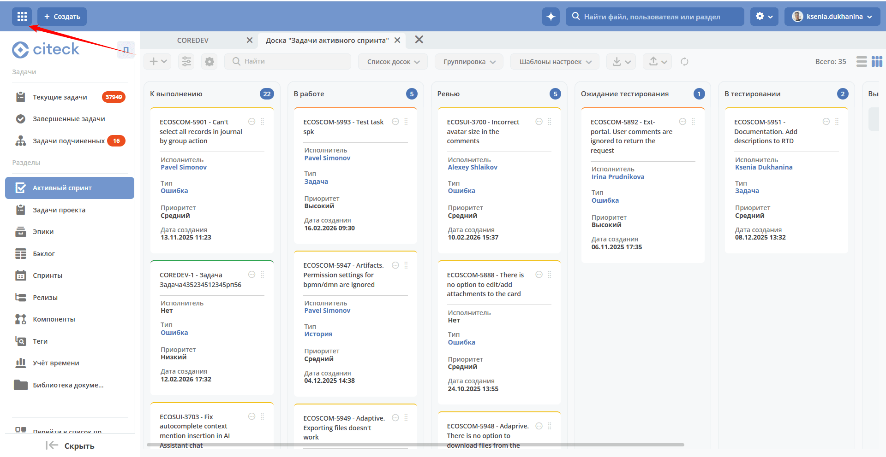
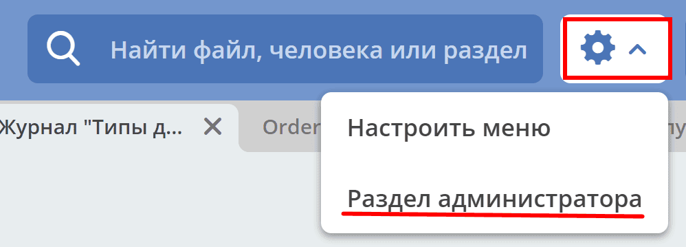
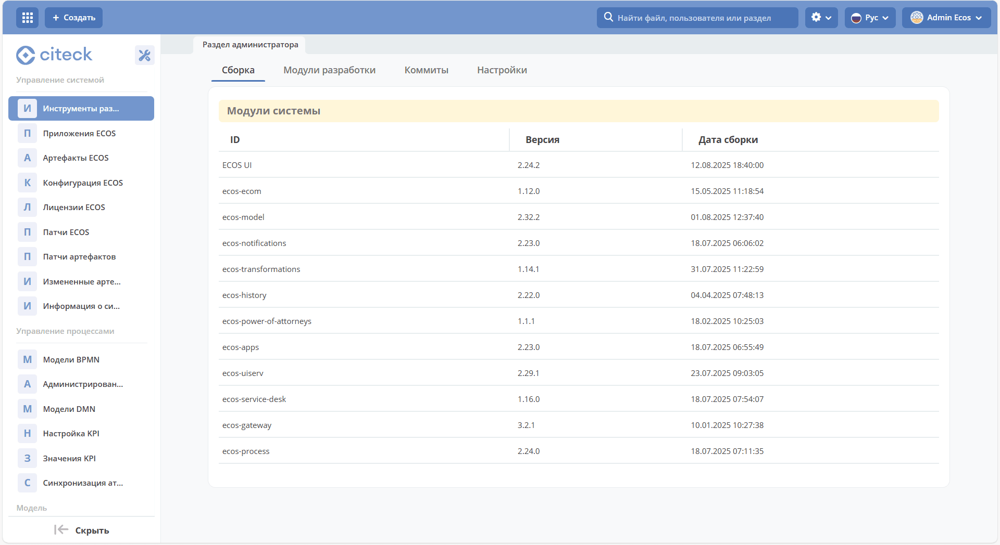
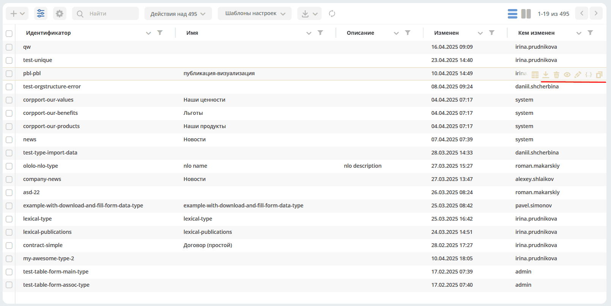

.. _admin:

Раздел администратора
======================

.. contents::
   :depth: 2

**Раздел администратора** — рабочее пространство, предназначенное для системных администраторов. В нём сосредоточены инструменты настройки и конфигурации платформы: управление пользователями, типами данных, процессами, формами, уведомлениями и другими компонентами системы.

Перейдите в рабочее пространство **"Раздел администратора"**:

|

В левой части представлено меню с разделами для конфигурации и настройки системы:

      - Управление системой;
      - Управление процессами;
      - Модель;
      - Конфигурация UI;
      - Конфигурация уведомлений;
      - и другие разделы, состав которых зависит от установленных модулей.

Управление системой — Инструменты разработки
---------------------------------------------

.. tab-set::

    .. tab-item:: Сборка

        Представлена актуальная информация о модулях Citeck:

        .. image:: _static/admin/admin_12.png
               :width: 700
               :align: center

    .. tab-item:: Коммиты

        По всем репозиториям указан список внесённых изменений:

        .. image:: _static/admin/admin_14.png
               :width: 700
               :align: center

        По ссылкам можно перейти в репозиторий, конкретный коммит, задачу.

    .. tab-item:: Настройки

        Содержит параметры отладки и диагностики платформы. Используйте эти настройки при разработке и решении проблем:

        .. image:: _static/admin/admin_13.png
               :width: 700
               :align: center

        **Включить логгер для новых форм** — включает дебаг-логи для форм. Смотреть можно в консоли браузера.

        **Включить дебаг для Records API** — в ответе от :ref:`Records API<Records_API>` запросов возвращается дополнительная информация, которая помогает понять, что происходило на сервере во время запроса.

        .. note::

            Настройки отладки рекомендуется включать только временно — исключительно для диагностики, а после завершения анализа — отключать, чтобы не перегружать логи в продуктивной среде.

Интерфейс раздела администратора
----------------------------------

Данные в каждом разделе администратора представлены в виде журнала — таблицы с записями, которые можно просматривать, редактировать и управлять ими.

Для каждой записи доступен стандартный набор действий.

.. note::

    Для отдельных разделов могут быть доступны дополнительные специальные действия, характерные для данного типа артефактов.

.. grid:: 1
   :gutter: 2

   .. grid-item-card:: Скачать в виде JSON-файла
      :class-header: sd-font-weight-bold

      .. image:: _static/admin/admin_4.png
         :width: 25
         :align: left

   .. grid-item-card:: Удалить
      :class-header: sd-font-weight-bold

      .. image:: _static/admin/admin_5.png
         :width: 25
         :align: left

   .. grid-item-card:: Открыть карточку журнала в соседней вкладке
      :class-header: sd-font-weight-bold

      .. image:: _static/admin/admin_6.png
         :width: 25
         :align: left

      Карточка представляет собой :ref:`дашборд<dashboard>`:

      .. image:: _static/admin/admin_7.png
         :width: 500
         :align: center

   .. grid-item-card:: Открыть на редактирование
      :class-header: sd-font-weight-bold

      .. image:: _static/admin/admin_8.png
         :width: 25
         :align: left

   .. grid-item-card:: Редактировать JSON-файл
      :class-header: sd-font-weight-bold

      .. image:: _static/admin/admin_9.png
         :width: 25
         :align: left

      .. image:: _static/admin/admin_11.png
         :width: 500
         :align: center

   .. grid-item-card:: Копировать
      :class-header: sd-font-weight-bold

      .. image:: _static/admin/admin_10.png
         :width: 25
         :align: left
