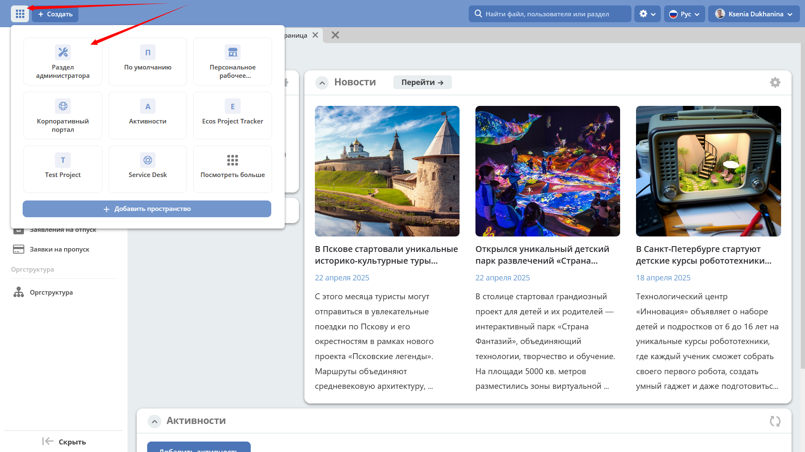
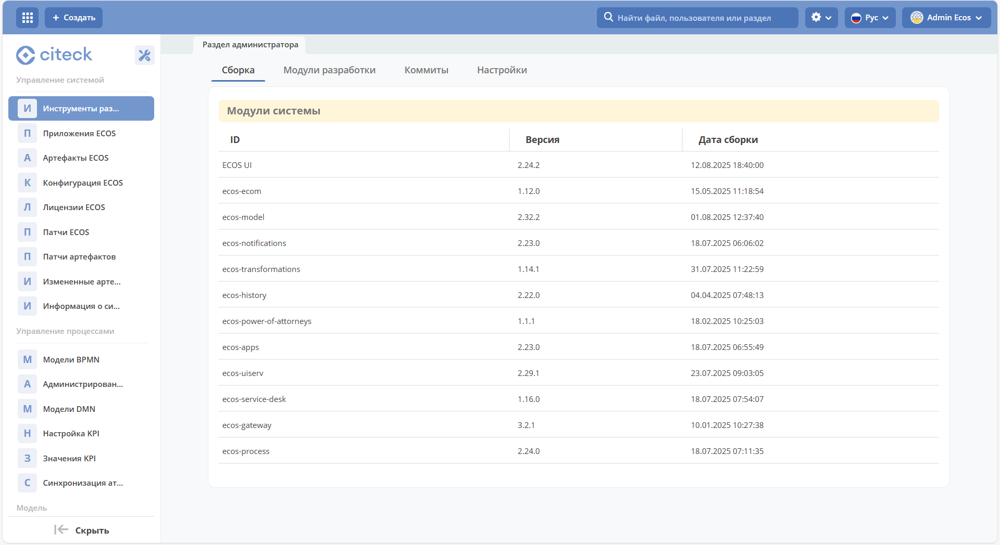
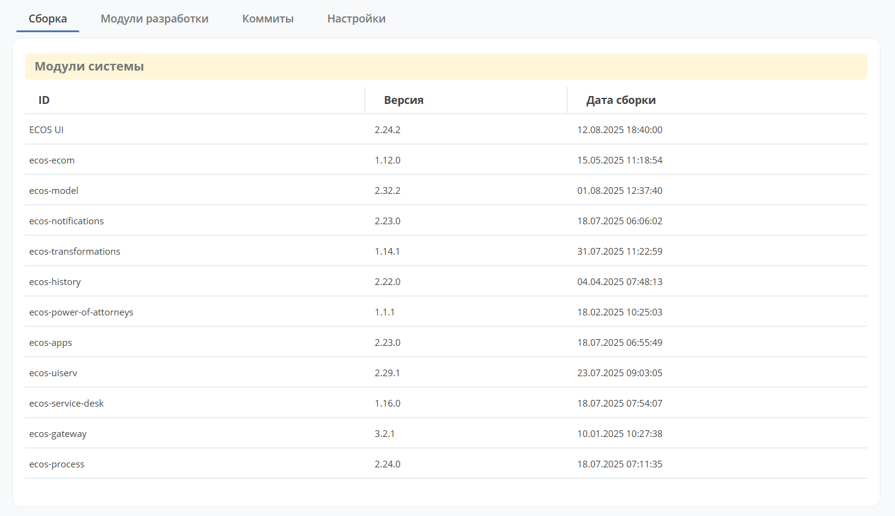
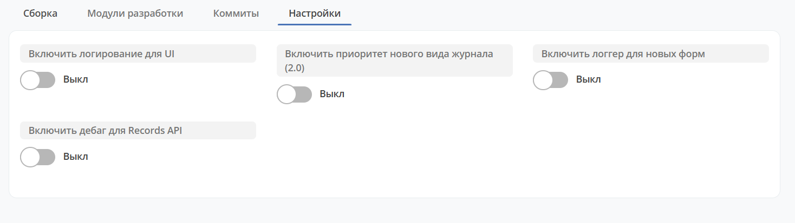
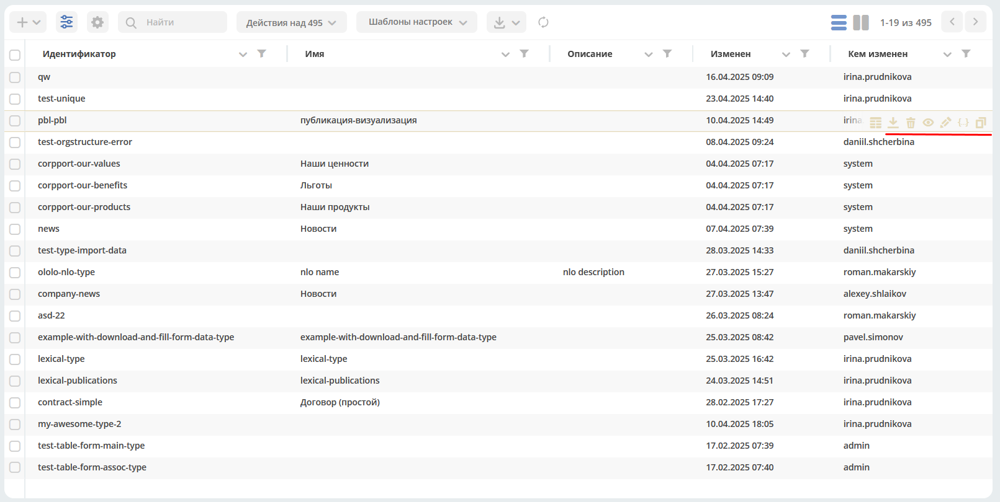

.. _admin:

Раздел администратора
======================

**Раздел администратора** — рабочее пространство, предназначенное для системных администраторов. В нём сосредоточены инструменты настройки и конфигурации платформы: управление пользователями, типами данных, процессами, формами, уведомлениями и другими компонентами системы.

Перейдите в рабочее пространство **"Раздел администратора"**:

В левой части представлено меню с разделами для конфигурации и настройки системы:

      * Управление системой;
      * Управление процессами;
      * Модель;
      * Конфигурация UI;
      * Конфигурация уведомлений;
      * и другие разделы, состав которых зависит от установленных модулей.

Управление системой — Инструменты разработки
---------------------------------------------

Вкладка "Сборка"
~~~~~~~~~~~~~~~~~

Представлена актуальная информация о модулях Citeck:

Вкладка "Коммиты"
~~~~~~~~~~~~~~~~~

По всем репозиториям указан список внесённых изменений:

.. image:: _static/admin/admin_14.png
       :width: 600
       :align: center

По ссылкам можно перейти в репозиторий, конкретный коммит, задачу.

Вкладка "Настройки"
~~~~~~~~~~~~~~~~~~~~

Содержит параметры отладки и диагностики платформы. Используйте эти настройки при разработке и решении проблем:

**Включить логгер для новых форм** — включает дебаг-логи для форм. Смотреть можно в консоли браузера.

**Включить дебаг для Records API** — в ответе от :ref:`Records API<Records_API>` запросов возвращается дополнительная информация, которая помогает понять, что происходило на сервере во время запроса.

.. note::

    Настройки отладки рекомендуется включать только временно — исключительно для диагностики, а после завершения анализа — отключать, чтобы не перегружать логи в продуктивной среде.

Интерфейс раздела администратора
----------------------------------

Данные в каждом разделе администратора представлены в виде журнала — таблицы с записями, которые можно просматривать, редактировать и управлять ими.

Для каждой записи доступен стандартный набор действий.

.. note::

    Для отдельных разделов могут быть доступны дополнительные специальные действия, характерные для данного типа артефактов.

.. list-table::
      :widths: 5 10
      :align: center
      :class: tight-table

      * -

             .. image:: _static/admin/admin_4.png
                  :width: 25
                  :align: center

        - Скачать в виде JSON-файла

      * -

             .. image:: _static/admin/admin_5.png
                  :width: 25
                  :align: center

        - Удалить

      * -

             .. image:: _static/admin/admin_6.png
                  :width: 25
                  :align: center

        - | Открыть карточку журнала в соседней вкладке.
          | Карточка представляет собой :ref:`дашборд<dashboard>`:

             .. image:: _static/admin/admin_7.png
                  :width: 500
                  :align: center

      * -

             .. image:: _static/admin/admin_8.png
                  :width: 25
                  :align: center

        - Открыть на редактирование

      * -

             .. image:: _static/admin/admin_9.png
                  :width: 25
                  :align: center

        - Редактировать JSON-файл:

             .. image:: _static/admin/admin_11.png
                  :width: 500
                  :align: center

      * -

             .. image:: _static/admin/admin_10.png
                  :width: 25
                  :align: center

        - Копировать
