Корпоративный портал
=====================

.. _corp_portal:

.. contents::
    :depth: 3

**Корпоративный портал** — раздел для сотрудников компании, который объединяет различные инструменты, информацию и сервисы в одном месте. Он используется для работы, коммуникации и управления бизнес-процессами.

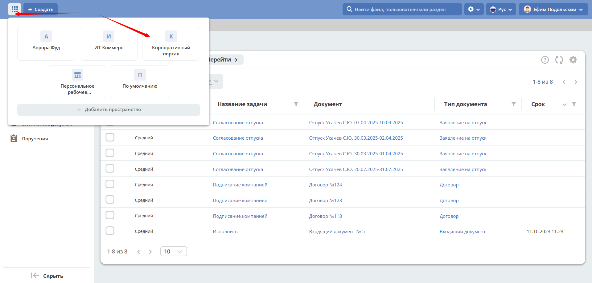

Портал обеспечивает:

    -	Хранение документов, регламентов, баз знаний.
    -	Новости компании, анонсы.
    -	Автоматизацию рабочих процессов (отпуска, заявки, отчетность).

Главная страница содержит дашборд с приветственной информацией **(1)**, :ref:`новостями<widget_news>` **(2)**, :ref:`днями рождения<widget_birthdays>` сотрудников **(3)**. Для enterprise версии Citeck будет доступен виджет :ref:`«Активности»<widget_activities>`.

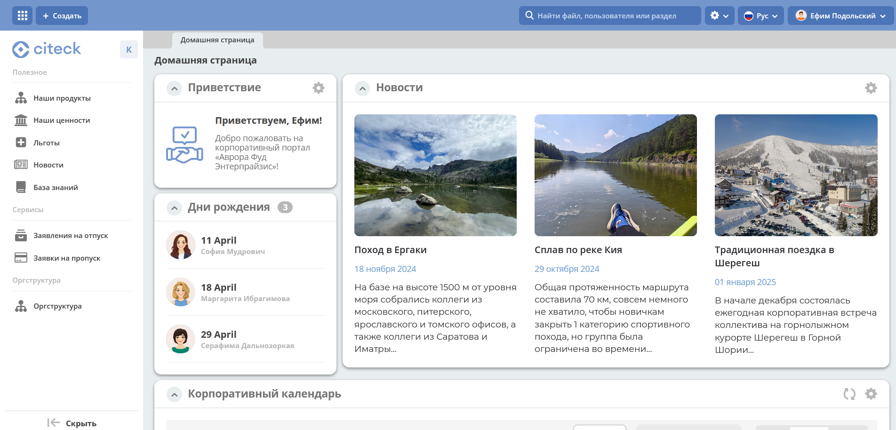

В меню **(4)** доступны основные разделы корпоративного портала: **Полезное**, **Сервисы** и **Оргструктура**.

В приветственном виджете по клику на **Смотреть больше** открывается :ref:`База знаний <wiki_corp>`

Полезное
----------

В подразделах **Наши продукты**, **Наши ценности**, **Льготы**  представлена информация в виде :ref:`библиотек документов<document_library>` - с файлами можно ознакомиться, скачать:

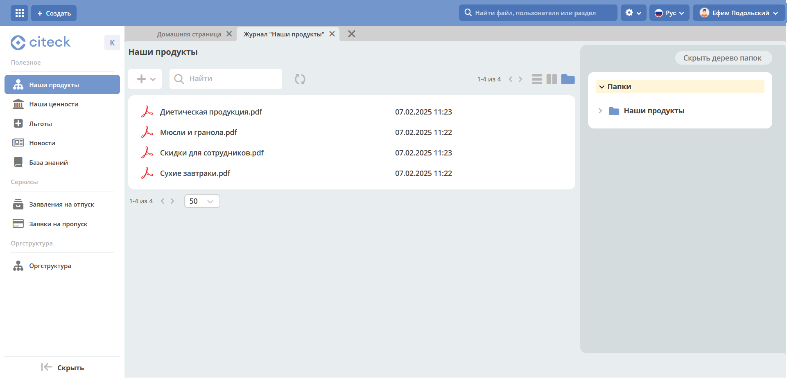

.. list-table::
      :widths: 20 20
      :align: center

      * - |

            .. image:: _static/corp_portal/corp_01.png
                  :width: 700
                  :align: center

        - |

            .. image:: _static/corp_portal/corp_02.png
                  :width: 700
                  :align: center

В подразделе **Новости** информация представлена в виде списка превью новостей:

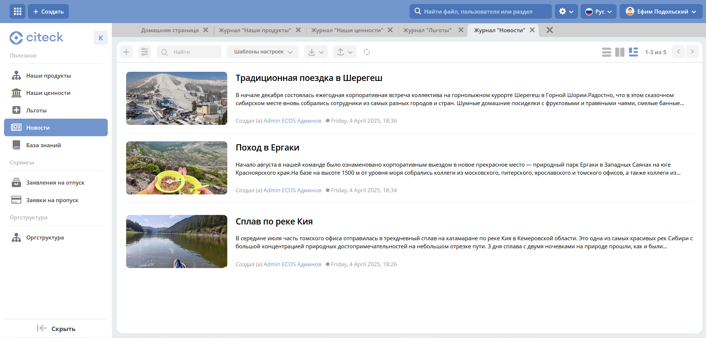

По клику на превью открывается карточка новости:

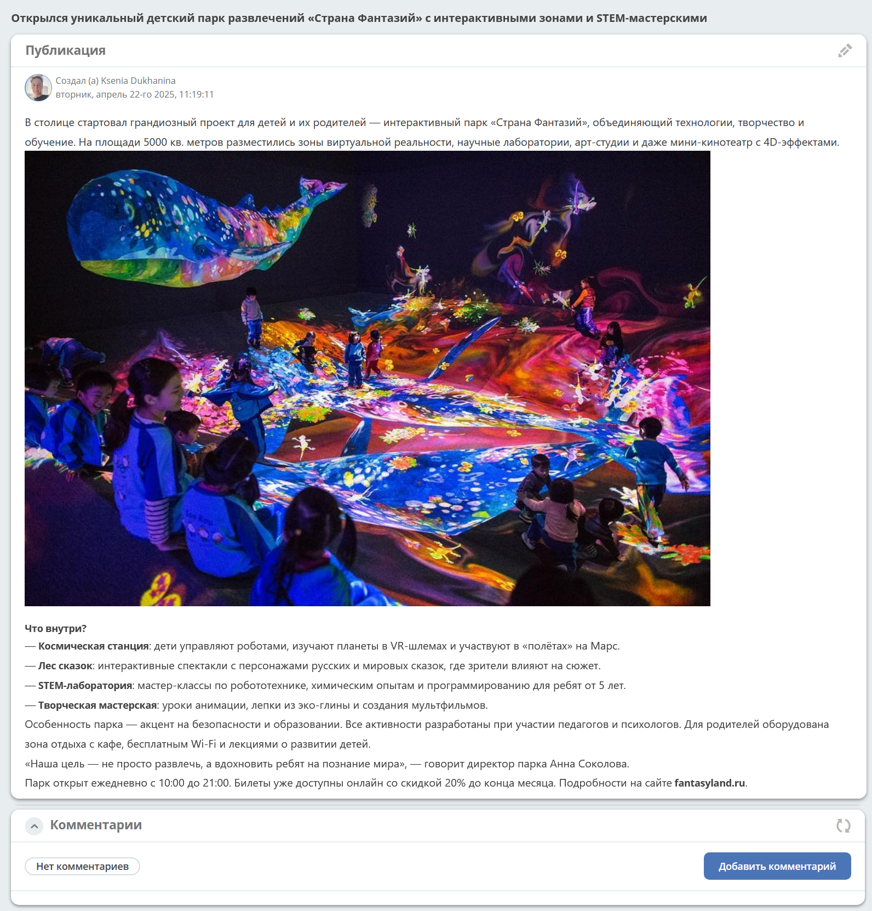

.. _wiki_corp:

В подразделе **База знаний** информация представлена в виде :ref:`иерархии<widget_knowledge_base>`. При выборе раздела справа открывается сама :ref:`публикация<widget_publication>`.

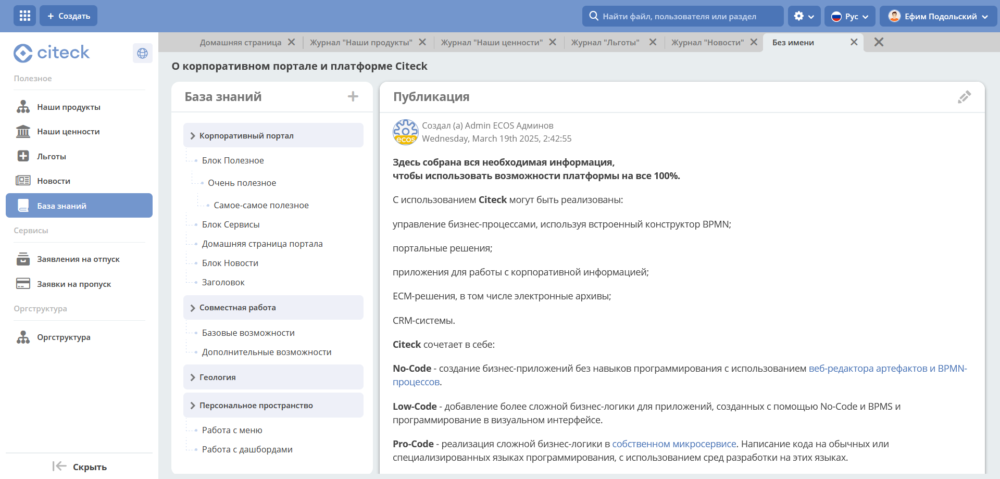

Сервисы
--------

В разделе доступны самые популярные корпоративные бизнес-процессы:

 - :ref:`Заявления на отпуск<ecos-vacation>`

    .. image:: _static/corp_portal/corp_05.png
        :width: 700
        :align: center

 - :ref:`Заявки на пропуск<ecos-order-pass>`

    .. image:: _static/corp_portal/corp_06.png
        :width: 700
        :align: center

Оргструктура
--------------

В разделе представлена иерархия компании - подразделения, должности, сотрудников и их взаимосвязи. Форма оргструктуры разделена на две части и содержит:

    - иерархическое дерево структуры с возможностью поиска;
    - дашборд с информацией о выбранной части структуры.

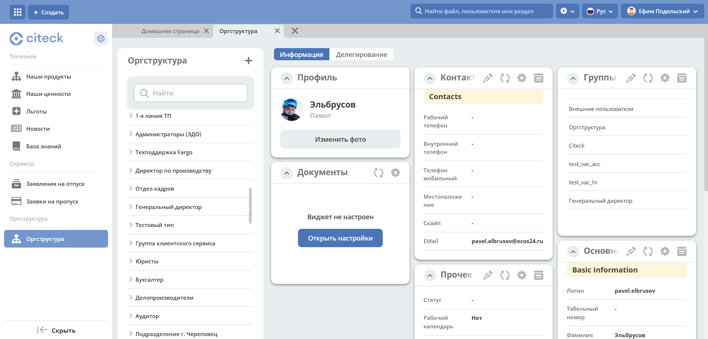

Добавление контента
---------------------

Наполнение подразделов Наши продукты, Наши ценности, Льготы
~~~~~~~~~~~~~~~~~~~~~~~~~~~~~~~~~~~~~~~~~~~~~~~~~~~~~~~~~~~~

Выбранные папки, файлы перетащите в область загрузки:

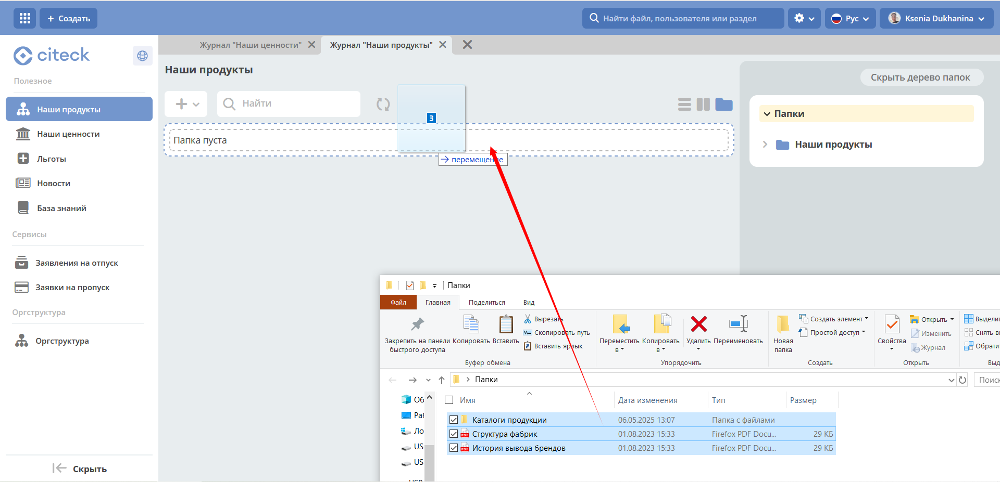

или воспользуйтесь кнопкой **+**:

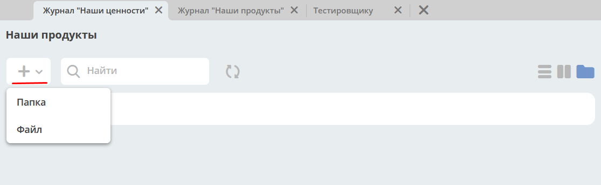

.. list-table::
      :widths: 20 20
      :align: center

      * - |

            .. image:: _static/corp_portal/new_file_3.png
                  :width: 500
                  :align: center

        - |

            .. image:: _static/corp_portal/new_file_4.png
                  :width: 500
                  :align: center

Подробно о :ref:`библиотеке документов<document_library>`

Добавление новостей
~~~~~~~~~~~~~~~~~~~~~

Перейдите в журнал **"Новости"**:

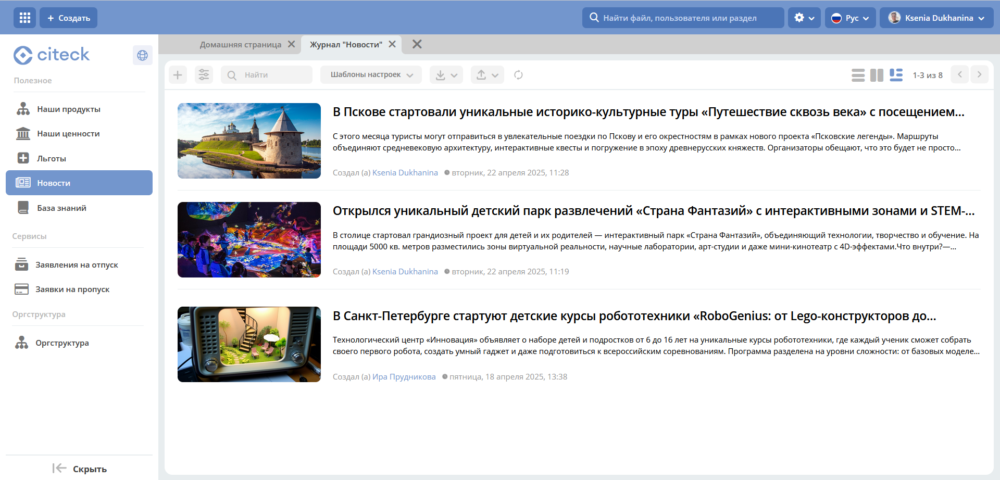

Нажмите **+** и с помощью :ref:`редактора<wysiwyg_editor>` оформите текст новости и сохраните:

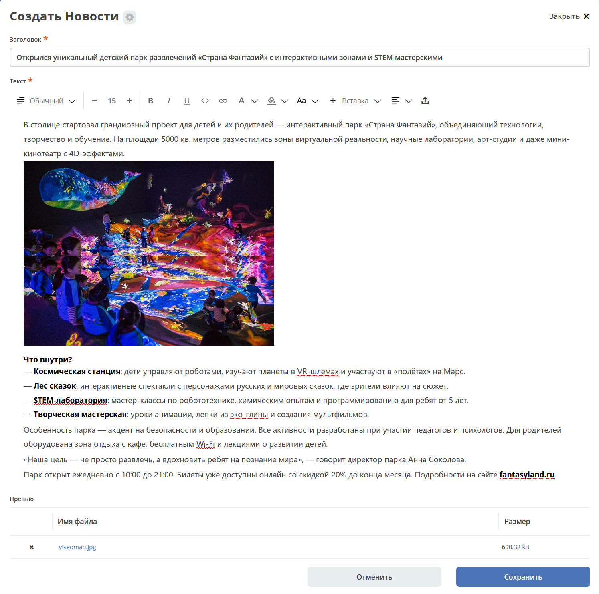

Добавление статей в базу знаний
~~~~~~~~~~~~~~~~~~~~~~~~~~~~~~~~~~~~

Перейдите в журнал **"База знаний"**:

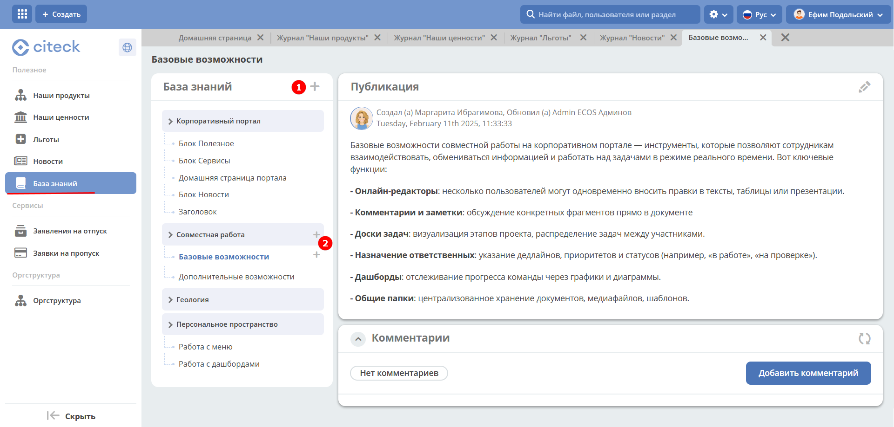

Для добавления публикации или раздела 1-го уровня нажмите большой **+** **(1)**, с использованием :ref:`редактора<wysiwyg_editor>` создайте контент, сохраните. Для добавления публикации или подраздела  нажмите маленький **+** **(2)**. Количество создаваемых публикаций в каждом уровне не ограничено.

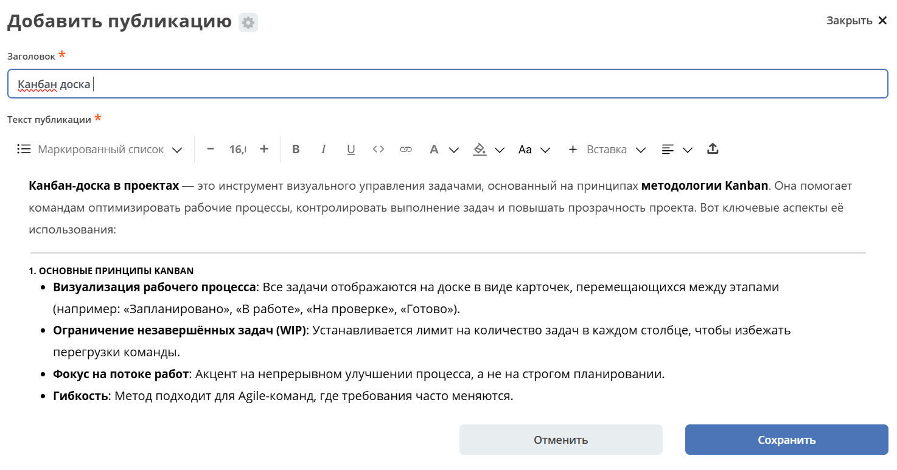

Добавленная публикация в структуре:

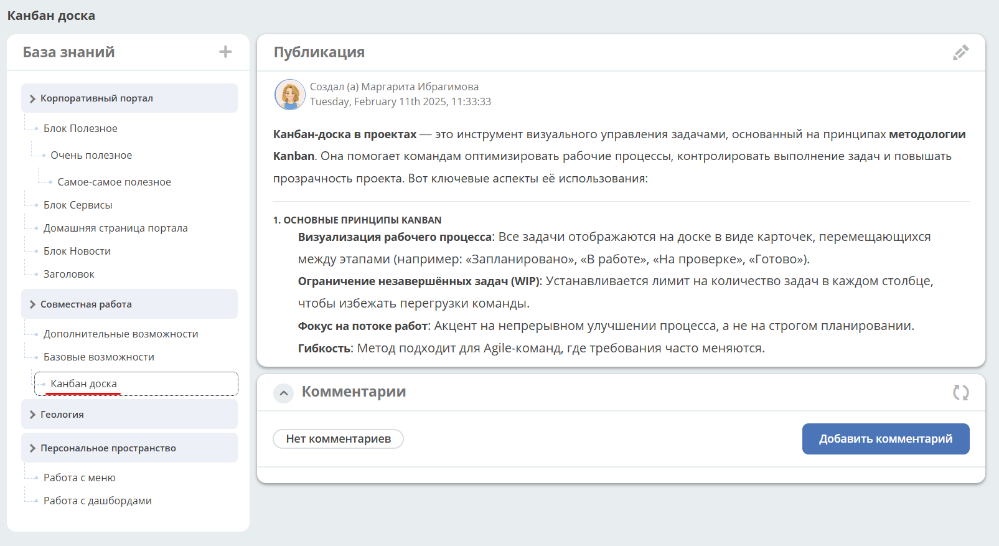

Корпоративный портал при первой установке платформы
-----------------------------------------------------

При первой установке Citeck из шаблона создается пустой корпоративный портал:

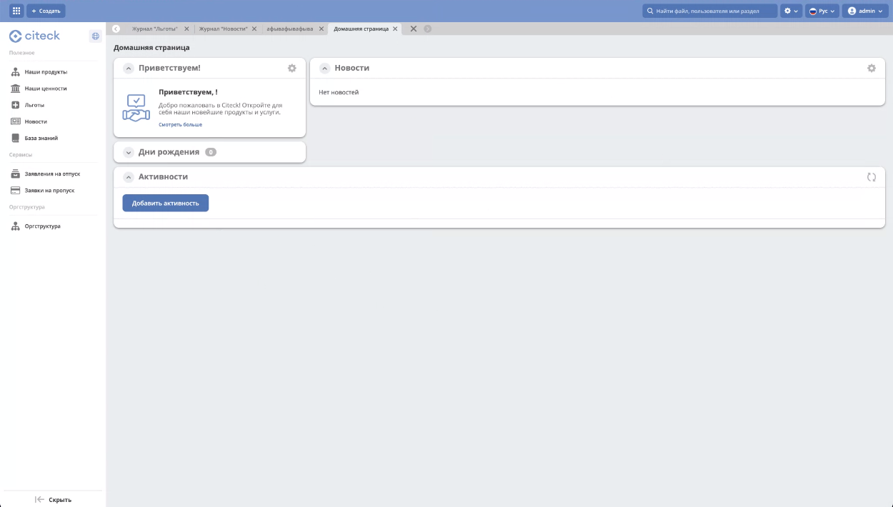

