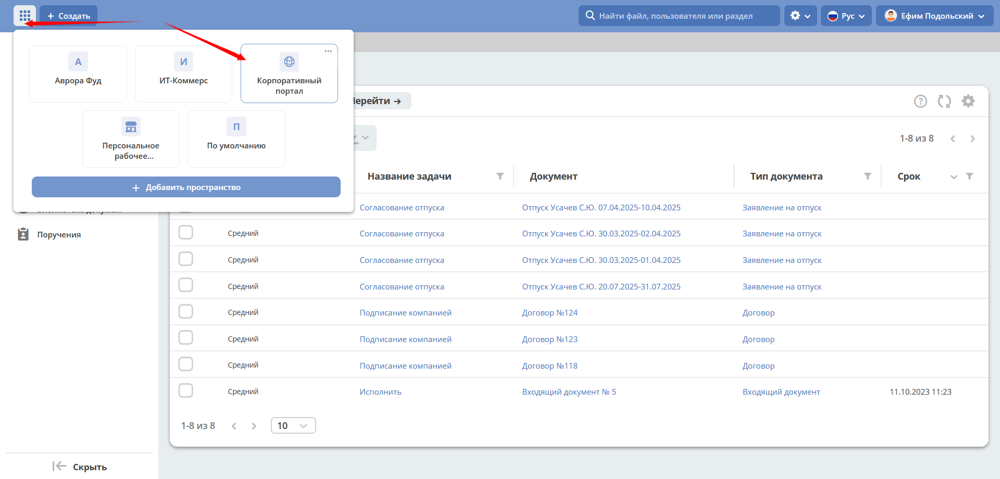
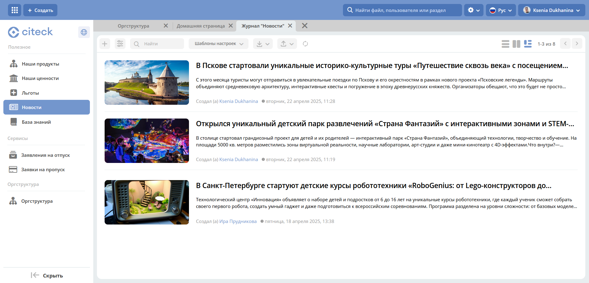
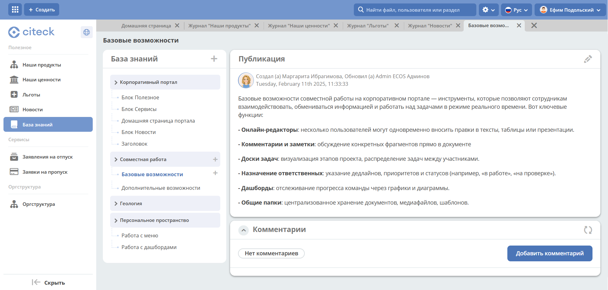

Корпоративный портал
=====================

.. _corp_portal:

**Корпоративный портал** — раздел для сотрудников компании, который объединяет различные инструменты, информацию и сервисы в одном месте. Он используется для работы, коммуникации и управления бизнес-процессами.

Портал обеспечивает:

    -	Хранение документов, регламентов, баз знаний.
    -	Новости компании, анонсы.
    -	Автоматизацию рабочих процессов (отпуска, заявки, отчетность).

Главная страница содержит дашборд с приветственной информацией, новостями и днями рождения сотрудников:

.. image:: _static/corp_portal/corp_main_page.png
       :width: 700
       :align: center

В меню доступны основные разделы корпоративного портала:

Полезное
----------

В подразделах **Наши продукты**, **Наши ценности**, **Льготы**  представлена информация в виде библиотек документов - с файлами можно ознакомиться, скачать:

.. image:: _static/corp_portal/corp_00.png
       :width: 700
       :align: center

.. list-table::
      :widths: 20 20
      :align: center

      * - |

            .. image:: _static/corp_portal/corp_01.png
                  :width: 700
                  :align: center

        - |

            .. image:: _static/corp_portal/corp_02.png
                  :width: 700
                  :align: center

В подразделе **Новости** информация представлена в виде списка превью новостей:

По клику на карточку новость будет доступна подробно. 

В подразделе **База знаний** информация представлена в виде иерархии:

По клику слева на иерахию  справа отображается публикация. 

См. подробно о виджете **Публикации**.

Сервисы
--------

В разделе доступны самые популярные корпоративные бизнес-процессы:

 - :ref:`Заявления на отпуск<ecos-vacation>`

    .. image:: _static/corp_portal/corp_05.png
        :width: 700
        :align: center

 - :ref:`Заявки на пропуск<ecos-order-pass>`

    .. image:: _static/corp_portal/corp_06.png
        :width: 700
        :align: center

Оргструктура
--------------

В разделе представлена иерархия компании - подразделения, должности, сотрудников и их взаимосвязи. Форма оргструктуры разделена на две части и содержит:

    - иерархическое дерево структуры с возможностью поиска;
    - дашборд с информацией о выбранной части структуры.

.. image:: _static/corp_portal/corp_07.png
       :width: 700
       :align: center