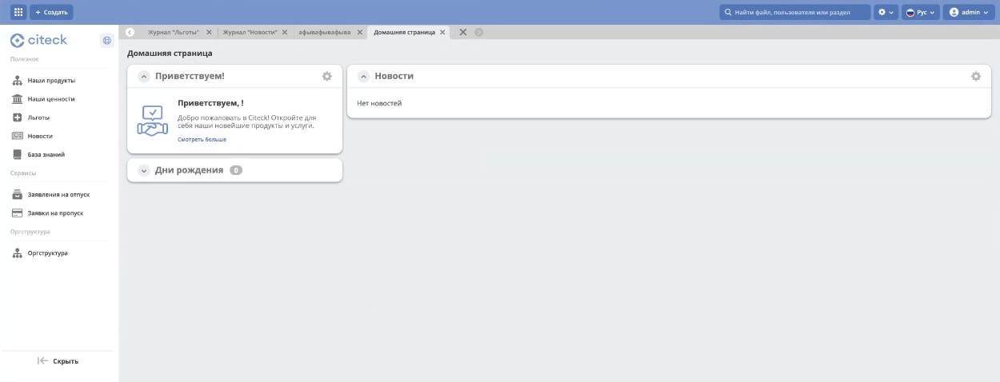

.. _corp_portal:

Корпоративный портал
=====================

.. contents::
    :depth: 3

**Корпоративный портал** — встроенное рабочее пространство Citeck для сотрудников компании. Объединяет корпоративные сервисы, информационные ресурсы и инструменты для совместной работы в едином интерфейсе.

.. image:: _static/corp_portal/corp_menu.png
       :width: 700
       :align: center

Портал обеспечивает:

- Хранение документов, регламентов, баз знаний.
- Информирование сотрудников: новости компании, анонсы мероприятий.
- Автоматизацию кадровых и административных процессов (заявления на отпуск, заявки на пропуск и др.).
- Визуализацию организационной структуры компании.
- Ведение базы знаний с поддержкой иерархии публикаций.

Главная страница содержит дашборд с приветственной информацией **(1)**, :ref:`новостями<widget_news>` **(2)**, :ref:`днями рождения<widget_birthdays>` сотрудников **(3)**. Для enterprise версии Citeck будет доступен виджет :ref:`«Активности»<widget_activities>`.

.. image:: _static/corp_portal/corp_main_page.png
       :width: 700
       :align: center

В меню **(4)** доступны основные разделы корпоративного портала: **Полезное**, **Сервисы** и **Оргструктура**.

В приветственном виджете по клику на **Смотреть больше** открывается :ref:`База знаний <wiki_corp>`.

Полезное
----------

Раздел содержит информационные материалы компании: документы, регламенты, корпоративные ценности, условия работы, а также ленту новостей и базу знаний.

В подразделах **Наши продукты**, **Наши ценности**, **Льготы** представлена информация в виде :ref:`библиотек документов<document_library>` — с файлами можно ознакомиться или скачать:

.. image:: _static/corp_portal/corp_00.png
       :width: 700
       :align: center

.. list-table::
      :widths: 20 20
      :align: center

      * - |

            .. image:: _static/corp_portal/corp_01.png
                  :width: 700
                  :align: center

        - |

            .. image:: _static/corp_portal/corp_02.png
                  :width: 700
                  :align: center

В подразделе **Новости** информация представлена в виде списка превью новостей:

.. image:: _static/corp_portal/corp_03.png
       :width: 700
       :align: center

По клику на превью открывается карточка новости:

.. image:: _static/corp_portal/corp_03_1.png
       :width: 600
       :align: center

.. _wiki_corp:

В подразделе **База знаний** информация представлена в виде :ref:`иерархии<widget_knowledge_base>`. При выборе раздела справа открывается сама :ref:`публикация<widget_publication>`.

.. image:: _static/corp_portal/corp_04.png
       :width: 700
       :align: center

Сервисы
--------

Раздел предоставляет сотрудникам доступ к автоматизированным HR- и административным процессам без необходимости обращаться к другим разделам системы.

В разделе доступны наиболее востребованные корпоративные бизнес-процессы:

- :ref:`Заявления на отпуск<ecos-vacation>` — создание и отслеживание заявлений на различные виды отпусков.

   .. image:: _static/corp_portal/corp_05.png
       :width: 700
       :align: center

- :ref:`Заявки на пропуск<ecos-order-pass>` — оформление заявок на выдачу временных или постоянных пропусков для сотрудников и посетителей.

   .. image:: _static/corp_portal/corp_06.png
       :width: 700
       :align: center

Оргструктура
--------------

Раздел отображает иерархию компании — подразделения, должности, сотрудников и их взаимосвязи. Удобен для поиска коллег, просмотра контактных данных и понимания структуры организации.

Форма оргструктуры разделена на две части и содержит:

- иерархическое дерево структуры с возможностью поиска;
- дашборд с информацией о выбранной части структуры (подразделении, должности или сотруднике).

.. image:: _static/corp_portal/corp_07.png
       :width: 700
       :align: center

.. note::

   Для настройки и управления оргструктурой перейдите в раздел :ref:`Оргструктура<org_structure>`.

Добавление контента
---------------------

.. note::

   Добавление и редактирование контента доступно пользователям с соответствующими правами (как правило, пользователям с ролью **Менеджер** рабочего пространства «Корпоративный портал»). Права назначаются администратором системы через :ref:`настройки рабочего пространства<new_workspace>`.

Наполнение подразделов Наши продукты, Наши ценности, Льготы
~~~~~~~~~~~~~~~~~~~~~~~~~~~~~~~~~~~~~~~~~~~~~~~~~~~~~~~~~~~~

Выбранные папки, файлы перетащите в область загрузки:

или воспользуйтесь кнопкой **+**:

.. list-table::
      :widths: 20 20
      :align: center

      * - |

            .. image:: _static/corp_portal/new_file_3.png
                  :width: 500
                  :align: center

        - |

            .. image:: _static/corp_portal/new_file_4.png
                  :width: 500
                  :align: center

Подробно о :ref:`библиотеке документов<document_library>`.

Добавление новостей
~~~~~~~~~~~~~~~~~~~~~

Перейдите в журнал **«Новости»**:

Нажмите **+** и с помощью :ref:`редактора<wysiwyg_editor>` оформите текст новости и сохраните:

Добавление статей в базу знаний
~~~~~~~~~~~~~~~~~~~~~~~~~~~~~~~~~~~~

Перейдите в журнал **«База знаний»**:

.. image:: _static/corp_portal/wiki_1.png
       :width: 700
       :align: center

Для добавления публикации или раздела 1-го уровня нажмите большой **+** **(1)**, с использованием :ref:`редактора<wysiwyg_editor>` создайте контент, сохраните. Для добавления публикации или подраздела нажмите маленький **+** **(2)**. Количество создаваемых публикаций в каждом уровне не ограничено.

Добавленная публикация в структуре:

Корпоративный портал при первой установке платформы
-----------------------------------------------------

При первой установке Citeck из шаблона создаётся пустой корпоративный портал:

Разделы **Полезное**, **Сервисы** и **Оргструктура** доступны сразу, но не содержат данных — их необходимо наполнить в соответствии с потребностями компании.

Рекомендуемый порядок первоначального наполнения:

1. Настройте :ref:`организационную структуру<org_structure>` — добавьте подразделения и сотрудников.
2. Наполните подразделы **Наши продукты**, **Наши ценности**, **Льготы** — загрузите файлы или создайте папки.
3. Добавьте первые новости в подраздел **Новости**.
4. Создайте статьи в **Базе знаний** для хранения корпоративных регламентов и инструкций.
