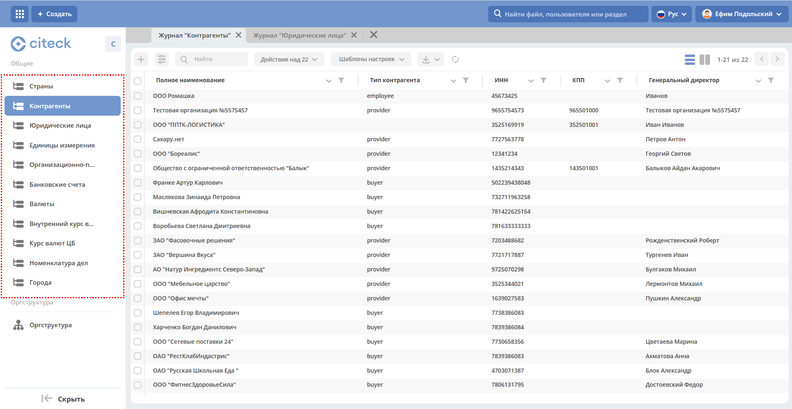

.. _datalists:

Справочники
======================

**Справочник** — тип для хранения наборов бизнес-данных, которые используются как статические данные для документов и не участвуют непосредственно в бизнес-процессах.

**Основные справочники** доступны в публичном :ref:`рабочем пространстве<workspaces>` **«Справочники»**:

Данные из этих справочников используются при создании большинства документов системы:

    * **Контрагенты** — организации и физические лица, с которыми ведётся деловое взаимодействие (поставщики, покупатели, партнёры);
    * **Юридические лица** — собственные компании организации, от имени которых создаются договоры и документы;
    * **Единицы измерения** — стандартный список единиц для указания количества и объёма в документах;
    * **Организационно-правовые формы** — формы собственности (ООО, АО, ИП и т.п.) для заполнения реквизитов;
    * **Банковские счета** — реквизиты счетов юридических лиц и контрагентов для использования в документах;
    * **Валюты** — список валют для указания стоимости в договорах и счетах;
    * **Курсы валют**:

      - **Внутренний** — курс, задаваемый вручную в системе;
      - **ЦБ** — актуальный курс Центрального банка.

.. note::

    Также для каждого модуля системы создаются отдельные справочники, доступные в рабочих пространствах этих модулей.

В :ref:`рабочем пространстве<workspaces>` **«Справочники»** также доступна :ref:`организационная структура<org_structure>`:

Дашборды в справочниках
----------------------------

При открытии карточки записи справочника отображается дашборд с полной информацией об элементе. Вид дашборда зависит от типа справочника.

Типовой элемент справочника
~~~~~~~~~~~~~~~~~~~~~~~~~~~~~~~~

Для большинства справочников при открытии записи отображается стандартный дашборд со свойствами элемента. Например:

Контрагент
~~~~~~~~~~~

Карточка контрагента содержит расширенный дашборд с реквизитами, связанными документами и историей взаимодействия. Например:

.. image:: _static/datalists/dashboard_02.png
       :width: 700
       :align: center

Подробно о :ref:`Клиенте 360<client_360>`.

Юридические лица
~~~~~~~~~~~~~~~~~

Карточка юридического лица отображает реквизиты компании, банковские счета и связанные документы. Например:

.. _datalists_new:

Создание записи справочника
--------------------------------------------

Создание записи справочника является типовой операцией для всех справочников. Для этого необходимо:

    1. Выбрать справочник.
    2. Нажать **+**.

         .. image:: _static/datalists/data_2.png
            :width: 700
            :align: center

    3. В открывшейся форме заполнить необходимые поля (обязательные поля отмечены **«*»**).

         .. image:: _static/datalists/data_3.png
            :width: 600
            :align: center

    4. Нажать кнопку **Применить**.

Подробно о :ref:`создании справочников<dataset_sample>`.
