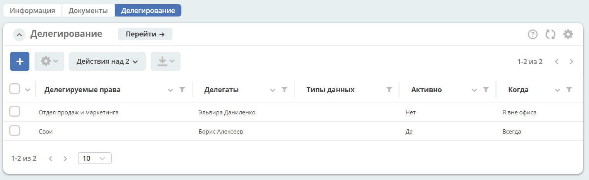

Делегирование
==============

Пользователь любой роли имеет возможность делегировать свои полномочия на время отсутствия.

Делегирование производится путем назначения пользователей (делегатов), которым должны быть переданы полномочия для всех ролей пользователя (доверителя), который делегирует свои полномочия.

Таких делегатов может быть один или несколько, при этом у каждого из них появляется доступ ко всем задачам доверителя (но не к тем документам, которые не взяты делегатом в работу, что означает, что они будут иметь доступ к тем задачам, где пользователь назначен единственным исполнителем, например, Юристом по договору, но не будут иметь доступ к нераспределённым задачам юридического отдела).

Пользователь любой роли имеет возможность активировать функцию отсутствия в офисе и включить делегирование.

.. note::

    Администратор и Технолог через оргструктуру также имеет возможность назначить заместителя пользователю. См. ниже

Настройка делегирования
-------------------------

.. _delegation_settings:

Перейти в **Мой профиль** на вкладку **Делегирование** и нажать:

 .. image:: _static/delegation/01.png
       :width: 700
       :align: center 

И в карточке выбрать:

 .. image:: _static/delegation/02.png
       :width: 500
       :align: center 

* **Делегируемые права (1)** – **Свои** (по умолчанию) и **Группы**, в которых состоит пользователь из выпадающего списка, 

 .. image:: _static/delegation/03.png
       :width: 600
       :align: center 

* **Делегаты (2)** - заместителей может быть выбрано несколько:

 .. image:: _static/delegation/04.png
       :width: 200
       :align: center 

* **Когда (4)** (доступно в 2 режимах):

    -	**«Я вне офиса»** - заместитель будет иметь доступ к выполнению задач доверителя только на период отсутствия последнего в офисе  (то есть пока у доверителя статус в профиле «Отсутствую»); 
    -	**«Всегда»** - вне зависимости от присутствия доверителя в офисе.

 .. image:: _static/delegation/05.png
       :width: 600
       :align: center 

И нажать **Сохранить**

Делегирование можно настроить на определенные **Типы данных (3)** (типы документов), если доверитель хочет предоставить заместителям выполнение задач только, например, на Договоры, а на Доверенности нет;

При необходимости настроенного заместителя можно “отключить”, не удаляя запись из журнала заместителей, выключив чекбокс **«Активно» (5)**.

.. note::

    Администратор через открытие профиля пользователя в Оргструктуре так же может настроить делегирование.

Активных записей о делегировании может быть несколько. Они суммируются в зависимости от условий.

.. note::

 Если задача попадает под условия хотя бы одного делегирования, то она делегируется. Например, есть задачи А, Б, В, Г.
              
 А и Б попадают под условия первого делегирования, Б и В под условия второго делегирования - в результате делегируются задачи  А, Б и В.

Включение делегирования пользователем
--------------------------------------

Выбрать **Сменить статус**:

 .. image:: _static/delegation/07.png
       :width: 200
       :align: center 

Если была выбрана настройка делегирования **«Я вне офиса»**, то появляется всплывающее окно, в котором необходимо выставить чекбокс **«Делегировать выполнение задач»**, нажать **Подтвердить**:

 .. image:: _static/delegation/08.png
       :width: 500
       :align: center 

.. note::

    Если у пользователя замещение настроено как **«Всегда»** или заместителей у пользователя нет, то смена статуса осуществляется без промежуточного окна.

Если при смене статуса пользователь не активизировал опцию **«Делегировать выполнение задач»**, делегирование НЕ производится.

Статус пользователя будет изменен на **«Отсутствую»**, 

Иконки статусов:

.. list-table::
      :widths: 20 20
      :align: left
      :class: tight-table 
      
      * - 

             .. image:: _static/delegation/09.png
                  :width: 50
                  :align: center 

        - На месте
      * - 

             .. image:: _static/delegation/10.png
                  :width: 50
                  :align: center 

        - Отсутствую

Включение делегирования администратором, технологом
----------------------------------------------------

В оргструктуре перейти в профиль пользователя во вкладку делегирование.

 .. image:: _static/delegation/11.png
       :width: 700
       :align: center 

Далее порядок действий аналогичен и описан в :ref:`Настройках делегирования<delegation_settings>`.

Описание механизма делегирования
---------------------------------

Всегда
~~~~~~~

При наличии у пользователя заместителей и условия **«Всегда»** делегирование задач на заместителей осуществляется сразу по факту сохранения формы настройки заместителей. 

У заместителей в журнале **«Активные задачи»** появятся задачи доверителя и будут доступными для исполнения. 

При этом исполнителем в этих задачах будет по-прежнему указан сам доверитель, у самого доверителя из журнала **«Активные задачи»** задачи не будут удалены, сам доверитель по-прежнему будет иметь доступ к своим задачам через журнал активных задач и журналы модулей системы.

Я вне офиса
~~~~~~~~~~~

При наличии у пользователя заместителей и условия **«Я вне офиса»** делегирование задач на заместителей осуществляется только по факту смены статуса профиля доверителя на **«Отсутствую»**. 

У заместителей в журнале **«Активные задачи»** появятся задачи доверителя и возможность выполнения задач через журналы модулей системы.

При этом исполнителем в этих задачах будет по-прежнему указан сам доверитель, у самого доверителя из журнала **«Активные задачи»** задачи не будут удалены, сам доверитель по-прежнему будет иметь доступ к своим задачам через журнал активных задач и журналы модулей системы.

После смены статуса профиля доверителя на **«На месте»** у заместителей исчезают задачи доверителя из журнала **«Активные задачи»** и возможность выполнения задач через журналы модулей системы.

Если заместитель выполнит задачу, то в **Истории события** указывается, что действие выполнено заместителем от имени доверителя (заполнено поле **«От имени»**).

При направлении заместителем какой-либо задачи на доработку (или аннулирование), в случае выполнения Инициатором доработки (или неподтверждения аннулирования), задача будет возвращена на доверителя, при этом заместитель будет иметь право доступа к задаче.

